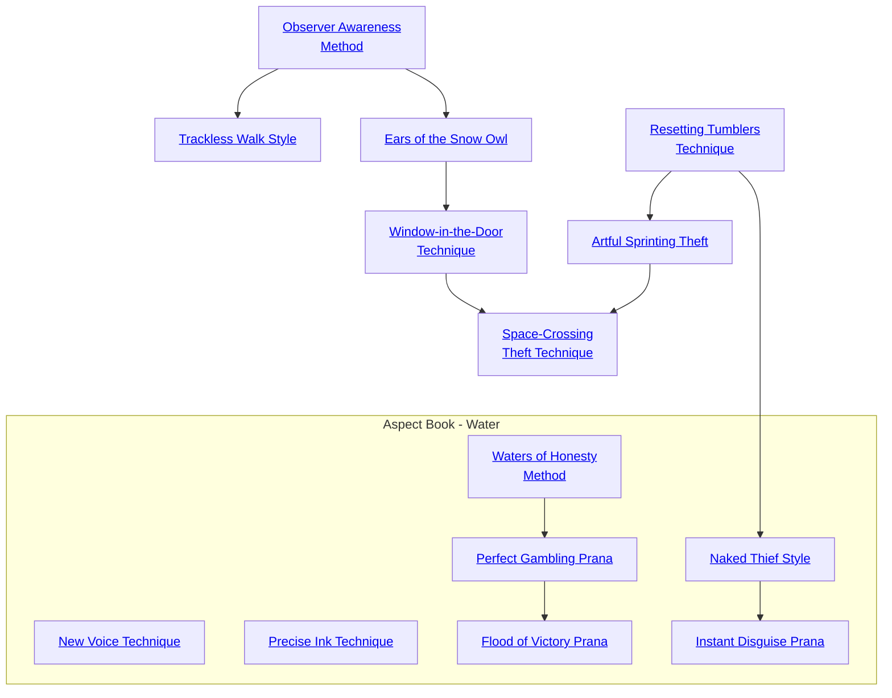

## Observer Awareness Method

Cost: 1 mote
Duration: Instant
Type: Reflexive
Minimum Larceny: 2
Minimum Essence: 1
Prerequisite Charms: None

This simple Charm allows a Dragon-Blood to know
if he is being observed. It was developed in the days before
the Realm proper, when it was conceivable that one of
the noble Terrestrial Exalted could act in a criminal
capacity. In these dangerous days, the Charm sees use
among those Exalted who might act as spies or who wish
to speak to a confidante unobserved. Simply spend the
necessary Essence and roll Perception + Larceny; a single
success tells the Exalted whether he is being observed.
Each additional success points out the location of an
observer, starting with the closest.

## Trackless Walk Style

Cost: 2 motes
Duration: One scene
Type: Simple
Minimum Larceny: 3
Minimum Essence: 2
Prerequisite Charms: Observer Awareness Method

The greatest spies and thieves of the Realm know that
the best way to avoid detection in their efforts is to leave as
little evidence as possible of their passing. However, those
spies and thieves know full well that the most talented
magistrates and house investigators can learn a great deal
from a trace as innocuous as a single hair. By activating this
Charm as he enters a location, a Dragon-Blood prevents
himself from leaving inadvertent evidence. This Charm
does not prevent the character from being observed; it
merely prevents him from leaving behind clues to his
identity, such as footprints. Also, this Charm does not
prevent the character from deliberately leaving behind
evidence of his presence (if, for instance, he is a romantic
master thief and always leaves a rose at the scene of a crime,
this Charm does not prevent him from doing so). Characters
using this Charm cannot be tracked except by supernatural
means, but the Charm's short duration means that it is an
expensive way to conceal ones passage for a long while.

## Ears of the Snow Owl

Cost:
Duration:
Type:
Minimum Larceny:
Minimum Essence:
Prerequisite Charms:
1 mote
One minute
Simple
4
2
Observer Awareness
Method
This Charm, quite useful when sneaking about in
places one shouldn't be, allows a character to hear conversations
and movement in other rooms as clearly as if the
walls between him and those spaces weren't there. By
spending the necessary Essence in conjunction with a
listen-oriented Perception roll, the player can eliminate
any penalties to that roll that might come as a function of
obstacles between his character and the thing he's listening
to. The Charm does not eliminate penalties due to
distance, just physical obstructions.

## Window-in-the-Door Technique

Cost: 2 motes
Duration: One turn
Type: Simple
Minimum Larceny: 5
Minimum Essence: 2
Prerequisite Charms: Ears of the Snowy Owl

Many a time has come when a mortal thief or spy has
wished for the ability to see what lies beyond a doorway or
inside a chest without risking the opening of a latch or lock.
Spies among the Terrestrial Exalted do not merely wish for
this ability; this Charm allows them to do precisely that. The
character simply spends the necessary Essence, and an area
roughly two feet square before his eyes becomes transparent.
That area doesn't move — once the character has used this
Charm, the area that was in front of him when he spent the
Essence remains transparent to him for a full turn. The
Dragon-Blood can only see through about a three-inch
thickness of stone — perhaps twice that of wood and half
that much iron or jade. The material is only transparent to
the Exalted using this Charm; others cannot see through it.
Walls, doors and containers can be enchanted to prevent
this kind of voyeurism.

## Resetting Tumblers Technique

Cost: 3 motes
Duration: Instant
Type: Reflexive
Minimum Larceny: 3
Minimum Essence: 2
Prerequisite Charms: None

With this ability, the Exalted can immediately discard
a failed break-in attempt or other Larceny action and try at
once to remedy the situation. A player may spend the
required Essence and then immediately reroll the dice pool
for the most recent Larceny action his character performed;
this must take place right after the roll is made and before the
Storyteller describes its success or failure. The Exalted must
accept the result of the second dice roll, even if it is worse
than the first one. Additionally, if the Larceny action and
this Charm are part of a Combo, then using the Charm
forces the Exalted to re-spend all of the necessary Essence to
activate the other Charms in the Combo, even if he does not
need to reroll or reactivate them.

## Artful Sprinting Theft

Cost: 1 mote
Duration: One turn
Type: Supplemental
Minimum Larceny: 3
Minimum Essence: 2
Prerequisite Charms: Resetting Tumblers Technique

The occasional orphaned Dragon-Blood on the
streets of hinterland cities such as Nexus might grow up
to learn this Charm; ordinarily, noble Terrestrials of the
Realm will have nothing to do with it, save possibly for
its application to later Charms. Ordinarily, even the
simplest Larceny actions - pocket-picking and bag-snatching
 — require the character to slow down slightly,
using only half of his maximum movement (which
would be his Dexterity + 12 yards) on the turn he uses
Larceny. With this Charm, the character may use his
full dice pool on a simple Larceny action (one that
would ordinarily take just one turn) while running flat-
out. The action can take place at the beginning, middle
or end of this movement.

## Space-Crossing Theft Technique

Cost: 5 motes
Duration: Instant
Type: Simple
Minimum Larceny: 5
Minimum Essence: 3
Prerequisite Charms: Window-in-the-Door Technique, Artful Sprinting Theft

With this Charm, the Exalted can cause an object
to disappear from its current location and reappear in
his hands without crossing the intervening space. The
character must be able to see the object clearly — if it
is within a locked chest, he must use Window-In-The-Door
Technique (see above) to see it before he can use
Space-Crossing Theft Technique to grab it. However, if
he can see it, he only needs to expend the Essence and
off it goes, as long as it weighs less than about 15 pounds
(the Storyteller's judgment is final as to what can be
taken and what can't). This Charm does not work on
items held by a sentient being (a mortal, Exalted or
spirit), but it will work on items they are merely wearing:
the Exalted could snatch a sheathed sword but not
a sword in a foe's hand.

## New Voice Technique

Cost: 2 motes
Duration: One scene
Type: Simple
Minimum Larceny: 3 /
Minimum Essence: 2
Prerequisite Charms: None

This Charm allows the character to perfectly imitate
someone else's voice for an entire scene. In addition, also
allows the character to imitate the sound of any animal,
spirit or other creature, as well as any other noise that the
character can perceive. The character must have heard the
voice or sound she is attempting to duplicate at least once,
and she must correctly remember the sound she is attempting to duplicate. To do so, the player must make a successful
Perception + Larceny roll for her character. The difficulty
of the roll varies depending upon how familiar the character is with a sound and how complex the sound is.
Remembering the sound of a friend's voice is difficulty 1,
while remembering the voice of a three-mouthed god that
speaks in music and that the character only heard once is
difficulty 5. Also, regardless of what the original sound did,
the character cannot use this Charm to do damage or to
duplicate any magics associated with the target's voice.
Each different sound that the character duplicates requires
a new casting of this Charm. This Charm will fool both a
character's closest associates and animals trained to respond only to the target's voice.

## Precise Ink Technique

Cost: 3 motes
Duration: One task
Type: Simple
Minimum Larceny: 3
Minimum Essence: 2
Prerequisite Charms: None

Forgers and spies everywhere favor this Charm. A
character using this Charm can duplicate anyone's writing
and even her writing style. The only limit on this Charm
is that either the character must have a sample of what he
wants to duplicate in front of him or he must examine the
document carefully and his player make a successful Perception + Larceny roll for the Dragon-Blood to correctly
recall the details that he needs to duplicate. The character
can forge anything from a brief signature to a multi-page
letter. In addition, this Charm allows the character to use
ordinary forging tools to perfectly duplicate any mundane
stamp or seal used to prove a document's authenticity. This
Charm does not translate languages, and the character
must have seen an actual sample of the person's writing
that he is attempting to duplicate. However, it allows the
character to create a perfect duplicate of someone's writing
that is impossible to differentiate from the original by
mundane means. If someone examines the forgery using
Charms, the difficulty of any roll to determine the authenticity of the item is increased by the character's permanent
Essence.

## Waters of Honesty Method

Cost: 4 motes, 1 Willpower
Duration: One Scene
Type: Simple
Minimum Larceny: 2
Minimum Essence: 1
Prerequisite Charms: None

This Charm allows the character to determine if
anyone is cheating at a game that she is observing. The
character can only observe one game at a time, but the
Charm allows her to learn both who is cheating and how
the cheating is being accomplished. This Charm works on
any game or contest, from footraces or duels to games
involving dice or cards.

## Perfect Gambling Prana

Cost: 4 motes
Duration: Instant
Type: Simple
Minimum Larceny: 3
Minimum Essence: 2
Prerequisite Charms: Waters of Honesty Method

This Charm allows the character to control a single
event during any game of chance. The character can control the
outcome of a single throw of dice or the draw of a card.
To use this Charm, the character must be the one throwing
the dice or the recipient of the drawn card — the character
cannot influence someone else's dice rolls or the cards that
someone else is dealt. Each new roll or draw requires a
different use of this Charm. Frequent use of this Charm will
exhaust the character's Essence pool quite rapidly. This
Charm is illegal in the Realm, and offenders will be imprisoned or executed, depending upon their status.

## Naked Thief Style

Cost: 2 motes, 1 Willpower
Duration: One scene
Type: Supplemental
Minimum Larceny: 4
Minimum Essence: 2
Prerequisite Charms: Resetting Tumblers Technique

Sometimes, the most useful time to be able to pick a
lock or open a barred door is when no one is expecting the
character to be able to do so. This Charm allows characters to pick locks, untie bonds, unbar doors and lock or
unlock all manner of non-magical locks without any sort
of tools or equipment. Regardless of whether the character would need a set of fine steel lock picks to finagle a
sturdy lock, a paper thin saw to cut through the bar on a
door or simply a pry bar to jimmy open a window, this
Charm allows the character to attempt the feat without
any tools by creating temporary tools made from solidified Essence. While this Charm does not otherwise aid
the character when opening a lock, it can be successfully
used in Combos with Charms that do. The character
must use this Charm once per lock or other obstacle —
for example, if a door has both a bar and a lock, the
character would need to use this Charm twice.

## Flood of Victory Prana

Cost: 5 motes, 1 Willpower
Duration: One scene
Type: Simple
Minimum Larceny: 5
Minimum Essence: 3
Prerequisite Charms: Perfect Gambling Prana

A gambler using this Charm automatically wins whatever game she is playing. Regardless of whether the character
is playing craps, cards, roulette or any other game of
chance, she will win. The only exception is if another
character uses the same Charm on the game. In such a case,
the character with the highest permanent Essence wins.
The only limit on this Charm is that it cannot be safely
used in casinos run by gods or Exalts, since they almost
always have ways to determine if someone is using this or
some similar Charm to cheat. In general, using Charms to
cheat at a casino run by a powerful god is a quick way to
attain a messy death, and it is illegal in the Realm, as well
as very poor social form.

## Instant Disguise Prana

Cost: 4 motes
Duration: One scene
Type: Supplemental
Minimum Larceny: 4
Minimum Essence: 2
Prerequisite Charms: Naked Thief Style

In emergencies, even the most skilled thieves and
spies lack the time to adequately prepare a disguise. While
this Charm does not allow the character to disguise herself
more thoroughly than normal, it does allow her to disguise
herself as well as if she had a full set of disguise makeup and
to do so inhumanly rapidly. In a single minute and without
any equipment, a character can use this Charm to disguise
herself as well as if she had no shortage of time or equipment. The character can change her hair color and the
shape of her nose and make other similar changes, but she
cannot exceed the limits of ordinary disguises — she
cannot make herself noticeably shorter or thinner or
perform other normally impossible changes. Also, the
disguise produced by this Charm no better than any
other created by the character. It can simply be accomplished faster and without penalties for lack of equipment.
Although the Charm requires only a minute to perform,
the effects last for one full scene. This Charm in no way
alters a character's clothing or accoutrements.
