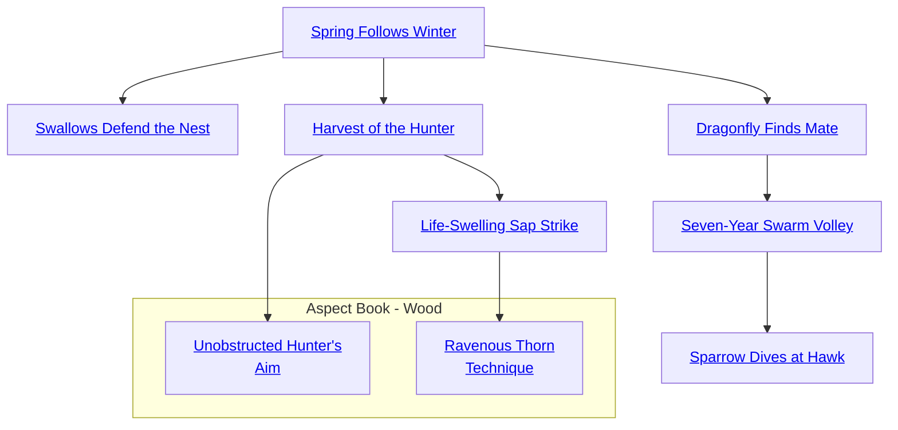

## Archer's Favorable Wind

Cost: 1 mote
Duration: Instant
Type: Supplemental
Minimum Archery: 2
Minimum Essence: 1
Prerequisite Charms: None

Wind makes archery less accurate because it blows
arrows off course. The Aspects of Air, however, can
persuade the winds to let the arrow fly unhindered. Each
point of Essence the character has cancels one point of
extra difficulty. Thus, a Dynast of Air with Essence 4 could
practice target shooting in a hurricane! Each bowshot
demands a separate use of this Charm.
Cascade Charms:
• A more experienced Aspect of Air might be able to
negate wind penalties for a few minutes, during which she
could fire as many arrows as she wanted.
• The character could extend the Archer's Favorable
Wind to a small group of other characters.
• An Air-attuned archer might persuade the winds to
blow against the arrows of his enemies, increasing their
difficulty to hit.

## Fortunate Wind Attack

Cost: 1 mote
Duration: Instant
Type: Supplemental
Minimum Archery: 2
Minimum Essence: 1
Prerequisite Charms: None

Through this basic Charm, a Dragon-Blooded archer
persuades the winds to propel and guide his arrow. The
range increment of the character's weapon in doubled for
that attack.
Cascade Charms:
• A more experienced Dynast of Air could extend this
Charm's effect to a small group of people.
• As with various Archery-based Charms used by
Solars, a Dragon-Blooded archer might negate range pen-
alties entirely.

## Spring Follows Winter

Cost: 2 motes
Duration: Instant
Type: Reflexive
Minimum Archery: 2
Minimum Essence: 1
Prerequisite Charms: None
Just as green leaves will bloom after the harshest winter,
so a Dragon-Blood with this Charm will always strike her
target. After spending the 2 motes of Essence, the archer's
player may reroll the character's Dexterity + Archery completely.
 She must accept the second result. If this Charm is
included in a Combo, the Essence cost for all other incorporated
Charms must be paid again as if for a second shot, but
only one (hopefully accurate) arrow is actually fired.

## Swallows Defend the Nest

Cost: 1 mote per arrow
Duration: Instant
Type: Extra Actions
Minimum Archery: 3
Minimum Essence: 2
Prerequisite Charms: Spring Follows Winter

The physical limitations of wood and sinew are overcome
by this Charm, allowing the Exalted archer to
launch a flurry of arrows at his foe. Each arrow fired after
the first costs 1 mote of Essence, but is fired using the
archer's full dice pool. The Dragon-Blood is limited to
firing his permanent Essence rating in arrows per turn, and
he may not split his dice pool for extra actions.

## Harvest of the Hunter

Cost: 2 motes
Duration: Instant
Type: Simple
Minimum Archery: 3
Minimum Essence: 2
Prerequisite Charms:
Spring Follows Winter
A Wood-aspected Dragon-Blood may go to hunt with
an empty quiver yet never lack for arrows. Anything that
grows will yield up appropriate ammunition to the archer's
gathering hands. The chosen plant — even something as
odd as a desert cactus or a marsh reed — sprouts a number
of arrows equal to the Exalt's permanent Essence in response
to her desires. The archer may specify the type of
arrow she desires, and the arrows may be shared with others
— they are perfectly normal (if often somewhat odd-looking)
arrows.

## Life-Swelling Sap Strike

Cost: 3 motes
Duration: Instant
Type: Supplemental
Minimum Archery: 5
Minimum Essence: 3
Prerequisite Charms: Harvest of the Hunter

In the hands of the Dragon-Blooded, an arrow is not
merely a pointy stick — it is an extension of the living tree
from which it came, and as such, it is inimical to the
undead. As soon as it is fired from the bow, an arrow
imbued with this Charm begins to bolt leaves (without
interfering with the arrow's flight). Upon striking an
undead creature, it erupts into full bloom, wrapping the
foul creature in blossoms and leaves and causing aggravated,
rather than lethal, damage. This Charm has no
effect on living creatures. The Charm has no effect on the
Abyssals and their Deathlord masters, but it is as effective
on materialized ghosts and nemissaries as it is on hungry
ghosts and the walking dead.

## Dragonfly Finds Mate

Cost: 1 mote
Duration: Instant
Type: Reflexive
Minimum Archery: 3
Minimum Essence: 2
Prerequisite Charms: Spring Follows Winter

Dragon-Blooded students of the bow have learned,
through hard practice, to track the expected path of a
projectile. Using this Charm, an Exalt at the sharp end of
an arrow's flight may attempt to turn it aside before impact
with a missile of his own. If the attempt's Dexterity +
Archery total, including any penalties for multiple actions,
equals or exceeds the attacker's successes, the
incoming missile is deflected. A partial parry is not possible;
this is an all or nothing attempt. Not just arrows, but
any projectile may be turned aside, including knives, axes,
chamber pots, shoes and other oddments.

## Seven-Year Swarm Volley

Cost: 3 motes, 1 Willpower + 1 mote per person defended
Duration: One turn
Type: Simple
Minimum Archery: 4
Minimum Essence: 2
Prerequisite Charms: Dragonfly Finds Mate

An Exalt with this Charm is now a master of the
arrow's flight. By filling the sky above her allies with a
barrage of arrows, the archer may defend her companions
from ranged attacks. The archer must have and fire two
arrows per protected ally, which can include himself. The
character's player then makes a Dexterity + Archery roll.
Until the character's next action, compare any ranged
attack against a protected character to the result of this
Dexterity + Archery roll. If the number of successes equals
or exceeds those generated by the attacker, the attack is
foiled. If it is less, the successes subtract from the attack as
the missile is turned aside. The Exalted archer may not
split her dice pool or take any other actions during the time
she protects her allies, or the protection ends immediately.

## Sparrow Dives at Hawk

Cost: 5 motes, 1 Willpower
Duration: Instant
Type: Reflexive
Minimum Archery: 5
Minimum Essence: 3
Prerequisite Charms: Seven-Year Swarm Volley

Using this Charm, a Dragon-Blooded archer may
imbue an arrow fired from his bow with enough Essence
and will that it will turn aside any assault within the range
of his bow. The archer's player rolls Dexterity + Archery;
successes on this roll subtract from the successes of the
attack the archer is attempting to deflect. If the archer
exceeds the attacker's successes, immediately apply the
remaining successes as an archery attack against the character
who launched the assault against which the Exalt is
defending. The archer may not use any other Charms
during the turn in which he executes Sparrow Dives at
Hawk; although the action is complete in the blink of an
eye, it requires intense spiritual concentration.

## Unobstructed Hunter's Aim

Cost: 2 motes
Duration: Instant
Type: Reflexive
Minimum Archery: 3
Minimum Essence: 2
Prerequisite Charms: Harvest of the Hunter

Using this Charm, the archer infuses an arrow with
her Essence, harmonizing it to the element of wood. An
arrow so imbued will pass through obstacles of wood or plant
unimpeded. With Unobstructed Hunter's Aim, the arrow
soars through densely wooded and overgrown terrain as if
it were being launched across an empty, open plain.
An attack made with the use of this Charm ignores
ranged cover modifiers granted by any obstacle consisting
of wood or other plant matter. This Charm is even capable
of bypassing the defense provided by wooden shields and
timber fortifications, regardless of their thickness. This
effect does not work on enchanted items containing the
Five Magical Materials.

## Ravenous Thorn Technique

Cost: 3 motes
Duration: Instant
Type: Supplemental
Minimum Archery: 5
Minimum Essence: 3
Prerequisite Charms: Life-Swelling Sap Strike

Feared by those who know of it, this lethal attack awakens the Essence currents in a wooden arrow,
transforming its pattern into that of a root seeking
the nourishment of rich soil. Through the use of this Charm,
the Dragon-Blooded turns his projectile into a growing,
twisting missile, alive with runners and hungry roots that
bore through the archer's victim.
If the initial archery attack causes damage, the arrow
sprouts roots and creepers which bore into the target's body,
inflicting the base damage of an arrow (minimum of 1) of
the appropriate type at the beginning of each subsequent
turn. This damage ignores armor and may only be soaked
with Stamina and other natural soak. This effect persists
for a number of turns equal to the archer's permanent
Essence or until it is removed. Successfully removing the
arrow requires a Dexterity + Medicine roll with a difficulty
equal to the permanent Essence of the archer.
