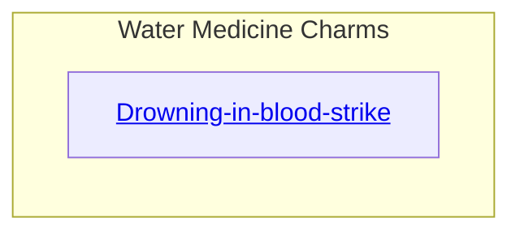
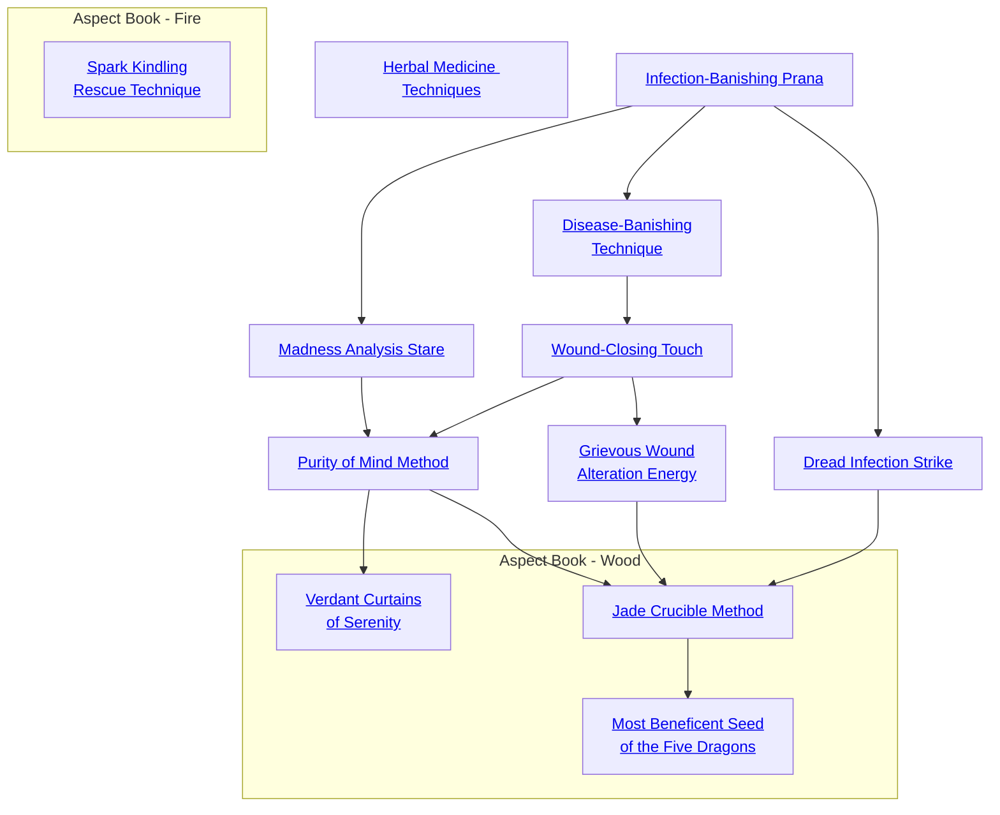

## Drowning-in-blood-strike

Cost: 4 motes
Duration: Instant
Type: Supplemental
Minimum Medicine: 2
Minimum Essence: 1
Prerequisite Charms: None

The body, as anyone can see, contains a lot of water
- blood. Dragon-Blooded warriors who learn the hidden
tides and currents of blood can strike in such a way as to
cause internal bleeding into an enemy's lungs. The victim
can literally drown in his own blood.
To use this Charm, the attacker must successfully
strike her opponent in some way. If the Drowning-in-Blood
Strike roll succeeds, the target loses one point of
Stamina on each subsequent turn, for as many turns as the
player rolled successes on the Essence + Medicine roll.
The Drowning-in-Blood Strike does not itself inflict health
levels of damage, though it may look like a series of rapid
punches or some other attack.
Cascade Charms:
• A more skilled or powerful Dynast no longer needs
to punch his opponent to inflict the Drowning-in-Blood
Strike; a light slap, or even a mere brush with a finger, will
suffice to disrupt the flow of blood.
• An even more advanced version of the Drowning-
in-Blood Strike adds a time delay: The attacker can prime
the victim to drown in his own blood minutes or hours
later.
• Techniques resembling the Drowning-in-Blood
Strike can be used to stanch internal or external bleeding.

## Herbal Medicine Techniques

Cost: 5 motes
Duration: Until consumed
Type: Simple
Minimum Medicine: 2
Minimum Essence: 1

In the Age of the Exalted, most drugs and medicines
come from plants. A physician or druggist who under-
stands the Essence within plants can prepare drugs and
medicines with uncannily precise effects. Each effect is
actually a separate Charm, but a character who learns one
Herbal Medicine Technique probably knows a few more as
well. Some common tricks include:
• Time Delay: A drug or medicine takes effect at a
time set by the Dragon-Blooded character, perhaps days
after the Dynast administered the draught.
• Trigger: A drug or medicine takes effect when a
certain external condition is met.
• Tuning: The druggist can control the content of
hallucinations caused by a drug.
Most uses of an Herbal Medicine Technique require
only a simple success. Some applications - for instance,
very precise hallucinations or a time delay longer than a
few hours — might impose difficulty penalties.
The Dynast who would use an Herbal Medicine
Technique must compound the drug or medicine herself
and infuse it with Essence at that time. The effect of the
Essence-charged drug lasts its regular duration. Only after
the magic medicine runs its course can the character who
created it recover the motes of Essence used in its creation.
Cascade Charms:
• With experience, a Dragon-Blooded pharmacist
might Combo different Herbal Medicine Techniques.
• More skilled and powerful druggists might produce
medicines with actual magical effects on their users. Storytellers
may want to restrict how &quot;magical&quot; an effect
characters can achieve through Medicine-based Charms.

## Infection-Banishing Prana

Cost: 1 mote
Duration: Instant
Type: Simple
Minimum Medicine: 2
Minimum Essence: 2
Prerequisite Charms: None

Nearly any Exalted with the Medicine Ability can tell
at a glance whether a wound has been infected. Infections
rarely strike the Exalted themselves, but their servants,
henchmen and bodyguards often suffer from such maladies
in the hours and days following battle. Regardless of the
nature of the character suffering from infection, Dragon-Blooded
with this Charm can remove the infection with
just a touch and the expenditure of a mote of Essence.
Removing the infection does not eliminate damage already
done, but it removes the source of infection and
prevents it from recurring to this injury - even if the
Charm's subject does something foolish, like enter the
sewers of Nexus with an open wound. So long as the wound
has been treated with Infection Banishing Prana, it will
not become infected. Note that Infection Banishing Prana
only works on infections caused by physical injury; ordinary
and magical plagues are unaffected by it.

## Dread Infection Strike

Cost: 2 motes
Duration: Instant
Type: Supplemental
Minimum Medicine: 3
Minimum Essence: 2
Prerequisite Charms: Infection-Banishing Prana

The character's knowledge of the medicinal arts
and the sources of infection has grown to such levels
that he can magically infect his own weapon as he
strikes; if he does at least one lethal wound to the target,
the wound is much more likely to become infected. The
difficulty of the Stamina + Resistance roll to avoid
infection from the attack goes up by +2, even for
Exalted. Frequent use of this Charm is sure to win the
character enemies, as there is no more hated weapon
than disease. The Essence must be spent to activate this
Charm before the character makes his attack roll, and if
the attack does not do at least one lethal wound, the
Essence is wasted. This Charm can explicitly be used in
a Combo with Charms of other Abilities.

## Disease-Banishing Technique

Cost: 4 motes, 1 Willpower
Duration: Instant
Type: Simple
Minimum Medicine: 4
Minimum Essence: 2
Prerequisite Charms: Infection-Banishing Prana

With this technique, the Dragon-Blood becomes
like a healer out of legend. He can remove all but the
most powerful magical plagues from his allies with a
touch of his hand. The Exalt must make an ordinary
diagnosis with his Medicine Ability at some time before
using Disease-Banishing Technique, as it is necessary to
know what plague it is the character intends to eliminate.
If the diagnosis roll is successful, however, then the
simple expenditure of a few seconds' time, the touch of
the Exalted's hand and the expenditure of the necessary
Essence combine to violently purge the disease from the
subject's body. The subject is likely to convulse and expel
some foul substance from her mouth and nose as this
Charm takes effect, costing her his next turn if one had
been available. Should the subject suffer from multiple
plagues — a terrible fate indeed! - then this Charm
must be used multiple times. Disease-Banishing Technique
does work on battlefield infection - however,
Infection-Banishing Prana is a far more effective tool for
such things. This Charm, like so much other magic, is
powerless against the Great Contagion.

## Wound-Closing Touch

Cost: 2 motes per health level converted, plus 1 Willpower
Duration: Instant
Type: Simple
Minimum Medicine: 4
Minimum Essence: 3
Prerequisite Charms: Disease-Banishing Technique

With this simple Charm, the Exalted can rapidly close
open and bleeding wounds on his body, allowing himself to
heal those wounds far more quickly than a mortal could.
The Charm leaves only bruises and sprains behind, rather
than life-threatening injury. So long as at least 1 mote of
Essence is spent, any bleeding wounds automatically close.
In addition, every 2 motes of Essence spent turns one lethal
wound level into a bashing wound level instead. The
character does not have to convert all of his lethal wounds
into bashing wounds if he does not wish to do so. This
Charm can also be used on other characters.

## Grievous Wound Alteration Energy

Cost: 3 motes and 1 Willpower per health level converted
Duration: Instant
Type: Simple
Minimum Medicine: 5
Minimum Essence: 3
Prerequisite Charms: Wound-Closing Touch

This complex Charm allows the Exalted to turn
truly horrific injuries, such as those inflicted by supernatural
sources, into mere lacerations and broken bones.
By spending 3 motes of Essence, he can convert an
aggravated wound level into a lethal wound level. The
Dragon-Blooded does not have to convert all of his
aggravated wounds to lethal wounds if he does not wish
to do so or cannot afford the Essence. This Charm also
automatically closes any bleeding wounds from which
the character suffers. Aggravated wounds converted to
lethal wounds with this Charm can later be converted
to bashing wounds with Wound-Closing Touch, above.
This Charm can also be used on other characters.

## Madness Analysis Stare

Cost: 3 motes
Duration: Instant
Type: Simple
Minimum Medicine: 3
Minimum Essence: 2
Prerequisite Charms: Infection-Banishing Prana

This Charm allows a Dragon-Blood to analyze another
character and see what external influences there are
over his mind; this includes low-Willpower compulsions,
mind-affecting sorcery or Charms and/or derangements. A
Perception + Medicine roll is called for here, with a
difficulty of 2. Should this roll be successful, the Exalt can
detect any external influences on the target. With four or
more successes, she can trace magical influences backward
to their source. The Exalted cannot use this Charm on
herself, as one's mind often proves too nimble for cogent
self-analysis. This Charm cannot diagnose or help in the
treatment of the Great Curse.

## Purity of Mind Method

Cost: 5 motes, 1 Willpower
Duration: Instant
Type: Simple
Minimum Medicine: 4
Minimum Essence: 3
Prerequisite Charms: Wound-Closing Touch, Madness-Analyzing Stare

With a strike of the palm and a touch of the lips, an
Exalted with this level of mastery over the medicinal arts
can remove the pain of insanity or external influence from
the Charm's subject. The Dragon-Blood must have first
used Madness-Analyzing Stare to learn the source of the
subject's mental problems - whether it be madness,
compulsion or sorcerous meddling. This Charm must be
used repeatedly if its subject suffers from multiple sources
of mental influence. Purity of Mind Method works to
counteract only sorcery spells of instant duration — ones
whose effects are still ongoing must be targeted with
Emerald Countermagic. Like Madness-Analyzing Stare,
this Charm is powerless in the face of the Great Curse.

## Spark Kindling Rescue Technique

Cost: 5 motes
Duration: Varies
Type: Simple
Minimum Medicine: 2
Minimum Essence: 2
Prerequisite Charms: None

Dynasts in the Cathak legions developed this Charm
as a means of retrieving fallen comrades from the field of
battle. By sending a potent surge of Essence through the
target's body, the Fire Aspect sparks an incapacitated
target into furious action for three turns for every success
on a Strength + Medicine roll. The target does not regain
consciousness and cannot take actions of his own, so the
Exalt using this Charm must guide the target's somewhat
uncoordinated running, but the target can move at his
maximum speed for the duration of this Charm, provided
the Exalt guides him around obstacles. Targets affected by
this Charm are, albeit only briefly, stabilized and will not
lose blood again until three turns after the Charm concludes.
If the target takes damage beyond the maximum
dictated by his Stamina while this Charm is in effect, he
dies the moment the Charm concludes.
For the rules on death and dying, see page 233 of
Exalted.

## Verdant Curtains of Serenity

Cost: 5 motes, 1 Willpower
Duration: One scene
Type: Simple
Minimum Medicine: 5
Minimum Essence: 3
Prerequisite Charms: Purity of Mind Method

Through extended insight meditation and the reining
of the mind's wandering tendencies, a Dragon-Blooded who
has mastered this technique way wrap his consciousness in
bands of resilient Essence, affording his sanity a fortresslike
protection through which only the most persistent psychic
effects may penetrate.
A character using this Charm may add her permanent
Essence to the difficulty of any supernatural effect that seeks
to sway her emotions, control her mind or induce madness.
This Charm has no effect upon the Great Curse.

## Jade Crucible Method

Cost: Special, 1 Willpower
Duration: Instant
Type: Simple
Minimum Medicine: 5
Minimum Essence: 4
Prerequisite Charms: Dread Infection Strike, Grievous Wound Alteration Energy, Purity of Mind Method

As one of the most dangerous and powerful of the
internal medicine techniques devised by Dragon-Blooded
savants, the secrets of this Charm are closely guarded and
known to very few. Wise use of this technique will allow
a truly adept practitioner to access a hidden wellspring of
Essence within himself. By sacrificing the integrity of his
physical form, he releases a portion of the Essence that gives
him life, liberating it for other more direct uses. Despite
the power of this Charm, it's manifestation is quite subtle,
as its effects are invisible to the casual onlooker.
The player of the character using this Charm chooses
how many health levels he wishes to convert into Essence
and then rolls his character's permanent Essence + Medicine. Each success on this roll grant 1 mote of Peripheral
Essence per health level expended. These health levels
are not lost until after the roll is made, and therefore, any
wound penalties accrued from their loss do not affect this
roll. Essence gained in this way may cause the characters
Peripheral Essence pool to exceed its normal maximum
levels, but any such excess Peripheral Essence is lost at
the end of the scene, returning to the natural essence
flows of Creation.

## Most Beneficent Seed of the Five Dragons

Cost: 8 motes, 1 Willpower
Duration: One scene
Type: Simple
Minimum Medicine: 5
Minimum Essence: 5
Prerequisite Charms: Jade Crucible Method

As the five elements intertwine to form all things
within Creation, so too does each Dragon-Blooded contain a piece of all five elements within his Essence. As a
master of life and death, a Dragon-Blood wielding this
Charm may cause the seed of another element to blossom
within himself, providing him with some of the benefits
of that aspect.
The Dragon-Blood must select which type of elemental
Essence he wishes to emulate when this Charm is invoked.
For the duration of the Charm's effect, the character's
aspect is considered to be of that type for purposes of
Charm activation costs, anima effects and immunities
or resistances specific to beings of that elemental aspect.
The character loses access to his Wood-aspected anima
power while this effect persists and must pay the out-of-
element mote surcharge on any Wood-aspected Charms.
The character may opt to end this effect at any time, as a
reflexive action, but ending the Charm's effect will cause
any benefits from non-Wood-aspected anima powers to
end as well. This Charm does not effect which skills are
considered favored by the character for experience cost
or training time purposes.
