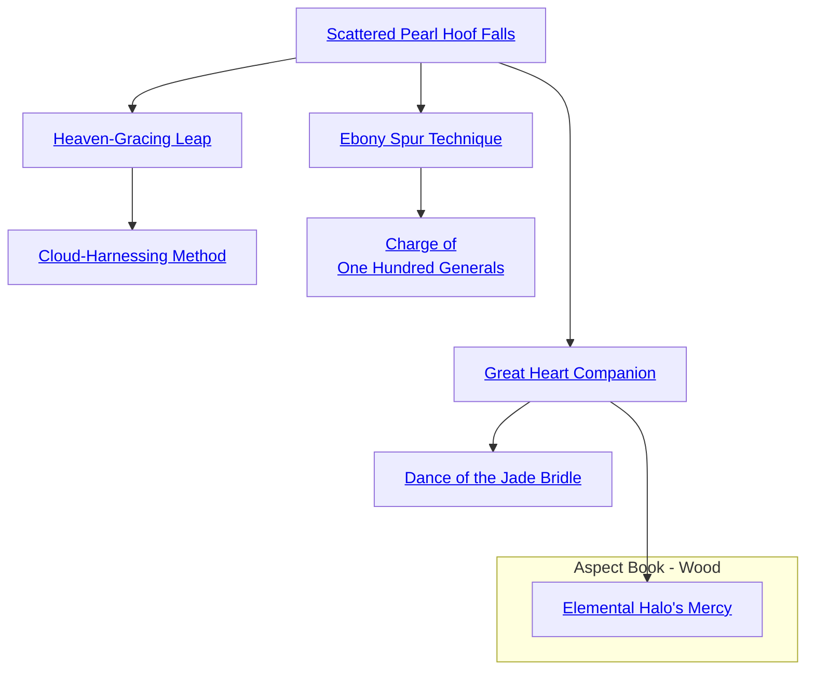

## Scattered Pearl Hoof Falls

Cost: 1 mote
Duration: One turn
Type: Reflexive
Minimum Ride: 2
Minimum Essence: 1
Prerequisite Charms: None
The hoofbeats of a steed whose rider employs this
Charm strike the ground as quickly and lightly as pearls
falling from a broken necklace. The mount's speed for the
turn is increased by the rider's Ride Ability in yards.
Additionally, the rider receives two additional dice for
Ride checks, as his Essence-enhanced steed handles obstacles
with ease. These bonus dice do not raise the Ride
Ability for purposes of attacking while mounted.
Animal
<table>
    <tr>
        <th>Animal</th>
        <th>Average Movement in Yards Per Turn</th>
    </tr>
    <tr>
        <td>Horse</td>
        <td>60</td>
    </tr>
    <tr>
        <td>Donkey</td>
        <td>50</td>
    </tr>
    <tr>
        <td>Elephant</td>
        <td>35</td>
    </tr>
    <tr>
        <td>Ox</td>
        <td>25</td>
    </tr>
</table>

## Heaven-Gracing Leap

Cost: 3 motes
Duration: Instant
Type: Reflexive
Minimum Ride: 3
Minimum Essence: 2
Prerequisite Charms: Scattered Pearl Hoof Falls

With the aid of this Charm, a rider and steed pair can
clear prodigious distances with a single jump, safely landing
leaps that seemed if not impossible, then certainly unwise.
With room to run, two successes on a Charisma + Ride roll
will let the mount safely jump one half its movement for the
turn when jumping for distance. Standing jump, or jumping
vertically, either up or down, will modify both distance and
difficulty at the Storyteller's discretion.

## Cloud-Harnessing Method

Cost: 4 motes
Duration: One turn
Type: Reflexive
Minimum Ride: 5
Minimum Essence: 3
Prerequisite Charms: Heaven-Gracing Leap

A mount emboldened with this Charm does not
actually take to the skies, but its feet barely brush the
ground. So quickly does the beast move that it is capable
of running over water, deep snow, loose sand or sharp,
scree-covered slopes without the slightest difficulty. Rapid
ascent and descent are also made trivially easy and may be
done at the mount's full speed. A successful Dexterity +
Ride roll is necessary to invoke the Charm. The mount's
movement rate for the turn is doubled, and no environmental
Ride check penalties apply. Both mount and rider
will still take damage from harmful local environments,
such as riding over a pool of lava.

## Ebony Spur Technique

Cost: 1 mote per two damage dice
Duration: Instant
Type: Supplemental
Minimum Ride: 3
Minimum Essence: 2
Prerequisite Charms: Scattered Pearl Hoof Falls

The simple advantages of height and mobility enjoyed
by a mounted swordsman wreak havoc on the
battlefield. Exalted cavalry are even more terrifying, translating
their mounts' great speed and strength into carnage
in the opposing ranks. With a successful Dexterity + Ride
roll, the Dragon-Blooded rider can add up to his Ride skill
in extra damage dice to hand-to-hand attacks. Archery
and Thrown attacks are not affected by this Charm. This
Charm can explicitly be included in Combos with Charms
of other Abilities.

## Charge of One Hundred Generals

Cost: 1 mote per mount/rider pair, plus 1 Willpower
Duration: One charge
Type: Supplemental
Minimum Ride: 5
Minimum Essence: 2
Prerequisite Charms: Ebony Spur Technique

Only the Exalted dare to stand and meet this deadly
charge with any hope of success. The Dragon-Blooded
rider gathers cavalry to her side, pays the Essence cost of 1
mote per ally and mount (including herself and her steed)
and forges the unit into a thunderous charge that moves
across the field of battle as one. Where the charge hits
enemy lines, pikes snap, shields crack and defenders fall
while the charge rides through unscathed. Every member
of the charge attacks on the leader's initiative, and the
charge's attacks are resolved before any delayed attack
actions on the part of the defenders. Any defender who
suffers damage but is not knocked unconscious or killed
must immediately make a Ride or Athletics check to avoid
being dismounted or knocked down. Defenders who retain
their lives and their feet may then attack normally. The
Exalt must ride with the group, which cannot number
more than 5 x the character's permanent Essence.

## Great Heart Companion

Cost: 2 motes
Duration: One turn per success
Type: Reflexive
Minimum Ride: 3
Minimum Essence: 2
Prerequisite Charms: Scattered Pearl Hoof Falls

The beasts typically chosen for mounts are (with the
possible exception of the ass) generally considered to be
brave, solid creatures. Still, even stout courage may not be
enough when the mount comes face to face with the dangers
a Dragon-Blood will invariably encounter fulfilling her duties
as a Prince of the Earth. Using this Charm, an Exalt rider can
bolster her mount's natural bravery with her Essence, spiritually
blurring the line between rider and steed. The Exalt's
player makes a Charisma + Ride roll; each success guarantees
a turn during which the mount will not bolt or flee no matter
the danger unless commanded to do so by her rider. The
Dragon-Blood also does not need to devote an action to
controlling the mount. No matter the provocation, the beast
responds exactly as trained, without hesitation. Finally, during
the Charm's duration, the rider cannot be removed from
her steed's back while the Charm lasts by force or by accident.
A failed or botched Ride check may result in the loss of
actions, but the Exalt will remain on her mount's back unless
she chooses to dismount - thereby ending the Charm.

## Dance of the Jade Bridle

Cost: 10 motes + 1 Willpower
Duration: Special
Type: Supplemental
Minimum Ride: 5
Minimum Essence: 3
Prerequisite Charms: Great Heart Companion

The great beastmasters of the Dragon-Blooded do not
restrict themselves to average mounts. Fierce bears, big-toothed
cats and even river dragons have served as steeds to
the Elemental Dragon of Wood's children. Such impressive
creatures are never broken without an epic battle of will,
magic and stamina, however. Activating this Charm allows
the Dragon-Blood to distill what would be painstaking days or
weeks of training into one tumultuous encounter. The Exalt's
player rolls Charisma + Ride, while the intended mount
resists with its Stamina + Willpower. The Storyteller sets the
specifics of the task at his discretion, but expect an extended,
difficult test and a few bruises or worse along the way.
Breaking a flying creature such as a hybroc or a notoriously
vicious one such as a tyrant lizard in this manner carries the
very real possibility of a messy end. Nevertheless, once the test
is won, the creature is immediately compliant and trainable
(by the Dragon-Blood at least). A final note — this Charm
does not protect the rider from a beast who rebels after a period
of mistreatment. Such fierce-natured beasts may fight to the
death rather than submit again to a cruel master.

## Elemental Halo's Mercy

Cost: 3 motes
Duration: One scene
Type: Simple
Minimum Ride: 4
Minimum Essence: 3
Prerequisite Charms: Great Heart Companion

The powerful elemental anima of a Dragon-Blood
often injures all those nearby. This is especially problematic
for Dragon-Blooded who employ mounts. By way of this
Charm, a Dragon-Blood may protect his steed from the
damaging effects of his anima flux. With but a moments
concentration and a touch, the Dragon-Blood may infuse
his mount with a portion of his own Essence, shielding it
from the damaging of effects of his elemental banner.
For the duration of the scene, a mount affected by
this Charm will suffer no damage from the Dragon-Blood's
anima flux.
