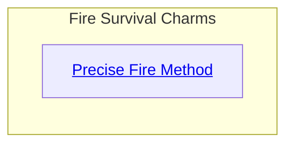
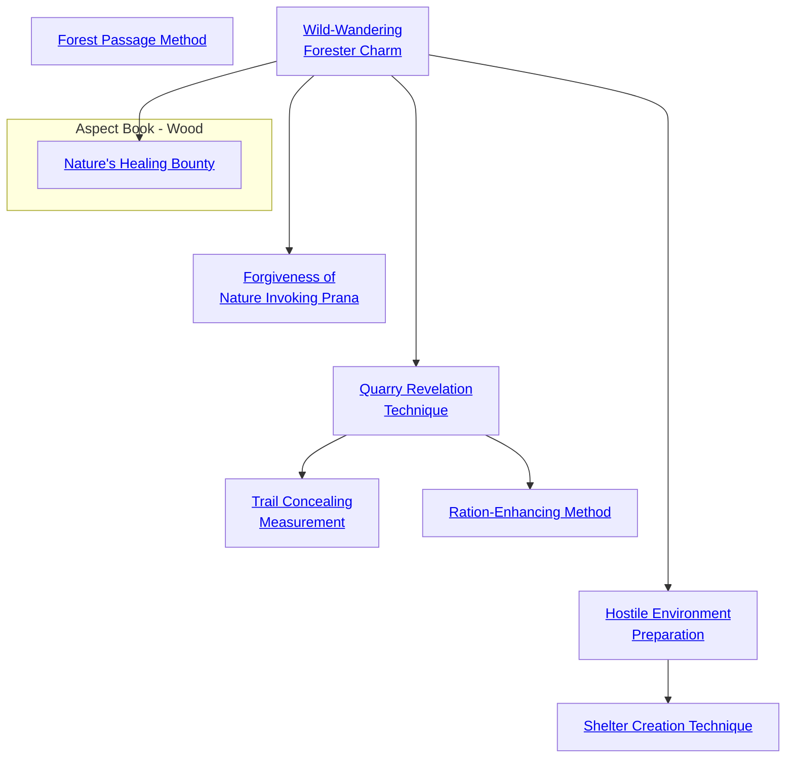

## Precise Fire Method

Cost: 5 motes
Duration: 1 hour
Type: Simple
Minimum Survival: 2
Minimum Essence: 1
Prerequisite Charms: None

As one might expect, the Dragon-Blooded attuned to
Fire can shape that unstable element with preternatural skill.
This Charm displays that power in a comparatively subtle
way. The character starts a fire; the method doesn't matter.
If the fire has suitable fuel, it will spread, as fires do. This fire,
however, spreads only along a path predefined by its creator
along invisible threads of Essence. For instance, a Fire-attuned
character could drop a torch on a forest floor littered
with dry leaves and have the fire burn in a narrow line, not
even scorching the leaves near the defined path or setting the
trees on fire. Applications include barriers of flame to restrict
and channel a fight, or a form of time-delayed arson.
The fire can last a full hour, fuel permitting. At the
end of that time, the Dragon-Blood can extinguish magic-bound
fire, if he so desires. If the character is no longer
present to restrain the fire, it burns out of control to the
extent that its fuel permits.
The player rolls Intelligence + Survival for the character
to lay the threads of Essence. The basic Precise Fire
extends through 25 square feet, in whatever simple shape
the character desires. For instance, the Dynast could
create a wall of fire one foot wide and 25 feet long, a solid
square five feet on a side, a foot-thick ring eight feet in
diameter and so on. For every extra success, the area is
increased by an additional 25 square feet, but the character
cannot benefit from more successes than she has points of
permanent Essence. The Storyteller may also impose difficulty
penalties if the character wants to burn a particularly
complicated shape, such as writing a person's name in fire.
Cascade Charms:
• The basic Charm requires that the Dragon-Blooded
character light the fire by hand. With greater skill and
power, a character could initiate Precise Fires using fires
someone else set, or from a distance. For instance, a
character could shoot a flame arrow to start a Precise Fire
far away, or send flames leaping from an enemy's campfire.
• A more powerful character could make the flames
burn even in areas without suitable fuel. Whatever's avail-
able, burns.

## Forest Passage Method

Cost: 2 motes
Duration: The Dragon-Blooded's Essence in scenes
Type: Simple
Minimum Survival: 2
Minimum Essence: 1
Prerequisite Charms: None

A Wood-attuned character can attune herself to the
Essence of trees, grasses, briars and other plant life around
her. While thus attuned, she can pass through dense
vegetation without any penalty to her movement or combat.
Somehow, the crowding, tangling plants never seem
to be exactly where the character is. Not only does this
make it easier to pursue animals or fugitives through
undergrowth, briars or other hindrances, the Dragon-Blooded
character enjoys a considerable advantage over
an enemy if she fights in such surroundings.
Cascade Charms:
• A more experienced or powerful Wood-attuned
character could extend the effect of the Forest Passage
Method to other characters, for a suitably increased Essence
cost.
• A variation using Stealth instead of Survival makes
a person virtually invisible, silent and undetectable while
within forest, scrub or shrubbery.

## Wild-Wandering Forester Charm

Cost: 1 mote per 2 dice
Duration: Instant
Type: Supplemental
Minimum Survival: 2
Minimum Essence: 1
Prerequisite Charms: None

The Exalt using this Charm calls upon his superior
knowledge of the wilderness and uses his Essence, and
his relationship to the Elemental Pole of Wood in
particular, to improve his chance of survival in hostile
environments. The Dragon-Blood can improve his Survival
dice pools by two dice for every mote of Essence
spent, but can no more than double his Survival Ability.
The character must spend a full mote of Essence
even if he wishes to add just a single die (as might be the
case if he has an odd Survival score).

## Forgiveness of Nature Invoking Prana

Cost: 2 motes
Duration: Instant
Type: Reflexive
Minimum Survival: 2
Minimum Essence: 2

Prerequisite Charms: Wild-Wandering Forester Charm
The Exalt with this Charm is able to beg a brief favor
of the spirits of the natural world when he has given offense
or behaved in an inappropriate manner before them. In so
doing, he may be able to correct prior mistakes, although
there is always the chance that he will instead give further
offense. Immediately after a Survival roll, the Dragon-Blood's
player may spend 2 motes of Essence and reroll. He
must accept the second roll. If this Charm is part of a
Combo, the character must pay all the Essence necessary
to activate associated Charms again, even if they do not
contribute to the rerolled pool.

## Quarry Revelation Technique

Cost: 2 motes
Duration: One day
Type: Simple
Minimum Survival: 3
Minimum Essence: 2
Prerequisite Charms: Wild-Wandering Forester Charm

With this Charm, the Exalted can track the passage
of nearly any creature that is not using magic (such as
Trail Concealing Measurement, below) to hide signs of
its passing. The character needs only to spend the required
Essence, and signs of his quarry's passage stand out
to the character's eyes: Animal tracks and spoor become
much more prominent, and the broken twigs and other
signs that reveal a human's passage are quite clear. The
tracker's player must make a simple Perception + Survival
roll and acquire only a single success to keep on his
prey's trail, regardless of the conduciveness of the local
terrain and weather to tracking. The character cannot
follow a trail more than a week old with this Charm. If the
target is using Trail Concealing Measurement or some
other wilderness Charm that makes her untrackable
without magical aid, then this Charm counts as such aid.
Under such circumstances, the tracking Exalt's player
may make a normal Survival roll to track the target but
does not gain this Charm's normal mechanical bonus.

## Trail Concealing Measurement

Cost: 3 motes
Duration: One day
Type: Simple
Minimum Survival: 3
Minimum Essence: 2
Prerequisite Charms: Quarry Revelation Technique

The Exalted using Trail Concealing Measurement
knows instinctually how to hide signs of his passage. He
does this so skillfully that mortal trackers and those without
Quarry Revelation Technique (above) or other magical
means of tracking him are unable to do so. Players of beings
with magical means to pursue the character make normal
rolls to track the character. It is rumored by those who have
traveled close to the Wyld that the Lunar Exalted are not
fooled by this Charm at all when they wear animal shapes.

## Ration-Enhancing Method

Cost: 2 motes
Duration: One hunt
Type: Simple
Minimum Survival: 3
Minimum Essence: 2
Prerequisite Charms: Quarry Revelation Technique

Ration-Enhancing Method doubles the effectiveness
of any hunting expedition the character takes part in
during the scene that it is active. Whether alone or as part
of a group, when the Dragon-Blood with this Charm sets
off to find food, he (and his group, if applicable) will find
twice as much food as the level of success on their Survival
rolls would otherwise imply.

## Hostile Environment Preparation

Cost: 3 motes + 1 per companion
Duration: 1 Day
Type: Simple
Minimum Survival: 4
Minimum Essence: 2
Prerequisite Charms: Wild-Wandering Forester Charm

This Charm enables an Exalt and his companions to
avoid the worst effects of hostile environments. In a hot
environment, the Exalted leading the group uses this
Charm to make sure he and his fellows remain out of the
worst heat of the sun and conserve water. In a cold
environment, he makes sure they conserve body heat as
well as possible and remain moving to avoid frostbite.
When Hostile Environment Preparation is active,
the group can be assumed to be unharmed by any
environment that would ordinarily require three or fewer
successes on a Survival roll. Environments that would
require four or more successes now require three fewer
successes, so even the most hostile natural environment
only requires two successes on a Survival roll. The Charm's
base 3 motes cost protects the Exalt. Every additional
mote spent protects a single traveling companion. An
Exalt cannot protect more individuals with this Charm
than his permanent Essence.

## Shelter Creation Technique

Cost: 5 motes
Duration: One scene
Type: Simple
Minimum Survival: 5
Minimum Essence: 3
Prerequisite Charms: Hostile Environment Preparation

The character calls upon helpful spirits of Wood
(and, if appropriate, other elements) to help him build
a remarkably robust, protective and comfortable shelter
even in the worst environment. For a group traveling in
the forest, the Exalted can create a wooden hut in a
matter of about 30 minutes. Those traveling in the
desert can find themselves in a sheltered outcropping,
shaded from above and with plenty of room for wind to
flow through. A character in the Far North may build an
igloo or other hard-packed snow shelter in about 30
minutes. These shelters will last no more than a day, as
they are somewhat magical in nature. Generally, the
shelter the character builds can hold around six human-sized
creatures; if the Exalted wishes to build a larger
shelter, he must spend an additional mote of Essence per
person to be accommodated within it.

## Nature's Healing Bounty

Cost: 1 mote per two dice
Duration: Instant
Type: Reflexive
Minimum Survival: 3
Minimum Essence: 2
Prerequisite Charms: Wild-Wandering Forester Charm

Wood-aspected Dragon-Blooded are known for their
great expertise in herbalism and natural healing lore. With
the use of this Charm, a Terrestrial Exalt may supplement
his healing skills through the use of medicinal plants and
wild herbs. The Dragon-Blood can improve his Medicine
dice pools by two dice for every mote of Essence spent
but can add no more dice than his Survival Ability (plus
any relevant specialty). The character must spend a full
mote of Essence even if his player wishes to add just a
single die (as might be the case if the character had an
odd Survival score).
