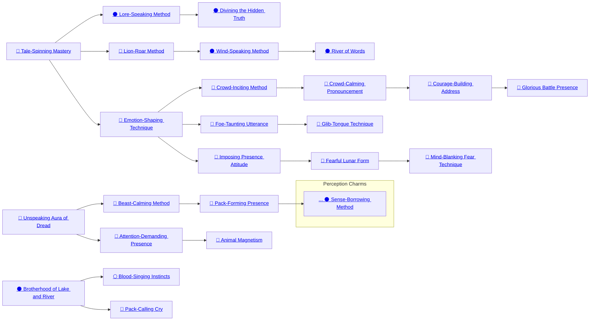

## Tale-Spinning Mastery

Cost: 1 mote per die
Duration: One scene
Type: Simple
Minimum Charisma: 3
Minimum Essence: 2
Prerequisite Charms: None

Lunar society has little in the way of a written
tradition, instead preferring to pass information down
orally. Much of the history and many of the traditions of
the Lunar Exalted take the form of stories — some based
on history, others simply parables — and learning how to
tell a story is an important skill in Lunar society, particularly
among the No Moons. Much of this is simply
learned, part of the Performance Ability, but a master
storyteller knows how to use Essence and his shapeshifting
powers to enhance the tale. The exact method will
depend on the audience — speaking to youngsters might
involve lots of noise and action, while, with adults,
delivery may be a major factor — but the Lunar can use
his abilities to shape his voice and actions accordingly.
Normally, the Charm affects five subjects, but for each
additional mote spent, the speaker can increase his
audience by a further five people. A Lunar with sufficient
Essence can use Tale-Spinning Mastery to address a
crowd, though it is an inefficient method.
While Tale-Spinning Mastery is in effect, the
Lunar's player can add bonus dice to any test involving
storytelling, though the bonus may not exceed the
character's Charisma. The Storyteller may increase the
difficulty of the roll if the audience is hostile, disinclined
to listen or otherwise distracted. The audience
must be able to comprehend the Lunar's speech for the
Charm to work.

## Lore-Speaking Method

Cost: 3 motes
Duration: 30 minutes + 10 minutes per die
Type: Simple
Minimum Intelligence: 3
Minimum Essence: 2
Prerequisite Charms: Tale-Spinning Mastery

Most Lunars do not believe in writing. Instead,
their history, traditions and knowledge are conveyed
orally. Each No Moon teaches the rudiments to the
youngsters whose bodies he tattoos. By using the Lore-Speaking
Method, a Lunar can enter a meditative
trance and search his memories for relevant information.
The trance lasts for a minimum of 30 minutes, but
may be extended if he wishes, providing the Lunar
with additional time to search his memories. At the
end of the meditation, the Lunar's player makes an
Intelligence + Wits roll, adding a bonus die for each
additional 10 minutes the character spent in meditation,
to a maximum bonus of his dots of Intelligence.
The difficulty of the roll depends on the nature of the
information he seeks — 1 for routine matters, 3 for
more obscure facts and 5 for esoteric knowledge the No
Moon may have mentioned in passing — and the net
successes determine the strength and clarity of the
recollection. The Storyteller may keep the exact difficulty
secret, instead telling the Lunar how sure he is of
the memory. If the Lunar's player rolls no successes or
if the Exalt is interrupted before 30 minutes have
elapsed, the Charm fails.

## Divining the Hidden Truth

Cost: 5 motes, 1 Willpower
Duration: 1 hour +
Type: Simple
Minimum Perception: 4
Minimum Essence: 3
Prerequisite Charms: Lore-Speaking Method

Sometimes, a Lunar has need of information he does
not know. In routine matters, he can turn to the No
Moons, who may be able to provide what he needs in
return for a boon, but even the No Moons are fallible.
Some information can only be acquired from outside
sources. A civilized Lunar might trek into the Threshold
or even the Realm proper in his quest for information.
Those with closer ties to the Wyld, however, do not allow
the restrictive trappings of civilization to bind their
thought patterns and will seek knowledge from their
ancestors and friendly sprits by means of a vision quest.
Entering a deep trance, the Lunar allows his mind
and spirit to wander free, perhaps aided by psychotropic
fungi or the crushed essence of certain beetles. This
trance may last for hours or days, and there is no guaran-
tee of success. The Lunar's mind wanders in search of the
truth it desires, traversing the landscape of his own
psyche. He may encounter &quot;spirits,&quot; which are, in fact,
creations of his mind, guiding him on his quest for divine
inspiration. The difficulty of the vision quest is knowing
when to trust his senses and instincts and when to reject
them; a Lunar in this trance cannot easily distinguish
between what is a real insight and what is his imagination.
The Lunar may emerge enlightened, or he may be
confounded by what he has seen. Indeed, external forces
aware of the Lunar's endeavor might seek to manipulate
the quest to their own ends, passing on their interference
as &quot;divine&quot; inspiration.
At the end of the vision quest, which lasts a number
of hours equal to the Lunar's Essence, his player may ask
a single question and roll Perception + Lore. The difficulty
of the roll is at the Storyteller's discretion and
depends on the nature of the information sought. &quot;Routine&quot;
information requires only a single success, while
hidden knowledge — obscured deliberately or otherwise
— requires at least three successes and possibly
even five. Irrespective of the size of his dice pool, a Lunar
may not count more successes than his permanent
Essence Trait. He must discard any extras. Failing this
roll can have devastating effects. If the Lunar gets at
least one success but not enough to succeed, he simply
wakes none the wiser. Failure, however, leaves the
Lunar disoriented and forced to soak a number of dice of
bashing damage equal to his Essence. A botch leaves him
catatonic for a number of days equal to his Essence and may
also result in a derangement.

## Lion-Roar Method

Cost: 5 motes
Duration: Indefinite
Type: Simple
Minimum Charisma: 3
Minimum Essence: 3
Prerequisite Charms: Tale-Spinning Mastery
Using this Charm to expand his lungs and vocal cords,
a Lunar can transform his normal voice into a formidable
roar. Anything the Lunar says while the Charm is in effect is
clearly audible to anyone within a number of yards equal
to (the Lunar's Essence x 100) and to those with acute hearing
for twice that distance. A Lunar can also use the Lion
Roar Method as a pseudo- weapon by roaring at an
individual within 10 yards. That individual must make a
reflexive Stamina + Endurance roll against a difficulty
equal to his own Perception. If the target fails, he temporarily
loses a point of Perception and must attempt
to soak a number of levels of bashing damage equal to the
Lunar's Stamina. The Charm actually changes the
character's body, and the Essence is committed (and the
effect available) until the character releases the Essence
committed to the effect.

## Wind-Speaking Method

Cost: 3 motes
Duration: Instant
Type: Simple
Minimum Wits: 3
Minimum Essence: 3
Prerequisite Charms: Lion Roar Method

Winds circulate around the world, and while not as
skilled as the Dragon-Blooded at manipulating the elements,
some Lunars do know how to call upon the wind
and use it to convey messages to their allies. Upon
activating this Charm, the Lunar whispers a few words
(his Essence score x 5 in words maximum) and names a
recipient. The Exalt's player then rolls Wits + Linguistics.
The difficulty of the roll depends on the range to the
intended recipient; if he is within a 1,000 yards, it is
difficulty 1, while up to a mile requires two successes.
Three or more successes allow the message to travel up to
five miles. The recipient must be known to the Lunar
and must have spoken to him at some point in the past.
The target is the only person to hear the message -
sending messages to multiple recipients requires multiple
invocations of the Charm.

## River of Words

Cost: 4 motes per 10 words/person, 1 Willpower
Duration: Instant
Type: Simple
Minimum Wits: 4
Minimum Essence: 3
Prerequisite Charms: Wind-Speaking Method

A more powerful version of the Wind-Speaking
Method, River of Words allows messages that are more
complex, longer distance and multiple recipients. There
is no range limitation to the message transmission,
though there may be a delay in delivery dependant on
the range; it takes one hour for the message to cross 600
miles. The Storyteller may require a Wits + Performance
roll to determine the clarity of the message at its destination.
The maximum number of recipients for a River of
Words communiqué is equal to the Lunar's Essence, and
the maximum number of words message may contain is
(the Lunar's Essence x 10).

## Emotion-Shaping Technique

Cost: 4 motes
Duration: One scene
Type: Simple
Minimum Manipulation: 3
Minimum Essence: 2
Prerequisite Charms: Tale-Spinning Mastery

The Emotion Shaping Technique enhances a Lunar's
already considerable presence, using a combination of
charisma, insight and timing to allow the Exalt to manipulate
the emotional responses of his audience. The
target must be capable of understanding the Exalt for the
Charm to function correctly but need not be paying full
attention to what is being said; the Lunar's words and the
Charm work on the subconscious as much as on the
conscious mind. The Lunar's player rolls Manipulation +
Presence, and each success allows the Lunar to temporarily
increase or decrease one of the target's Virtues by
a point. This may not increase the Virtue above 5, nor
may it reduce it below 1. Additionally, a Virtue may not
be altered by more than two — even under the influence
of this Charm, a paragon of valor will not become a
sniveling coward. The Lunar's successes need not, however,
be applied to the same Virtue or even to the same
target. Two successes could be applied one to each of two
Virtues or two to one or even one to a Virtue of one
character and one to a Virtue of another. However, other
Charms such as the Crowd-Inciting Method and Courage-Building
Address are better able to manipulate large
numbers of people. This power does not work on spirits
or any sort.

## Crowd-Inciting Method

Cost: 3 motes + 1 per 10 people, 1 Willpower
Duration: Instant
Type: Simple
Minimum Charisma: 4
Minimum Essence: 3
Prerequisite Charms: Emotion-Shaping Technique

In broad terms, the Crowd-Inciting Method follows
the same principals as the Emotion-Shaping
Technique but is better able to influence large numbers
of people, albeit in a restricted manner. The Lunar must
address and be heard by the crowd, his player rolling
Manipulation + Performance against a difficulty dependant
on the size of the crowd (difficulty +1 per 50
people or fraction thereof). If the roll succeeds, the
player may spend successes to temporarily reduce the
Temperance or Compassion Virtues of the crowd by a
maximum of 2 dots each and not below 1 (meaning that
if the Exalt has more than four successes, they are
wasted), perhaps making it more amenable to other
suggestions. A failed roll has no effect, but a botch may
result in the crowd turning on the speaker.

## Crowd-Calming Pronouncement

Cost: 6 motes + 1 per 10 people, 1 Willpower
Duration: Instant
Type: Simple
Minimum Charisma: 4
Minimum Essence: 3
Prerequisite Charms: Crowd-Inciting Method

The Crowd-Calming Pronouncement functions in
the same manner as the Crowd-Inciting Method, save
that it allows the Lunar to temporarily increase the
Compassion or Temperance of the crowd by up to 2 dots
(but not above 5). The base Essence cost is higher than
for the Crowd-Inciting Method, and the difficulty is + 1
per 30 people in the crowd — it is harder for the Lunar
to calm a mob than to stir one into action. A failed roll
has no effect, but a botch may result on the address
fanning the flames of discontent.

## Courage-Building Address

Cost: 6 motes + 1 per 25 people, 1 Willpower
Duration: One battle
Type: Simple
Minimum Manipulation: 4
Minimum Essence: 3
Prerequisite Charms: Crowd-Calming Pronouncement

In battle, numbers are rarely the deciding factor.
Instead, troop quality is often the key, and courage is the
cornerstone of troop quality. By means of the Courage-Building
Address, a Lunar can instill a sense of bravery
in his troops, increasing their Valor Virtue for the
duration of the battle by means of an inspirational
speech (which requires at least five minutes). While the
Lunar makes the speech, his player should make a Manipulation
+ Performance roll (difficulty 2 if the Lunar
is the unit commander or another notable individual, 3
otherwise). For every two successes gained, the Valor of
the troops temporarily increases by a dot for the duration
of the battle. A failed roll has no effect, but a botch may
harm the resolve of the troops. The Courage-Building
Address cannot be used during a battle.

## Glorious Battle Presence

Cost: 8 motes, 1 Willpower
Duration: 5 turns
Type: Supplemental/Special
Minimum Charisma: 5
Minimum Essence: 3
Prerequisite Charms: Courage-Building Address

Lunars are adept at combat, and they excel on the
battlefield. They are a fearsome presence — demoralizing
to an enemy and inspirational to their own troops. By
means of this Charm, a Lunar can influence the performance
of his troops in a battle. His commands are clearly
audible to troops within (his Essence x 100) yards, and his
player gains bonus dice equal to the character's Charisma
when attempting any rolls involving leadership. Furthermore,
any friendly troops within (the Lunar's Essence x
10) yards are immune to any effects that would reduce
their Willpower or Valor and cannot fail Valor checks.
Any enemy troops within the same radius increase by l
the difficulty of resisting intimidation or demoralization.

## Foe-Taunting Utterance

Cost: 3 motes
Duration: One turn
Type: Simple
Minimum Manipulation: 3
Minimum Essence: 2
Prerequisite Charms: Emotion-Shaping Technique

Insults are part of Lunar combat ritual — deriding an
opponent's reputation is almost as effective a wound as
that caused by a blade. However, most Lunars are inured
to the taunts, ignoring them as part of the formalities. By
means of this Charm, however, the Lunar gains insight
into what barbs will get under an opponent's skin and
make her react. The Lunar's player makes a Manipulation
+ Presence roll against a difficulty equal to the
opponent's Temperance. If the roll succeeds, the target
may be angered by the comments and fight badly, or he
may even fly into a howling rage.
With one or two successes, the target is distracted
and subtracts one success from all attacks, dodges and
parries until the end of the next turn. Three or four
successes indicate the comments have really gotten
under the opponent's skin. In addition to the previous
penalties, the target's player's next initiative roll is
reduced by 3. Five or more successes indicate the target
goes wild; she may not parry or dodge any attacks, nor
may she attack anyone other than the Lunar who taunted
her for the remainder of the battle. However, the target
is not subject to any initiative or attack roll penalties.
This Charm may only be used on a single foe. The target
may use Willpower to offset its effects, each point allow-
ing her to offset all the taunt-induced penalties for the
turn. The target must be within (the Lunar's Essence x
10) yards.

## Glib-Tongue Technique

Cost: 5 motes
Duration: One scene
Type: Simple
Minimum Manipulation: 4
Minimum Essence: 3
Prerequisite Charms: Foe-Taunting Utterance

The Glib Tongue Technique builds on a Lunar's
presence, allowing him to persuade an individual to act
(or not) as the Lunar sees fit. The Lunar's player makes
a Manipulation + Presence roll with a difficulty equal
to the target's permanent Essence. The net successes
determine if the Lunar's manipulation succeeds or not.
If the Lunar's player rolled one extra success, the
subject is predisposed to the Exalt's suggestion and will
likely do as the Lunar desires providing no other influences
(Charms, other persuasion attempts) come into
to play. Three additional successes guarantee the
subject's immunity of mortal persuasion, but she is still
open to magical manipulations that convince her to do
other than what the Lunar says. Five or more extra
successes mean the subject will do as desired and
cannot be swayed. Furthermore, she will do so as soon
as possible, even at great risk to herself.

## Imposing Presence Attitude

Cost: 2 motes per die
Duration: Instant
Type: Supplemental
Minimum Charisma: 4
Minimum Essence: 2
Prerequisite Charms: Emotion-Shaping Technique

Using this Charm, a Lunar can overwhelm someone
he is speaking to with his physical presence. Some use
Essence to modify their size, making themselves physically
larger, while others take on a more terrifying visage.
A few are less obvious, simply exuding menace and using
barely controlled fury to scare the person they are facing.
When the Lunar makes an intimidation attempt (see
Exalted, p. 242), his player may purchase additional dice
up to the Exalt's unmodified Manipulation score.

## Fearful Lunar Form

Cost: 3 motes per die
Duration: Instant
Type: Simple
Minimum Charisma: 4
Minimum Essence: 2
Prerequisite Charms: Imposing Presence Attitude

The battle-form of a Lunar is a fearsome sight and
more-or-less guarantees the success of an intimidation
effort. When making an intimidation roll, the Lunar's
player may convert a number of dice up to his character's
Manipulation Attribute into automatic successes. Fearful
Lunar Form is as effective against groups as it is against
individuals; make one roll, and apply it to all who behold
the Exalt's deadly glory.

## Mind-Blanking Fear Technique

Cost: 5 motes
Duration: Instant
Type: Simple
Minimum Manipulation: 4
Minimum Essence: 3
Prerequisite Charms: Fearful Lunar Form

A Lunar may focus his intimidation efforts on a
single individual, seeking not only to force him into
submission, but also to shatter his will. If successful, the
subject's mind will be overwhelmed, perhaps rendering
him unconscious or causing a derangement but certainly
damaging his short-term memory. The Lunar's player
rolls Manipulation + Presence against a difficulty equal
to the target's Essence. Success indicates that the target
has forgotten what happened in the last minute and each
additional success increases this mind-blanking period
by a minute. Mind-Blanking Fear Technique may only
be targeted on an individual, and the Lunar employing it
must be in beastman form.

## Unspeaking Aura of Dread

Cost: 3 motes per die
Duration: Instant
Type: Simple
Minimum Charisma: 2
Minimum Essence: 1
Prerequisite Charms: None

Speech is only one method of manipulating others.
Scent and body language can also play a part, particularly
in more feral circumstances. A Lunar may attempt to use
his protean nature to manipulate others by such nonverbal
means, altering his posture, scent and a host of other
factors to better influence others. When making a Social
roll, the Lunar's player may purchase additional dice up
to his character's Charisma at a cost of 3 motes each.
Such manipulation only works on targets within a num-
ber of yards equal to the Lunar's Essence, though they
need not understand his language (or even be able to
hear him) to be affected.

## Beast-Calming Method

Cost: 3 motes
Duration: One scene
Type: Simple
Minimum Manipulation: 3
Minimum Essence: 3
Prerequisite Charms: Unspeaking Aura of Dread

Using this Charm, a Lunar can modify the mental
state of a beast or a group of animals. This may be a
ravening pack of wolves he seeks to pacify, or it may be
a skittish packhorse he wants to calm. The difficulty of
the Manipulation + Survival roll depends on the nature
of and number of the animals he seeks to influence. One
success would allow the Lunar to walk past a rabbit
without causing it to bolt, while three successes would
hold a ravening pack of wolves in check. Five or more
successes would cause even the mighty tyrant lizard to
stand in abeyance. The target animals need not understand
the words of an Exalt seeking to calm them to be
affected by the Charm.

## Pack-Forming Presence

Cost: 5 motes, 1 Willpower
Duration: Special
Type: Simple
Minimum Manipulation: 3
Minimum Essence: 3
Prerequisite Charms: Beast Calming Method

Using this Charm, a Lunar can seek to command
beasts to do his bidding. To do so, his player must make
a series of Manipulation + Survival rolls over a period
of several days of game time, during which time the
Essence must remain committed. If the beasts are already
friendly to the Lunar, he must accumulate one
success for each beast he seeks to command, whereas, if
they are neutral, three successes are needed for each.
Hostile or fearful beasts cannot be easily commanded
and must generally be convinced to give the Lunar a
chance, usually by means of the Beast Calming Method.
However, if the Lunar gets five successes with this
Charm, even the most hostile beasts will acknowledge
the Lunar as their pack-leader. Beasts commanded in
this way remain loyal to the Lunar for a number of
months equal to his Essence. After that time, he must
either rework the Charm or trust to natural friendship.
The Lunar may command a total number of beasts equal
to (Charisma + Survival) x 10 via this Charm, though
he may command more through natural loyalty.
The cost of this Charm is paid per group of beasts
(if the beasts are social animals) or against individuals
(if they are lone animals). If the character spends 1
experience point when he uses the Charm and uses it
only on a single creature, then he may spend an
experience point to increase his Familiar rating with
that beast by 1. A character cannot get a new familiar
unless his old one has died and cannot have more than
one familiar at a time. See the Solar Charm Spirit Tied
Pet on page 179 of Exalted and the Familiar Background
on page 143 for details.

## Attention-Demanding Presence

Cost: 4 motes
Duration: Instant
Type: Simple
Minimum Charisma: 3
Minimum Essence: 2
Prerequisite Charms: Unspeaking Aura of Dread
Using this Charm, a Lunar can focus the attention of
those in the immediate vicinity upon himself without
speaking. Doing so requires a Charisma + Presence roll.
Each success indicates a number of individuals equal to
the Exalt's Essence have received the Essence-driven
equivalent of a shouted &quot;look at me.&quot; These subjects find
their attention focused on the Lunar and instinctively
look into his eyes where possible. A target may spend a
point of temporary Willpower to resist the Charm's effect.

## Animal Magnetism

Cost: 2 motes
Duration: Instant
Type: Supplemental
Minimum Manipulation: 4
Minimum Essence: 2
Prerequisite Charms: Attention Demanding Presence

A Lunar may use this Charm when seeking to seduce
another character, exploiting his animal magnetism and
feral nature with — metaphorically — deadly results; few
can resist the focused attentions of a Lunar for long.
When the Lunar makes the seduction attempt (see
Exalted, p. 242), his player may add bonus dice equal to
the character's Essence. The number of successes determines
the outcome of the seduction.

## Brotherhood of Lake and River

Cost: 5 motes and 1 Willpower per person
Duration: Instant
Type: Simple
Minimum Wits: 2
Minimum Essence: 3
Prerequisite Charms: None

Though Lunars often live and act alone, they can
form strong friendships and associations, similar to Solar
Circles, which they call &quot;packs.&quot; This camaraderie is a
rare gift, but it is not the ultimate expression of a Lunar's
loyalty. That ultimate expression is the Brotherhood of
Lake and River, a bond of blood and Essence forged
between the Lunar and his adopted brother. To partake
in the Brotherhood of Lake and River, the Lunar and his
sibling-to-be must cut the palm of their fellow's hands
and bind the wounds together for at least 10 minutes
while the Charm is activated. From that point on, the
Lunar is always dimly aware of his wolf-sibling's direction
and distance and will know if the other sustains
serious injury or is killed. When in close proximity —
within 100 yards or so — the Lunar may even read his
wolf-sibling's surface thoughts. If the two have used the
Charm reciprocally, they may even speak without words
when within 100 yards of one another. The effects of the
Charm are permanent and can only be broken by death.
The maximum number of wolf-siblings a Lunar may
have is equal to twice his Essence, though only one bond
is formed with each use of the Charm. If such a packmate
dies, another may take his place in the Lunar's heart.
This Charm's effects are not automatically reciprocal.
To establish a reciprocal link, two Lunars must use the
Charm on one another.

## Blood-Singing Instincts

Cost: 1 mote per wolf-sibling drawn from
Duration: One turn
Type: Reflexive
Minimum Dexterity: 3
Minimum Essence: 3
Prerequisite Charms: Brotherhood of Lake and River

A Lunar hunting alone is a fearsome sight. One
hunting with her associates is a nightmare for her enemies.
She can exploit the blood and Essence ties to her
allies, tapping into their senses and battlefield knowl-
edge to gain a decisive edge. Before rolling initiative
each turn, the Lunar can activate Blood-Singing Instincts,
paying motes of Essence up to the number of
allies present who are wolf-siblings of the Lunar through
the Charm Brotherhood of Lake and River. Each mote of
Essence spent in this manner adds 1 to the Lunar's
player's initiative roll for the turn. Multiple Lunars can
use one another to increase their initiative, making
Lunars who hunt as a pack into the deadliest of foes.

## Pack-Calling Cry

Cost: 1 mote per sibling called
Duration: Instant
Type: Simple
Minimum Charisma: 3
Minimum Essence: 3
Prerequisite Charms: Brotherhood of Lake and River

By crying into the wind and sounding the Pack-Calling
Cry, a Lunar uses the blood ties to his wolf-siblings
in the Brotherhood of Lake and River to summon them
into his presence. The Lunar may attempt to summon
any number of those bound to him by the Brotherhood
of Lake and River, each costing 1 mote of Essence. If
summoning less than his full pack, the Lunar can select
which of his packmates receive the summons.
The call can be heard over any distance, implanting
the desire to return to the Lunar's presence as soon as
possible. The wolf-sibling has some leeway in deciding
how quickly to heed the call (a few minutes if nearby,
perhaps hours if miles away and days if hundreds or
thousands of miles distant), but if she seeks to delay
beyond this time, her player must make a Willpower roll
against a difficulty equal to the calling Lunar's Charisma.
Success allows the target to resist the call for the same
time period again, and if her player is successful a number
of times (which need not be consecutive) equal to the
calling Lunar's Essence, the desire to return fades away.
Failure means the target must immediately break off
what she is doing and set off toward the caller, though she
may attempt to resist after each day of travel.
