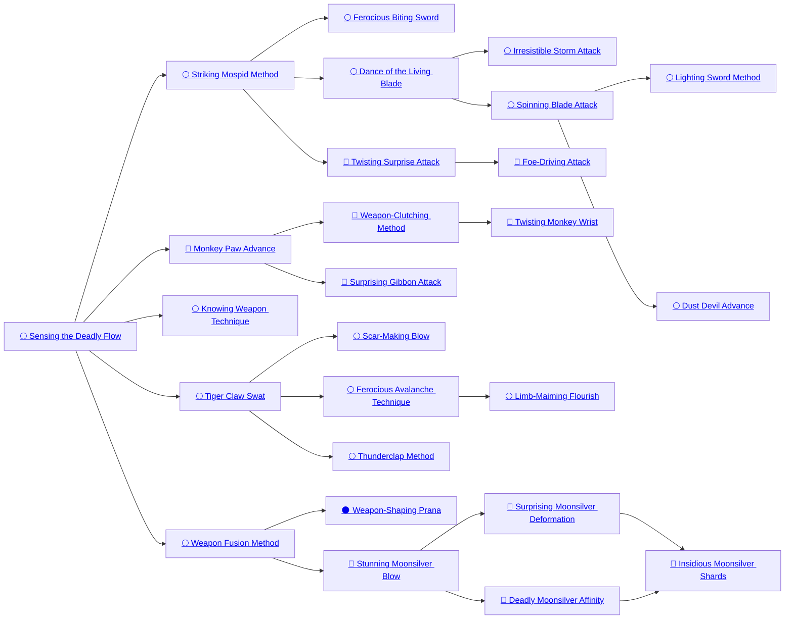

## Sensing the Deadly Flow

Cost: 1 mote per die
Duration: Instant
Type: Supplemental
Minimum Dexterity: 2
Minimum Essence: 1
Prerequisite Charms: None

By means of this Charm, a Lunar can perceive the
flows of Essence around his target, using them to guide
his blows to best effect. For each mote of Essence spent
on this Charm, the Lunar gains an additional attack die
on a single Melee attack. These bonus dice may not
exceed the character's Dexterity.

## Striking Mospid Method

Cost: 1 mote per +1 initiative
Duration: Instant
Type: Reflexive
Minimum Dexterity: 2
Minimum Essence: 1
Prerequisite Charms: Sensing the Deadly Flow

Using this Charm, a Lunar can imbue his weapon
with preternatural speed, using his Essence and instincts
to enhance the tempo of his attack. When rolling initiative
for a turn in which the character plans to make a
Melee attack, the Lunar may spend Essence to improve
his initiative rating for a single turn, each mote buying a
+1 modifier. The character cannot spend more motes
than he has points of Dexterity. The Essence cost of the
Charm is paid before making the initiative roll. The
Striking Raptor Method cannot be used in a Combo with
any other Charm that gives an initiative bonus.

## Ferocious Biting Sword

Cost: 4 motes
Duration: Instant
Type: Supplemental
Minimum Strength: 2
Minimum Essence: 2
Prerequisite Charms: Striking Mospid Method

By fortifying his attacking weapon with Essence, a
Lunar can make it very difficult for his opponent to block
a single attack with a hand-to-hand weapon. Players
rolling to defend against this attack must roll two successes
for each of the Exalt's own successes they seek to
negate. If a defender rolls an odd number of successes, the
extra success is wasted.
For Example: Red Jaw uses the Ferocious Biting Sword
to enhance his attacks on a Solar. His reaver daiklave,
Winter's Heart, arcs round at the enemy, and Red Jaw's
player gets four successes on the attack. The Storyteller rolls
the Solar's parry and gets seven successes. Ordinarily, this
would cancel out Red Jaw's attack, but as the Ferocious
Biting Sword Charm was in effect, it only cancels three of the
successes, with the seventh success on the parry discarded.
With one success remaining, Red Jaw's attack succeeds.

## Dance of the Living Blade

Cost: 3 motes per attack, 1 Willpower
Duration: Instant
Type: Extra action
Minimum Dexterity: 4
Minimum Essence: 2
Prerequisite Charms: Striking Mospid Method

By using the Dance of the Living Blade, the
Lunar can make multiple Melee attacks per turn.
These may be against the same foe or against multiple
foes within a distance in yards equal to the Lunar's
Dexterity. Each additional attack costs 3 motes of
Essence, and the Lunar may purchase no more additional
attacks than he has points of Essence. Each
attack is made with the Lunar's full dice pool and must
be parried or dodged separately. A Lunar can buy no
more extra actions than (the initiative on which he
activated this Charm ÷ 3, rounded down). This
normally means (the character's initiative ÷ 3), but
Lunars who hold their action and then invoke this
Charm may lose extra actions.

## Irresistible Storm Attack

Cost: 6 motes + 1 mote per yard, 1 Willpower
Duration: Instant
Type: Extra action
Minimum Dexterity: 5
Minimum Essence: 3
Prerequisite Charms: Dance of the Living Blade

Using this Charm, a Lunar can face multiple
foes and force them onto the defensive. The Irresistible
Storm Attack allows the Lunar to make a
number of Melee attacks equal to his Essence. All
the foes targeted by this Charm must be within a
number of yards of the Lunar equal to twice his
Dexterity. Each target of the Irresistible Storm Attack
is subject to a full attack. In addition, for each
additional mote the character spends, he may force
all his opponents to either give up one yard of
ground or give him a bonus Dexterity die, as per the
Ferocious Avalanche Technique. The Irresistible
Storm Attack cannot be used in a Combo with
Charms that grant extra attack dice or extra actions.
As with the Ferocious Avalanche Technique, the
maximum number of bonus dice the character can
gain is equal to his Dexterity. Each attack must be at
a different foe, and no foe can be attacked more than
once. Unused extra attacks are wasted.

## Spinning Blade Attack

Cost: 2 motes
Duration: Instant
Type: Extra action
Minimum Dexterity: 3
Minimum Essence: 3
Prerequisite Charms: Dance of the Living Blade

By means of this Charm, activated immediately
after rolling initiative, a Lunar armed with two hand-to-hand
weapons can attack a single opponent twice in a
single turn. One action is made with each weapon. Each
attack uses the Lunar's full dice pool at the character's
full initiative score, and neither attack is considered to
be with the character's off hand. The Lunar using the
Spinning Blade Attack may abort one or both of these
attacks to parries and, thus, can attack twice, attack and
parry or parry twice at his full dice pool in the same turn,
provided the actions are against the same opponent.

## Lighting Sword Method

Cost: 5 motes
Duration: Instant
Type: Extra action
Minimum Dexterity: 4
Minimum Essence: 2
Prerequisite Charms: Spinning Blade Attack

The Lightning Sword Method allows a Lunar armed
with two weapons to attack one or two opponents in the
same turn. The mechanics are as per the Spinning Blade
Attack, save that both actions need not be directed
against the same target, though the Lunar's attack has no
greater range than normal, so both foes must be within
the distance the Lunar can move for the turn.

## Dust Devil Advance

Cost: 3 motes, 1 Willpower
Duration: Varies
Type: Reflexive
Minimum Dexterity: 5
Minimum Essence: 3
Prerequisite Charms: Spinning Blade Attack

Using this Charm, the Lunar becomes a whirling
killing machine, constantly moving and attacking, ever
aware of his surroundings. While using this Charm, the
Lunar gets an initiative bonus equal to half (round down)
the number of yards he moved the previous turn. The
Charm remains active so long as the Lunar keeps moving
and commits Essence to it. If he is forced to stop moving,
the Charm ends. Additionally, while the Charm is active,
the Lunar can turn to meet any attack and cannot be
ambushed or attacked from the rear. The Dust Devil
Advance cannot be used in a Combo with any other
Charm that gives an initiative bonus. This Charm cannot
give the Lunar more bonus dice than his Dexterity.

## Twisting Surprise Attack

Cost: 4 motes
Duration: Instant
Type: Reflexive
Minimum Manipulation: 3
Minimum Essence: 2
Prerequisite Charms: Striking Mospid Method

By suddenly transforming his body — extending
his reach, adding an extra joint in an arm and so forth
— the Lunar performs an &quot;impossible&quot; maneuver. As
a result, he automatically wins initiative against a
single opponent. This Charm can be activated at any
point prior to the Lunar's actual action, so the player
could roll initiative as normal but choose to activate
this Charm depending on the actions of others. When
used in a Combo with extra action type Charms, the
Charm does not need to be applied to every action in
that Combo. The Twisting Surprise Attack cannot be
used in a Combo with any other Charm that gives an
initiative bonus.

## Foe-Driving Attack

Cost: 5 motes, 1 Willpower
Duration: Instant
Type: Extra action
Minimum Charisma: 4
Minimum Essence: 3
Prerequisite Charms: Twisting Surprise Attack

This Charm allows the Lunar to extend his body in
wild and improbable ways, wrong-footing his opponent,
keeping her off balance by force of arms and wearing
down her defenses until she makes a deadly error. When
activating this Charm, the Lunar's player rolls the attack
dice normally, but if the player gets 3 or more successes
(not extra successes) on the attack roll, the Lunar may
immediately attack the same target again. If the second
attack also gets 3 successes, the Lunar can attack again,
and so on, up to a maximum number of attacks equal to
the Lunar's Dexterity. All attacks must be at the same
target. Damage for each attack is resolved normally
before the next attack is launched, so unless the target
has powerful defensive Charms, she will surely falter.
The Foe-Driving Attack may not be used in any Combo
that includes Charms that provide automatic successes
on the attack roll.

## Monkey Paw Advance

Cost: 1 mote per die
Duration: Instant
Type: Supplemental
Minimum Manipulation: 3
Minimum Essence: 2
Prerequisite Charms: Sensing the Deadly Flow

The Lunar may combine his mastery of weapons and
his protean nature to counter the efforts of an unwary
foe, adjusting his weapon's path at the last moment to
negate defensive moves. If an opponent attempts to
parry a Lunar's Melee attack but does not completely
block it, the Lunar's player can use the Monkey Paw
Advantage to reroll the parried successes as another
attack with the same weapon, paying 1 mote per die
rerolled. If the opponent has actions remaining, she can
attempt to parry these rerolled attack dice. The Monkey
Paw Advantage confers no benefit if the target dodges.
The Monkey Paw Advance cannot be included in a
Combo with Charms that give extra actions.

## Weapon-Clutching Method

Cost: 2 motes
Duration: Instant
Type: Reflexive
Minimum Manipulation: 3
Minimum Essence: 2
Prerequisite Charms: Monkey Paw Advance
Using this Charm, the Lunar can elongate one of his
arms to retrieve a weapon that has been knocked from his
grasp or to otherwise arm himself. The arm may extend
to a number of yards equal to twice the Lunar's Essence,
grabs the weapon, then returns to its normal length with
the weapon ready to use. The extension and contraction
of the arm are almost simultaneous, and so, the Weapon
Clutching Method cannot be used to attack at a distance.
Lunars who wish to make a ranged Melee attack
will need to use the Surprising Gibbon Attack.

## Twisting Monkey Wrist

Cost: 1 mote per die
Duration: Instant
Type: Supplemental
Minimum Charisma: 3
Minimum Essence: 3
Prerequisite Charms: Weapon Clutching Method

In addition to proving a major advantage in weaving
past an opponents defenses, a Lunar's protean flexibility
helps to make disarming opponents easy. The Lunar
merely extends her limbs and alters the way her joints
move in order to give her a considerable edge. When
attempting a disarming attack (see Exalted, pp. 238-
239), the Lunar can purchase additional dice up to her
Dexterity. When using this Charm, the difficulty of
disarming in melee combat decreases to 2. The target
may parry the attempt as usual, but his player's reflexive
Wits + Melee roll requires one more success than the
Lunar's disarming roll to be effective.

## Surprising Gibbon Attack

Cost: 1 mote
Duration: Instant
Type: Supplemental
Minimum Manipulation: 4
Minimum Essence: 2
Prerequisite Charms: Monkey Paw Advance

Even allowing for the reach of limbs and weapons,
melee combat requires the combatants to be within a
few yards of each other. Longer weapons — such as
pole arms — can confer considerable advantages,
particularly when facing mounted opponents. Lunar
Exalted may adjust their bodies to adjust circum-
stances in their favor — they can elongate one or both
limbs, allowing them to attack opponents some dis-
tance. A Lunar using this Charm may attack at a
distance of up to his Essence in yards. If the opponent
is more than three yards from the Lunar, she will be
unable to make a hand-to-hand counterattack and
must move before engaging the Exalt in hand-to-hand
combat. Any weapon wielded in this manner — even
a knife — is considered a long weapon, and the Lunar
does not suffer the usual penalties for attacking mounted
opponents from on foot.

## Knowing Weapon Technique

Cost: 3 motes per die
Duration: Instant
Type: Supplemental
Minimum Dexterity: 3
Minimum Essence: 2
Prerequisite Charms: Sensing the Deadly Flow

By means of this Charm, a Lunar's control over his
weapon is without peer, and he can steer his attack to its
most deadly effect: Blades carve through flesh, and blunt
weapons break bones like porcelain. After an opponent
has applied his soak to an attack the Lunar makes using
a hand-to-hand weapon, the Lunar may pay 3 motes of
Essence per remaining damage point of damage. Each
point paid for in this manner becomes an automatic
success. The Lunar cannot buy more automatic successes
than his permanent Essence.

## Tiger Claw Swat

Cost: 3 motes per die
Duration: Instant
Type: Supplemental
Minimum Strength: 3
Minimum Essence: 2
Prerequisite Charms: Sensing the Deadly Flow

By lunging at his foe and binding Essence into his
attacks, a Lunar can inflict monstrous damage on his
opponent. The shocking impact of such an attack is
devastating and quite often ends the battle in the Lunar's
favor. The Lunar may enhance a single Melee attack by
buying additional damage dice at a cost of 3 motes per
die. The maximum number of points that can be added
is equal to the Lunar's Strength rating. This must be done
before the attack is rolled.
The attack may be dodged as normal, but the
difficulty of parrying an attack augmented with this
Charm is greatly increased. All parry attempts must first
overcome a base difficulty equal to the number of motes
spent fueling Tiger Claw Swat before they subtract
successes from the attack. This doesn't enhance the
attack. They simply increase the difficulty of the target's
parry and do not add to the damage of the Lunar's
attack. The difficulty modifier is applied first and must
be overcome before the extra successes can be applied
to defending against the Lunar's blow. Tiger Claw Swat
cannot be used in a Combo with other Charms that
increase damage dice.

## Scar-Making Blow

Cost: 2 motes
Duration: Instant
Type: Supplemental
Minimum Dexterity: 4
Minimum Essence: 2
Prerequisite Charms: Tiger Claw Swat

Scars are an integral part of Lunar Exalted society,
maintaining the Lunars' form and used as a means of
counting coup. Scarring an opponent, without causing
serious injury, is an unsubtle means of demonstrating
martial superiority. A Lunar enacting this Charm can
turn the Dexterity dice in his Dexterity + Melee attack
pool into automatic successes when attempting to mark
a target (see Exalted, p. 238). The opponent may parry
or dodge as normal, reducing the net successes for the
marking attempt.
Ritual scarring forms part of several Lunar events,
and the Scar-Making Blow is used in some cases to
impart the markings. In such cases, the target willingly
undergoes the marking, and the number of successes
needed to mark the target is reduced to 1. Scars imparted
by this Charm are simply the product of healing and lack
the magical strength of those imparted by the No Moon
Caste's Form-Fixing Method.

## Ferocious Avalanche Technique

Cost: 1 mote per yard
Duration: Instant
Type: Supplemental
Minimum Dexterity: 3
Minimum Essence: 2
Prerequisite Charms: Tiger Claw Swat

By making a series of swift and decisive blows, a
Lunar can unbalance his opponent. By using the
Ferocious Avalanche Technique, the Lunar forces
his opponent to give ground. For each mote of Essence
spent by the Lunar, his target must either back
off a yard or allow the Lunar to gain a bonus attack
die. If the opponent has not yet acted this turn or has
moved less than half his move allowance, he may
back off as a reflexive action. If the opponent does not
(or cannot) back away, the Lunar gains a number of
bonus attack dice equal to the distance the target
didn't move. The maximum bonus the Lunar can
gain from this attack is equal to his Dexterity, and
these are Dexterity bonus dice.
For example: A Lunar attacks and puts 3 motes of
Essence into the Ferocious Avalanche Technique. His opponent
must either back up three yards or else the Lunar gains
+3 attack dice. If the opponent backed up a yard but could go
no further due to an obstacle, the Lunar would gain + 2 attack
dice (3 - the distance in yards moved).

## Limb-Maiming Flourish

Cost: 6 motes
Duration: Instant
Type: Supplemental
Minimum Dexterity: 4
Minimum Essence: 2
Prerequisite Charms: Ferocious Avalanche Technique

Using the Limb-Maiming Flourish, a Lunar uses
Essence to maximize the lethal effect of her weapon,
guiding it to the points that will do most damage.
When rolling damage, any 10s on the damage dice
count as two successes. After determining the actual
amount of damage inflicted, the Lunar may reduce one
of the victim's Physical Attributes or Appearance by
one instead of inflicting two health levels of damage.
This may not reduce an Attribute below 1, nor may it
be used to convert all damage into Attribute loss — the
target must loose at least one health level per Attribute
point lost. An Exalted requires a week of healing to
recover each Attribute point lost, but such injuries are
permanent if inflicted on mortals. Limb-Maiming Flourish
cannot be used in a Combo with other Charms that
increase damage dice.

## Thunderclap Method

Cost: 1 mote per die
Duration: Instant
Type: Supplemental
Minimum Strength: 3
Minimum Essence: 3
Prerequisite Charms: Tiger Claw Swat

Most competent swordsmen can adjust their blows
so as to cause bashing damage to their targets. The
Lunar Exalted are considerably more formidable than
any mortal swordsman, and their Essence-laden blows
can fell even a Terrestrial. By means of the Thunderclap
Method, a Lunar increases the strength of a Melee
attack while softening its impact, so that it will only
fell an enemy, rather than slay her. A blow enhanced
by this Charm rings like thunder, stunning the opponent.
Any attack enhanced with this Charm
automatically does only bashing damage, but after
subtracting soak from the damage of the attack, the
Lunar can activate this Charm and pay 1 mote to
change a remaining die of damage to an automatic
success. Each remaining die becomes an automatic
success, inflicting a level of bashing damage. A Lunar
cannot buy more automatic damage successes in this
fashion than he has points of Strength. The Charm
cannot be part of a Combo with any other Charm that
grants automatic damage successes.

## Weapon Fusion Method

Cost: 1 mote
Duration: Instant
Type: Supplemental
Minimum Dexterity: 3
Minimum Essence: 2
Prerequisite Charms: Sensing the Deadly Flow

By means of this Charm, the Lunar's weapon becomes
an extension of his body. When making a single
attack or parry with a hand-to-hand weapon, the Lunar's
player can use his choice of the character's Melee, Brawl
or Martial Arts Abilities. The weapon's characteristics
are unaffected, only the Ability used to make the attack
changes. The Weapon Fusion Method cannot be used as
part of a Combo that incorporates Charms that aid in
unarmed Brawl or Martial Arts combat.

## Weapon-Shaping Prana

Cost: 2 or 3 motes
Duration: Indefinite
Type: Simple
Minimum Wits: 2
Minimum Essence: 3
Prerequisite Charms: Weapon Fusion Method

Using this Charm, a Lunar can pick up any piece of
wood or bone and imbue it with his Essence to transform
it into a serviceable hand-to-hand weapon (selected
from the list on p. 327 of Exalted). It costs 2 motes to
form a one-handed hand-to-hand weapon and 3 motes
to form a two-handed hand-to-hand weapon. These
weapons can be used by others as well as by the Lunar and
persist until the Exalt withdraws the Essence committed
to the Charm.

## Stunning Moonsilver Blow

Cost: 1 mote
Duration: Instant
Type: Supplemental
Minimum Manipulation: 3
Minimum Essence: 3
Prerequisite Charms: Weapon Fusion Method

The Lunar's mastery of moonsilver weapons allows
her to imbue such a weapon with Essence, causing it to
flow and flatten, rather than crush or cut. With the use of
this Charm, the Lunar can cause a single attack with a
moonsilver weapon to inflict bashing damage rather than
lethal without subtracting a success from her attack action
as per the normal pulling blows rules (see Exalted, p. 238).

## Surprising Moonsilver Deformation

Cost: 2 per success
Duration: Instant
Type: Supplemental
Minimum Manipulation: 4
Minimum Essence: 3
Prerequisite Charms: Stunning Moonsilver Blow

Moonsilver weapons have an innate link to the
Lunar Exalted, affording them considerable advantages
in combat. Combining this Charm with a moonsilver
weapon's fluid nature increases the difficulty of parrying
or dodging the weapon; the weapon simply flows around
the opponent's defenses or anticipates the defensive
moves. Increase the number of successes needed to parry
or dodge a single attack with a moonsilver weapon by up
to the Exalt's Essence, at a cost of 2 per additional success
required. These simply increase the difficulty of the
target's parry roll and do not add to the damage of the
Lunar's attack. The difficulty modifier is applied first and
must be overcome before the extra successes can be
applied to defend against the Lunar's blow. This Charm
has no effect if the parrying weapon is also made of
moonsilver, nor is it effective when attacking with
moonsilver talons or teeth.

## Deadly Moonsilver Affinity

Cost: 1 or 3 motes per die
Duration: Instant
Type: Supplemental
Minimum Manipulation: 4
Minimum Essence: 3
Prerequisite Charms: Stunning Moonsilver Blow

By means of this Charm, a Lunar can further
exploit his weapon's fluid form, rendering it into a truly
devastating tool, for the edge flows into blows, seeking
to widen and deepen cuts or reshaping itself to smash
bones for maximum effect. When making a damage
roll for a moonsilver weapon, the Lunar's player can
purchase additional damage dice up to the weapon's
damage rating. These points are added before soak is
applied. Bonus dice of damage up to the Lunar's
Strength cost 1 mote each, while those that exceed the
character's Strength cost 3 motes each. Deadly
Moonsilver Affinity cannot be used as part of a Combo
with other Charms that increase the damage value or
extra successes of an attack.

## Insidious Moonsilver Shards

Cost: 6 motes, 1 Willpower
Duration: Instant
Type: Supplemental
Minimum Charisma: 4
Minimum Essence: 4
Prerequisite Charms: Surprising Moonsilver Deformation, Deadly Moonsilver Affinity

A moonsilver weapon's edge is its most lethal aspect,
inflicting heinous damage on the Lunar's foes. It is
not, however, the only harm such weapons can inflict. A
more insidious option is open to appropriately minded
Lunars. By activating this Charm, the Lunar empowers
his moonsilver weapon so that it gains a purpose even
when beyond his hands. If the blow is successful, a
fragment of the blade breaks off in the wound, remaining
to cause grievous harm to the victim. The player must
pay for the Charm before making the attack roll. For the
magic to have effect, the attack must be successful and
must inflict at least one health level of damage.
The attack does damage as normal, and a shard of
moonsilver remains in the wound, slowly working its way
through the victim's body. This causes one die of lethal
damage per day and continues to cause damage until it is
removed. Removing the shard requires at least Medicine
3 and is Challenging (requires 3 successes). The removal
procedure causes five dice of lethal damage, minus one
die per extra success (to a minimum of 1L). Charms that
heal aggravated damage, such as Bodily Regeneration
Prana, can also be used to expel a moonsilver shard, as
can a shapeshifting stunt. Activating this Charm lowers
the weapon's damage rating by 1 until the next night the
moon is full.
