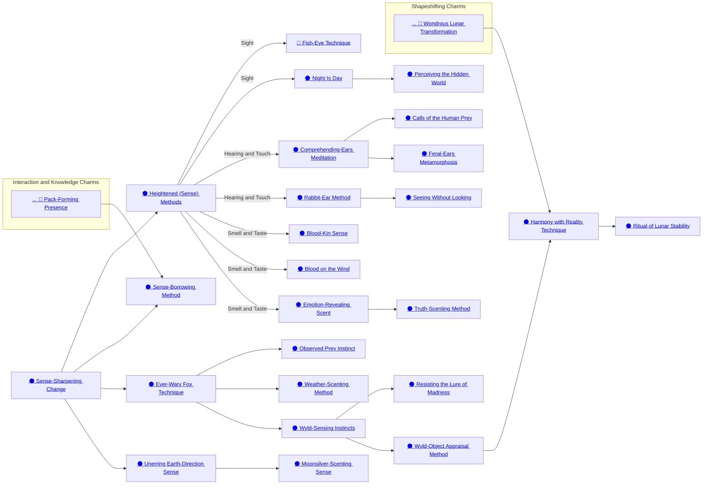

## Sense-Sharpening Change

Cost: 1 mote per die
Duration: One scene
Type: Simple
Minimum Perception: 2
Minimum Essence: 1
Prerequisite Charms: None

Using this Charm, the Lunar can heighten all of his
senses far beyond those of normal humans. His ears grow
to better hear sound, his nostrils flare to enhance his
ability to smell, and his eyes grow and dilate to enhance
his sight — he can even taste individual ingredients in a
meal and feel the slightest wind on his skin. For the
duration of the Charm, the Lunar's player adds bonus
dice equal to the amount of Essence spent to Perception
rolls. He may not increase the character's pool by more
dice through this Charm than the Lunar has dots of
Perception. This enhancement, though powered by Essence,
does not grant the Lunar supernatural powers —
it merely enhances his mortal senses.

## Heightened (Sense) Methods

Cost: 5 motes
Duration: 10 turns
Type: Simple
Minimum Perception: 3
Minimum Essence: 1
Prerequisite Charms: Sense-Sharpening Change

This Charm is actually three different Charms,
one each for sight, for scent and taste and for hearing
and touch. Through it, the Lunar can hone his senses
far beyond those of most animals. When making a
Perception test with the heightened sense, the Lunar's
Perception dice are automatically successes, and the
Lunar's player need only roll the character's Ability
dice (usually Awareness or Survival). Charms that
reduce successes in Perception tests affect these automatic
successes normally. The Charm must be purchased
separately for each of the three sense groups
and only provides a bonus when used in conjunction
with that sense group. A Lunar may use a maximum of
two Heightened (Sense) Charms at any time. If he
wishes to enhance a third, he must cease using the
Charm on one of the already-heightened senses.
Heightened (Sense) Method Charms may not be used
at the same time as the Sense-Sharpening Change or
any other Charm that boosts the Lunar's Perception,
though they may be used in conjunction with sense-
enhancing Charms that do not directly enhance the
Perception Trait, such as Night Is Day.

## Sense-Borrowing Method

Cost: 5 motes
Duration: Sustained
Type: Simple
Minimum Perception: 3
Minimum Essence: 2
Prerequisite Charms: Sense-Sharpening Change, Pack-Forming Presence

Using this Charm, a Lunar can attach his perceptions
to the senses of another human or an animal. The
Lunar must touch the target when activating the Charm,
but once it is functioning, the subject may travel up to
a mile from the Lunar per point of the Exalt's permanent
Essence and still serve as a source of sensory
information. If the subject is willing, no roll is required
to activate the Charm. Otherwise, the Lunar's player
must make a Wits + Awareness roll, with a difficulty
equal to the target's Essence. Animals of the Lunar's
totem species are automatically willing, while other
animals are not unless charmed or befriended. To
succeed, the Lunar's player must roll a number of
successes equal to or exceeding the target's Essence.
Otherwise, the Charm fails, and if the target is an Exalt
or other supernatural creature, he knows the Lunar
attempted to use a Charm on him. Mortals and mortal
beasts cannot detect the Charm.
While the Charm is active, the Lunar senses
everything his subject does. For all intents and pur-
poses, the subject becomes the Lunar's eyes and ears.
The Lunar has some semblance of his own senses, but
borrowed senses dominate his perceptions. Any ac-
tions taken by the Lunar while the Sense-Borrowing
Method is being used — including reflexive actions —
are at +2 difficulty. As a consequence, most Lunars
simply meditate while using the Charm. If the either
the Lunar or his subject sustain an injury (at least one
health level of damage), the Charm ends. This Charm
gives the Lunar no control over the creature, he
simply shares its senses.

## Ever-Wary Fox Technique

Cost: 1 mote
Duration: Instant
Type: Reflexive
Minimum Perception: 2
Minimum Essence: 1
Prerequisite Charms: Sense-Sharpening Change

Lunars are very aware of their environments and,
thus, very difficult to ambush. When the character is
attacked from surprise, the Lunar may choose to activate
this Charm automatically if the character has sufficient
Essence to power it. When it does activate, the Lunar's
player's reflexive Perception + Awareness roll to avoid
being ambushed (see Exalted, p. 238) gains a number of
bonus dice equal to the Lunar's Perception.

## Observed Prey Instinct

Cost: 2 motes
Duration: Instant
Type: Reflexive
Minimum Perception: 3
Minimum Essence: 1
Prerequisite Charms: Ever-Wary Fox Technique

This reflexive Charm allows a Lunar to know if he is
being watched, either by normal senses or magic. It activates
automatically if the Lunar comes under sustained
observation — a casual glance or a flirtatious look are not
enough to trigger it. The Charm guides his perceptions to
gather further information, allowing a reflexive Perception
+ Awareness roll. The number of successes determines
the information gathered. A single success merely confirms
that the Lunar is being observed, while additional
successes will pinpoint the number and direction of observers
(one per success). A Lunar observed by magical
means will know the viewpoint from which he is being
watched but not the actual location of the observer.

## Weather-Scenting Method

Cost: 1 mote
Duration: Instant
Type: Simple
Minimum Wits: 2
Minimum Essence: 1
Prerequisite Charms: Ever-Wary Fox Technique

Lunars with this Charm can track and predict the
weather, using Essence to build on and extend their
natural perceptions. The number of successes from a
Wits + Survival roll determines the scope of information
a Lunar can divine. Each success garners him either
knowledge of conditions within a 10-mile radius or for
the next day (cumulative). A Lunar may purchase information
on both area and time, but he must do so in as
even a manner as possible. For example, a Lunar who gets
4 successes cannot purchase information on a 40-mile
radius or about a 10-mile radius for 4 days in advance, but
rather learns about a 20-mile radius for two days in
advance. If there are an odd number of successes, the
Lunar's player may choose which aspect has the additional
die. The Weather-Scenting Method may not be
used to predict future conditions under the influence of
magic, though it may be used to gather information on
the prevailing conditions when the Charm is activated.

## Unerring Earth-Direction Sense

Cost: 1 mote
Duration: Instant
Type: Simple
Minimum Wits: 2
Minimum Essence: 1
Prerequisite Charms: Ever-Wary Fox Technique

After activating this Charm, the Lunar instinctively
knows the direction of the Imperial Mountain.
This works irrespective of the Lunar's situation — it is as
effective inside a building or underground as it is in
plains or forest — and works as well in darkness as in
daylight. If the Lunar simply desires to know the direction
of the Imperial Mountain, no roll is required
However, he may also use this Charm to identify his
location, though this requires a Wits + Awareness roll,
the number of successes indicating the precision of the
information. One success gives him little more than
what he already knows, three successes allows him to
narrow his location down to the county or district, and
five or more let him know precisely where he stands.

## Moonsilver-Scenting Sense

Cost: 3 motes
Duration: One hour
Type: Simple
Minimum Perception: 3
Minimum Essence: 3
Prerequisite Charms: Unerring Earth Direction Sense

The Moonsilver-Scenting Sense hones the Lunar's
olfactory nerves, allowing her to scent deposits of
moonsilver in the surrounding lands or moonsilver weapons
not attuned to a Lunar. The Lunar's player must make
a Wits + Awareness roll, the number of successes determining
what — if anything — the character learns of the
moonsilver deposits and unattuned items in the region.
One success allows the Lunar to ascertain whether there
is any moonsilver within a number of miles equal to the
Lunar's Perception + Essence. Three successes also pro-
vide a direction and approximate distance. Five or more
successes allow the Lunar to judge the quality and condition
(e.g., concealed by Dragon-Blooded machinations)
of the deposits or items. The Lunar's player may make one
roll for every 10 minutes that the Charm is active.

## Wyld-Sensing Instincts

Cost: 3 motes
Duration: Instant
Type: Simple
Minimum Perception: 3
Minimum Essence: 1
Prerequisite Charms: Ever-Wary Fox Technique

Having existed on the edge of the world, Lunar Exalted
are ever watchful for the warping effects of the Wyld.
Though their nature and their tattoos protect them from
its deforming effects, their associates and non-Lunar kin
are less fortunate, and their gear is often vulnerable as well.
Provided the Lunar has sufficient motes available, Wyld-Sensing
Instincts activates reflexively to alert the Lunar to
these malign changes. Immediately after it does, the Lunar's
player may make a (non-reflexive) Perception + Survival
roll. The number of successes indicates the amount of time
the Lunar has to act before changes occur. One success
gives the Lunar a few turns to escape the transformations,
while three successes indicates he has several minutes to
reach safety. Five or more successes indicate that, while
approaching dangerous levels, the chaos is not yet sufficient
to warp items, and he has as much as 30 minutes to
seek refuge — or to otherwise protect — his associates.

## Resisting the Lure of Madness

Cost: 3 motes, 1 Willpower
Duration: One lunar month
Type: Simple
Minimum Perception: 3
Minimum Essence: 2
Prerequisite Charms: Wyld-Sensing Instincts

A character who activates this Charm is immune to
Wyld addiction while the Charm's effects persist. Characters
addicted to the Wyld do not have to worry about
addictive behavior or relapse while the Charm's effects
continue, and those not addicted will not become so
while under the magic's sway.

## Wyld-Object Appraisal Method

Cost: 1 mote
Duration: Instant
Type: Simple
Minimum Perception: 3
Minimum Essence: 2
Prerequisite Charms: Wyld-Sensing Instincts

Although all Exalted can attempt to discern if
something is safe to remove from the Wyld and will
retain its form if removed, this ability is far from certain.
With the use of this Charm, a Lunar can absolutely tell
what the original form of a creation of the Wyld was,
whether it will be safe to remove it from the Wyld and
whether or not it will retain its present form when
removed. The Lunar can usually inspect only a single
item through the use of this Charm, although a number
of similar small items could be checked at the same time.

## Harmony with Reality Technique

Cost: 10 motes + plus 1 additional mote per pound of material, 1 Willpower
Duration: Instant
Type: Simple
Minimum Intelligence: 4
Minimum Essence: 3
Prerequisite Charms: Wyld Object Appraisal Method, Wondrous Lunar Transformation

A Lunar skilled in the ways of the Wyld can force his
will upon it, causing it to accede to his whims. While he
cannot create exactly what is desired, as a Solar can, he
can force the things he discovers to retain their form and
function when returned to Creation, no matter how
improbable or weird; in essence, he forces that part of the
Wyld to become part of Creation. This Charm cannot
affect more than 50 pounds of material per point of the
character's permanent Essence.

## Ritual of Lunar Stability

Cost: 10 motes, 1 Willpower
Duration: A number of lunar months equal to permanent Essence
Type: Simple
Minimum Intelligence: 5
Minimum Essence: 4
Prerequisite Charms: Harmony With Reality Technique

There are many places on the edges of Creation that
are kept safe only through the use of ancient rituals,
secret pacts or powerful sorceries. While this Charm
cannot replace these powers, it can provide sanctuary
from the effects of the Wyld for a time. The use of this
Charm requires that the Lunar first pace out the area she
wishes to protect, encircling it with her scent and
presence; this area can be no larger than a number of
square miles equal to her permanent Essence. Once this
is done, she uses the Charm, and her player rolls Wits +
Lore. For every three successes scored, the level of the
Wyld in the area protected is reduced by one (so if she
scored six successes, she would reduce an area of Deep
Wyld down in intensity to be equivalent to
Bordermarches). This effect lasts a number of weeks
equal to her permanent Essence.

## Fish-Eye Technique

Cost: 2 motes
Duration: One scene
Type: Simple
Minimum Manipulation: 3
Minimum Essence: 2
Prerequisite Charms: Heightened Sight Method

By means of this Charm, a Lunar modifies the shape
of his face and the nature of his eyes. He gains 360-degree
vision and, as a result, is aware of actions all around him
and does not suffer penalties for being caught unawares
by visible attacks. However, comprehending such a vista
forces the Lunar to focus on the &quot;big picture&quot; rather than
the details and, as a result, increases by 1 the difficulty of
any Perception rolls involving spotting details.

## Night Is Day

Cost: 1 mote
Duration: One scene
Type: Simple
Minimum Perception: 3
Minimum Essence: 1
Prerequisite Charms: Heightened Sight Method

Using this Charm, a Lunar alters his eyes to allow
him to see perfectly in low-light conditions. As such, he
treats nighttime conditions as daylight, though he is
partially colorblind in normally lit conditions (+1 difficulty
to Perception rolls) for the duration of the Charm.
Night Is Day does not allow the Lunar to see in absolute
darkness — there must be some light, even if just a
twinkle, for the Lunar's eyes to exploit. The Charm
manifests by giving the Lunar flashing, cat-like eyes
while it is active.

## Perceiving the Hidden World

Cost: 3 motes
Duration: One scene
Type: Simple
Minimum Manipulation: 3
Minimum Essence: 2
Prerequisite Charms: Night Is Day

Some animals can see light incomprehensible to
humans, most often the spectral glows of heat and cold.
Using this Charm, a Lunar can do likewise, allowing him
to perceive radiated heat and other forms of light normally
beyond his experience. This allows him to see in
perfect darkness, though his ability to distinguish detail
is greatly impaired (+2 difficulty to all Perception rolls
involving discerning fine detail).

## Comprehending-Ears Meditation

Cost: 4 motes
Duration: One scene
Type: Simple
Minimum Wits: 2
Minimum Essence: 1
Prerequisite Charms: Heightened Hearing and Touch Method

This Charm allows a Lunar to understand - in
general terms if not the exact meaning of words — any
language spoken in his presence. The Lunar's player
must roll Wits + Linguistics, with the number of successes
indicating the level of comprehension. One success
allows him to get the general gist of what's being said,
while three successes afford solid comprehension. Five or
more successes allow the Lunar to discern nuances in
what has been said, be they insults or flattery. The
Comprehending Ears Meditation does not allow the
Lunar to speak in a foreign tongue. Comprehending Ears
Meditation does not allow the Lunar to understand
nonverbal communication.

## Calls of the Human Prey

Cost: 6 motes, 1 Willpower
Duration: One scene
Type: Simple
Minimum Wits: 3
Minimum Essence: 2
Prerequisite Charms: Comprehending Ears Meditation

By activating this Charm, a Lunar can attempt to
both understand and speak any language or dialect
known by people he has consumed. The Lunar's player
makes a Wits + Linguistics roll when the Lunar activates
the Charm. The difficulty is 5 - (the number of people
who spoke the language the Lunar has eaten the heart's
blood of). The number of successes on the roll determines
the Lunar's level of comprehension and fluency.
One success indicates linguistic abilities comparable
with a young child, while three successes denote average
adult abilities. Five or more successes grant the skills of
a poet. Calls of the Human Prey does not allow the Lunar
to read or write the language, nor does it make her a
perfect mimic. If the Lunar has eaten only a few victims
fluent in a single language, his voice may possess a
distinct accent that damages his ability to socialize with
those who dislike his dialect.

## Feral-Ears Metamorphosis

Cost: 2 motes
Duration: One scene
Type: Simple
Minimum Wits: 2
Minimum Essence: 2
Prerequisite Charms: Comprehending Ears Meditation

This Charm allows a Lunar to understand and communicate
with — in general if not in precise terms — any
animals in his presence. It functions as per the Comprehending
Ears Meditation, save with regard to its subjects.
The Lunar's player makes a Wits + Linguistics roll when
the Lunar activates the Charm, with a difficulty of 5 -
(the number of beasts of that species the Lunar has eaten
the heart's blood of). The Lunar need get only one
success in most cases, as natural animals are not generally
articulate. However, if the animal is a complex thinker
normally unable to communicate, then more successes
may be relevant. A Lunar using this Charm can automatically
understand the language of his totem animal
form (no roll needed).

## Rabbit-Ear Method

Cost: 3 motes
Duration: One scene
Type: Simple
Minimum Perception: 3
Minimum Essence: 2
Prerequisite Charms: Heightened Hearing and Touch Method

Using this Charm — which, in any form, causes his
ears to enlarge and resemble those of a rabbit or stiff-eared
dog — a Lunar can use his enhanced hearing to
keep track of others in his immediate vicinity without
needing to have them in sight. He is dimly aware of the
others' presence and may reach out with his senses to
pinpoint them and provide extra information. Doing so
requires a Perception + Awareness roll, difficulty 1 in
wilderness conditions, 2 in the streets of a town and 3
inside a structure. One success indicates that the Lunar
is aware of those around him, but only in a general sense,
while three successes provide him with an approximate
direction and range to each. Five or more successes allow
the Lunar to pinpoint the others and also provide information
on their activities, equipment carried and
movement. The Lunar may use this Charm to track a
number of others equal to (his Essence x 5) and may
perceive them out to (his Perception x 100) yards.
Unless concealed by Charms, those closest to the Lunar
are revealed first, and those furthest from him last. A
Storyteller may, at his discretion, identify more distant
targets first if they are somehow &quot;broadcasting&quot; their
presence by making lots of noise.

## Seeing Without Looking

Cost: 4 motes
Duration: One scene
Type: Simple
Minimum Perception: 4
Minimum Essence: 2
Prerequisite Charms: Rabbit Ear Method

By focusing his hearing, a Lunar can build a mental
picture of the surrounding area. Unlike the Rabbit Ear
Method, which only tracks individuals, Seeing Without
Looking also allows the Lunar to build up an idea of the
objects and materials that make up the environs by
analyzing subtle alterations in the sound of echoes.
Analyzing the sounds he hears takes the Lunar five
turns, during which time he may move about at a
walking pace but cannot take any other actions. If he
does, the Charm fails. After five turns have elapsed, the
Exalt's player makes a Perception + Awareness roll.
The number of successes on this roll determines the
quality of the Lunar's mental picture and the range to
which the sense applies.
One success indicates that the Lunar has a general
picture of the surroundings, including the position of
people, beasts and major obstacles. However, he knows
little about their composition and size and cannot tell
the difference between two small objects placed close
together. Three successes let the Lunar refine his
search, allowing him to identify the materials and
giving him a finer &quot;resolution&quot; in his mind. Five or
more successes allow the Lunar to identify most details
in his immediate area, save those that can only be
gleaned by sight (such as color). With five successes,
the Lunar can also identify hidden people and items in
the vicinity, even if Charms were used as part of the
concealment process. The Lunar's mental picture extends
a number of yards equal to (the number of
successes on the Perception roll x 5). Provided he
maintains the Charm and carries out no actions other
than walking, the mental image remains current. However,
as soon as he carries out a dice action or ceases to
spend Essence, the picture &quot;locks&quot; though the Lunar
may still act on the details for the remainder of the
scene. Thus, a Lunar who wishes to fight blind will
need to use this Charm to build up a picture of his
surroundings and Rabbit Ear Method to sense his foes.
However, such a Lunar might be deceived by sliding
walls, silently opening pits or other changes that make
the static picture of his environment obsolete.

## Blood-Kin Sense

Cost: 1 mote
Duration: Instant
Type: Simple
Minimum Perception: 3
Minimum Essence: 2
Prerequisite Charms: Heightened Smell and Taste Method

Using this Charm, a Lunar can immediately sense
the blood ties between other individuals. A Lunar's
player may make a Perception + Awareness roll when
the character targets the Blood-Kin Sense on an individual.
If the player gets at least one success, the Lunar
knows if the person is related to someone else the Lunar
is familiar with, while three successes give some indication
of the relationship. Five or more successes allow
the Lunar to sense firm details of the subjects lineage,
including a capsule history of the being's ancestor's
physical abilities for a number of generations back
equal to the Lunar's Essence. The Blood-Kin Sense
assumes the Lunar is using scent to study his subject. If
the Lunar tastes the target's blood, his player gains
three bonus dice for the roll.

## Blood on the Wind

Cost: 5 motes
Duration: One day
Type: Simple
Minimum Perception: 3
Minimum Essence: 2
Prerequisite Charms: Heightened Smell and Taste Method

By means of the Charm, a Lunar can track an
opponent (or opponents) through almost any terrain.
To the Lunar, the trail is as clear on solid stone as it is
in the woodlands or on soft ground. When making a
tracking roll (Perception + Survival) for the Lunar, her
player need roll only a single success for the character to
follow any mundane prey. Furthermore, if the Lunar is
in beastman form when using this Charm, he is considered
to be a supernatural tracker, can automatically
track any mortal target and has a number of automatic
successes in the tracking contest against other super-
natural trackers equal to his Essence.

## Emotion-Revealing Scent

Cost: 2 motes
Duration: Instant
Type: Simple
Minimum Perception: 3
Minimum Essence: 2
Prerequisite Charms: Heightened Smell and Taste Method

Using this Charm, a Lunar can sense the emotional
state of her subject, even if there are no outward signs.
Even if the target appears perfectly calm, his body scent
will betray him, allowing the Lunar to clearly scent
strong emotions such as fear, anger, hate and love. Doing
this does not require a dice roll, though it does count as
a dice action. The Charm does not, however, automatically
divine the cause of this emotion or its focus. To
divine a deeper understanding of the target, the Lunar's
player must roll Perception + Investigation, the number
of successes indicating the degree of information gathered.
One success merely confirms the initial impression,
while three successes denote the source, target or object
causing the emotions. Five or more successes allow the
Lunar to deduce the reason for the emotion.

## Truth-Scenting Method

Cost: 3 motes
Duration: One scene
Type: Simple
Minimum Perception: 4
Minimum Essence: 2
Prerequisite Charms: Emotion-Revealing Scent

By observing subtle physical and chemical responses
in his subject, a Lunar can determine whether a person
in his presence is speaking the truth. The Lunar may
target the Charm at an individual — in which case, it
works automatically — or he may use it more generally
on a body of people. In this latter case, the Lunar's player
must roll Perception + Investigation, the number of
successes being the number of people the Exalt can
successfully observe. The Truth-Scenting Method does
not detect evasions or statements that twist the truth
without actually being falsehoods. Furthermore, some
&quot;truths&quot; are subjective, and it is the target's view, not
that of the perceiving Lunar, which determines truth.
For Example: If a subject says, &quot;I saw him do it,&quot; when
he saw no such thing, the Lunar can detect the lie. However,
the Charm will not detect a lie if the subject states, &quot;No, Janek
didn't pay me anything&quot; (because Marcos did), as it is an
evasion, not an outright lie.
