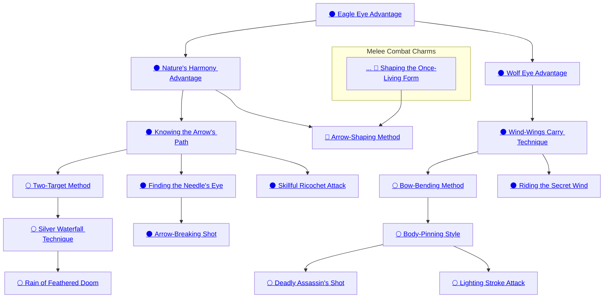

## Eagle Eye Advantage

Cost: 2 motes per die
Duration: Instant
Type: Supplemental
Minimum Perception: 2
Minimum Essence: 1
Prerequisite Charms: None

A Lunar Exalted can use this Charm to sharpen his
hand-eye coordination, making it easier to strike ranged
targets. Careful observers (a reflexive Perception +
Awareness roll, difficulty 3) will notice a change in the
Lunar's eyes — they take on an avian aspect - but
otherwise, his form is unchanged. When making an
Archery or Thrown attack against a ranged target, the
Lunar may convert attack dice into automatic successes.
He may not, however, purchase more successes than his
Dexterity score.

## Nature's Harmony Advantage

Cost: 3 motes
Duration: Instant
Type: Supplemental
Minimum Perception: 3
Minimum Essence: 2
Prerequisite Charms: [[#Eagle Eye Advantage]]

By listening to his animal instincts, a Lunar can
compensate for adverse environmental effects such as
wind and rain on the flight path of his missile. The arrow
always flies true, allowing the Exalt to ignore all environmental
penalties during an Archery or Thrown attack.
Nature's Harmony Advantage does not compensate for
reduced visibility and must be included in a Combo with
the Wolf Eye Advantage if the Lunar is to avoid all
environmental penalties for ranged attacks.

## Knowing the Arrow's Path

Cost: 3 motes
Duration: Instant
Type: Supplemental
Minimum Perception: 3
Minimum Essence: 2
Prerequisite Charms: [[#Nature's Harmony Advantage]]

Cover is a target's best defense against missile attacks,
but the preternaturally enhanced senses and reflexes
of the Lunar Exalted can degrade its effectiveness. Using
Knowing the Arrow's Path allows the Lunar to ignore
cover penalties, including those of a shield, when firing
at an opponent.

## Two-Target Method

Cost: 3 motes
Duration: Instant
Type: Extra action
Minimum Dexterity: 3
Minimum Essence: 2
Prerequisite Charms: [[#Knowing the Arrow's Path]]

By using his Essence to alter the arrow's flight, a
Lunar can attack two targets with a single arrow, usually
by shooting through the first target into the second. Both
victims must be within two yards of each other. The
Lunar's player makes a single Archery + Dexterity attack
roll. If it succeeds, the successes are split as equally as
possible between the two targets, who each may attempt
to parry or dodge the attack as normal. If the Lunar's
player rolls only one success, he picks who he attacks.
Regardless of how the attack is described, determine the
arrow's damage normally against target hit (i.e., arrows
boosted by this Charm are not &quot;slowed down&quot; by passing
through the chest of the first target, beyond dividing the
successes of the attack).

## Silver Waterfall Technique

Cost: 3 motes per attack + 1 Willpower
Duration: Instant
Type: Extra action
Minimum Dexterity: 4
Minimum Essence: 2
Prerequisite Charms: [[#Two-Target Method]]

Shifting her body to give it an efficient, fluid grace,
a Lunar archer can load and fire her bow with preternatural
speed. For every 3 motes spent activating the Charm,
the Lunar can make an additional Thrown or Archery
attack, which may be at her first target or at any other
target in range. The player must declare the number of
attacks the Lunar is making before paying to activate the
Charm. The player cannot buy more extra attacks than
her character's permanent Essence Trait, nor can she buy
more extra actions than (the initiative on which the
character activated this Charm ÷ 3, rounded down).
This normally means (the character's initiative + 3), but
Lunars who hold their action and then invoke this
Charm may lose extra actions. Each attack uses the
character's full dice pool. The character cannot make an
attack unless she has the ammunition to do so.

## Rain of Feathered Doom

Cost: 2 motes per target
Duration: Instant
Type: Extra action
Minimum Dexterity: 5
Minimum Essence: 3
Prerequisite Charms: [[#Silver Waterfall Technique]]

Using this Charm to speed his drawing and firing,
the Lunar can loft a series of arrows before the first has
hit its target. Unlike regular shots, which are aimed at
an individual, the Rain of Feathered Doom targets an
area. The Lunar may fire as many arrows as (his
Dexterity x the rate of the bow), subject to the number
of arrows and motes of Essence available. For every
two arrows fired, the Lunar may target a single individual,
and each individual targeted costs 2 motes of
Essence. All of the targets must be within (the Lunar's
Dexterity) yards equal to of a center point picked by
the Lunar. The targets do not gain the benefits of any
movement or cover, so thick do the arrows fly. Make
one attack roll, and apply it to all the targets, increasing
the base difficulty of each attack by 1. Irrespective
of the number of arrows fired, the Lunar may attack
each target only once during the turn (the extra
arrows are wasted).

## Finding the Needle's Eye

Cost: 2 motes
Duration: Instant
Type: Reflexive
Minimum Perception: 4
Minimum Essence: 2
Prerequisite Charms: [[#Knowing the Arrow's Path]]

To an Exalt who can hit a dipping swallow at 100
yards, striking a projectile in flight is only slightly more
challenging. Using this Charm, the Lunar can attempt
to deflect a ranged attack aimed at him by using a
missile of his own. Toattempt this, the Lunar must have
the bow and ammunition ready. The player makes a
reflexive Dexterity + Archery or Thrown roll, with
each success reducing the attacker's successes. If the
Lunar's player rolls at least as many successes as the
attacker's, the attack is disrupted in flight and causes no
damage. If the Lunar's player does not equal or exceed
the attacker's successes, then the attacker's successes
are still reduced. This defense is only effective against
ranged attacks, and the Lunar must expend one arrow
per activation of this Charm.

## Arrow-Breaking Shot

Cost: 3 motes
Duration: Instant
Type: Reflexive
Minimum Perception: 5
Minimum Essence: 3
Prerequisite Charms: [[#Finding the Needle's Eye]]

While Finding the Needle's Eye allows an Exalt to
use arrows to defend himself from enemy missile
attacks, protecting his allies is a more difficult task.
Not only must he observe the path of projectiles
inbound against multiple targets, but firing at those
targets often requires him to hit a crossing target, not
an issue when the Lunar himself was the target. The
Arrow-Breaking Shot functions like Finding the
Needle's Eye, save that that each deflection attempt
costs more Essence and requires the number of successes
to exceed those of the attacker for the deflection
to be successful. As with Finding the Needle's Eye,
above, the Charm can be used only against ranged
attacks, and the Lunar must expend one arrow with
each activation of the Charm.

## Skillful Ricochet Attack

Cost: 3 motes
Duration: Instant
Type: Supplemental
Minimum Perception: 3
Minimum Essence: 2
Prerequisite Charms: [[#Knowing the Arrow's Path]]

Using this Charm, a Lunar can negate an opponent's
cover by bouncing his missile off of several surfaces, his
enhanced senses allowing him to calculate an unerring
trajectory for a single Thrown or Archery attack. Each
surface the missile must bounce off of to reach its target
subtracts 1 from the attack's damage (meaning the
character's Strength + the weapon's damage bonus). If
the total damage reaches 0, the weapon's energy is spent,
and it falls to the ground.

## Arrow-Shaping Method

Cost: 6 motes, 1 Willpower
Duration: One scene
Type: Simple
Minimum Manipulation: 4
Minimum Essence: 3
Prerequisite Charms: [[Lunar Shapeshifting#Shaping the Once-Living Form|Shaping the Once-Living Form]], [[#Nature's Harmony Advantage]]

So long as he is surrounded by raw materials — stones,
twigs, bones, reeds, long blades of grass and the like — a
Lunar will not run out of ammunition. Instead of drawing
arrows from his quiver, the Lunar may instead pick up an
appropriate piece of raw material — anything long and
thin for arrows, and anything of roughly the correct shape
for thrown weapons - and transform it into a missile
suitable for firing from the bow or for throwing. The arrow
retains the appearance of the raw material, but in the
hands of the Lunar, it is a functional but non-magical item
of that type. Only the Lunar can use weapons he has
shaped. He can shape a maximum number of missiles equal
to his Dexterity in a single turn and must use them within
a number of turns equal to his Essence, for at the end of
that time they revert to their raw form. Missiles embedded
in their victims when they revert do an extra IL damage.

## Wolf Eye Advantage

Cost: 2 motes
Duration: Instant
Type: Supplemental
Minimum Perception: 2
Minimum Essence: 1
Prerequisite Charms: [[#Eagle Eye Advantage]]

By sharpening his senses, a Lunar can offset the
disadvantage of poor visibility (but not for the effects of
wind, rain and the like) on a missile's flight path. Activating
this Charm allows the Lunar to treat visibility ranges
as double their value for the purposes of a single Archery
or Thrown attack. For example, on a foggy day the Lunar
can attacks targets without penalty out to 20 yards and
with +1 difficulty out to 60 yards. Furthermore, when
using this Charm, a Lunar can make a blind attack out to
200 yards and treats all night conditions as day (further
including increasing visibility distances). See page 237 of
Exalted for the visibility table.

## Wind-Wings Carry Technique

Cost: 4 motes
Duration: Instant
Type: Supplemental
Minimum Perception: 3
Minimum Essence: 2
Prerequisite Charms: [[#Wolf Eye Advantage]]

Range is the main enemy of archers, but by enhancing
his senses to observe the flows of Essence within the
air, the Lunar can use them to steer the shot to the target.
The Lunar can attack out to two times the weapon's
listed range at -1 die and out to three times the weapon's
range at only -2 dice. Additionally, a Lunar using this
Charm can strike attack targets out to four times the
weapon's range at -4 dice. The Charm confers no ben-
efits to hitting small targets at shorter distances.

## Bow-Bending Method

Cost: 3 motes
Duration: Instant
Type: Reflexive
Minimum Strength: 3
Minimum Essence: 2
Prerequisite Charms: [[#Wind-Wings Carry Technique]]

All bows have a pull, and beyond this upper limit, the
archer's strength has no appreciable effect, except perhaps
to break the bow. Using this Charm to control his actions
and Essence to reinforce the weapon, the Lunar can coax
extra performance out of the bow. When firing, the Lunar's
player must state the Strength the Lunar is using and can
as much as double a bow's maximum Strength without
harming the weapon. The player may increase the maximum
Strength beyond double, but doing so requires him to
make an immediate — before the shot is fired — reflexive
Dexterity + Archery roll against a difficulty equal to the
number of points by which he exceeded the weapon's
maximum Strength. If he succeeds, the shot takes place as
usual. If he fails, the bow breaks, and the Essence is wasted.
If making multiple missile attacks, this Charm must be
activated once for each shot, as usual for instant Charms.

## Body-Pinning Style

Cost: 3 motes
Duration: Instant
Type: Supplemental
Minimum Strength: 4
Minimum Essence: 2
Prerequisite Charms: [[#Bow-Bending Method]]

While the Bow Bending Method attempts to use
brute force to increase archery damage, the Body-Pinning
Style relies on precision targeting as can only be
provided by someone with the body control of a Lunar
Exalted. When rolling damage dice for an archery attack,
count all 10s as two successes. The number of extra
successes gained in this way cannot exceed the Lunar's
unmodified Strength.

## Deadly Assassin's Shot

Cost: 3 motes per success
Duration: Instant
Type: Supplemental
Minimum Strength: 4
Minimum Essence: 3
Prerequisite Charms: [[#Body-Pinning Style]]

By allowing his subconscious mind control and by
shaping his body to the needs of the shot, the Lunar can
fire a truly devastating ranged attack at a single foe. The
powerful Charm seems to give the arrow a bloodthirsty
life of its own, its erratic path leaving jagged wounds and,
occasionally, amputating limbs. Immediately after soak is
applied, the Lunar can spend motes of Essence, with the
mechanical effect of turning damage dice into automatic
successes. The maximum number of automatic successes
cannot exceed the Lunar's permanent Essence or the
maximum Strength rating of the bow, whichever is lower.

## Lighting Stroke Attack

Cost: 6 motes
Duration: Instant
Type: Supplemental
Minimum Strength: 5
Minimum Essence: 2
Prerequisite Charms: [[#Body-Pinning Style]]

Some attacks are so swift and powerful that the target
doesn't see the blow coming and has no chance to avoid it.
Ranged attacks incorporating the Lightning Stroke Attack
exploit the Lunar's powers to this end, misdirecting
the opponent's eye by warping limbs and the missile in
flight. The attack is rolled normally, but the target cannot
attempt to dodge or parry. Instead, she must rely on her
soak to absorb the arrow's damage. The perfect defenses of
the Solar Exalted, Charms such as Seven Shadow Evasion
and Heavenly Guardian Defense, are proof against this
attack, just as they are proof against all others.

## Riding the Secret Wind

Cost: 7 motes
Duration: Instant
Type: Simple
Minimum Perception: 4
Minimum Essence: 4
Prerequisite Charms: [[#Wind-Wings Carry Technique]]

By using this Charm, the Lunar can tap into the
flows of Essence and the senses of beasts in the area
to target any opponent within reach of his weapon.
He may attack any target in range with a single
Thrown or Archery attack, even if no direct line of
sight exists between Lunar and target. As long as
there is some unblocked route the missile could
take to the target, it will attempt to strike the
victim. The normal range penalties apply to the
attack, but the target cannot claim any cover modifiers.
The target may attempt to parry or dodge and
soak the attack normally, though she is unlikely to
be aware of it and, so, should probably check for
blindside. Riding the Secret Wind cannot be included
in a Combo with any Charms with automatic
damage successes.
