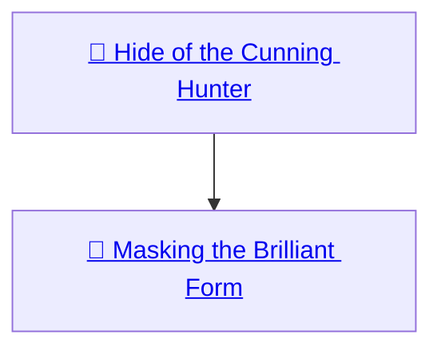
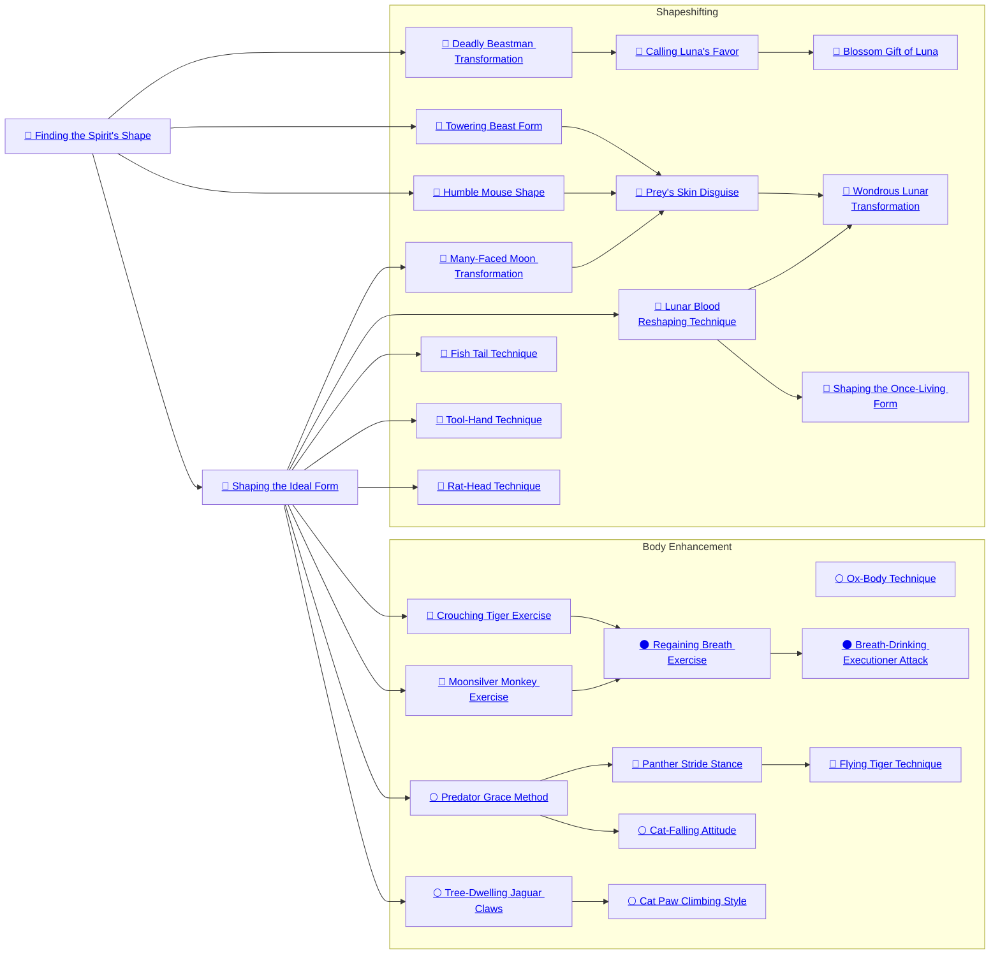

## Hide of the Cunning Hunter

Cost: 1 mote
Duration: One day
Type: Simple
Minimum Manipulation: 1
Minimum Essence: 1
Prerequisite Charms: None

This Charm is often one of the first that young
Lunars learn. It allows the Lunar to suppress his tattoos,
causing them to become invisible. The effects of this
Charm dissipate if the Lunar's Tell becomes visible due
to his anima banner reaching or exceeding the 4-7
motes level of anima display. Otherwise, it is impossible
to detect the Lunar's tattoos — even forms of sight that
allow the perception of active Essence will not see the
effects of the Charm. Storytellers should assume that
individuals who see a Lunar with unsuppressed tattoos
will always regard the Lunar suspiciously for the purposes
of perceiving his Tell, and most will immediately
realize the character's nature. The Lunar Anathema
are, after all, the stuff of legend.

## Masking the Brilliant Form

Cost: 3 motes, 1 Willpower
Duration: One scene
Type: Simple
Minimum Manipulation: 2
Minimum Essence: 1
Prerequisite Charms: Hide of the Cunning Hunter

This Charm makes it harder to perceive the
Lunar's Tell. While this Charm is active, it is impossible
to detect the Tell of a Lunar who has never
purchased Deadly Beastman Transformation. While
this Charm is active, Lunars who have purchased
Deadly Beastman Transformation 1-2 times are treated
as if they had never purchased it for the purposes of
having their Tells spotted. Lunars who have pur-
chased Deadly Beastman Transformation 3 or more
times are treated as if they purchased it 1-2 times for
the purposes of spotting their Tells. This Charm
cannot suppress the character's Tell at the 4-7 motes
level of anima banner display, and its effects end if the
character's anima becomes that intense.

## Finding the Spirit's Shape

Cost: 1 mote
Duration: Instant
Type: Reflexive
Minimum Charisma: 2
Minimum Essence: 1
Prerequisite Charms: None

When purchasing this Charm, the Lunar chooses an
animal no larger than an elk and no smaller than a large
cat. That animal is now the Lunar's spirit animal, and its
shape is now considered one of the Lunar's true shapes.
It is thus easier to spot the Lunar's Tell when she assumes
this animal shape, and if the Lunar becomes locked into
her true shapes, she can still use this Charm to change
between her human and totem animal shape.
Almost all Lunars know this Charm. A Lunar either
tastes the heart's blood of his totem animal during his
initiation or, in many cases, finds the totem-shape when
she Exalts. Such Exalts are driven by an incredible
craving to consume the life of a beast of their newfound
shape, so that they can fairly gain its form. If a Lunar
wants a totem animal larger than an elk or smaller than
a cat, she may gain one, but she must already know or
must immediately purchase Humble Mouse Shape or
Towering Beast Form as appropriate and cannot exceed
the limits of those Charms.
A Lunar may change his totem animal, but doing so
is both costly and dangerous. Those who choose to do so
must pay a dot of permanent Willpower and buy this
Charm again. Traces of his previous form remain in the
Lunar's Tell, to which may be added attributes of the new
form. A Lunar whose Tell combines the traits of several
animals is known by other Lunars as a chimera and is
regarded with scorn. In addition, the Lunar may offend
the animal avatar of the species he forsakes and, thus,
gain the enmity of that godly being and the species it
protects. A Lunar in his totem animal shape may spend
1 mote to activate this Charm and return to human
shape. This Charm may be activated only once per turn.
Members of the Eclipse Caste may not learn this
Charm, for it draws on a natural power of the Lunar
Exalted that Solars cannot master or emulate.

## Shaping the Ideal Form

Cost: 1 mote
Duration: Instant
Type: Simple
Minimum Manipulation: 2
Minimum Essence: 1
Prerequisite Charms: Finding the Spirit's Shape

This Charm allows the Lunar to make minor
cosmetic changes to the appearance of any of his true
forms. Such modifications include changing hair, eye
or skin color by several shades, lengthening (or shortening)
hair length, reshaping a chin or nose slightly or
straightening teeth. A modification only applies to
the form in which it was used — if the Lunar wishes to
alter is hair color in his human and totem-animal
shapes, he will have to use this Charm twice. Shaping
the Ideal Form does not allow the Lunar to assume the
appearance of another being, though it may help to
disguise his appearance. Lunars who wish to assume
the form of specific individuals must learn the Charm
Prey's Skin Disguise. Shaping the Ideal Form cannot
be used to conceal the Lunar's Tell or tattoos. No
matter how much effort is put into the shaping, the
Charm cannot be used to improve the Lunar's Physical
Attributes unless the player invests experience in
raising the Attribute — in that case, training time can
represent an extended campaign of cosmetic self-
improvement by reshaping. Overuse of the Charm
tends to detract from the Lunar's appearance, render-
ing him bland. It is regarded as a sign of degeneracy and
vanity among Luna's Beloved.

## Deadly Beastman Transformation

Cost: 5 motes
Duration: Instant
Type: Reflexive
Minimum Charisma: 2
Minimum Essence: 2
Prerequisite Charms: Finding the Spirit's Shape

This powerful Charm allows the Lunar to shift its
shape into a monstrous hybrid of the human form and its
totem animal. This shape is three feet taller than the
Lunar's normal height and enjoys many bonuses. Anyone
who sees the Lunar in this shape cannot fail to
mistake him for what he is — a sleek and deadly feral
killing machine. A character using this shapechanging
Charm is considered to be in one of his true forms, which
includes the increased visibility of his Tell.
The first time a character takes this Charm, he
receives five Attribute points and two gifts. Both Attribute
points and gifts must be applied immediately after
the character purchases this Charm. Subsequent purchases
of the Charm provide three Attribute points and
one gift per purchase. A character can purchase this
Charm no more times than he has points of Essence.
Each Attribute point represents the war-shape's
enhanced physical capabilities. One Attribute point
raises the character's Strength or Stamina by 1 while he
is in his beastman form, and two Attribute points can
raise the character's beastman form's Dexterity by 1.
Once allocated, these bonuses are fixed and cannot be
modified. These points must be allocated immediately
when the Charm is purchased - characters cannot save
up points between purchases of this Charm. When the
character is in his hybrid war-shape, these bonus Attributes
are considered to be a natural part of the
character's Attribute for the purposes of Charms that
double Attributes and for the purposes of Charms that
allow the character to convert Attribute dice to auto-
matic successes on a roll.
Gifts represent special capabilities the hybrid shape
offers and give the character some sort of special bonus
beyond increased Attributes. Gifts often have prerequisite
gifts, which their effects build on and enhance. A
character cannot take a gift without taking all of its
prerequisites. Characters cannot take a gift more than
once unless the gift specifically permits it. Gifts, like
the Attribute bonuses, apply only while in hybrid form.
If the Lunar wishes to take advantage of his gifts in
human or totem animal form, he must learn Charms
that have similar effects or else use the Charm Calling
Luna's Favor.
In beastman form, weapons and armor worn by the
Lunar in human form are present in hybrid form as well,
magically adjusted to suit the size of the hybrid form.
While the Lunar's adjusted Attributes might allow him
to wield huge weapons or bear the weight of superheavy
armor, this Charm does not turn the Lunar's accoutrements
into such gear. Though the weapons may change
somewhat in size and shape to accommodate the hybrid's
large grip, the weapons' and armor's statistics do not
alter. Defensive gifts (Rugged Hide, Impenetrable Beast-Armor)
combine with any armor worn by the Lunar.
Characters can gain large dice pools by means of
the Deadly Beastman Transformation. Keep in mind
that the Lunar's running speed, jumping distance and
lifting ability will likewise change. Players should remember
that they may use the automatic successes rules
(Exalted, p. 90-91) rather than rolling dice for many
Athletics feats.
Characters in their hybrid shape may spend 5
motes activate this Charm and assume human form.
This Charm can be used only once per turn. Because
assuming totem animal shape with Finding the Spirit's
Shape requires only 1 mote of Essence and the Lunar
can then change to human shape with another activation
of that Charm, it is significantly cheaper for a
Lunar to pass through animal shape when returning to
human form (2 motes versus 5). However, this takes an
extra turn, so Lunars in a hurry sometimes directly
return to human shape.
Members of the Eclipse Caste may not learn this
Charm, for it draws on a natural power of the Lunar
Exalted that Solars cannot master or emulate.

## Calling Luna's Favor

Cost: 5 motes
Duration: Scene
Type: Simple
Minimum Manipulation: 3
Minimum Essence: 2
Prerequisite Charms: Deadly Beastman Transformation

By means of this Charm, a Lunar can draw forth the
power of one of his gifts when not in Beastman form.
From immediately after the character activates this Charm
until the end of the scene or until the character ends the
Charm's effects, he enjoys the benefits of one of his
Deadly Beastman Transformation gifts. The gift actually
manifests and is probably an obvious mark of supernatural
character. Characters can manifest any gift they
possess, regardless of whether or not it has prerequisites.

## Blossom Gift of Luna

Cost: 3 motes, 1 Willpower
Duration: Indefinite
Type: Simple
Minimum Charisma: 4
Minimum Essence: 3
Prerequisite Charms: Calling Luna's Favor

This Charm is an extension of the Charm Calling
Luna's Favor. By activating this Charm while in
hybrid form, the Lunar may retain a single Deadly
Beastman Transformation gift until he ends the
Charm's effects or he next enters hybrid form. As with
Calling Luna's Favor, above, the gift actually manifests
and is in no way concealed by this magic.
Characters can manifest any gift they possess, regardless
of whether or not it has prerequisites.

## Towering Beast Form

Cost: None
Duration: Indefinite
Type: Special
Minimum Charisma: 3
Minimum Essence: 2
Prerequisite Charms: Finding the Spirit's Shape

Knowledge of this Charm allows the Lunar to as-
sume a form larger than an elk but no larger than a Tyrant
Lizard or other large dinosaur. There is no cost to use this
Charm's effects - learning this Charm simply enhances
the Lunar's capabilities.
Members of the Eclipse Caste may not learn this
Charm, for it draws on a natural power of the Lunar
Exalted that Solars cannot master or emulate.

## Humble Mouse Shape

Cost: None
Duration: Indefinite
Type: Special
Minimum Charisma: 3
Minimum Essence: 2
Prerequisite Charms: Finding the Spirit's Shape

Knowledge of this Charm allows the Lunar to
shapeshift into a form smaller than a cat but no smaller
than a field mouse. There is no cost to use this Charm's
effects — learning this Charm simple enhances the
Lunar's capabilities.
Members of the Eclipse Caste may not learn this
Charm, for it draws on a natural power of the Lunar
Exalted that Solars cannot master or emulate.

## Many-Faced Moon Transformation

Cost: 3 motes
Duration: Instant
Type: Reflexive
Minimum Charisma: 4
Minimum Essence: 2
Prerequisite Charms: Shaping the Ideal Form

By means of this Charm, the Exalted changes gender,
males becoming females and vice versa though their
personalities, knowledge and Traits are unchanged. This
is not a cosmetic modification — the Charm changes the
Lunar's biology and he or she becomes capable of siring
or bearing children as appropriate. While many Lunars
have a preferred gender, individual Lunars do not have
a &quot;natural&quot; sex — they're considered to be in true form
in either gender. Attempts by a pregnant Lunar to use
this Charm automatically fail.

## Prey's Skin Disguise

Cost: 5 motes, 1 Willpower
Duration: Indefinite
Type: Simple
Minimum Charisma: 4
Minimum Essence: 3
Prerequisite Charms: Towering Beast Form, Humble Mouse Shape

Mouse Shape, Many-Faced Moon Transformation
This Charm allows the Lunar to assume the outward
appearance of a specific other human. To do so, the
Lunar must consume the target's heart's blood like any
other beast whose form she wishes to gain. The Charm
then allows her to assume the victim's outward appearance
and Physical Attributes and Appearance, but she
does not gain the victim's knowledge, Mental or Social
Attributes or Abilities. If the target is an Exalt, the Lunar
gains his outward appearance but remains a Lunar. This
Charm cannot be used to mimic the Fair Folk who,
though humanoid, are something other.
The character can still dress and act any way she
desires — she adopts the victim's outward appearance,
not personality. A Lunar willing to consume many mor-
tals can develop quite a diverse catalog of shapes. Just as
with any other type of shapechanging, the appearance of
the character's Tell and tattoos is unchanged. Lunars who
wish to masquerade as the persons they consumed would
thus be well-advised to use Charms to suppress these
unmistakable signs. The Charm's effect includes a gender
change if appropriate, with the same limitations to preg-
nant characters as Many-Faced Moon Transformation.
Members of the Eclipse Caste may not learn this
Charm, for it draws on a natural power of the Lunar
Exalted that Solars cannot master or emulate.

## Lunar Blood Reshaping Technique

Cost: 3 motes, 1 health level + special
Duration: One day
Type: Simple
Minimum Manipulation: 4
Minimum Essence: 3
Prerequisite Charms: Shaping the Ideal Form

By allowing a subject to taste his blood and activating
this Charm, the Lunar can make minor
alterations to the form of another willing subject. The
range of possible changes are as per Shaping the Ideal
Form - this Charm cannot be used to change a
target's shape or to give her the appearance of a specific
other human. Unlike modifications the Lunar makes
to himself, the changes fade after a day. The subject
must also spend a temporary Willpower point (two if
she is an Exalt). Unwilling subjects, tattooed Lunars,
non-humans, the undead and unmaterialized spirits
cannot be shaped by this Charm. Once the Charm is
activated, the player rolls Manipulation + Craft
(Body Shaping) at standard difficulty. One
success or more indicates success, while if
the roll fails, the subject's form is unaltered.
A botch, however, results in an unexpected
— and usually unpleasant - outcome.

## Wondrous Lunar Transformation

Cost: 5 motes, 1 Willpower, 1 health level + special
Duration: One day
Type: Simple
Minimum Manipulation: 5
Minimum Essence: 4
Prerequisite Charms: Prey's Skin Disguise, Lunar Blood Reshaping Technique

A more powerful version of the Lunar
Blood Reshaping Technique, this Charm
allows the Lunar to alter the subject's form to
match one of the patterns in the Lunar's
&quot;library.&quot; This process is a difficult one, both
painful for the subject and requiring immense skill
by the Lunar, but it allows the subject to attain a non-human
form or to masquerade as another human. In
addition to the costs to the Lunar, the subject must
spend 2 temporary Willpower points (3 if an Exalt).
Unwilling subjects, tattooed Lunars, non-humans, the
undead and unmaterialized spirits cannot be shaped
by this Charm. Once the Charm is activated, the
Lunar's player rolls Manipulation + Craft (Body
Shaping) at difficulty 3. Three or more suc-
cesses indicates success, while if the roll fails (or
gets only one or two successes), the subject's
form is unaltered. A botch, however, results in
an unexpected — and usually unpleasant —
outcome, probably a subject twisted and
crippled for the duration or possibly suffering
permanent damage.

## Shaping the Once-Living Form

Cost: 1 mote per raw cubic foot, 1 per volume increase + 1 health level
Duration: Indefinite/Instant
Type: Simple
Minimum Manipulation: 3
Minimum Essence: 3
Prerequisite Charms: Lunar Blood Reshaping Technique

By means of this Charm, a Lunar can reshape inert
once-living material into another form. He can turn a
fallen tree into a shelter, a bone into a weapon or a hide
into clothing. He cannot, however, use the Charm to
create complex objects (a simple buckle is about as
sophisticated as it gets), nor can it be used to reshape
objects that are already under the influence of Charms,
sorcery or other supernatural effects. The item to be
shaped must be smeared in the Lunar's blood, costing
him a single health level (unsoakable lethal damage)
before Essence can be channeled into the object.
The texture, appearance and so on of the original
material remains unaltered — a bone weapon is clearly
bone, not metal — but the product may be modified by
conventional methods (dyes, paint and so forth). The
Essence cost for activating the Charm reflects the amount
of raw material affected. If the target object is roughly the
same size as the raw material, the Essence cost of the
Charm is unaltered. If a size change is part of the process,
the Lunar must spend additional Essence motes, each
extra mote allowing the final product's size to be twice
(or half) that of the raw material. An object fashioned in
this manner are not permanent, but rather remains while
the Lunar commits the Essence. If the Lunar uses the
Essence for other purposes, the object reverts to its
original form. A Lunar can, however, make his construct
permanent by spending a point of Willpower, but this
may only be done at the moment of creation. In this case,
the Charm is instant, and the Essence returns normally.
Shaping the object requires a Manipulation + Craft
roll, usually of difficulty 1. The Storyteller may, however,
increase this difficulty for more complex shapes.
This Charm cannot effect the undead.

## Fish Tail Technique

Cost: 6 motes
Duration: Indefinite
Type: Simple
Minimum Charisma: 3
Minimum Essence: 3
Prerequisite Charms: Shaping the Ideal Form

Using this Charm, a Lunar transforms his limbs to
enhance his swimming abilities, turning his limbs into
flippers, webbing hands and feet or performing other
similar effects (at the Lunar's discretion) to enhance his
swimming abilities, allowing him to move through water
unimpeded at twice his normal movement rate. If the
Lunar is in a form with innate swimming abilities, such
as that of a shark or a seal, the Fish Tail Technique
confers no additional benefits. This Charm does not
confer the ability to breath water, and the character must
surface to breathe (per the holding breath rules on p. 243
of Exalted) or risk drowning.

## Tool-Hand Technique

Cost: 1 mote
Duration: One scene
Type: Simple
Minimum Manipulation: 2
Minimum Essence: 2
Prerequisite Charms: Shaping the Ideal Form

Most Lunars abhor the trappings of civilization, but
this does not mean that they don't occasionally require
tools. Unlike mortals, who must keep a range of prefabricated
tools for such circumstances, a Lunar can reshape
his body to provide the necessary instruments. Hands
are strengthened and fingers and claws sharpened and
reshaped to provide any tool the Exalt might need.
While using the Tool-Hand Technique, the Lunar can
naturally perform tasks that would normally require
tools (for example, boring a hole in wood, hammering a
peg or picking at stone). The Lunar's hands, feet or
whatever else is shaped into the tool takes on a superficial
resemblance to the tool in question but remains
indisputably flesh and bone (albeit flesh and bone
surrounded by a nimbus of Essence). A Lunar with
multiple limbs can equip the multiple limbs at a cost of
1 mote per limb and suffers no injury from the pounding.
cutting or rasping of using the &quot;tools.&quot; The Tool-Hand
Technique cannot be used to form weapons or to otherwise
give the Lunar an advantage in inflicting or
withstanding damage, nor does the Lunar work any
faster than she would with normal tools. Any rolls
involving Craft gain +2 dice when the Lunar uses this
Charm.

## Rat-Head Technique

Cost: 3 motes
Duration: One scene
Type: Simple
Minimum Manipulation: 2
Minimum Essence: 2
Prerequisite Charms: Shaping the Ideal Form

By means of this Charm, the Lunar's bones, muscles
and organs become capable of immense deformation, allowing
him to squeeze his body through gaps it would not
normally fit through. By means of this Charm, a human-sized
Lunar could wriggle through a hole as small as a mouse
hole or a knothole in a fence. The process is very unsettling
to watch and is likewise uncomfortable for the Lunar.
The Rat-Head Technique cannot be used as part of
any Combo or while the Lunar is under the effects of a
Charm or sorcery that hardens or reinforces his limbs in
any manner (such as the Body Weapon Technique). While
using this Charm, the Lunar's natural soak cannot exceed
2B/2L under any circumstances, and he cannot parry lethal
attacks without an appropriate stunt — his &quot;softened&quot; body
lacks the strength to do so effectively. A Lunar under the
effect of Rat-Head Technique may dodge normally.

## Ox-Body Technique

Cost: None
Duration: Permanent
Type: Special
Minimum Stamina: Varies
Minimum Essence: 1
Prerequisite Charms: None
The bodies of the Exalted are far more durable than
those of mere mortals. To help simulate this, an Exalt
may buy extra health levels as if they were a Charm. A
player may purchase this Charm up to once per dot of
human-form Stamina his character possesses. Each Ox-
Body Technique Charm purchased can provide two -1
health levels or four -2 health levels, at the player's
option, determined at the time of purchase.

## Crouching Tiger Exercise

Cost: 5 motes, 1 Willpower
Duration: Varies
Type: Simple
Minimum Charisma: 3
Minimum Essence: 2
Prerequisite Charms: Shaping the Ideal Form

Lunars employ Essence to enhance their muscles via
this Charm, using a series of stances and static exercises
to focus Essence into their limbs, increasing their strength
and resilience. A Lunar using this Charm swells into an
intimidating, muscular brute. Her tendons stand out like
taught rope, and her muscles seem ready to burst through
her skin. The Exalt's player makes a Strength + Athletics
roll. For every success, add one to the Lunar's Strength.
That character cannot more than double her initial
Strength through the use of this Charm. This is a dice
bonus added by a Charm and should be considered as
such when determining the maximum effect of other
dice-bonus Charms. The Charm's effects last for a num-
ber of turns equal to the character's Essence + the
number of success rolled. The exercises used to activate
the Crouching Tiger Exercise require the character's
undivided dice action for a number of turns equal to 10
+ (the Lunar's Strength prior to this performance of the
exercise). These turns of preparation must be concurrent
and uninterrupted and cannot be combined with the
preparation periods of other, similar exercises.

## Moonsilver Monkey Exercise

Cost: 6 motes, 1 Willpower
Duration: Varies
Type: Simple
Minimum Charisma: 3
Minimum Essence: 2
Prerequisite Charms: Shaping the Ideal Form

By performing a series of limbering up exercises and
stances as he directs Essence through his muscles, a
Lunar Exalt can temporarily boost his hand-eye coordination,
his movements becoming fluid and graceful as
moonsilver. The Exalted's player makes a Dexterity +
Athletics roll. For every success, add one to the Lunar's
Dexterity. That character cannot more than double his
initial Dexterity through the use of this Charm. This is
a dice bonus added by a Charm and should be considered
as such when determining the maximum effect of other
dice-bonus Charms. The Charm's effects last for a num-
ber of turns equal to the character's Essence + the
number of success rolled. Enacting the Moonsilver Monkey
Exercise requires the character's undivided dice
action for a number of turns equal to (the Lunar's
Dexterity prior to the performance of this exercise) + 10.
These turns of preparation must be concurrent and
uninterrupted, and cannot be combined with the preparation
periods of other, similar exercises.

## Regaining Breath Exercise

Cost: 1 Willpower
Duration: Instant
Type: Simple
Minimum Intelligence: 4
Minimum Essence: 3
Prerequisite Charms: Crouching Tiger Exercise, Moonsilver Monkey Exercise

In addition to using his Essence to fortify his body,
a Lunar can draw on his strength of spirit to fortify his
Essence. By entering a trance and focusing his mind
inward for a number of turns equal to (20 - his Stamina),
a Lunar can regain motes of Essence. Doing so requires a
Stamina + Endurance roll. For every success, the Lunar
gains 2 motes of Essence. The character cannot regain
more than his normal maximum temporary Essence, nor
can he regain more than (his permanent Essence x 2)
motes per use of the Charm. These turns of concentration
must be concurrent and uninterrupted and cannot
be combined with the preparation periods of other,
similar exercises.

## Breath-Drinking Executioner Attack

Cost: 2 motes
Duration: Instant
Type: Reflexive
Minimum Wits: 4
Minimum Essence: 4
Prerequisite Charms: Regaining Breath Exercise

The death of an individual releases her body's
Essence, which forms the target's lower or &quot;animal&quot;
soul. By means of the Breath-Drinking Executioner
Attack, a Lunar can trap and consume this vital energy
to restore his own Essence reserves. By activating this
Charm immediately after slaying an opponent, a Lunar
regains the result of one 10-sided die in motes of
Essence. An Exalt cannot regain more Essence in a
given turn than he has points of Stamina. The Exalt
may not exceed his normal maximum temporary Essence
through the use of this Charm.

## Predator Grace Method

Cost: 1 mote per 2 dice
Duration: Instant
Type: Reflexive
Minimum Dexterity: 3
Minimum Essence: 2
Prerequisite Charms: Shaping the Ideal Form

Using this Charm, the Lunar gains preternatural
balance beyond that of even the greatest feline hunter.
The Exalt can walk across surfaces as fragile as bamboo
and string with ease and casually resists efforts to unbalance
him. By spending motes of Essence, the Lunar's
player may convert Dexterity dice into automatic successes
when making a single Athletics roll related to
balance and climbing or when rolling to resist or escape
sweeps, clinches, holds and tackles. Upon activating the
Charm, the Lunar's body and features undergo subtle
changes, resulting in a lithe and graceful appearance that
shifts to give him the best balance and grip possible in the
present circumstances.

## Panther Stride Stance

Cost: 4 motes
Duration: One scene
Type: Simple
Minimum Manipulation: 3
Minimum Essence: 2
Prerequisite Charms: Predator Grace Method

Using this Charm, the Lunar's legs shift into the
likeness of the legs of a giant cat, and his whole body
twists slightly, becoming lower and more streamlined.
For the remainder of the scene, the character can move
at twice his normal movement rate and leap three times
his normal jumping distance. If the target surface is
uncertain, the Lunar's player must still make a (Dexterity
or Wits) + Athletics roll normally for the character to
land successfully (see p. 252 of Exalted) after such a leap.
A Lunar may carry a &quot;passenger&quot; on such a leap, though
doing so reduces his effective Dexterity by one and his
effective Strength by two. A Full Moon who uses this
Charm in conjunction with his anima power moves at
three times his normal movement rate and can leap five
times his normal jumping distance.

## Flying Tiger Technique

Cost: 3 motes
Duration: One Scene
Type: Simple
Minimum Manipulation: 4
Minimum Essence: 3
Prerequisite Charms: Panther Stride Stance

By creating a flap of skin between his arms and legs,
a Lunar can drastically extend his leaping abilities.
Using the skin flap as crude gliding wings, a Lunar using
this technique can extend his horizontal leaping abilities
in excess of 10 times his normal leaping distance, though
this depends on his trading height for distance. He can
travel 20 yards per dot of Strength and Athletics, and
another two yards for every yard of altitude he descends.
For example, a Lunar with Strength 3, Athletics 3 who
leaps from a branch 100 yards up may glide to a point on
the ground 320 yards away ([3 x 20] + [3 x 20] + [2 × 100]
yards). The Lunar may attempt to extend this distance
by rolling Dexterity + Athletics, each success adding 10
percent to the range. The anima powers of a Full Moon
Lunar, the effect of Panther Stride Stance and other
movement-enhancing Charms do not add to the gliding
distance of the Skin-Flap Flying Method.

## Cat-Falling Attitude

Cost: 3 motes
Duration: Instant
Type: Supplemental
Minimum Dexterity: 3
Minimum Essence: 2
Prerequisite Charms: Predator Grace Method

Using this Charm, a Lunar greatly improves his
ability to avoid damage from a fall. He will always land
on his feet and suffers only one level of bashing damage
for every 10 feet fallen. Furthermore, he only suffers
lethal damage if he falls more than 100 feet or onto a
treacherous surface such as spikes.

## Tree-Dwelling Jaguar Claws

Cost: 3 motes
Duration: One scene
Type: Simple
Minimum Dexterity: 3
Minimum Essence: 3
Prerequisite Charms: Shaping the Ideal Form

Using his protean abilities to grow claws and to
adapt his skeleton and muscles, a Lunar Exalted can
ascend trees (or other surfaces where his claws can
grip) with surprising ease. The Lunar normally uses
half his movement rate when climbing but may use his
full movement rate without penalty if his player makes
a successful Dexterity + Athletics roll. When faced
with difficult climbing conditions (high winds, overhangs,
etc.) a Lunar using this Charm reduces the
difficulty of the Dexterity + Athletics roll by l (but not
below 1). If the Lunar makes unarmed Brawl or Martial
Arts attacks while the Charm is active, his attacks
inflict lethal damage.

## Cat-Paw Climbing Style

Cost: 5 motes
Duration: One scene
Type: Simple
Minimum Dexterity: 4
Minimum Essence: 4
Prerequisite Charms: Tree-Dwelling Jaguar Claws

Using this Charm, a Lunar may ascend, descend or
traverse any surface with relative ease, even if there are
no obvious handholds. Instead, he relies on minute
adjustments to his fingers and toes to exploit minute
variations in surface texture. The Lunar may move up to
half his normal movement rate either horizontally or
vertically and reduces the difficulty of all Dexterity +
Athletics rolls by 2 (but not below 1). Lunar characters
may carry up to 100 pounds per point of Strength while
using this Charm.
