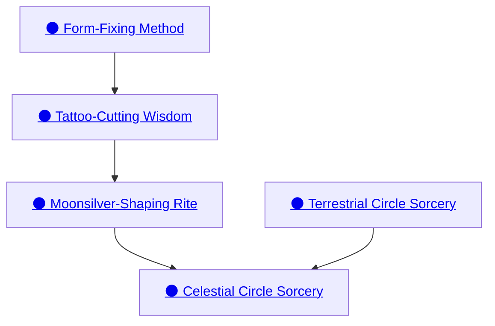

## Terrestrial Circle Sorcery

Cost: 1 Willpower
Duration: Instant
Type: Simple
Minimum Intelligence: 3
Minimum Essence: 3
Prerequisite Charms: None

Terrestrial sorcery is the simplest magic wielded by
Lunars, and the No Moons will initiate members of any
caste as sorcerers provided an Exalt shows the appropriate
intelligence and aptitude. Note that invoking this
Charm only enables the character to cast a single
Terrestrial Circle Sorcery spell. The actual spell itself
has an Essence cost, often very high, that the character
must pay to actualize the spell. This cost is listed in the
spell's description. Terrestrial Circle Sorcery can never
be part of a Combo.

## Form-Fixing Method

Cost: 5 motes, 1 Willpower, 3 experience points
Duration: Instant
Type: Simple
Minimum Intelligence: 3
Minimum Essence: 3
Prerequisite Charms: None

Knowledge of this Charm allows a Lunar to tattoo a newly
Exalted Lunar, fixing his caste and allowing him to resist the
physical (but not mental) warping properties of the Wyld. The
Lunar can fix the newly tattooed Exalt's caste as whichever he
chooses, but the tests of initiation are used to determined the
Lunar's caste. The experience points spent are gone forever.
This Charm is generally practiced only by Lunars of the No
Moon Caste, but other Lunars know it. However, it is considered
inappropriate for Lunars of castes other than No Moon to
tattoo young Lunars. The use of this Charm requires a ceremony
of several hours, where occult instruments are used to
draw the moonsilver tattoos into the Lunar's skin.

## Tattoo-Cutting Wisdom

Cost: 3 motes, 1 Willpower, 1 experience point
Duration: Instant
Type: Simple
Minimum Intelligence: 3
Minimum Essence: 3
Prerequisite Charms: Form-Fixing Method

Using this Charm, a Lunar can engrave or otherwise mark
an item so that it is immune to the chaotic effects of the Wyld,
an untamed Demesne or another source of shapechanging.

## Moonsilver-Shaping Rite

Cost: Special
Duration: Indefinite
Type: Simple
Minimum Intelligence: 3
Minimum Essence: 3
Prerequisite Charms: Tattoo-Cutting Wisdom

Though others may attempt to forge moonsilver,
only a Lunar Exalted has the knowledge and spiritual
connection to the Magical Material to shape it effectively.
Enacting this Charm forges a bond between the
Lunar and the moonsilver being worked. Moonsilver is
essentially impossible to work without the use of this
Charm, and the technique is a jealously guarded secret of
the Lunars. This bond must be maintained — and the
Essence committed — for the duration of the item-crafting
effort, even when the object is not in the Lunar's
immediate presence. Failing to maintain the Charm
results in the immediate failure of the creation effort,
though the moonsilver can be reused in a later project.
The Essence cost of the Charm is twice the rating of the
artifact the Lunar seeks to create. This is in addition to
the basic Essence cost for creating the item (see Chapter
Five of The Book of Three Circles for the specifics and
rules of item creation).

## Celestial Circle Sorcery

Cost: 2 Willpower
Duration: Instant
Type: Simple
Minimum Intelligence: 4
Minimum Essence: 4
Prerequisite Charms: Terrestrial Circle Sorcery, Moonsilver-Shaping Rite

Celestial sorcery is much harder to learn and master
than Terrestrial magics, and its practice among the
Lunar Exalted is restricted to members of the No Moon
Caste, who must undergo a rigorous (and often deadly)
training regime before they are entrusted with its secrets.
Note that invoking this Charm only enables the character
to cast a single Celestial Circle Sorcery spell. The
actual spell itself has an Essence cost, often very high,
that the character must pay to actualize the spell. This
cost is listed in the spell's description. Celestial Circle
Sorcery can never be part of a Combo.
