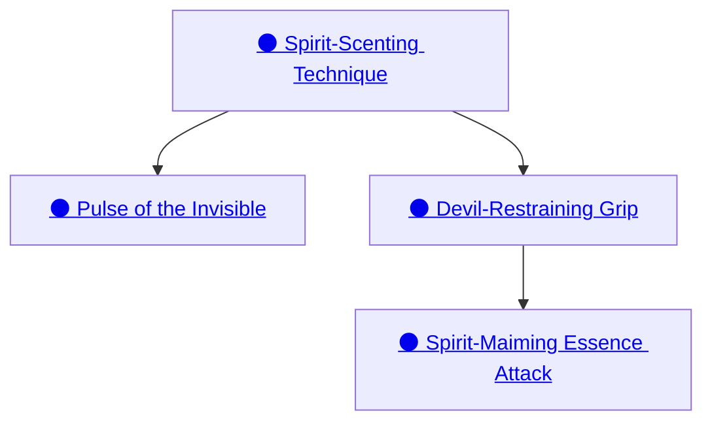

## Spirit-Scenting Technique

Cost: 2 motes
Duration: One scene
Type: Simple
Minimum Perception: 3
Minimum Essence: 2
Prerequisite Charms: None

By means of this Charm, a Lunar can &quot;see&quot; spirits in
his immediate vicinity, gaining an approximate idea of
their forms and actions. Provided he is circumspect, and
no Charms aid the spirit, this observation is undetectable.
Furthermore, this Charm allows the Lunar to sense
the true form of a materialized spirit — a Lunar will know
that a spirit masquerading as or possessing a human is not
what it seems. The Charm does not allow the Lunar to

## Pulse of the Invisible

Cost: 8 motes
Duration: One scene
Type: Simple
Minimum Perception: 4
Minimum Essence: 3
Prerequisite Charms: Spirit-Scenting Technique

Using this Charm, a Lunar can adapt his senses to
detect the flows and patterns of Essence in the world
around him, as well as any dematerialized spirits present.
The Exalt can instinctively sense the direction and
strength of flows, as well as the locations and power of
loci such as Manses and Demesnes. Ascertaining more
detailed information requires a Perception + Occult
roll. A single success grants the Lunar basic information
about the examined Essence, such as identifying
the nature of a sorcery or the general geomancy of a
region, while additional successes provide more indepth
and specific information. For example, three
successes might allow the Lunar to judge the age and
other specific details of the sorcery, while, with five
successes, he may identify the sorcerer by &quot;signature&quot;
traits. Likewise, three successes provides the sort of
detailed survey information necessary to construct a
Manse, while five allows a near-perfect comprehension
of an area's geomancy.

## Devil-Restraining Grip

Cost: 6 motes, 1 Willpower
Duration: One scene
Type: Simple
Minimum Wits: 4
Minimum Essence: 3
Prerequisite Charms: Spirit-Scenting Technique

Using the Devil-Restraining Grip Charm, a Lunar
can immobilize a spirit with a snare of Essence,
binding it to her as if on a leash. If the spirit is
dematerialized, she can drive it into the material
world, and once the spirit is in physical form, it is
prevented from dematerializing. To use this Charm,
the Exalt's player makes a Manipulation + Occult roll
against a difficulty equal to the spirit's Essence. The
spirit must be within (the Lunar's Essence x 10) yards.
If she succeeds, the spirit cannot move further from
the Exalt than its Essence Trait in yards and must
materialize. If it does not have the Essence to materialize,
then the additional Essence required is drained
from the Lunar's reserves. If both the spirit and the
Lunar cannot pay for the spirit's materialization, then
the Essence is wasted, and the spirit remains immaterial.
If the spirit is already further away than its Essence
in yards, it may only move toward the Lunar. The
Charm does not protect the Lunar from the spirit's
actions, though each success beyond that needed to
ensnare the spirit imposes a -1 die penalty to all of the
spirit's actions. The spirit is held for a number of
minutes equal to the Lunar's Essence.

## Spirit-Maiming Essence Attack

Cost: 10 motes, 1 Willpower
Duration: Instant
Type: Supplemental
Minimum Intelligence: 4
Minimum Essence: 4
Prerequisite Charms: Devil-Restraining Grip

If an encounter with a spirit goes wrong or if the
being is intrinsically hostile, then the Lunar may have
to fight it, a difficult proposition against a possibly
incorporeal foe. The Spirit-Maiming Essence Attack
is one of the Lunar's most potent weapons in such a
conflict, allowing him to use his strength of will to
bolster his material attacks. The Lunar must activate
this Charm before he attacks. If the attack is successful,
the damage caused by the attack is aggravated. In
addition, the Lunar's player also reflexively rolls a
number of dice equal to the Lunar's Manipulation +
Essence and adds a bonus to the base damage of the
attack equal to the number of successes rolled. Spirits
destroyed with this Charm are gone forever, and they
can sense Exalts who know it and threat them with the
same wary respect reserved for those who can slay gods.
Attacks enhanced with this Charm may explicitly be
part of Combos with Charms of other Attributes.
