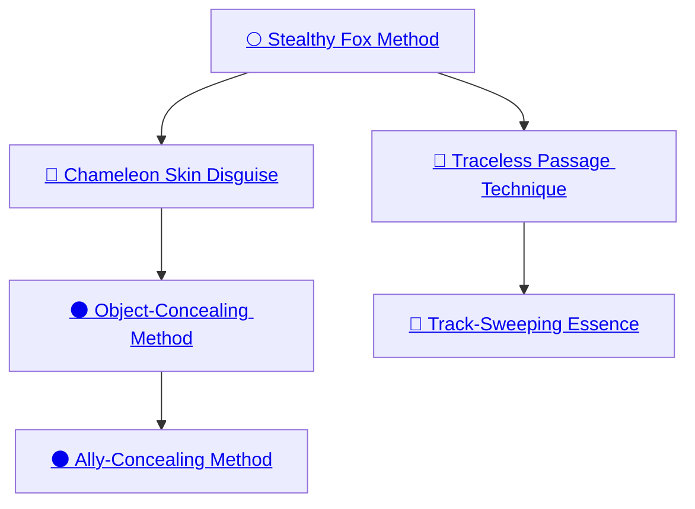

## Stealthy Fox Method

Cost: 2 motes per die
Duration: One scene
Type: Simple
Minimum Dexterity: 3
Minimum Essence: 2
Prerequisite Charms: None

Using this Charm. a Lunar can call on his feral instincts
to enhance any attempts to hide or use stealth. By
honing both his senses and his agility, the Lunar exploits all
cover to the maximum possible extent, avoiding obstacles
that might alert others to his presence, and moves in such
a graceful manner as to avoid catching the attention of
unwary observers. For the rest of the scene, when making a
roll to move stealthily or to hide, the Lunar's player may add
as many dice to the character's Stealth pool as the Exalt has
dots of Dexterity, at a cost of 2 motes per die.

## Chameleon Skin Disguise

Cost: 2 motes per die
Duration: One scene
Type: Simple
Minimum Charisma: 3
Minimum Essence: 3
Prerequisite Charms: [[#Stealthy Fox Method]]

Using this Charm, a Lunar can mimic the skin of the
chameleon and becomes able to adjust the texture and color
of his hide to better aid in concealment. The player may
convert the character's Dexterity into automatic successes.
For the rest of the scene, as long as the character stays still, he
may convert a number of dice up to his Dexterity Attribute
into automatic successes. The character must spend 2 motes
of Essence when the Charm is activated per dot of Dexterity
the player wants to convert. If the character moves any
distance, the Lunar must reflexively spend 2 motes at the end
of the movement to adapt the camouflage to his new back-
ground. The Charm's benefits are negated until the character
pays these 2 motes. The Chameleon Skin Method provides
the Lunar with no advantage if he is clothed or armored.

## Object-Concealing Method

Cost: 3 motes
Duration: One day
Type: Simple
Minimum Wits: 3
Minimum Essence: 3
Prerequisite Charms: [[#Chameleon Skin Disguise]]

The Object-Concealing Method allows a Lunar
both to find a suitable place of concealment for an item
and to enhance its protections against even a deliberate
search. The Lunar's player rolls Wits + Survival, usually
against a difficulty of 1 but perhaps higher in terrain with
very few hiding places. If she succeeds, the Lunar has
found a place of concealment for the item within (her
Wits x 10) yards. Furthermore, the number of successes
are the difficulty of Perception + Investigation rolls of
others trying to find the object in a deliberate search.
The object cannot be discovered by accident. It takes
(10 - the Lunar's Essence) turns to find a hiding place for
the concealed item.

## Ally-Concealing Method

Cost: 5 motes per person
Duration: One scene
Type: Simple
Minimum Wits: 4
Minimum Essence: 3
Prerequisite Charms: [[#Object-Concealing Method]]

This Charm functions as per the Object-Concealing
Method save that the object being hidden is another
character. The concealing Charm remains active so
long as the affected character remains calm and relatively
still. Attacking will disrupt this camouflage. A
Lunar may conceal as many people at once as his
Essence Trait, each costing 5 motes. A Lunar cannot
use Ally Concealing Method to hide himself. It takes
(10 - the Lunar's Essence) turns to find hiding places for
the concealed individuals.

## Traceless Passage Technique

Cost: 4 motes, 1 Willpower
Duration: One day
Type: Simple
Minimum Manipulation: 3
Minimum Essence: 2
Prerequisite Charms: [[#Stealthy Fox Method]]

Lunars are crafty in the ways of the wild, adept at
following — or hiding — signs of passage. There are
times, however, when a Lunar wishes to truly disappear,
throwing even the craftiest pursuers off the
scent. Traceless Passage Technique allows him to do
so, concealing evidence of his passage and disguising
anywhere he rested. Trackers without magical enhancements
are unable to follow his trail while the
Charm is active, and those with Charms or sorcery to
aid their endeavors suffer a difficulty modifier equal to
the Lunar's Essence. Traceless Passage Technique
does not provide the automatic successes against
other Lunars.

## Track-Sweeping Essence

Cost: 4 motes + 2 motes per person, 1 Willpower
Duration: One day
Type: Simple
Minimum Charisma: 3
Minimum Essence: 3
Prerequisite Charms: [[#Traceless Passage Technique]]

Using this Charm, the Lunar can extend the benefits
of Traceless Passage Technique to his companions,
and his instincts help to guide their actions as well as
his own. Enacting the Charm costs 4 motes, and each
person encompassed in Track-Sweeping Essence costs
an additional 2 motes. If the Lunar wants to conceal his
own passage, he must pay for himself as well. The Lunar
may conceal the passage of as many people as he has
points of Essence.
