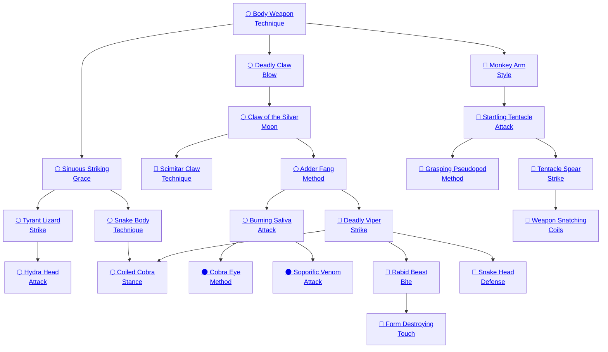
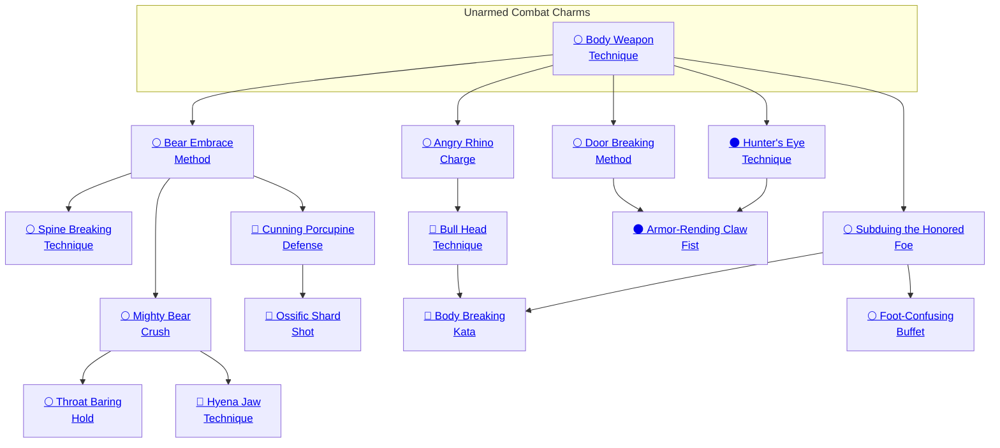

## Body Weapon Technique

Cost: 1 mote
Duration: Instant
Type: Supplemental
Minimum Strength: 1
Minimum Essence: 1
Prerequisite Charms: None

A Lunar may use this Charm to enhance his unarmed-combat
abilities, making his blows more deadly
by focusing Essence into his limbs. Rather than inflicting
bashing damage when executing a single unarmed Brawl
or Martial Arts attack (not a wrestling maneuver), his
blow causes lethal damage.

## Sinuous Striking Grace

Cost: 1 mote per + 1 initiative
Duration: Instant
Type: Reflexive
Minimum Dexterity: 1
Minimum Essence: 1
Prerequisite Charms: [[#Body Weapon Technique]]

The Lunar uses the Sinuous Striking Grace Charm
to guide his actions, allowing Essence flows to suggest the
likely actions of allies and enemies alike. When rolling
initiative, the Lunar may spend motes of Essence to
improve his initiative rating, 1 mote buying a +1 modifier
to a maximum of the Lunar's Dexterity score.

## Tyrant Lizard Strike

Cost: 1 mote per die
Duration: Instant
Type: Supplemental
Minimum Dexterity: 2
Minimum Essence: 1
Prerequisite Charms: [[#Sinuous Striking Grace]]

By means of this Charm, a Lunar can instinctively
perceive the flows of Essence in his target, using the
victim's intentions to easily guide the Exalt's blows
through the enemy's defenses, making the Lunar's claws
and teeth incredibly accurate. For each mote of Essence
spent on this Charm, the Lunar gains an additional
attack die on a single unarmed Brawl or Martial Arts
attack. These bonus dice may not exceed the character's
Dexterity.

## Hydra Head Attack

Cost: 3 motes per attack, 1 Willpower
Duration: Instant
Type: Extra action
Minimum Dexterity: 3
Minimum Essence: 1
Prerequisite Charms: [[#Tyrant Lizard Strike]]

A skilled Lunar can use Essence to enhance his
reactions, giving him preternatural reflexes and allowing
him to attack multiple times in a turn. For every 3 motes
of Essence spent activating this Charm, the Lunar gains
an additional unarmed Brawl or Martial Arts attack. A
Lunar can buy no more extra actions than his permanent
Essence, nor more than (the initiative on which he
activated this Charm + 3, rounded down). This normally
means (the character's initiative + 3), but Lunars who
hold their action and then invoke this Charm may lose
their ability to make many extra actions.

## Snake Body Technique

Cost: 5 motes
Duration: Instant
Type: Reflexive
Minimum Dexterity: 3
Minimum Essence: 2
Prerequisite Charms: [[#Sinuous Striking Grace]]

By utilizing the sinuous movements of a snake, the
Lunar can use a civilized enemy's strengths against him.
When attacked by a Melee or Martial Arts attack but
before damage is rolled, the Exalt's player can make a
reflexive Dexterity + Dodge roll against a difficulty equal
to the number of successes rolled on the attack. If the roll
succeeds, any damage from the attack is applied to the
attacker instead of the Lunar, with extra successes by the
Lunar increasing the number of damage dice. Even if the
Exalt fails to reflect the attack, Lunar's successes on the
Dexterity + Dodge roll still reduce the attack's successes
normally. The Snake Body Technique is a form of dodge
and cannot be used against undodgeable attacks, nor can
it be used to avoid counterattack-type effects.

## Coiled Cobra Stance

Cost: 5 motes
Duration: Variable
Type: Supplemental
Minimum Dexterity: 3
Minimum Essence: 2
Prerequisite Charms: [[#Snake Body Technique]], [[#Deadly Viper Strike]]

By holding his body in anticipation of the opponent's
actions, a Lunar using this Charm can ready a devastating
blow against his foe, timing that blow with deadly
precision. The Lunar activates the Charm before rolling
initiative and chooses a self-inflicted initiative penalty.
For every point of penalty on the initiative roll, the
Lunar gains a bonus die to his attack roll. This bonus
cannot exceed the Lunar's Dexterity, counts against the
Exalted's Dexterity Charm dice and only applies during
turns when the character plans to make Brawl or Martial
Arts attacks. If the Lunar does not attack in the turn in
which the Charm is activated, the advantages of the
Coiled Cobra Stance are lost. If the Lunar full dodges or
aborts to a parry, the effects of the Charm are lost. Coiled
Cobra Stance cannot be used in a Combo with Charms
that grant extra actions. A character cannot split his dice
pool in a turn when he uses the Coiled Cobra Stance.
For Example: After the first turn of combat, Kajeha
Lef knows she is faster than her opponent does and opts
to use the Coiled Cobra Stance. Kajeha is in hybrid form
and has a Dexterity of 6 but opts to delay her initiative
by only 5 points rather than risk the opponent acting
first. In the second turn of combat, her initiative score is
14 (reduced to 9), while her opponent gets a 7 total.
Kajeha still acts first, but her use of the Coiled Cobra
Stance adds 5 dice to her attack pool.

## Deadly Claw Blow

Cost: 2 motes per success
Duration: Instant
Type: Reflexive
Minimum Dexterity: 2
Minimum Essence: 1
Prerequisite Charms: [[#Body Weapon Technique]]

This Charm allows the Lunar to harness his bestial
prowess to become a killing machine. He becomes instinctively
aware of an opponent's weak spots and how to
exploit them, allowing him to target his attacks to
maximum effect. He may spend Essence to turn his
Dexterity dice into automatic successes when making a
single unarmed Brawl or Martial Arts attack. The dice
converted into automatic successes are not rolled as part
of his dice pool but the remaining dice (including Ability
dice and any Attribute dice not converted to successes)
are rolled normally. Each Attribute die converted costs
2 motes of Essence. The precision of the Deadly Claw
Blow allows the Lunar to harm beings not wholly in the
material world, allowing him to target spirits even if they
are dematerialized.
For Example: Swims in Shadows uses Deadly Claw
Blow to enhance his abilities in combat with the Fair Folk. His
player spends 6 motes of Swims in Shadows' Essence to
convert his 3 Dexterity dice into automatic successes, then
rolls the four dice of his Brawl Ability to see if he can increase
this number. He rolls 3, 4, 8 and 1, adding one additional
success, for a total of four successes.

## Claw of the Silver Moon

Cost: 4 motes
Duration: Instant
Type: Simple
Minimum Stamina: 2
Minimum Essence: 1
Prerequisite Charms: [[#Deadly Claw Blow]]

Using this technique, the Lunar temporarily trans-
forms his claws and fangs into moonsilver, drastically
improving his combat abilities. When using the Charm,
the Lunar may make unarmed claw attacks with his Brawl
or Martial Arts at Spd +6, Acc +1, Dmg +3L, Pry +1. He
may make unarmed bite attacks with those Abilities at
Spd +0, Acc + 2, Dmg +5L, Pry +0. Claws of the Silver
Moon can harm spirits even if they are dematerialized
and Charms that enhance moonsilver weapons may be
used in conjunction with Claws of the Silver Moon.

## Scimitar Claw Technique

Cost: 5 motes, 1 Willpower
Duration: One scene
Type: Simple
Minimum Manipulation: 3
Minimum Essence: 2
Prerequisite Charms: [[#Claw of the Silver Moon]]

Focusing Essence in his claws and teeth, not only does
the Lunar transform his claws and teeth into moonsilver,
but he also enlarges and reshapes them into vicious rending
weapons, well capable of disemboweling an ill-prepared
foe. When using the Charm, the Lunar's claw attacks are
Spd +6, Acc +4, Dmg +5L, Pry +4. The Lunar's bite attacks
are Spd +3, Acc +2, Dmg +8L, Pry +0. Charms that
enhance moonsilver weapons may be used in conjunction
with the Scimitar Claw Technique. Claws created
with the Scimitar Claw Technique can harm dematerialized
spirits.

## Adder Fang Method

Cost: 3 motes
Duration: Instant
Type: Supplemental
Minimum Stamina: 3
Minimum Essence: 2
Prerequisite Charms: [[#Claw of the Silver Moon]]

Lunars who know the Adder Fang Method can
enhance their attacks with venom. The Charm momentarily
creates poison generating glands or ducts,
releasing toxins whenever the Lunar successfully
makes an unarmed Brawl or Martial Arts bite attack.
In addition to the normal damage of the attack, if the
target takes damage, she suffers an additional number
of dice of lethal damage equal to the Stamina +
Essence of the Lunar. This damage is soaked separately
and does not add extra successes. However, it
ignores the target's armor — only Stamina and other
natural soak apply.

## Burning Saliva Attack

Cost: 3 motes
Duration: Instant
Type: Simple
Minimum Dexterity: 4
Minimum Essence: 2
Prerequisite Charms: [[#Adder Fang Method]]

Using this Charm, a Lunar channels Essence
into his digestive system, momentarily transforming
his stomach acids into a lethal weapon. He can spit
this corrosive phlegm at a target within 10 yards. The
attack uses Dexterity + Thrown or Athletics with a -
1 accuracy modifier. The opponent may dodge but
not parry. The attack inflicts 8L + extra successes.
The Burning Saliva Attack continues to harm the
opponent each turn until it is washed off or otherwise
removed. Scraping the acid off requires a Dexterity +
Athletics roll and is not a reflexive action - the
victim or one of his associates must use a dice action
to do so, though she need not roll.
Rather than directly attacking an enemy with
his acid saliva, the Lunar can target the opponent's
weapon. The accuracy of such attacks is -2, and
rather than the opponent soaking the damage, her
weapon must do so. Its soak is equal to its damage
value (so a straight sword that inflicts +3L has a soak
of 3). Roll unsoaked damage dice normally, and every
two successes reduce the weapon's damage value by
one. If the weapon's damage reaches 0, the weapon is
rendered useless. The acid continues to harm the
weapon until it is removed, which requires a non-reflexive
Dexterity + Athletics action, though the player of
the character removing the acid need not actually roll.
Such an attack doesn't affect weapons made of the Five
Magical Materials.

## Cobra Eye Method

Cost: 4 motes
Duration: Instant
Type: Simple
Minimum Intelligence: 5
Minimum Essence: 3
Prerequisite Charms: [[#Burning Saliva Attack]]

A sufficiently skilled Lunar can adjust the lethality
of his acid saliva, adjusting its damage and efficacy to
meet specific requirements. One such alternative is to
reduce the damage of the attack in favor of more precise
targeting of the attack. A Lunar may attack as per the
Burning Saliva Attack (range 10 yards, accuracy - 1,
damage 8L + extra successes, opponent may not parry),
and if the attack is successful, his player rolls damage
normally. However, as well as inflicting health levels of
damage, such an attack can reduces of the target's
Physical Attributes (Strength, Dexterity and Stamina),
his Appearance or his Perception. After rolling for
damage, the Lunar may sacrifice a health level of
damage to reduce one of the target's Physical Attributes,
his Appearance or his Perception by one dot.
An Attribute cannot be reduced below 1 with this
Charm. An Exalt requires a week of healing to recover
each Attribute point lost, but such injuries are permanent
if inflicted on mortals.

## Soporific Venom Attack

Cost: 6 motes
Duration: Instant
Type: Simple
Minimum Wits: 3
Minimum Essence: 2
Prerequisite Charms: [[#Burning Saliva Attack]]

By adjusting the composition of his saliva, the
Lunar can transform the Burning Saliva Attack from
an agonizing assault into a means of subduing a foe.
The Soporific Venom Attack functions as per the
Burning Saliva Attack, attacking at - 1 accuracy at a
range of 10 yards. However, the damage it inflicts is
14B + extra successes. The target may be rendered
insensate in two ways: He may sustain sufficient bashing
damage to render him incapacitated, or the toxin
may shock him into unconsciousness. The latter may
happen if the number of bashing health levels inflicted
by a single attack after damage is rolled exceeds
the target's Stamina Attribute. If it does, the target's
player must make a reflexive Stamina + Endurance
roll against a difficulty equal to the Lunar's Essence. If
the defender succeeds, he simply takes the bashing
damage from the attack. Otherwise, he is immediately
rendered unconscious for a number of minutes equal
to the Lunar's Stamina + Essence.

## Deadly Viper Strike

Cost: 8 motes, 1 Willpower
Duration: Instant
Type: Supplemental
Minimum Manipulation: 3
Minimum Essence: 2
Prerequisite Charms: [[#Adder Fang Method]]

The Deadly Viper Strike allows the Lunar to create
and use a more toxic variant of the venom in the Adder
Fang Method. This Charm must be used as part of an
unarmed Brawl or Martial Arts attack. In addition to
the normal attack damage, the venom injected into the
target causes injury and pain, though the immediate
damage is less than for the Adder Fang Method toxin.
Instead, if the Lunar's attack was successful and does
damage, the victim's player must roll Stamina + Endurance
against a difficulty equal to the Lunar's Essence. If
the roll fails, the target suffers an automatic level of
lethal damage, and his player must roll again (at the
same difficulty) next turn. Success indicates that the
target sustains no injury, and any additional successes
reduce the difficulty of resisting next turn. If the difficulty
is reduced to 0, the poison is no longer effective.
A botch indicates that the target suffers two automatic
levels of lethal damage, and the difficulty of resisting
next turn increases by one.

## Rabid Beast Bite

Cost: 3 motes
Duration: Instant
Type: Supplemental
Minimum Charisma: 3
Minimum Essence: 3
Prerequisite Charms: [[#Deadly Viper Strike]]

Fists, fangs and talons are only the most obvious
components of a Lunar's arsenal. Using the Rabid Beast
Bite, a Lunar Exalt can focus tainted traces of Essence
into an injury, no matter how insignificant. Any wounds
caused by a Brawl or Martial Arts attack supplemented
by Rabid Beast Bite are likely to become infected, even
if the attack inflicted only bashing damage.
Players must make a roll for their characters to
avoid infection on any injury caused by such an
attack. Wounds that would normally have a chance of
infection (those inflicting lethal or aggravated damage)
increase the difficulty of the roll to avoid infection
by the Lunar's Essence, and rolls for the unExalted to
recover from the infection are also increased by the
Lunar's Essence. The difficulty of avoiding infection
from bashing damage is 1. The cost of this Charm must
be paid before the Lunar makes his attack roll. Using
the Rabid Beast Bite on another Lunar is considered
a sign of great disrespect.

## Form Destroying Touch

Cost: 10 motes, 1 Willpower
Duration: Instant
Type: Supplemental
Minimum Charisma: 4
Minimum Essence: 4
Prerequisite Charms: [[#Rabid Beast Bite]]

Some Lunars regard rending an opponent's body as
too swift a punishment for whatever her offense has been
and seek to prolong the agony and distress of their
opponent. By means of the Form-Destroying Touch, the
Lunar uses his protean abilities to disrupt the body of his
opponent. The effects are weak at first but persist, with
increasing effectiveness. If the technique is successful,
wild mutations spring up on the victim's body, slowly
consuming and warping her form until nothing is left but
a shapeless mass.
The Form-Destroying Touch must be activated
before the Lunar makes an unarmed Brawl or Martial
Arts attack. The Charm has no effect unless the Exalt
gets at least one success on his attack roll — if the attack
roll fails or if the target blocks or dodges the attack, the
Charm has no effect, and the motes and Willpower are
lost. However, if the attack lands, the Lunar's player
rolls damage dice as normal — which the target cannot
soak - though no actual damage is recorded on the
target's health levels. Instead, if the successes inflicted
by the attack equal or exceed the target's Stamina, the
Lunar has implanted part of his protean power in the
victim, with potentially devastating consequences. If
the phantom damage does not exceed the victim's
Stamina, the Charm dissipates with no lasting effect.
The target of a successful Form-Destroying Touch
suffers no ill effects for the first day after she has been
attacked, though the corrupt Essence is already at
work. Each day after the first, anomalies begin to
emerge, and the target must attempt to resist the
corruption (roll Stamina + Endurance against a difficulty
equal to the Lunar's Essence). If the roll succeeds,
she resists ill effects for that day. If the roll fails, she
suffers aggravated damage; the first time this happens,
the damage is a single die, but it increases to two dice
the second time the roll fails, three the third, and so
forth, as the contagion continues to spread its mutations
and damage. These damage dice are rolled
normally. If the number of contagion-inflicted aggravated
health levels of damage exceeds the victim's
Essence + Stamina, the victim's body looses cohesion,
and she dies, transmuted into a chaotic jumble of
mutated organs and protoplasmic sludge.
Form-Destroying Touch cannot be used on those
immune to shapeshifting (such as Lunars) or where a
Charm or sorcery prevents the Lunar from touching his
victim or shields the target from Wyld mutation. Mortal
medicine is powerless to cure the Form-Destroying Touch,
though Charms such as Bodily Regeneration Prana can
negate the effect of Form-Destroying Touch if they cure
all the aggravated damage from the character's health
track. Disease-curing Charms and magical remedies do
nothing unless they are of incredible power (the legendary
Panacea Pipe might cure an afflicted character, for
example). The notable exception is the cure-all Sweet
Cordial (see Exalted, p. 336, which allows the victim's
player a regular Stamina + Resistance roll at difficulty 1
to defeat the infection.

## Snake Head Defense

Cost: 6 motes
Duration: Indefinite
Type: Simple
Minimum Charisma: 3
Minimum Essence: 4
Prerequisite Charms: [[#Deadly Viper Strike]]

Using this Charm, a Lunar can fashion part of his
body — usually the hair or a tail — into the form of a
venomous snake or snakes. If doesn't matter if the Lunar
has one large snake or many smaller ones, the effect is the
same. These snake-buds act pseudo-independently of
the Lunar. Though limited in reach to half the Lunar's
Essence in yards (rounded down), the snakes can attack
independently of the character. The snake or snakes
attack targets of the Exalt's player's choosing and act on
the Lunar's initiative. The snake-extensions fight with
half (round down, minimum 1) the Lunar's Attribute
and Ability scores and do Strength + 1L base damage.
They act once per turn but can split their dice pool
normally. Though lacking the raw strength of the Exalt,
a serpent's bite is venomous, acting in the same manner
as the Deadly Viper Strike (see above). However, the
venom is less than the Lunar's own, and the victim's
player need only roll Stamina + Endurance against a
difficulty equal to half the Lunar's Essence (rounded
down, minimum 1).
A snake may be attacked independently of the
Lunar and has 3 health levels: -1, -2 and -4. A fourth
point of damage &quot;kills&quot; or disables the snake. These
wounds do not affect the Lunar while the snake remains
in existence, but if he chooses to discontinue the
Charm, half (round up) of any wounds suffered by the
character's ophidian offshoots transfer to the Exalt.
Damaged snakes heal at the same rate as an Exalt (not
as fast as the Lunar using the Charm); dead snakes do
not heal. While a snake remains &quot;alive,&quot; a Lunar Exalted
cannot be subjected to an unanticipated attack by
a visible foe. The snakes cannot parry or dodge, but a
Lunar whose snake-extensions are attacked can parry or
dodge the attack as if it was against the Lunar himself.
A Lunar cannot use this Charm more than once at a
time on himself.

## Monkey Arm Style

Cost: 2 motes
Duration: Instant
Type: Reflexive
Minimum Manipulation: 2
Minimum Essence: 1
Prerequisite Charms: [[#Body Weapon Technique]]

Ordinarily, a Lunar can only attack targets within
arm's reach. The Monkey Arm Style allows the Lunar to surprise
his opponents by extending his reach by a number of yards equal to his
Essence. The Charm causes one or both of the Lunar's
arms to elongate, reshaping bone and muscle to create a
long, sinuous limb that, despite its snake-like appearance,
remains fully functional. The hand can grasp objects or targets
but lacks the finesse required to wield a weapon
effectively. The Monkey Arm Style can be used on its own to
extend the Lunar's reach for an instant, but it is most commonly
used as part of a Brawl or Martial Arts attack, allowing
the character to make unarmed attacks or wrestling
maneuvers at a distance equal to his Essence in yards.

## Startling Tentacle Attack

Cost: 3 motes per attack
Duration: Instant
Type: Extra action
Minimum Manipulation: 2
Minimum Essence: 1
Prerequisite Charms: [[#Monkey Arm Style]]

This Charm allows the Lunar to pour Essence into one
of his limbs, which splits into
multiple, writhing tentacles. Anything held in that
limb is dropped, and while the Exalted's natural weaponry
functions as normal, the damage is always converted
to bashing before it is applied to the target. Each of the
tentacles is capable of making a separate attack at the
Lunar's full Dexterity + Brawl or Martial Arts dice,
although all must attack the same target within a
number of yards equal to twice the Lunar's Essence. If
the defender dodges, make one roll and apply it to all
attacks. However, parry attempts must be made against
each attack. The tentacles re-form into the original
limb after the attacks are made. The Exalted cannot
create more tentacles than his permanent Essence.

## Grasping Pseudopod Method

Cost: 5 motes
Duration: Until attack ends
Type: Supplemental
Minimum Manipulation: 3
Minimum Essence: 2
Prerequisite Charms: [[#Startling Tentacle Attack]]

Using this Charm, the Lunar shapes one of his limbs
into a single, powerful tentacle that allows the Lunar to
make clinch, hold and throw attacks out to a number of
yards equal to twice his Essence (per the rules on pages
239 and 240 of Exalted). If the Lunar's player botches his
attack roll or if the target gets five more successes than
the Lunar in any contest related to the wrestling, the
Lunar's player must make a reflexive Wits + Athletics
roll or have his character thrown toward the target and
suffer the effects of knockdown.

## Tentacle Spear Strike

Cost: 4 or 5 motes per tentacle
Duration: Instant
Type: Extra Action
Minimum Manipulation: 4
Minimum Essence: 3
Prerequisite Charms: [[#Startling Tentacle Attack]]

By increasing the amount of Essence he commits
when creating tentacles, the Lunar can strike at targets
further away, allowing him to make hand-to-hand at-
tacks at incredible range. The Lunar can make a number
of tentacle attacks up to his permanent Essence, and
each tentacle may make a separate attack at the Lunar's
full Dexterity + Brawl or Martial Arts. A tentacle does
damage as if it were a normal unarmed attack by the
Lunar. Each tentacle may attack the same target, or they
may attack different victims, but each defender must be
in sight and within a number of yards of the Lunar equal
to (the Lunar's Essence x 10). Roll each attack sepa-
rately, but if the target parries or dodges the attack, make
one roll and apply it to all attacks directed against him.
As a result, the Lunar's opponent may avoid some none,
some or all of the tentacles. The tentacles re-form into
the original limb immediately after the attacks are made.
The cost of the Charm is 4 motes per tentacle if all are
directed at a single target, or 5 motes per tentacle if the
attacks are targeted at multiple foes.

## Weapon Snatching Coils

Cost: 4 motes per tentacle, 1 Willpower
Duration: Instant
Type: Simple
Minimum Manipulation: 4
Minimum Essence: 3
Prerequisite Charms: [[#Tentacle Spear Strike]]

By directing his pseudopodia at an opponent's
weapon, the Lunar can use the multiplicity of the
tentacles and their speed and reach to foil the
opponent's attacks. The maximum number and reach
of the tentacles is as per the Tentacle-Spear Strike
(Essence x 10 in yards, no more than Essence tentacles),
but rather than rolling Dexterity + Brawl, the
Lunar's player rolls Strength + Brawl, adding 1 die for
each tentacle formed. The opponent may seek to parry
or dodge the attack, but if the number of successes
remaining after defense still exceeds the target's Dexterity,
she is disarmed. Weapon-Snatching Coils do
not inflict damage on the target, and the attack cannot
be split between multiple foes.

## Bear Embrace Method

Cost: 1 mote per die
Duration: Instant
Type: Supplemental
Minimum Dexterity: 3
Minimum Essence: 2
Prerequisite Charms: [[#Body Weapon Technique]]

Lunars revel in the visceral nature of hand-to-hand
combat, particularly when they can feel the breath of
their opponents on their face. As a consequence, grap-
pling is a favored technique. This Charm allows the
Lunar to fortify his musculature, allowing his player to
purchase additional dice up to the character's Dexterity
when rolling a single wrestling attack with Martial Arts
or Brawl. The Charm allows the addition of dice to
enact, continue or escape from such maneuvers or to do
extra points of damage in a clinch attack.

## Spine Breaking Technique

Cost: 3 motes
Duration: Instant
Type: Supplemental
Minimum Strength: 3
Minimum Essence: 2
Prerequisite Charms: [[#Bear Embrace Method]]

The pinnacle of their wrestling abilities, the Spine-Breaking
Technique demonstrates the awesome power
of the Lunars' bestial nature. By means of this Charm,
the Lunar turns a painful and often incapacitating
attack into a lethal demonstration of his prowess. The
Lunar makes a clinch attack as normal, but rather than
the normal bashing damage, the Spine-Breaking Technique
inflicts lethal damage. The Spine-Breaking
Technique is also very difficult for the victim to escape
from, and the player of a Lunar who activated the
technique with his last action adds the Lunar's Strength
in automatic successes to the roll to resist any escape
attempt. A Lunar caught in a clinch may activate this
Charm on his action to do lethal damage. The Spine-Breaking
Technique can be used in a Combo with
Charms that increase the character's Strength but not
with any that enhance Dexterity.

## Mighty Bear Crush

Cost: 2 motes per die
Duration: Instant
Type: Reflexive
Minimum Strength: 4
Minimum Essence: 2
Prerequisite Charms: [[#Bear Embrace Method]]

This Charm allows the Lunar to imbue his muscles
with Essence, giving flesh and bone the strength and
consistency of steel hawsers. When the character has
successfully executed a clinch, tackle or throw or is doing
damage from maintaining a clinch, this Charm allows
the Lunar to transform dice up to his Strength into
automatic damage successes. However, the maximum
number of dice the Lunar can transform is equal to his
Essence or Strength, whichever is lower. The Essence for
this Charm is spent after soak is applied, so characters
need not worry about wagering Essence. The Mighty
Bear Crush can be used against any target the Lunar
perceives, including dematerialized spirits.

## Throat Baring Hold

Cost: 5 motes per turn
Duration: Varies
Type: Supplemental
Minimum Dexterity: 4
Minimum Essence: 2
Prerequisite Charms: [[#Mighty Bear Crush]]

Lunars revel in close combat, and many are unafraid
to place themselves in a disadvantageous position if
doing so will aid their hunting companions. Indeed,
doing so is seen by many as both a test of strength and
courage. The Throat-Baring Hold is one of the most
powerful expressions of this, allowing a Lunar who has
his opponent in a hold to &quot;open&quot; the opponent's defenses
to other attackers.
The Lunar must make a successful hold attack.
Any extra successes reduce the target's lethal and
bashing soak totals until the Lunar's next action or
until the opponent breaks free. As with normal hold
attacks, the Lunar's attack does not inflict damage. The
Throat-Baring Hold may be maintained for multiple
turns, but the Lunar must spend 5 motes and his action
(and Charm) for the turn in order to maintain the
Charm, and the target may break out, just as if it were
a normal hold.
The penalty inflicted remains the same from turn
to turn, until the hold is broken — a Lunar whose
initial attack fares poorly must release his foe and apply
the hold again to get a new result. In all turns after the
initial attack, the Lunar's player may add the Exalt's
Strength as automatic successes to the roll for the
purposes of combating the target's escape attempts and
reducing soak totals. Attacks against the target will
not harm the Lunar - the Charm helps keep him clear
of the incoming strikes - but a botched attack may
still strike him.

## Hyena Jaw Technique

Cost: 6 motes
Duration: Indefinite
Type: Simple
Minimum Manipulation: 2
Minimum Essence: 3
Prerequisite Charms: [[#Mighty Bear Crush]]
Despite their formidable strength and unparalleled
martial prowess, a foe is sometimes able to resist
the Lunar's attentions for a protracted period. Activating
the Hyena Jaw Technique allows a Lunar who has
his opponent in a clinch or hold to subdue the foe
quickly. The Charm, usable only in beastman form,
allows the Lunar to extend his neck and muzzle, allowing
him to clamp his jaws on the opponent's throat.
Every turn the Charm is in effect, the target loses a dot
of temporary Stamina and falls unconscious if reduced
to 0 Stamina. If the target attempts to break away from
the clinch or hold, she must soak lethal damage equal
to the Lunar's Strength + 2, irrespective of the success
(or otherwise) of her player's escape roll. If the target
falls unconscious as a result of Stamina loss or her
injuries, further damage inflicted by the Hyena Jaw
Technique reduces one of the target's Mental Attributes
(Perception, Intelligence or Wits) by one, but
not below 0. If all four targeted Attributes are reduced
to 0, the target dies. A victim of Hyena Jaw Technique
regains one Attribute dot per day.

## Cunning Porcupine Defense

Cost: 5 motes, 1 Willpower
Duration: Indefinite
Type: Simple
Minimum Charisma: 3
Minimum Essence: 3
Prerequisite Charms: [[#Bear Embrace Method]]

Though reveling in close combat, there are times
Lunars seek to escape the clutches of their opponents
and brute strength is not enough. This Charm, which
can only be used when in the hybrid beastman form,
allows the Lunar to give his foe a deadly surprise. After
activating the Charm, the Lunar sprouts a number of 6-inch
long, razor-sharp spines. Anyone who is clinching
the Lunar when the spines form or who thereafter
clinches, holds or otherwise engages in wrestling with
the Lunar, risks grave injury. Those clinching or holding
the Lunar suffer damage equal to the Lunar's Strength +
5L, and the Lunar substitutes this for his normal damage
when he does damage in a clinch.
Any unarmed attacks made by the Lunar while the
spines are extended inflict lethal damage rather than
bashing. Players of characters who make unarmed
attacks against a Lunar using the Cunning Porcupine
Defense must make a reflexive Dexterity + Athletics
roll (Difficulty 3) or else their characters suffer lethal
damage equal to their own Strength. Regardless, the
Lunar takes damage from the opponent's attack as
normal. The Cunning Porcupine Defense remains in
effect as long as the Lunar commits Essence to the
Charm and stays in beastman form. If the Lunar leaves
hybrid form or stops committing Essence, the spines
merge back into his body.

## Ossific Shard Shot

Cost: 2 motes
Duration: Instant
Type: Simple
Minimum Manipulation: 3
Minimum Essence: 3
Prerequisite Charms: [[#Cunning Porcupine Defense]]

Using this Charm, a Lunar can tear a fragment from
her bones and reform her muscles to launch it from her
body, hurling it at an opponent within a range of (her
Perception x 10) in yards. This attack is horrible to
behold, as the shard tears free of the Lunar's body in a
shower of blood and torn tissue, which, like the bone,
regenerates near-instantly. The attack is made with
Dexterity + Archery or Thrown, at - 1 accuracy, and it
inflicts (9L + extra successes) damage.

## Angry Rhino Charge

Cost: 1 mote per 2 dice
Duration: Instant
Type: Supplemental
Minimum Strength: 2
Minimum Essence: 2
Prerequisite Charms: [[#Body Weapon Technique]]

Rather than simply wounding an opponent, a Lunar
may use her strength and body mass to overbear the
opponent and force him into a disadvantageous position.
Using the Angry Rhino Charge after making a successful
Brawl or Martial Arts attack allows the Lunar's player to
purchase extra dice of damage up to the Exalt's Strength
Attribute. These bonus dice do not add to the damage
inflicted by the attack, but they do count toward deter-
mining knockdown and/or knockback (see Exalted, pp.
234-235) and also determine the difficulty of the target's
roll to avoid knockdown.
For Example: Ma-Ha-Suchi, in beastman form, uses
the Angry Rhino Charge in his battle with the Terrestrial
Gavus. After Ma-Ha-Suchi successfully strikes the Dragon-
Blooded, 3 motes are spent to purchase six extra dice to
supplement the ancient Lunar's natural Strength. Gavus has
a combined Stamina + Resistance of 8, which Ma-Ha-
Suchi's damage dice exceed. Gavus' player must therefore get
five successes (the number of dice purchased by Ma-Ha-Suchi),
or the Dragon-Blood suffers knockdown.

## Bull Head Technique

Cost: 2 motes per die
Duration: Instant
Type: Supplemental
Minimum Manipulation: 3
Minimum Essence: 2
Prerequisite Charms: [[#Angry Rhino Charge]]

The Lunars can grow not only tentacles, but also
other enhancements as well. Through the use of this
Charm, the Lunar reshapes his head to be like that of a
bull, including the bull's deadly horns, for the instant of
an attack. Using the Bull Head Technique, a Lunar who
is charging into combat (that is, who moves his full
movement allowance for the turn) may focus his Essence
to maximize damage to his opponent. After the Lunar
makes a successful Brawl or Martial Arts attack, his
player can purchase additional damage dice up to the
value of the Exalt's Strength Attribute. All damage from
the Bull Head Technique is lethal. Bonus damage is
applied before soak, not after.

## Subduing the Honored Foe

Cost: 1 mote per die
Duration: Instant
Type: Supplemental
Minimum Strength: 2
Minimum Essence: 1
Prerequisite Charms: [[#Body Weapon Technique]]

Though Lunars enjoy the thrill of combat, they
don't always want to kill their foes. In many cases, they
seek simply to subdue them, as part of a ritual or demonstrative
duel or to claim a ransom from the defeated foe.
This Charm envelopes the Lunar's limbs in Essence,
lending his blows considerable weight but also cushioning
the target from the worst effects of the blow. When
rolling damage for an unarmed Brawl or Martial Arts
attack, the Lunar's player can transform a number of dice
up to a maximum of his character's Essence into automatic
successes at the cost of 1 mote per die. Attacks
enhanced with Subduing the Honored Foe automatically do bashing damage only.
This Charm's effects take place immediately after
soak is applied, but the player must pick before he makes
the attack roll how many motes to spend converting dice
of damage into automatic successes. If the player pays to
convert more damage dice than he rolls, the extra
Essence invested is wasted. If the target remains conscious
after the attack but suffered more levels of bashing
damage than her Stamina, she is dazed, and her player
must make a successful reflexive Willpower roll (difficulty
of the Lunar's Strength) or have her character
spend her next action shaking off the attack's effects.

## Body Breaking Kata

Cost: 5 motes
Duration: Instant
Type: Supplemental
Minimum Charisma: 4
Minimum Essence: 2
Prerequisite Charms: [[#Bull Head Technique]], [[#Subduing the Honored Foe]]

Some Lunars employ finesse in combat, but most
prefer brute force, and the Body Breaking Kata reflects
this fact. It is not a subtle attack, but instead, employs a
combination of size, strength and outright aggression to
overwhelm an opponent. The Charm is only effective if
the Lunar charges into close combat with her opponent
- she must move half her movement allowance before
engaging the foe. The Lunar channels Essence through
her body while making a single unarmed Martial Arts or
Brawl attack. This Essence charge seems to cause the
Lunar's form to swell and take on giant proportions for an
instant. As far as observers are concerned, the target is
charged by a monstrous version of the Lunar's totem.
The player of the attacking Lunar should roll Dexterity
+ Brawl or Martial Arts as normal for the attack but
double the number of extra successes before applying the
target's soak. All damage from the Body Breaking Kata is
lethal.

## Foot-Confusing Buffet

Cost: 2 motes + 1 mote per die
Duration: One turn
Type: Supplemental
Minimum Dexterity: 3
Minimum Essence: 2
Prerequisite Charms: [[#Subduing the Honored Foe]]

Maintaining the initiative in combat is often as
important as the amount of damage inflicted on the
opponent. Keeping control of the direction of a fight
often takes precedence over inflicting injuries in the
short term. The Foot-Confusing Buffet allows the Lunar
to keep an opponent off balance, sacrificing one or more
damage dice from a successful Brawl or Martial Arts
attack in favor of an initiative penalty for the foe in the
following turn. The Charm surrounds the Lunar's attacking
limbs with a nimbus of light, creating a
mesmerizing series of patterns that distract the foe. The
Lunar must activate the Charm before making his attack,
paying the basic Essence cost even if the attack
misses. Only if the attacking Lunar gets at least one extra
success does the Foot-Confusing Buffet come into play.
The Lunar may sacrifice a number of dice of damage up
to his Essence or Strength score, whichever is lowest.
Damage dice are sacrificed before soak is applied. The
number of points sacrificed is applied as a penalty to the
target's player's initiative roll in the next turn.

## Door Breaking Method

Cost: 1 per damage success
Duration: Instant
Type: Simple
Minimum Strength: 3
Minimum Essence: 2
Prerequisite Charms: [[#Body Weapon Technique]]

By means of this Charm, a Lunar can focus his wrath
on an inanimate object, dealing it a devastating blow to
rend it into splinters. This attack is particularly effective
against man-made objects, but it may be used against any
non-living, non-magical item. When striking the object,
the Lunar focuses his strength and aggression into
the blow, as well as Essence. Every mote expended adds
one die of damage to a single attack by the Lunar against
an item. If the item is man-made, then each mote spent
is worth two automatic damage successes instead. The
Lunar's player cannot spend more motes when using this
Charm than the character's Strength.

## Hunter's Eye Technique

Cost: 2 motes per die
Duration: Instant
Type: Supplemental
Minimum Perception: 3
Minimum Essence: 2
Prerequisite Charms: [[#Body Weapon Technique]]

Strength is only part of winning a fight. Knowing
where to hit the opponent to gain maximum effect is an
equally important consideration — perhaps more important
in the case of fast, agile Lunars. Using this Charm,
the Lunar guides a single unarmed Brawl or Martial Arts
blow to the enemy's weak point, circumventing his
armor and defenses. For every 2 motes spent, the Lunar
may reduce the soak rating of her opponent's armor by 1.
This applies to armor soak only — the target's natural
soak is unaffected. The attack cannot reduce the soak of
an opponent's armor by more than the Lunar's own
Dexterity or below O. The soak reduction applies only for
the enhanced single attack. This Charm is of instant
duration — if the Lunar makes multiple attacks in a turn
and desires to reduce the opponent's armor soak each
time, she must pay for each reduction separately.

## Armor-Rending Claw Fist

Cost: 4 motes
Duration: Instant
Type: Supplemental
Minimum Intelligence: 4
Minimum Essence: 3
Prerequisite Charms: [[#Door Breaking Method]], [[#Hunter's Eye Technique]]

A Lunar's claws are formidable weapons, but the
protective effects of armor can blunt the strikes of even
the mightiest Exalts. By means of this Charm, a Lunar
can reduce the efficacy of his opponent's armor, directing
his attacks at the protective layers rather than
directly at the opponent. To do so, he transforms his
claws into vicious, hooked rending devices, lacking the
length to cause serious harm to the opponent but grant-
ing them sufficient strength and resilience to rend even
the hardest armors.
The Lunar makes an unarmed Brawl or Martial Arts
attack as normal, including determining the amount of
raw damage before soak. The opponent may reduce the
attack's damage only using his armor's lethal soak rating,
not his Stamina or any enhancements, unless they specifically
reinforce the armor. Unlike a normal soak, this
may reduce the damage of the attack to O. Roll any
remaining damage dice normally, and subtract the number
of successes from all of the armor's soak ratings. This
reduction is a permanent one, reflecting the Lunar's
efforts to shred and rend the armor, though a skilled
armorer may be able to affect repairs. If the number of
successful damage dice exceeds the armor's soak rating,
the armor is destroyed (irreparably), with the excess
applied to the opponent (who may soak with her Stamina)
as health levels of lethal damage. The Armor-Rending
Claw Fist is not effective against armor made from the
Five Magical Materials.
