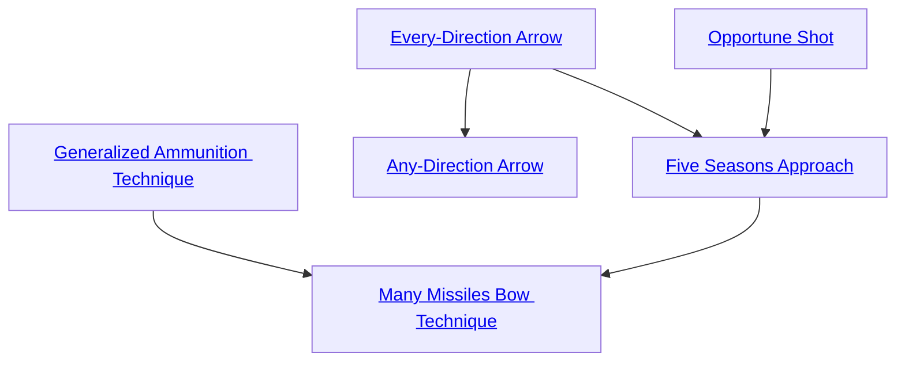

## Generalized Ammunition Technique

Cost: 1 mote
Duration: Instant
Type: Supplemental
Minimum Archery: 2
Minimum Essence: 2
Prerequisite Charms: None

The mirror of adjusting circumstances to meet one's
needs is adapting one's needs to things found in one's
circumstances. Both allow for the smooth progress of
fate. This Charm lets an adaptable Exalt fire anything no
heavier than her fist and no longer than her arm as if it
were an arrow, including handfuls of dust or fire, shouts,
dragonflies, small spirits or shadows. Living things can
avoid the Sidereal seizing and launching them with a
reflexive Dexterity + Dodge roll against a difficulty equal
to the Sidereal's Archery score. Upon impact, an improvised
arrow inflicts damage as a normal arrow of any type
(Exalt's choice), in addition to any unusual effects appropriate
to the attack. Sidereal Exalted can only shape
arrows from concrete things, although the Maiden of
Battles shapes her arrows from intention and desire.

## Any-Direction Arrow

Cost: 1 mote + 1 mote per die
Duration: Instant
Type: Supplemental
Minimum Archery: 1
Minimum Essence: 1
Prerequisite Charms: None

Graced by the chance to serve those who weave fate,
an arrow gleefully weaves in the air to strike its opponent
from an unexpected direction. The Exalt adds up to her
Essence in dice to an Archery roll. In addition, the arrow
takes no penalties from up to 50 percent cover.

## Every-Direction Arrow

Cost: 3 motes per extra arrow
Duration: Instant
Type: Extra Actions
Minimum Archery: 4
Minimum Essence: 2
Prerequisite Charms: Any Direction Arrow

The character fires a number of arrows no
greater than her Essence, which first scatter and
then strike a single target from every side. Use one
attack roll for all the arrows, but apply the damage
for each of them separately.

## Opportune Shot

Cost: 3 motes
Duration: Instant
Type: Reflexive
Minimum Archery: 3
Minimum Essence: 2
Prerequisite Charms: None

Spotting an opportunity thanks to the graces of fate,
the character launches an arrow before her normal
initiative. This Charm lets her automatically win initiative
over a single target for purposes of making an
Archery attack against him. She cannot split her dice
pool on the turn she uses Opportune Shot. Characters
using Opportune Shot, Thunderclap Rush Attack or
similar abilities in competition roll for initiative with
one another normally.

## Five Seasons Approach

Cost: 2 motes per target number reduction
Duration: Instant
Type: Supplemental
Minimum Archery: 4
Minimum Essence: 3
Prerequisite Charms: Every Direction Arrow, Opportune Shot

If skill does not suffice to make her shot, then a
character may trust to the world's esteem for her. If not
to that, then to the world's fear of what she hopes to save
it from. If not to that, to the world's dreams of the glories
she strives for. Even if these things fail, she may trust to
luck. This is the Five Seasons Approach. The character
can reduce the target number of an Archery roll. Sidereal
Exalted can always use any Virtue with this Charm.

## Many Missiles Bow Technique

Cost: 10 motes, 1 Willpower, 1 health level
Duration: One scene
Type: Simple
Minimum Archery: 5
Minimum Essence: 4
Prerequisite Charms: Generalized Ammunition Technique, Five Seasons Approach

This Charm uses a prayer strip marked with the
scripture of the Clay Maiden. The Exalt casts it into the
sky, where it radiates a gaudy pink light, hovering 10
yards above her bow.
For the duration of this Charm, the character's
arrows have triple their normal range. In addition, for 1
experience point each, the Sidereal can learn transformations
to apply to an arrow as it falls, reshaping it into
some other aspect of Creation. Commonly known trans-
formations include:
• Rain of fire: The arrow turns into a rain of fire,
attacking and applying its normal damage to all creatures
within five yards of the target, setting flammable things
alight, and ignoring armor on a successful hit.
• Snow: It begins to snow around the region where
the arrow fell. The character must renew this effect with
at least one arrow per minute to maintain it.
• Life: The target is healed for one level of lethal or
bashing damage.
• Grain: A small patch of ripe wheat, enough to
feed one person for a day, sprouts where the arrow lands.
• Boulder: The arrow turns into an unblockable
boulder as it falls. It can be dodged. Double the raw
damage of the attack, including extra successes, when
used against inanimate objects.
• Glass: The arrow becomes transparent as it falls.
Targets must make a reflexive Perception + Awareness
roll at difficulty 2 to defend against it without the use
of Charms.
Each such arrow costs 1 mote of Essence to fire.
Living or heavily worked &quot;arrows&quot; based on the Generalized
Ammunition Technique cannot suffer
transformations, nor can arrows made from the Five
Magical Materials.
Characters can learn transformations from other
Exalted with this Charm. They can also design new
transformations, with the Storyteller's approval. Effects
should be simple and should not directly duplicate the
effects of other Charms.
