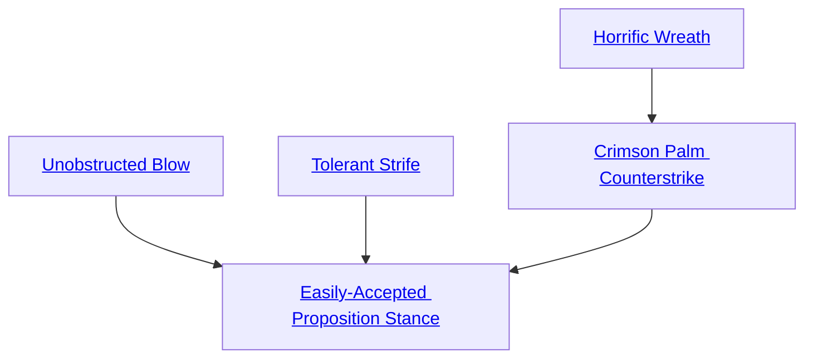

## Unobstructed Blow

Cost: 5 motes
Duration: Instant
Type: Supplemental
Minimum Brawl: 4
Minimum Essence: 2
Prerequisite Charms: None

The character chooses the arc of his blow and writes
it into forthcoming fate. One attack made using Brawl
cannot be blocked. If it hits, the target's armor provides
no protection.

## Tolerant Strife

Cost: 3 motes + 1 mote per die
Duration: Instant
Type: Supplemental
Minimum Brawl: 3
Minimum Essence: 1
Prerequisite Charms: None

The character adapts to the conditions of the battlefield,
rewriting the course of events so that they aid
rather than hinder her. She makes a Brawl attack,
suffering no environmental or circumstantial penalties
and adding up to her Essence in dice. Sidereal Exalted
may always use their Compassion with this Charm.

## Horrific Wreath

Cost: 2 motes
Duration: Five turns
Type: Simple
Minimum Brawl: 2
Minimum Essence: 2
Prerequisite Charms: None

The character mirrors her personal Essence to that
of her enemies. When she strikes at a demon, this Charm
wreathes her fists in a hideous red glare. When she
attacks the servants of the Malfeans, her hands burn an
undifferentiated white. Herunarmed attacks and attacks
using starmetal brawling aids do lethal damage against
ordinary foes and aggravated damage against inhabitants
of Malfeas and the Underworld. This Charm can be
invoked during a clinch, and its effects apply to a
character's clinching damage. Its effects also apply to
barehanded Martial Arts attacks.

## Crimson Palm Counterstrike

Cost: 5 motes
Duration: Instant
Type: Reflexive
Minimum Brawl: 4
Minimum Essence: 2
Prerequisite Charms: [[#Horrific Wreath]]

Coming to an accommodation with an enemy's
movements, the character learns to interrupt an enemy's
strike an instant before it happens. If the character is
aware of an incoming hand-to-hand attack, she can
reflexively counterattack. A well-executed Crimson
Palm Counterstrike knocks the enemy out of position:
He overreaches or stumbles and cannot complete his
attack. The Sidereal's player makes a single Dexterity
+ Brawl roll at her full dice pool. Count the
number of successes. Apply these successes first as a
parry, even against a lethal attack, to resolve the initial
blow. Then, apply the remainder as successes received
on an immediate Brawl counterattack.
The character can only use this Charm if she's able
to attack and cannot use it in response to Crimson Palm
Counterstrike or other any counterattack Charm. Otherwise,
the parry and counterattack succeed or fail
independently - she can knock her opponent aside
without damaging him, or vice versa.

## Easily-Accepted Proposition Stance

Cost: 12 motes, 1 Willpower, 1 health level
Duration: One battle
Type: Simple
Minimum Brawl: 5
Minimum Essence: 3
Prerequisite Charms: [[#Unobstructed Blow]], [[#Tolerant Strife]], [[#Crimson Palm Counterstrike]]

This Charm uses a prayer strip marked with the
scripture of the Drowning Maiden. The character knots
it into her shadow, where it shimmers a soft scarlet.
Once per invocation of this Charm, the character
can strike a fate-resolving blow, sending cascading vibrations
through the weave of the world. She dictates a
single event or circumstance. The dictum must be a
feasible occurrence, although it can be highly improb-
able: Reinforcements might arrive, a wall might
spontaneously crumble, or the character's fallen army
might turn out to be bruised and unconscious rather than
wounded and dead. Legions of tyrant lizards cannot fall
from the sky and set upon the foe.
The Exalt's player rolls Intelligence + Brawl. The
difficulty is the Essence of the highest-Essence entity
directly and unpleasantly affected by the character's
dictum. If she succeeds, that enemy has a choice. Either
the character's dictum comes to pass, or the tremors in
the weave ground through that enemy — inflicting dice
of aggravated damage equal to the Sidereal's Essence,
plus one die per extra success on the Brawl roll. This
damage ignores armor. The attempted use of a defensive
Charm nullifies the damage entirely; instead, the
dictum takes effect.
Sidereal Exalted can always use their Valor with this
Charm. Using this Charm without authorization is a
Severity 3 offense.
