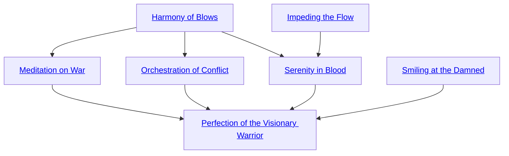

## Harmony of Blows

Cost: 8 motes
Duration: Instant
Type: Extra Action
Minimum Melee: 2
Minimum Essence: 2
Prerequisite Charms: None

The patterns and flows of a battlefield hold no
mysteries for the character. She does not need to improvise
last-second defenses. She notices openings well
before they appear. She can choose her blows precisely,
selecting multiple actions that combine harmoniously.
In the turn in which she invokes this Charm, the
character can take two extra attack actions, using Archery,
Brawl, Melee or Thrown. Sidereal Exalted may
always use their Temperance with this Charm.
This Charm is explicitly permitted to be in a
Combo with Charms of other Abilities. Note that the
rules on Combos may limit the kinds of actions a
character can take.

## Meditation on War

Cost: 1 mote per die + 1 mote per dice pool penalty cancelled
Duration: Instant
Type: Supplemental
Minimum Melee: 3
Minimum Essence: 2
Prerequisite Charms: Harmony of Blows

Calm and precision envelops the character as she
strikes. She adds dice to one Melee attack, increasing it
to a maximum of its normal pool plus the character's
Essence. For example, an Essence 3 character who has a
- 1 wound penalty can spend up to 4 motes to enhance her
attack. This can overcome penalties that reduce the
character's dice pool to 0 before Charms. Sidereal Exalted
may always use their Temperance with this Charm.

## Orchestration of Conflict

Cost: 2 motes per target number reduction
Duration: Instant
Type: Supplemental
Minimum Melee: 3
Minimum Essence: 2
Prerequisite Charms: Harmony of Blows

Manipulating the local flow of a conflict through
the ripple effects of her own actions, the character
reduces the target number for a Melee attack or parry.

## Impeding the Flow

Cost: 3 motes
Duration: Instant
Type: Reflexive
Minimum Melee: 2
Minimum Essence: 1
Prerequisite Charms: None

A wind full of red stardust and the character's will,
visible to those who can see dematerialized spirits, spins
around the character. It reroutes the flows of Essence and
fate that normally allow others to attack her. A casual
movement of the Exalt's weapon parries any one incoming
attack she is aware of, so long as the attack has a
physical component and is not specifically noted as
impossible to block. This is not a perfect defense.

## Serenity in Blood

Cost: 5 motes, 1 Willpower
Duration: Instant
Type: Reflexive
Minimum Melee: 4
Minimum Essence: 2
Prerequisite Charms: Harmony of Blows, Impeding the Flow

Stirring the currents of fate with the tip of her weapon,
the character disrupts the path of any attack made against
her, so long as it passes through any portion of the world
bound by fate. If she is unaware of the attack, her player
must make a reflexive Perception + Melee roll at difficulty
3 to divert the blow. Otherwise, this is a perfect block,
capable of stopping even unblockable attacks.

## Smiling at the Damned

Cost: 5 motes
Duration: Instant
Type: Supplemental
Minimum Melee: 4
Minimum Essence: 3
Prerequisite Charms: None

In the moment the character's weapon strikes true,
the colors around her take on a harsh red tinge. Essence
dissolves at the weapon's touch. Halve the raw damage
for one attack, rounding down, but the damage is aggravated.
Sidereal Exalted may always use their Conviction
with this Charm.

## Perfection of the Visionary Warrior

Cost: 10 motes, 1 Willpower, 1 health level
Duration: One scene
Type: Simple
Minimum Melee: 5
Minimum Essence: 3
Prerequisite Charms: Meditation on War, Orchestration of Conflict, Serenity in Blood, Smiling at the Damned

This Charm uses a prayer strip marked with the
scripture of the Maiden on the Shelf. The character
places it across his eyes, whereupon it adheres and begins
to drip with dark blood.
The character suffers no visibility penalties. All
opponents and attacks become apparent to him, although
effects such as the Mental Invisibility Technique can
force him to ignore them. He sees enemies not as bodies
and faces but as patterns of fate and potential or — for
creatures outside of fate — disruptions in such patterns.
The character can reflexively parry any blockable
attack with his full Dexterity + Melee dice pool. Once
per turn, after his initiative, he can reflexively make an
Archery, Brawl, Melee or Thrown attack at his full dice
pool. He cannot use the latter ability in any turn where
he splits his normal dice pool.
