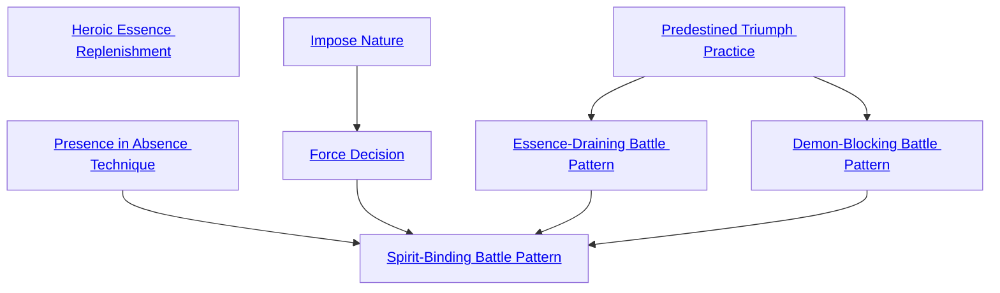

## Heroic Essence Replenishment

Cost: None
Duration: Permanent
Type: Special
Minimum Presence: 1
Minimum Essence: 2
Prerequisite Charms: None

In her moments of greatest accomplishment, the
force of an exultant Sidereal's will allows her to siphon
Essence from the world. This Charm draws on her ability
to single-handedly remake the world in the shape she
favors and dominate those hostile to herself and her
cause. Immediately after a successful roll using Valor or
immediately after a Presence roll that bent an enemy to
her will, the Exalt regains twice her Valor in motes of
Essence, up to her normal maximum. There is no cost to
use this Charm's effects — learning this Charm simply
enhances the Exalt's capabilities.

## Presence in Absence Technique

Cost: 5 motes
Duration: Instant
Type: Simple
Minimum Presence: 2
Minimum Essence: 1
Prerequisite Charms: None

The character impresses the fervent force of his
personality on another person's future. When next the
target finds himself in a specified circumstance, the
Sidereal can use Performance, Presence or Socialize as if
the Exalt were there. His player makes a single Ability
roll, which Charms cannot augment. This uses the target's
actions as a medium but does not change those actions —
rather, it gives them an unexpected emotional resonance
and unusual connotations. For example, the target could
enter the court of a king of thieves and discover that her
actions inadvertently comprise a Presence roll to con-
vince that court that she must die. Using this Charm
voids any previous Presence in Absence Technique effects
on the target. The Sidereals cannot annotate a
single person's destiny with dozens of future rolls.

## Impose Nature

Cost: 3 motes
Duration: Indefinite
Type: Simple
Minimum Presence: 4
Minimum Essence: 2
Prerequisite Charms: None
The character blesses a single creature with her
personal sign, making a ghostly imprint of the character's
Caste Mark on the target's left palm. The target gains the
Sidereal's Nature in addition to his own. Both Natures
are equally strong, and both help the target regain
Willpower. The target proceeds normally, given that he
has discovered an entirely new kind of joy/self-satisfaction,
and while generally inclined to follow both Natures,
does not need to give either precedence.

## Force Decision

Cost: 5 motes, 1 Willpower
Duration: Instant
Type: Simple
Minimum Presence: 3
Minimum Essence: 2
Prerequisite Charms: [[#Impose Nature]]

This Charm allows the Sidereal to channel Essence
into another being briefly, forcing him to make the
decision the Sidereal desires. The Sidereal's player makes
a Manipulation + Presence roll with a difficulty equal to
the target's Essence. Success indicates that the target
will make the decision the Sidereal desires.

## Predestined Triumph Practice

Cost: 8 motes, 1 Willpower
Duration: One battle
Type: Simple
Minimum Presence: 4
Minimum Essence: 3
Prerequisite Charms: None

This Charm gives the character supernatural acu-
men and insight when planning a battle. It functions
automatically when the Sidereal commands the troops
herself. Otherwise, it requires a Charisma + Presence roll
to properly convey the Sidereal's ideas to the leader of
the side she favors. This roll has difficulty 1 for a coop-
erative leader, difficulty 3 for a leader who does not trust
the Sidereal and difficulty 5 if the leader is actively
unwilling to accept the Sidereal's advice.
Fighting those blessed by a Sidereal's insight is
difficult. If the Exalt succeeds, opponents suffer a one-die
penalty to their dice pools for both attacking and defend-
ing against the troops. Sidereal Exalted can always use
their Compassion with this Charm.

## Essence-Draining Battle Pattern

Cost: 8 motes
Duration: Until the relevant battle ends
Type: Simple
Minimum Presence: 5
Minimum Essence: 3
Prerequisite Charms: [[#Predestined Triumph Practice]]

Having applied the Predestined Triumph Practice,
the character may encourage his troops to fight in the
Essence-Draining Battle Pattern. Their elegant maneuvering
dams, blocks and diverts the flows of Essence that
oppose them.
At any time while planning an impending battle,
the character can elect to use this Charm. When the
battle begins, the player rolls the Sidereal's Intelligence
+ Presence to measure the character's efficiency in
designing the pattern and the troops' ability to follow it.
The maximum number of successes achievable equals
the Exalt's permanent Essence. Any further successes are
lost. The pattern has a Perfection rating equal to this
final number of successes.
One Exalt or 20 unExalted warriors can spend an
action to enact part of the Sidereal's battle plan. The
altered Essence flows of the battlefield pour 1 mote of
temporary Essence into each character enacting the
plan. In addition, they each add the pattern's Perfection
to the Essence cost of Charms and sorcery used by their
opponents. Any number of characters can take this
action in a given turn, each further increasing the
difficulty of hostile magic. However, this cannot more
than double the cost for a Charm or spell. The Essence-
Draining Battle Pattern affects any hostile Charm or
sorcery that either originates upon the battlefield or has
direct effects there.
For example, if the character has Essence 5, and his
player rolls five or more successes, and six Dragon-
Blooded under his command fight in the Essence-Draining
Battle Pattern, Charms and sorcery used against the
character's forces cost up to 30 motes extra. Sledgehammer
Fist Punch costs 8 motes instead of 3. Rain of Doom
costs 90 motes instead of 60. Once upon a time, legions
of well-advised Dragon-Blooded used this power to con-
strain even the horrible power of the Primordials.
An army may only enact one Battle Pattern-type
Charm. Sidereal Exalted can always use their Compassion
with this Charm.

## Demon-Blocking Battle Pattern

Cost: 8 motes
Duration: Until the relevant battle ends
Type: Simple
Minimum Presence: 5
Minimum Essence: 3
Prerequisite Charms: [[#Predestined Triumph Practice]]

Having applied the Predestined Triumph Practice,
the character may encourage her troops to fight in the
Demon-Blocking Battle Pattern. Their formations are
attuned to the disruptions in fate that the creatures of
Malfeas and the Underworld embody, and by mirroring
and twisting that disruption, the warriors can keep the
threads of fate running straight and true.
The character invokes this Charm exactly as with
the Essence-Draining Battle Pattern. One Exalt or 20
unExalted warriors can spend an action to enact part of
the pattern, imposing a general dice-pool penalty on an
inhabitant of Malfeas or the Underworld equal to the
pattern's Perfection. This cannot reduce the victim's
pool below O before the use of Charms.
An army may only enact one Battle Pattern-type
Charm. Sidereal Exalted can always use their Compas-
sion with this Charm.

## Spirit-Binding Battle Pattern

Cost: 10 motes, 1 Willpower, 1 health level
Duration: Until the relevant battle ends
Type: Simple
Minimum Presence: 5
Minimum Essence: 3
Prerequisite Charms: [[#Presence in Absence Technique]], [[#Force Decision]], [[#Essence-Draining Battle Pattern]], [[#Demon-Blocking Battle Pattern]]

This Charm uses a prayer strip marked with the
scripture of the Maiden at War. The character first
applies the Predestined Triumph Practice and then burns
the prayer strip. Only the symbols on it remain, drifting
on the wind as letters of blood and smoke.
The Charm takes effect once the battle begins. The
Sidereal names a spirit or elemental she hopes to call and
bind. The Sidereal's location and invocation immediately
becomes obvious to the spirit, wherever it may be.
If the Sidereal uses this Charm unassisted, the spirit's
maximum Essence is 5. However, up to one Sidereal of
each other caste can support her, participating in the
planning. They need not have the Charm themselves.
Each adds 1 to the maximum summonable Essence.
The dice pool for summoning and binding the spirit
starts at O. The death of one Exalted or 20 unExalted
warriors on the Sidereal's side adds one die to this pool.
Whenever the Exalt finds this dice pool satisfactory, the
player rolls against the spirit's Essence. Success binds the
spirit to grant whatsoever favor the character demands
and exact no retribution — or to serve her for a year and
a day, later taking whatever revenge it chooses. (Elder
spirits often consider killing the Sidereal Exalted too
crude a revenge, instead seeking to impose an equally
demeaning slavery upon them.) Suicide and favors tantamount
to it are outside the limits of this agreement.
An army may only enact one Battle Pattern-type
Charm. Sidereal Exalted can always use their Conviction
with this Charm.
