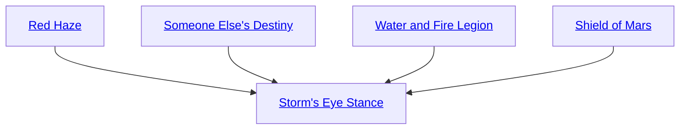

## Red Haze

Cost: 5 motes, 1 Willpower
Duration: Five days
Type: Simple
Minimum Resistance: 2
Minimum Essence: 2
Prerequisite Charms: None

Motes of crimson starlight fall in a mist over all
things the character can see, warping the Essence of
mortals, spirits, Exalted and even inanimate objects with
furious opposition to the Primordial foe. Inhabitants of
Malfeas and the Underworld lose one die from all rolls to
affect creatures and places thus blessed. Rolls made
defending against these enemies gain one die.

## Someone Else's Destiny

Cost: 4 motes + 1 mote per die
Duration: Instant
Type: Reflexive
Minimum Resistance: 2
Minimum Essence: 1
Prerequisite Charms: None

Hissing, the character expels the effects of any
poison or drug affecting her, including alcohol, onto a
future enemy. Her player adds up to the character's
Essence in dice to a Resistance roll made to avoid the
poison's effects. If the roll succeeds, the substance ceases
to exist, except as a memo attached to her fate. It
reappears, coalescing around her weapon, a moment
before the next physical attack she makes that lets her
player roll at least one die of lethal or aggravated damage.
The full quantity of that poison or drug enters the
bloodstream of the person she hit, with its normal effects.

## Water and Fire Legion

Cost: 5 motes, 1 Willpower, 1 health level
Duration: Until Calibration
Type: Reflexive
Minimum Resistance: 3
Minimum Essence: 2
Prerequisite Charms: None

With a reflexive sacrifice of pain, the character
binds fire or water to the defense of fate. If she touches a
flame, flame cannot burn or suffocate her for the duration
of the Charm. If she touches a body of water, water
cannot freeze, boil, sicken or drown her. Her allies and
the things she cares for also fall under this protection.
In addition, while touching a spirit or elemental of
fire or water - which may require a Brawl or Martial
Arts action - the character can reflexively invoke this
Charm. Her player rolls Charisma + Resistance against
a difficulty equal to the spirit's Essence to coerce it into
service. This service must take the form of protecting
something reasonably concrete. The Sidereal dictates
what the spirit must protect. The spirit cannot retaliate
for the Charm's duration. This Charm automatically
expires at Calibration, and cannot be applied during that
time. Sidereal Exalted may always use their Conviction
with this Charm.

## Shield of Mars

Cost: 5 motes, 1 Willpower
Duration: Instant
Type: Reflexive
Minimum Resistance: 3
Minimum Essence: 2
Prerequisite Charms: None

Snarling fate with a twist of her hand, the character
passes damage she might have suffered on to another.
After damage is rolled but before it is applied, the
Sidereal's player makes a reflexive Dexterity + Resistance
roll. Each two successes allow the Exalt to transfer
one level of undodgeable, unblockable and unsoakable
damage to her attacker or one of her attacker's allies
(who must be present) rather than taking it herself. She
cannot transfer more damage than she originally took
She transfers bashing damage to others as bashing damage.
She transfers lethal and aggravated damage to others
as lethal damage. If her target uses a perfect dodge such
as Seven Shadow Evasion, a perfect block such as the
Heavenly Guardian Defense or a perfect soak Charm
such as the Adamant Skin Technique, neither the target
nor the Sidereal suffer the transferred damage.

## Storm's Eye Stance

Cost: 10 motes, 1 Willpower, 1 health level
Duration: One scene
Type: Simple
Minimum Resistance: 4
Minimum Essence: 3
Prerequisite Charms: Red Haze, Someone Else's Destiny, Water and Fire Legion, Shield of Mars

This Charm uses a prayer strip marked with the
scripture of the One-Handed Maiden. The character
casts it into the air and night's darkness falls around her.
The prayer strip burns like a hot coal, hovering near her
and casting a flickering red light over the side of her face.
When any effect does her harm, the Exalt can tangle the
destiny of any number of visible targets with her own.
This is a reflexive action costing 3 motes per target. She
invokes this effect after all damage or deleterious effects
are rolled but before they are applied. Her targets suffer
the same effects from the attack as the Exalt. Only
perfect dodges such as Seven Shadow Evasion, perfect
blocks such as the Heavenly Guardian Defense and
perfect soak Charms such as the Adamant Skin Technique
protect against this Charm.
