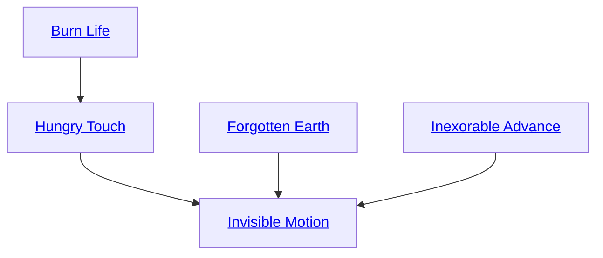

## Burn Life

Cost: 3 motes per dot
Duration: One scene
Type: Simple
Minimum Athletics: 2
Minimum Essence: 2
Prerequisite Charms: None

The character draws upon the long thread of his
own future destiny for power, sacrificing a few days
or weeks of lifespan to suffuse his physical form with
Essence. His player rolls Essence + Athletics. Each
success represents one point that the Exalt can add
to his Strength, Dexterity or Stamina until the end
of the scene; he cannot raise any of them by more
than his Essence. These improvements add normally
to his damage, running speed or soak. Each
increase costs 3 motes of Essence and three days of
lifespan. Successes not paid for are lost. Increases to
his Attributes are dice bonuses added by a Charm
and should be considered as such when determining
the maximum effect of other dice-bonus Charms.
Sidereal Exalted may always use their Conviction
with this Charm.

## Hungry Touch

Cost: 1 mote per target number reduction or damage point
Duration: Instant
Type: Supplemental
Minimum Athletics: 3
Minimum Essence: 2
Prerequisite Charms: Burn Life

With a single blow, the character consumes the
destiny of an object, bringing that destiny partway
toward or immediately to its final conclusion. When
attempting to destroy an object with a feat of
strength, the character can use this Charm to reduce
the target number of the Willpower roll to
boost her Strength + Athletics. If she succeeds at
destroying the object, she recovers the Willpower
point spent. Alternately, when attacking an object,
the character can buy up to her Essence in additional
points of damage at 1 mote each.

## Forgotten Earth

Cost: 1 mote
Duration: Instant
Type: Reflexive
Minimum Athletics: 2
Minimum Essence: 1
Prerequisite Charms: None

For a moment, the character cuts the connection
between herself and the ground, and her destiny lies in
the air. She triples her leaping distance for a single jump.

## Inexorable Advance

Cost: 1 mote
Duration: Five turns
Type: Simple
Minimum Athletics: 3
Minimum Essence: 2
Prerequisite Charms: None

Eliding the moments of her own life between
footsteps, or between the beginning of a gesture and its
end, the character acts without the need for motion.
She suffers no wound or armor penalties of any sort, nor
any penalties that reduce her running speed. When
characters first learn this Charm, their movements
involve flickering shifts in their position — as if others
saw them through a strobe light. With a few days'
practice, however, they can smooth out this effect,
moving with a fluid grace that appears to ignore normal
anatomical constraints.

## Invisible Motion

Cost: 10 motes, 1 Willpower, 1 health level
Duration: One day
Type: Simple
Minimum Athletics: 4
Minimum Essence: 3
Prerequisite Charms: Hungry Touch, Forgotten Earth, Inexorable Advance

This Charm uses a prayer strip marked with the
scripture of the Maiden and the Dust. The character
wraps it around his forehead or neck, whereupon it
exudes a soft scent of lilacs and decay. For the rest of the
day, the character receives the benefits of the Inexorable
Advance Charm every turn. This continuous simplification
of his movements also reduces the fatigue value of
his armor by two, to a minimum of zero. A fatigue value
of zero means that the character need never roll to see if
he becomes fatigued from wearing the armor. In addition,
the character can compress more action and more
complex action into the fractional seconds of his life he
skips over and reduces to instantaneousness. He doubles
his movement rate and receives a number of automatic
successes equal to his Athletics score to divide in any
fashion among his physical actions every turn. The
character can reserve some of these successes for reflexive
actions later in the turn, but successes not used by the
end of each turn are lost.
