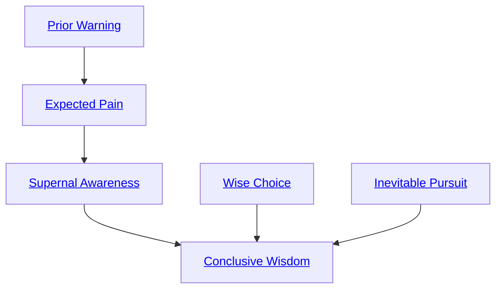

## Prior Warning

Cost: 6 motes
Duration: Five hours
Type: Simple
Minimum Awareness: 2
Minimum Essence: 1
Prerequisite Charms: None

Once a Sidereal commits Essence to this Charm, her
perceptions constantly probe into the immediate future
for anything that could do her harm. When the character
is in danger, her player makes a reflexive Wits +
Awareness roll. If she succeeds, the character has a
feeling of ill ease that informs her of impending danger.
The character gets a warning period of two minutes per
success rolled. This Charm only allows the Sidereal to
spot obvious harm: Slow-acting poison concealed in her
ale would not set off the alarm, as the effect is too far in
the future. However, it might be triggered just before the
effects kick in, giving the character time to deduce the
cause and seek a cure.

## Expected Pain

Cost: 3 motes
Duration: Instant
Type: Reflexive
Minimum Awareness: 3
Minimum Essence: 2
Prerequisite Charms: [[#Prior Warning]]

The character has a general idea of the bad things
that will happen to him in the course of his life. When
an unpleasant moment impends, this awareness crystallizes.
This Charm activates automatically when
something unexpectedly dangerous or awful is about to
happen, and the character learns its general nature
(&quot;attack,&quot; &quot;poison,&quot; &quot;betrayal,&quot; &quot;loss of loved one,&quot; &quot;hu-
miliation&quot;). The character has one turn's warning in
which to turn his fate aside. Ambushes against the
character automatically fail, but the character does not
automatically detect his attacker.

## Supernal Awareness

Cost: 4 motes
Duration: One scene
Type: Simple
Minimum Awareness: 3
Minimum Essence: 3
Prerequisite Charms: [[#Expected Pain]]

The character can see the web of fate around her as
it cascades into the unavoidable reality of the present.
With this Charm, she can focus enough attention upon
the influx of destiny to watch continuously, out to a
distance of (her Essence x 100) yards, for specific disturbances
in that web. She can either keep track of people
within that region, monitor spirits within that region or
watch for some specific phenomenon such as combat,
the use of Essence or the mention of her name. She senses
only vague details — specifically, she can identify the
location and power level of what she sees and recognize
specific effects or people she is familiar with, but she
cannot follow the course of events. For example, when
monitoring Essence use, she might recognize the invocation
of the Expected Pain Charm, which she knows well.
Unless she has seen it often, however, the Ten Ox
Meditation (see Exalted, p. 196) would register only as
an Essence 3 Charm. In neither case would she know the
specific effects of the Charm, such as what object a Solar
used Ten Ox Meditation to destroy. The effects of this
Charm are cumulative: If a Sidereal uses it five times in
a scene, she can monitor five different things.
Supernal Awareness does not rely on any of the
character's senses. Normal Stealth and Charms that
make the character physically invisible or silent have
no effect.

## Wise Choice

Cost: 6 motes
Duration: Instant
Type: Simple
Minimum Awareness: 2
Minimum Essence: 1
Prerequisite Charms: None

Life is full of choices. This Charm gives a Sidereal
the edge on mere mortals by allowing him to make the
best choice when confronted with many options. However,
this Charm allows only a brief peek into the future,
not an extended glimpse into all the consequences of the
decision. The ideal short-term outcome is guaranteed,
but long-term gains are not.

## Inevitable Pursuit

Cost: 8 motes, 1 Willpower
Duration: One day
Type: Simple
Minimum Awareness: 5
Minimum Essence: 2
Prerequisite Charms: None

No one can hide from their past. It unwinds inevitably,
event cascading into event, rolling from the then
into the now and finally into an inescapable collection
of destinies. Characters with this Charm can track others
not by the physical marks they leave on the world, but by
the impressions their passage leaves on the destinies of
everything around them. In a relatively uninhabited
region, the character can follow a trail as old as one day
per point of her permanent Essence. In a more populous
region, where many people leave their marks on fate -
and, more importantly, where those marks interact with
one another in a progressively unruly and chaotic fash-
ion — this Charm is less effective. In such places, the
character is limited to following trails no older than one
hour per point of her permanent Essence.
This ability can be foiled by use of the Traceless
Passage Charm (see Exalted, p. 182) and similar Charms.
If the target uses such a Charm, resolve the matter with
a standard opposed tracking contest.

## Conclusive Wisdom

Cost: 20 motes, 1 Willpower, 1 health level
Duration: Instant
Type: Simple
Minimum Awareness: 5
Minimum Essence: 4
Prerequisite Charms: [[#Supernal Awareness]], [[#Wise Choice]], [[#Inevitable Pursuit]]

This Charm uses a prayer strip marked with the
scripture of the Maiden and the Scythe. The character
holds it up before her target. It fixes itself in the air
and begins to blossom with pungent violet flowers,
whose petals dry, fall off and turn to dust in the course
of seconds, each replaced as it dies with another
flower's blooming.
The target of this Charm finds himself caught in a
vision of his own ending: transported to a likely end for
his life, a few hours, minutes or turns before its conclusion
comes. Roll his permanent Willpower against a
difficulty of 3. Success indicates that the Charm fazes
him but has no other effect. Failure indicates that he
returns from the vision deeply shaken. Reduce his temporary
Willpower to 1. His Personal Essence pool is
instantly lost; reduce his temporary Essence by the amount
of his Personal Essence, to a minimum of 0. He cannot
recover Willpower or personal Essence for the remainder
of the scene.
If the victim is a Storyteller character, the rules
above suffice. Otherwise, the Storyteller should play
the vision out. This occurs at a convenient time:
immediately, as the next scene, or at the end of the
session, depending on the play group's style. The Sto-
ryteller devises an interesting and ideally appropriate
scenario for the target's most likely ending. As events
progress, the target can alter the scenario in one small
way for each point of permanent Essence he possesses.
Motes, Willpower, experience points and health levels
spent or recovered in the vision do not affect the
character's actual totals.
If, through interesting roleplay, luck or martial
cleverness, the target manages to survive his impending
doom, he suffers no permanent ill effects. Further, when
he finishes processing the vision, a few scenes later, he
generally recovers his full temporary Willpower.
If the target dies in the vision but his player made his
permanent Willpower roll, above, the character suffers
no permanent ill effects save disquiet.
If the target dies in the vision and failed his permanent
Willpower roll, his player must roll the character's
permanent Essence and permanent Willpower. (He cannot
spend Willpower on these rolls.) Failure on either
roll means losing one dot of the appropriate Trait, to a
minimum of 1. No matter what he rolls, he cannot
recover his Personal Essence for the remainder of the
story. He only has access to Peripheral Essence.
This Charm has no effect on Abyssal Exalted or the
dead. It specifically affects Second and Third Circle
demons, despite their normal immunity to Willpower
loss from Sidereal Charms.
