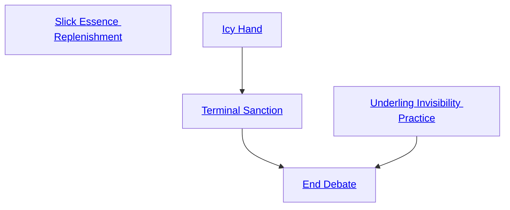

## Slick Essence Replenishment

Cost: None
Duration: Permanent
Type: Special
Minimum Bureaucracy: 1
Minimum Essence: 2
Prerequisite Charms: None

In demonstrating her superiority to the frantic masses
that mill about her, a calm and settled soul becomes a
natural sinkhole for the Essence of the world. This
Charm draws on a Sidereal's ability to keep perspective
and maintain her tranquility in the most troubled circumstances,
easily juggling a hundred projects and a
thousand data points, controlling herself always and
controlling others when necessary. Immediately after a
successful roll using Temperance or immediately after a
Bureaucracy roll that substantially helped her implement
her agenda, the Exalt regains twice her Temperance
in motes of Essence, up to her normal maximum. There
is no cost to use this Charm's effects - learning this
Charm simply enhances the Exalt's capabilities.

## Icy Hand

Cost: 1 mote
Duration: Five days
Type: Reflexive
Minimum Bureaucracy: 2
Minimum Essence: 2
Prerequisite Charms: None

The character's cold clean touch instantly drives
away bureaucratic corruption. She can invoke this Charm
immediately after touching a target bureaucrat, which,
for unwilling targets, requires an unarmed attack (which
need do no damage). The Sidereal's player rolls Charisma
+ Bureaucracy against the target's Essence. If
successful, the target is compelled to perform his duties
honestly for the duration of the Charm.
A spark in the character's pupil glitters violet during
the use of this Charm.

## Terminal Sanction

Cost: 8 motes, 1 Willpower
Duration: One scene
Type: Simple
Minimum Bureaucracy: 4
Minimum Essence: 3
Prerequisite Charms: [[#Icy Hand]]

Sometimes, all it takes to kill a god is a word in the
right ear. To invoke this Charm, the Exalt's player
rolls Charisma + Bureaucracy against a difficulty equal
to the target's Essence. Normally, this files a petition
in the Bureau of Endings, activating certain perquisites
of the Chosen of Fate that facilitate quick,
effective resolution of a conflict with a spirit or elemental.
However, due to the terms of the Primordials'
surrender, this Charm specifically affects demons of
all Circles and adds the Sidereal's Essence in auto-
matic successes against them.
The effects of the Charm are as follows. Whether
the character succeeds or fails, the spirit must instantly
manifest and materialize to meet the Sidereal's calm
gaze. It cannot dematerialize until the end of the scene.
If the character succeeds, the spirit becomes additionally
vulnerable. If its materialized body dies that scene, the
Sidereal can either destroy it utterly, bind it into an
object, coerce it into service for an indefinite task or
command its obedience for a year and a day. This can
offer a Sidereal a second opportunity to bind a demon
that breaks free of her control.
Sidereal Exalted may always use their Temperance
with this Charm. Learning this Charm requires the
Maiden of Endings' approval.

## Underling Invisibility Practice

Cost: 4 motes
Duration: Indefinite
Type: Simple
Minimum Bureaucracy: 3
Minimum Essence: 2
Prerequisite Charms: None

By the will of the Maiden of Endings, who marks the
end to every destiny, those who consider themselves
above the process of fate shall find themselves most
vulnerable to it.
With this Charm, the character conceals his presence
effectively from those who foolishly consider
themselves his superiors. Anyone who knows of the
Sidereal Exalted and looks down upon them, or who
considers himself superior to all others, simply cannot
detect the Sidereal. This invisibility also applies to those
who consider themselves more important than or hierarchically
superior to the character himself.
The character registers on such entities' senses as a
brief impression related to his caste. Chosen of Journeys
&quot;feel&quot; like there is somewhere the subject needs to be.
Chosen of Serenity exude a faint sense of peace and
happiness. Chosen of Battles provide a sense of intangible
tension to the air. Chosen of Secrets provoke a
strange sense of déjà vu. And the Chosen of Endings
radiate a vague air of danger.
The arrogant cannot use the help of others to spot
the Sidereal. Reports on the character's presence no
more register than the character's direct visual impres-
sion. However, victims can derive other information
from such reports, such as &quot;something bad is happening
and is preventing me from hearing exactly what my
friends are saying.&quot; They can even target the Sidereal
based on this kind of information and the faint impres-
sion mentioned above. However, their dice pool for
attacking or defending against the Sidereal starts at 0,
before the effects of Charms. A perfect counter to invis-
ibility (such as Eye of the Unconquered Sun — see Caste
Book: Night, p. 75) overcomes this effect. This Charm
conceals the last few seconds of a Sidereal's tracks.
This Charm has no effect on other Sidereal Exalted
Otherwise, the Storyteller always decides whether a
Storyteller character falls victim to this Charm, and
players of non-Sidereals can explicitly decide their char-
acters' opinions on the Sidereal Exalted and specific
Exalts. Learning this Charm requires the Maiden of
Endings' approval.

## End Debate

Cost: 10 motes, 1 Willpower, 1 health level
Duration: Instant
Type: Simple
Minimum Bureaucracy: 5
Minimum Essence: 3
Prerequisite Charms: [[#Terminal Sanction]], [[#Underling Invisibility Practice]]

This Charm uses a prayer strip marked with the
scripture of the Maiden's Promise, which explodes in
searing amethyst light as the character throws it to the
ground. As the light fades, passion and the desire for
speech drains from all those who witnessed the Charm.
Everything has already been said.
If the character wishes, this Charm can instantly
end a debate - leading into an immediate vote or to
everyone dropping the matter, as circumstances dictate.
Alternately, as long as one or more key individuals
are present, End Debate can stop any bureaucratic pro-
cess cold. Only an Intelligence + Bureaucracy roll with
a difficulty equal to twice the character's permanent
Essence can restart it.
Finally, if the Sidereal's player successfully rolls
Strength + Bureaucracy against the target's Essence, this
Charm can impose the effects of ley Hand on a single
bureaucrat permanently — only by resigning his position
(and, if desired, seeking another) can he reestablish a
career of corruption.
Sidereal Exalted may always use their Temperance
with this Charm.
