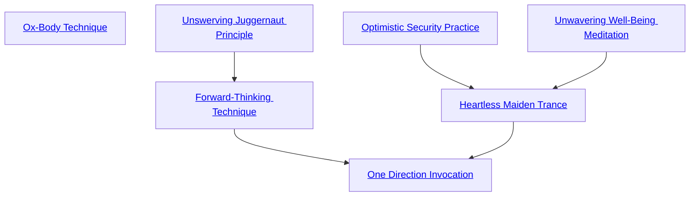

## Ox-Body Technique

Cost: None
Duration: Permanent
Type: Special
Minimum Endurance: Varies
Minimum Essence: 1
Prerequisite Charms: None
The bodies of the Exalted are more durable than
those of mere mortals. To help simulate this, an Exalt
may buy extra health levels as if they were a Charm. A
player may purchase this Charm up to once per dot of the
Endurance Ability her character possesses. Each provides
one -0 health level.

## Unswerving Juggernaut Principle

Cost: 5 motes
Duration: Indefinite
Type: Simple
Minimum Endurance: 2
Minimum Essence: 2
Prerequisite Charms: None

The stars bathe the character in yellow stardust. It
suffuses her, glittering beneath her skin, hair, clothing
and eyes. She begins to run. She must keep her eyes
focused straight forward, keep her course within 10
degrees of its original heading and can take no other
actions save walk, sprint, run, jump, ride, use a mobility-enhancing
Charm or invoke the Lesser Sign of Mercury.
Violating these strictures ends the Charm's effects. In
exchange, for the duration of the Charm, the character
receives an additional 5L/5B soak, needs no sleep, suffers
no fatigue and adds her Essence to all Endurance rolls.
Fatigue rolls do not need to be made for her wearing
armor, regardless of environmental conditions. These
benefits also apply to any horse she rides.
The character's journey is a thing of fate and not
chance, interwoven with her reasons for traveling. If
something renders her journey irrelevant or alters its
appropriate destination, her player automatically makes
a reflexive Perception + Awareness check for the Sidereal.
Even on failure, she senses a change in the situation.
Success gives her a hint of what it might be. Exalted who
invoke this Charm while fleeing pursuit often know
when it is safe to stop their flight.

## Forward-Thinking Technique

Cost: 10 motes, 1 Willpower
Duration: Indefinite
Type: Simple
Minimum Endurance: 3
Minimum Essence: 3
Prerequisite Charms: Unswerving Juggernaut Principle

The character's world narrows to his journey. The
strands of fate that bind him to things behind him
loosen. This Charm includes all of the benefits of the
Unswerving Juggernaut Principle. In addition, it grants
an increased (10L/10B) soak bonus against attacks the
character cannot see coming. He can dodge any attack
reflexively with a dice pool of 0 and his permanent
Essence in automatic successes. He can evade pursuit
and cover his tracks without slowing down, deviating
from his course or ending the Charm. This requires the
normal Wits + Survival roll. This Charm does not defeat
supernatural tracking such as Inevitable Pursuit. It ex-
plicitly prevents trackers from noticing the straight-line
travel the Forward-Thinking Technique enforces unless
they succeed at the tracking contest.

## Optimistic Security Practice

Cost: 5 motes
Duration: One scene
Type: Simple
Minimum Endurance: 2
Minimum Essence: 1
Prerequisite Charms: None
Reflecting on the great sacrifices she might someday
make for others, the character passes her hand over the
weave of fate and imbues events with her own generosity
of spirit. Weapons and other damage sources turn aside
from her skin. She adds her permanent Essence to her
lethal and bashing soak. This soak specifically applies
even to aggravated damage sources. Creatures with Essence
lower than her Compassion must spend one
Willpower point each time they attempt to damage or
disable her, or the attack automatically fails. This Charm
is incompatible with the use of armor.

## Unwavering Well-Being Meditation

Cost: 2 motes
Duration: Instant
Type: Reflexive
Minimum Endurance: 3
Minimum Essence: 2
Prerequisite Charms: None

The character's calm certainty in his own destiny
turns aside a single event that might otherwise do him
harm. Players of attackers with an Essence lower than the
Sidereal's Temperance must succeed at a Willpower roll,
or the attackers falter, and their attacks automatically
fail. Even if they succeed, the character adds his permanent
Essence to his lethal and bashing soak. This soak
specifically applies even to aggravated damage sources.

## Heartless Maiden Trance

Cost: 8 motes, 1 Willpower
Duration: Indefinite
Type: Simple
Minimum Endurance: 4
Minimum Essence: 2
Prerequisite Charms: Optimistic Security Practice, Unwavering Well-Being Meditation

The character's chest convulses as she swallows her
heart. This suspends the normal functioning of her body.
The Exalt no longer suffers nor accumulates penalties
from disease, poison, degenerative effects, hunger, thirst,
fatigue, exhaustion, cold, heat, wounds or blood loss. She
does not need to breathe. She emerges from this Charm
in the exact physical state she entered it, save for any new
wounds taken and any poisons or diseases she contracted
while under the effect - which, effectively, enter her
system at that point. While this Charm lasts, the Exalt
ignores all accrued penalties from debilitating conditions
and wounds and is unaware of their existence. Sufficient
injury yields a nagging tactical distress that encourages
her to withdraw from combat, but she otherwise cannot
accept the notion that she is sick, poisoned, hungry, cold,
wounded or otherwise impaired. She does not regain
Essence except through the use of Charms. She functions
normally when Incapacitated and cannot be knocked
unconscious, but she can be killed by doing more than her
Stamina health levels beyond Incapacitated.

## One Direction Invocation

Cost: 16 motes, 1 Willpower, 1 health level
Duration: Indefinite
Type: Simple
Minimum Endurance: 5
Minimum Essence: 4
Prerequisite Charms: Forward-Thinking Technique, Heartless Maiden Trance

This Charm uses a prayer strip marked with the scripture
of the Eternal Maiden. The character releases it into
the air, where it darts and dances randomly about, staying
within 100 yards of him, trailing vivid afterimages of yellow
light. The character names a goal, which can be as grandiose
or minor as he chooses, and geases himself to fulfill it.
A character under the influence of this Charm
forsakes his name and his identity. Rolls to remember the
character suffer a -3 die penalty (in addition to the
normal penalty for remembering a Sidereal). The Exalt
cannot focus on any goal save the one he named in the
Charm. Irrelevant actions are forbidden. He suffers a
three die penalty on all rolls that — while helping him
toward his goal - have another primary purpose. How-
ever, any non-aggravated injury or impairment the
character receives while the Charm is active heals at the
rate of one lethal health level or all bashing health levels
per turn. Aggravated damage taken under the Charm's
effects heals at one level per hour. The character heals
preexisting conditions at the normal rate.
The character can end the Charm at any time but
cannot reclaim his name and identity until he achieves his
goal. If his goal becomes impossible to achieve, these things
are forever lost. He cannot personally establish a new
identity or name, and all attempts to do so fail, but high-
ranking members of his division can issue replacements.
