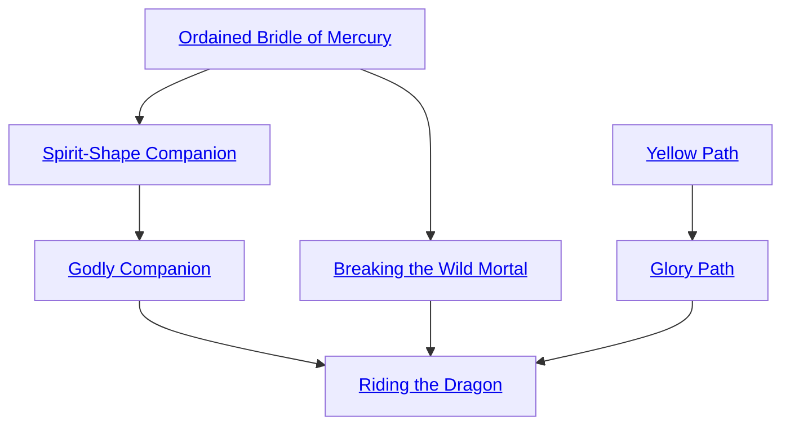

## Ordained Bridle of Mercury

Cost: 10 motes, 1 Willpower, 1 experience point
Duration: Until the character applies Mercury's bridle
Type: Simple
Minimum Ride: 2
Minimum Essence: 2
Prerequisite Charms: None

The character petitions Mercury to weave a mount
into her destiny. Each time she invokes this Charm, she
gains a dot of the Familiar Background, normally with a
creature she can ride. She can use this Charm to instantly
increase her bond with an existing familiar.
Alternately, she can invoke Mercury's guidance in finding
a new, &quot;suitable&quot; familiar. Her player specifies the
species. The character must travel to find the familiar
but always knows the way. The destined familiar always
allows the character to approach and set a bridle of
stardust upon its head. The bridle fades, but the Background
dot remains. If the character cannot afford to
establish a complete bond, Mercury can lead her to that
animal again with another invocation of the Charm.
It costs an extra experience point to summon forth
the bridle of Mercury and apply it to an animal of the
character's choosing rather than the Maiden's. Similarly,
the first dot of the Familiar Background costs an extra
experience point for animals unsuitable for riding - such
as a hawk. Note that controlling a familiar mount requires
a Ride roll in only the most extreme circumstances.
Sidereal Exalted can purchase a total number of
familiars and acquaintances no greater than their permanent
Essence, unmodified by Charms such as the
Soul Fire Shaper Form (see p. 193).

## Spirit-Shape Companion

Cost: 10 motes, 1 Willpower, 1 experience point
Duration: Instant
Type: Simple
Minimum Ride: 3
Minimum Essence: 3
Prerequisite Charms: Ordained Bridle of Mercury

Drawing on her understanding of the spirit world,
the character forces a metamorphosis upon one of her
familiars. The creature adopts some of the characteristics
of a spirit, as follows:
• Its Essence, Valor, and Intelligence increase to
a minimum of 2.
• It acquires an Essence pool of (Essence x 10) +
(Willpower x 3) + (Sum of Virtues x 2) — typically 51.
• The familiar's health levels become equal to its
Willpower + Conviction — typically 8.
• The familiar's natural state is dematerialized. For
a mote of Essence, it can manifest visually.
• It learns the Materialize Charm, which costs half
its motes to use. It learns one additional spirit Charm
of the Storyteller's choice if the Familiar Background is
3 or more and another if it is 5,
• The familiar develops an alternate shape, roughly
human but still deeply reminiscent in appearance of
the familiar's true nature.
• The familiar ceases to depend upon ordinary
nourishment.
• Yu-Shan registers the familiar as a small god. Its
primary duty is service to the character. However, it
may be called or reassigned to other duty.
The numbers above assume that a typical beast
familiar has Essence 2, Willpower 5, Compassion 2,
Conviction 3, Temperance 1 and Valor 2 after the use
of this Charm. Most non-familiar beasts have lower
Essence, Willpower and Compassion.

## Godly Companion

Cost: 20 motes, 1 Willpower, 5 experience points
Duration: Instant
Type: Simple
Minimum Ride: 4
Minimum Essence: 4
Prerequisite Charms: Spirit-Shape Companion

The character arranges a promotion for his
familiar. Its Essence and Intelligence increase to
a minimum of 3. It develops additional Virtues,
if necessary, to bring the sum of its Virtues to 12
or more. It learns two additional spirit Charms of
the Storyteller's choice and one additional shape.
It also acquires certain specific responsibilities:
• The familiar is responsible for safely escorting the
character to Yu-Shan and back when necessary and for
the character's behavior while in Yu-Shan. As an Essence
3 spirit, it possesses the innate ability to carry itself
and others between Yu-Shan and Creation.
• The familiar is responsible for delivering any
messages Heaven has for the character and must be
regularly available in Yu-Shan to collect them.
• The familiar must file regular reports on the
character's activities. Although these reports pass
through the Bureau of Destiny mailroom and are vulner-
able to interception, they are rarely read - all are
ultimately forwarded to the august weaver Caturasya,
who eats them.
• The familiar may receive additional miscellaneous
duties in Yu-Shan.

## Breaking the Wild Mortal

Cost: 10 motes, 1 Willpower, 1 experience point
Duration: Until the character applies Mercury's bit
Type: Simple
Minimum Ride: 2
Minimum Essence: 2
Prerequisite Charms: Ordained Bridle of Mercury

The character petitions Mercury to weave a mortal
companion into her destiny. Each time she invokes
this Charm, she gains a dot of the Acquaintances
Background, bonding first with a single mortal and
then with those around him. She can use this Charm
to instantly increase her connection with a specific
acquaintance and his social context. Alternately, she
can invoke Mercury's guidance in finding a new,
&quot;suitable&quot; acquaintance. Her player specifies the general
occupation and personality. The character must
travel to find the acquaintance but always knows the
way. The destined acquaintance always allows the
character to approach and set a bit made of stardust in
his mouth. Once it sinks in, the mortal loses the
memory of that embarrassing moment, but the Background
dot remains.
It costs an extra experience point to summon forth
the bit of stardust and apply it to a person of the
character's choosing rather than the Maiden's. Similarly,
the first dot of the Acquaintances Background
costs an extra experience point for people unsuitable for
riding — such as humans. (Some Wyld barbarians might
make acceptable mounts.)
Sidereal Exalted can purchase a total number of
familiars and acquaintances no greater than their permanent
Essence, unmodified by Charms such as the Soul
Fire Shaper Form (see p. 193).

## Yellow Path

Cost: 2 motes
Duration: One journey
Type: Simple
Minimum Ride: 3
Minimum Essence: 2
Prerequisite Charms: None

The character sees the glimmering yellow light of
Mercury illumine the shortest path to his destination.
This path is not necessarily safe, but the character can
expect to overcome any obstacles thereupon. This Charm
takes delays from such things as off-road travel, the need
for food and rest and injuries from dangerous encounters
into account. Roll the character's Essence. One success
indicates a substantial improvement in his speed over
ordinary travel. If the character has a deadline and any
chance exists of making it on time, three successes
indicate his timely arrival. Five or more successes allow
him to make any appointment not already missed.

## Glory Path

Cost: 8 motes
Duration: Five minutes
Type: Simple
Minimum Ride: 3
Minimum Essence: 2
Prerequisite Charms: Yellow Path

A nimbus of Mercury's light wraps around the
character's mount, and it develops the ability to overcome
any obstacle to complete its journey. The player makes a
Charisma + Ride roll. Each success adds five yards to the
mount's base speed. In addition, the mount is undaunted by
natural obstacles of any sort: for as many turns as necessary,
it can gallop in the air across chasms, straight up a cliff face,
across water or a swamp and weave through crowds of
panicked yeddim. Only barriers built by people - such as
walls of stone or sorcery - pose any obstacle. Sidereal
Exalted may always use their Temperance with this Charm.

## Riding the Dragon

Cost: 20 motes, 1 Willpower, 1 health level
Duration: One scene
Type: Simple
Minimum Ride: 5
Minimum Essence: 4
Prerequisite Charms: Godly Companion, Breaking the Wild Mortal, Glory Path

This Charm uses a prayer strip inscribed with the
scripture of the Desirable Maiden. The character affixes it to
the forehead of a familiar or an acquaintance, either long-established
or acquired through Charms. An indescribable
sense of shock, horror and elation immediately fills the
victim, who struggles for the next five turns to rip the strip
free. Unless the victim is restrained, this requires no roll.
At the end of those five turns, the familiar or
acquaintance undergoes a transformation, burning with
a terrible golden celestial light. Its form twists and
reshapes into a lesser elemental dragon. This Charm
exerts a great toll on the victim's body and soul, and
when the Charm runs its course, nothing but a burned-out
husk remains — a person or animal able to accept
food and mumble incoherently, but nothing more. That
Familiar or Acquaintances Background is permanently
lost, but at that moment, the character can choose either
an air or a water dragon as her mount for a scene.
The transformed dragon, its back writhing with the
symbols of the scripture, has no will of its own. The
Sidereal must ride it and direct its actions with her own.
The dragon flies at 500 mph, with effectively unlimited
tactical movement. It has a Dodge pool of 10 and a soak of
20 against all attacks. It attacks with 15 Speed, Accuracy
and Defense for 19 lethal damage. For each successful
Charisma + Ride roll the Sidereal's player makes in a given
turn, the mount takes one action at its full dice pool. Note
that the Sidereal must split her pool to make multiple Ride
rolls. The dragon has 10 health levels, all at -O. It can use
any spirit Charm or elemental power, with the exception
of extra action Charms or those that grant permanent
bonuses or penalties. The Sidereal pays for these Charms or
powers with her own motes, Willpower and health levels.
Sidereal Exalted may always use their Conviction
with this Charm.
