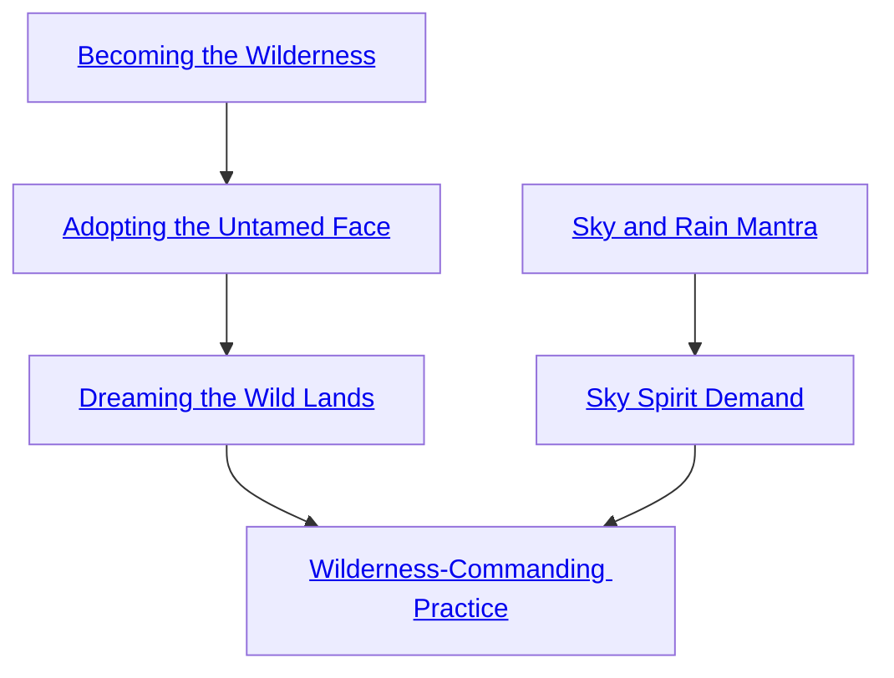

## Becoming the Wilderness

Cost: 1 mote per target number reduction
Duration: One day
Type: Simple
Minimum Survival: 2
Minimum Essence: 2
Prerequisite Charms: None

The character calls forth and spreads cat's cradle
between her hands as a representation of the weave of
fate for the entire local wilderness. She sets her will on
it, remaking the land into a mirror of her soul. For the
duration of this Charm, tree branches shelter her from
the rain, food animals wander into her camp, the winds
blow lightly near her, and she rarely encounters danger.
This Charm reduces the target number of Survival or
Awareness checks in the wilderness. Sidereal Exalted
may always use their Valor with this Charm.

## Adopting the Untamed Face

Cost: 4 motes
Duration: One scene
Type: Simple
Minimum Survival: 2
Minimum Essence: 2
Prerequisite Charms: Becoming the Wilderness

In turn, the character can make his soul mirror the land,
imposing the pattern of its fate upon the flows of his Essence.
His player receives automatic successes equal to the Sidereal's
Essence in any roll against a natural beast. While this Charm
is active, add the Sidereal's Essence in extra dice when
dealing socially with Lunar Exalted. Sidereal Exalted may
always use their Compassion with this Charm.

## Dreaming the Wild Lands

Cost: 5 motes, 2 Willpower
Duration: Five days
Type: Simple
Minimum Survival: 4
Minimum Essence: 3
Prerequisite Charms: Adopting the Untamed Face

As she mirrors herself to the land, the character
bends the wild directly to her will. Under the pressure of
her intention, trees shift their places and river dragons
cease to hunger. She can make cosmetic changes to the
scenery in uncivilized regions and dictate the behavior of
any wild beast she can see. She receives all the benefits
of Adopting the Untamed Face. Unless they know
better, Lunar Exalted perceive her as an eminent mem-
ber of their own kind — that is, ikth-ya, as described on
page 112 of Exalted: the Lunars. Sidereal characters
with Essence 5 or more appear as murr-ya.
Lunars do not imagine a Tell or Caste Mark or other
such indicators. The Sidereal Exalted simply carries
herself like an ikth-ya and, therefore, must be a Lunar.
Even if a Lunar knows better, the impression is difficult
to shake. Mistreating the character is mechanically easy
but emotionally difficult. Sidereal Exalted may always
use their Valor with this Charm.

## Sky and Rain Mantra

Cost: 10 motes
Duration: One day
Type: Simple
Minimum Survival: 3
Minimum Essence: 2
Prerequisite Charms: None

The character extends her influence into the sky,
adjusting the region's weather. Her player rolls Stamina +
Survival. The number of successes determines how harsh
the Exalt makes the weather. Specifically, other characters'
players need at least that many successes on a Survival
roll for their characters to survive the new conditions
without hardship. The Sidereal can voluntarily reduce
this difficulty when creating the storm. If the Exalt wishes
to calm the weather, she needs only one success.
Generally, this Charm takes effect within either
minutes or hours, depending on the magnitude
of the effects.

## Sky Spirit Demand

Cost: 5 motes, 1 Willpower
Duration: Instant
Type: Simple
Minimum Survival: 4
Minimum Essence: 2
Prerequisite Charms: Sky and Rain Mantra

The character strives to mirror the fate of an air
spirit or elemental to the flows of her own Essence, and
vice versa. Her player rolls Manipulation + Survival
against a difficulty equal to the spirit's Essence. If she
succeeds, the Exalt imposes one of her goals upon the
spirit. It appreciates the importance of that goal to the
same degree and in the same fashion the Sidereal does.
It can choose between that goal and its other beliefs
when and if they clash dramatically. Using this Charm in
a civilized region or against a civilized spirit adds +2 to
the difficulty. It can be adapted for use against spirits and
elementals of other elements, but this also adds +2
difficulty. Sidereal Exalted may always use their Compassion
with this Charm.

## Wilderness-Commanding Practice

Cost: 10 motes, 1 Willpower
Duration: Five days
Type: Simple
Minimum Survival: 5
Minimum Essence: 4
Prerequisite Charms: Dreaming the Wild Lands, Sky Spirit Demand

This Charm uses a prayer strip marked with the
scripture of the Maiden Entombed. The character casts
it into the air, where it dances in the wind, casting off
shapeless golden phantasms.
This Charm co-opts a wild region and turns it
against the Exalt's enemies. So long as the character
remains within sight of the prayer strip, he notices
anyone of interest within his Essence in miles, even
those who are not able to be tracked by non-supernatural
trackers. He can give anyone three automatic successes
on all Survival rolls made within the region or reduce
anyone's Survival pool to 0 before they benefit from
Charms. Each effect requires a further commitment of 2
motes per person so affected.
The Sidereal can also convey the location of someone
or something to a local beast or spirit. The Charm's
target sees the indicated person or thing as a hated
enemy. This requires 5 motes and a successful Manipulation
+ Survival roll against the beast or spirit's Essence.
The 5 motes are not committed. Intelligent victims can
change their minds if given reason to rethink the
situation. Sidereal Exalted may always use their Valor
with this Charm.
