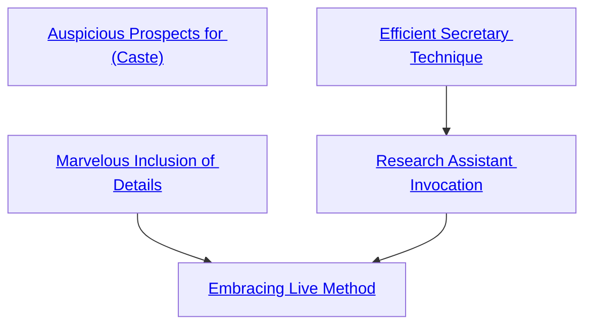

## Auspicious Prospects for (Caste)

Cost: 1 mote
Duration: Instant
Type: Simple
Minimum Investigation: 2
Minimum Essence: 1
Prerequisite Charms: None

The Maidens grant many of their Chosen this gift,
that keeps them clear-eyed and ever-alert for the patterns
in the stars that inform them of the needs of destiny. This
is actually five Charms, one for each Maiden.
Auspicious Prospects for Journeys helps the character
know when someone really ought to travel and,
possibly, where. Auspicious Prospects for Serenity helps
a character locate appropriate love matches or determine
whom fate wishes to have joy. Auspicious Prospects
for Battles hints at when and where and among whom a
battle or war ought to take place. Auspicious Prospects
for Fate — the Maiden of Secrets' Charm - gives
insights into the proper overall direction of the world
and the character's own life. Auspicious Prospects for
Endings suggests when something might best pass from
Creation. These Charms provide appropriate knowledge
when the Storyteller so chooses.
This knowledge almost never gives a direct benefit
to the character. More often, it provides her with goals
to strive for! So, she must satisfy herself with the joy of
service — and the ability to investigate the claims of
other Sidereal Exalted, with a mote of Essence and a
successful Intelligence + Investigation roll, when they
assert that some fate or other is favorable or necessary.
Any Sidereal can purchase any of these Charms. All
five are favored for the Chosen of Secrets. The other
Sidereal Exalted favor only their own caste's Charm.

## Marvelous Inclusion of Details

Cost: 1 mote per success
Duration: Instant
Type: Supplemental
Minimum Investigation: 1
Minimum Essence: 1
Prerequisite Charms: None

When a character learns this Charm, she weaves a
thread of aquamarine mystery into her eyes. From that
moment forward, she and the essence of fate that makes
for secrets are kin. The things of mystery and enigma
wear a faint, joyous glamour in her eyes. Conversely,
secrets go out of their way to provide the kinds of
evidence the character likes best. This Charm adds up to
the character's Essence in automatic successes to an
Investigation roll. If possible, the character chooses
what kind of evidence she finds - a murder weapon, a
book shelved right next to her, notes stuffed in such a
book, footprints or something of that ilk. Whatever she
finds, she finds instantly. Sidereal Exalted may always
use their Compassion with this Charm.

## Efficient Secretary Technique

Cost: 2 motes
Duration: One turn
Type: Simple
Minimum Investigation: 1
Minimum Essence: 2
Prerequisite Charms: None

On learning this Charm, the character spits out a
jubilant construct of Essence in the shape of an small
unmanifested emerald pattern spider. When so instructed
by the invocation of this Charm, it races off along the
weave of fate to locate some fact for the character — any
available information neither generally lost nor actively
concealed. Examples are the name of the local god-king
or carpenter, how many years ago widow Esther lost her
husband, the status of a given war, the number of oxen
an old friend now owns, the temperature in Nexus and so
forth. One turn later, it returns, whispering the information
into the character's ear. The spirit is indestructible
while the Exalt lives.

## Research Assistant Invocation

Cost: 5 motes
Duration: Five days
Type: Simple
Minimum Investigation: 2
Minimum Essence: 2
Prerequisite Charms: [[#Efficient Secretary Technique]]

Clapping his hands, the Sidereal causes a small
plant to grow into the shape of a dedicated scholar and
observer. This creature has the statistics and appearance
of a typical mortal (see Exalted, pp. 276-277) except that
it has an Intelligence 3, Awareness 3, Investigation 4,
Lore 2 and Linguistics and languages equal to the
character's own. It happily assists with research and
investigation in any desired fashion, carrying books and
research materials, noting details the character might
miss, digging for truths in a large library and so forth.
Under excessive stress, such as combat, it panics and
reverts to the form of a plant; it can be coaxed back into
human shape with a reapplication of this Charm.

## Embracing Live Method

Cost: 10 motes, 1 Willpower, 1 health level
Duration: Five days
Type: Simple
Minimum Investigation: 4
Minimum Essence: 3
Prerequisite Charms: [[#Marvelous Inclusion of Details]], [[#Research Assistant Invocation]]

This Charm uses a prayer strip marked with the
scripture of That Old Thing. The Sidereal forms a
question or curiosity in her mind and plants the strip as
if it were a seed. Over the course of the next day, it first
develops roots and then sprouts into a tall mulberry tree.
Local spirits of wood are drawn to visit it. They leave
small gifts or secrets behind there. Five days later, the
Sidereal can return. Her player rolls Charisma + Investigation.
For each success, the Exalt finds both a piece of
information useful in resolving her curiosity and a gift
she will value beneath the tree. There are also various
worthless offerings.
Returning earlier for faster answers is possible but
may provoke the wrath of one or two wood spirits. The
valuable gifts are generally trinkets that suit the character's
tastes, but the Storyteller may include unique or important
gifts for story reasons. Sidereal Exalted may always
use their Compassion with this Charm.
