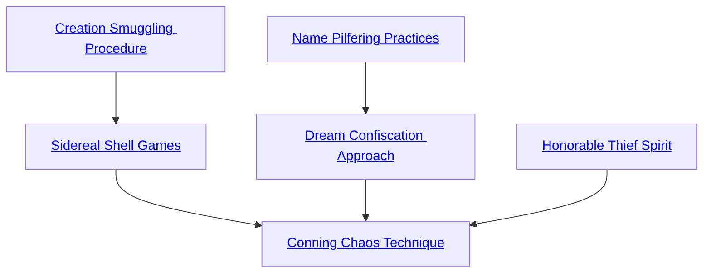

## Creation Smuggling Procedure

Cost: 5 motes, 1 Willpower
Duration: One day
Type: Simple
Minimum Larceny: 2
Minimum Essence: 1
Prerequisite Charms: None

The character calls the weave of events to her. Thin
tendrils of fate snake out from Creation to twine around
each of her fingers, fading into phosphorescent green
visibility for the final meter of their journey. If the
character is in or ventures into the Wyld, she becomes a
small island of stability and Creation, her destiny snuck
into the abode of chance by craft, art and cunning.
Neither the character nor anything within 10 yards of
her suffers the touch of the Wyld.

## Sidereal Shell Games

Cost: 1 mote + 2 motes per die or level successfully stolen, 1 Willpower
Duration: One scene
Type: Simple
Minimum Larceny: 3
Minimum Essence: 1
Prerequisite Charms: [[#Creation Smuggling Procedure]]

Again, the character summons the weave of events,
but now, she crosses her wrists and deftly switches
threads from one hand to the other as they materialize.
If her player succeeds at a Wits + Larceny roll, the Exalt
steals a portion of her target's destiny and can borrow up
to her Essence in bashing and lethal soak, in damage dice
or in dice from a specific pool (such as Dexterity +
Melee). The target loses the use of that soak or those dice
for the remainder of the scene. The character gains it.
The Sidereal cannot borrow more soak or more dice than
the target possesses. This Charm is partially cumulative:
The Sidereal can filch many different things in one scene
but cannot add to the same pool or soak twice. When a
Sidereal borrows dice for a pool, this is a dice bonus
added by a Charm and should be considered as such
when determining the maximum effect of other dice-
bonus Charms.

## Name Pilfering Practices

Cost: 5 motes
Duration: Indefinite
Type: Simple
Minimum Larceny: 3
Minimum Essence: 2
Prerequisite Charms: None

With a twist and a tug, the Sidereal steals another
being's name. The Sidereal learns the victim's true
name, and for the duration of the Charm, none save the
Exalt can speak or think it. Make a reflexive Dexterity +
Larceny roll with difficulty equal to the Sidereal's Essence
for Fair Folk to notice and substitute another name
for their own before the Sidereal completes the theft.

## Dream Confiscation Approach

Cost: 6 motes, 1 Willpower
Duration: Indefinite
Type: Simple
Minimum Larceny: 4
Minimum Essence: 2
Prerequisite Charms: [[#Name Pilfering Practices]]

Bumping casually into his target or otherwise making
physical contact, and after a successful Wits + Larceny
roll with difficulty equal to the target's Essence, the
character pockets his victim's dreams. Fair Folk suffer
the character's Essence in dice of aggravated damage,
ignoring armor, as the character dexterously unweaves
some of the dream Essence from their Wyld nature. They
immediately become ravenous and slightly mad, though
sane enough to Dodge further attempts by the character
to touch them. Any other characters affected by this
Charm become listless: Until the Sidereal stops committing
Essence to this Charm and thereby releases their
dreams, they cannot regain Willpower and do not regenerate
Essence naturally. Sidereal Exalted may always use
their Temperance with this Charm.

## Honorable Thief Spirit

Cost: 1 mote per target number reduction
Duration: One scene
Type: Simple
Minimum Larceny: 3
Minimum Essence: 2
Prerequisite Charms: None

Glittering green sparks weave about the character
for a moment before settling into her hair and skin and
becoming all but invisible. To the eyes of any criminal,
the character seems to have the virtues and qualities that
best qualify her for respect and admiration. The Sidereal
can reduce the target number of all peaceful or defensive
interactions with rogues, scum and knaves.

## Conning Chaos Technique

Cost: 10 motes, 1 Willpower
Duration: Varies
Type: Simple
Minimum Larceny: 5
Minimum Essence: 4
Prerequisite Charms: [[#Sidereal Shell Games]], [[#Dream Confiscation Approach]], [[#Honorable Thief Spirit]]

This Charm uses a prayer strip marked with the
scripture of the Savory Maiden. The Sidereal holds it up
before him, whereupon it straightens and affixes itself to
reality as if nailed to the air, occasionally emitting an
effulgence of green light. The Sidereal then names his
victim, who must be within 10 miles. For a moment, the
victim sees the prayer strip through the Exalt's eyes,
burning a brilliant green. Ancient forces set in motion by
the Charm wheel and deal with the Wyld, trading the
victim's destiny to chaos in exchange for a portion of
chaos claimed into Creation.
The Sidereal's player rolls Manipulation + Larceny.
Each success represents one month of this curse, and in
each month, the Wyld's efforts intensify — they're not
organized, conscious or directed, as a whole, but they're,
nevertheless, malevolent. The Charm draws Fair Folk
and Wyld-spawned monsters to the target, their schemes
and determination deadlier as time goes on. The victim
suffers a derangement (see Exalted, p. 281) or a taint (see
Exalted: The Lunars, pp. 219-221) as the order and laws
that bind her deteriorate, though she may overcome this
for a scene with a successful Temperance roll. However,
when the curse expires, or when the Wyld has claimed its
due, something in the chaos understands that the Maid-
ens have cheated it — that it has given more territory to
order and reason than chaos has consumed. The Sidereal's
name is marked. The more often he uses this Charm, the
more likely he is to find himself hunted by the very forces
he invokes.
The player of a victim of this Charm can make an
extended Intelligence + Lore roll every month for her
character to understand the nature of the curse. With six
successes, she understands that the prayer strip was
within 10 miles of her location at the time the curse fell
and that its destruction can free her. Twelve successes
gives her its precise location.
