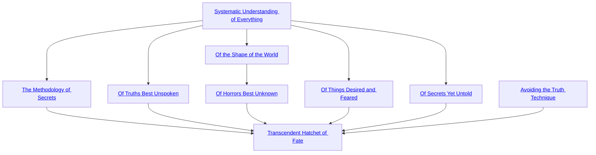

## Systematic Understanding of Everything

Cost: 1 mote
Duration: Until the character sleeps
Type: Reflexive
Minimum Lore: 1
Minimum Essence: 1
Prerequisite Charms: None

The character sleeps, and the Maiden of Secrets grants
her a vision of the projected plan for fate, from the moment
of her waking until the end of Creation. A character
trained to use this Charm can filter her perceptions and
observe a small portion of the Loom of Fate, integrating it
with her own extensive knowledge. Until the vision fades
with her next dream, she adds a + 1 specialty of her choice,
which applies to all relevant Abilities.
Characters can only spend Essence for this Charm
while asleep. This can increase the specialty total for an
Ability above +3, but the character cannot add more
than three specialty dice to any given roll. These specialties
are dice bonuses added by a Charm and should be
considered as such when determining the maximum
effect of other dice-bonus Charms.

## The Methodology of Secrets

Cost: 5 motes
Duration: Until the character sleeps
Type: Reflexive
Minimum Lore: 2
Minimum Essence: 2
Prerequisite Charms: Systematic Understanding of Everything

This Charm extends Systematic Understanding of
Everything, providing a specialty that gives a +3 bonus
to one Ability and a + 1 bonus to all Abilities where it is
relevant. Characters can only spend Essence for this
Charm while asleep and cannot invoke it in the same
slumber as Systematic Understanding of Everything.
This Charm can increase the specialty total for an
Ability above +3, but the character cannot add more
than three specialty dice to any given roll. These specialties
are dice bonuses added by a Charm and should be
considered as such when determining the maximum
effect of other dice-bonus Charms.

## Of Truths Best Unspoken

Cost: 5 motes
Duration: Three hours
Type: Simple
Minimum Lore: 3
Minimum Essence: 2
Prerequisite Charms: Systematic Understanding of Everything

Scuttling on the paths of fate are the seven Heptarchs
of Tragedy, gods of those truths and futures displeasing to
mortal eyes. Catching sight of a horror to come, they
snatch up the knowledge of it and bind it in a living
sepulcher that they cast into the earth. Gathering together
for three hours and simultaneously invoking this
Charm, a trinity of Exalted serving Serenity, Battles and
Secrets can dredge such a sepulcher forth and witness an
atrocity not yet come to pass. At any time within the next
year, the player of each can make a single Lore roll as if
the Sidereal were looking backward from the end of the
Age of Sorrows. For example, having lost an important
artifact, the character can roll to remember notable
events wherein it is destined to appear. Five successes
may lead him to it immediately, while one success may
indicate only that the Maidens intend it to fall into the
hands of a young Lunar hero &quot;eventually.&quot; Extrapolating
another aspect of the weave from a glimpse of one horrific
section of the Loom is difficult, even for the Exalted.
Characters can use this Charm, at most, once per
month. Multiple uses are not cumulative. Sidereal Exalted
may always use their Conviction with this Charm.

## Of Things Desired and Feared

Cost: 10 motes
Duration: Three hours
Type: Simple
Minimum Lore: 3
Minimum Essence: 2
Prerequisite Charms: Systematic Understanding of Everything

Charting the paths of the future can help to resolve
even the stickiest of situations. Gathering together for
three hours and simultaneously invoking this Charm, a
trinity of Exalted serving Journeys, Serenity and Endings
map the paths of destiny and learn at least one method
by which they may achieve a given goal. From a mechanical
perspective, they learn the price of success at
some endeavor — anything from &quot;a few bumps and
bruises&quot; to &quot;the destruction of your Circle and every-
thing you believe in.&quot; If the Sidereal characters choose to
pay the price, they automatically achieve their goal;
both the price and their victory occur in a narrative
fashion in amongst other stories.
The paths lain out by these small prophecies are
rarely optimal. Characters may reasonably decide to pur-
sue the goals in their own fashion rather than following
the prophecy (paying the price) or dropping the matter.
The Storyteller should only slightly inflate the price for
resolving a peripheral matter but set a prohibitive price
for automatically resolving something central to the story.
The characters still benefit, however, even when the
price they pay is greater than what their own planning
might provide. They are assured of success and can focus
their attention and planning effort on other matters.

## Of the Shape of the World

Cost: 3 motes per target number reduction, 1 Willpower
Duration: Instant
Type: Supplemental
Minimum Lore: 4
Minimum Essence: 3
Prerequisite Charms: Systematic Understanding of Everything

Averting her eyes from the truth that is, the character
invokes a truth she wishes to create. She may lower
the target number for a Sidereal astrology roll.

## Of Horrors Best Unknown

Cost: 10 motes
Duration: Instant
Type: Simple
Minimum Lore: 5
Minimum Essence: 3
Prerequisite Charms: Of the Shape of the World

The Sidereal weaves one of the nets of Neferuaten,
made from filaments of destiny thinner than the distance
between a stone and its shadow or a dog and its howl.
These nets can catch and cling even to those things
normally immune to the workings of destiny: not strong
enough to impede a Primordial's course, but cunning
enough to adhere to the nonexistent borders of Cecelyne,
the Endless Desert, or hang like gossamer from a
Deathlord's flesh. The Exalt can cast the net around any
creature she can see. Success requires a Dexterity + Lore
roll with difficulty equal to the target's Essence. After-
ward, the net then exerts a slow, continual pull on the
world around the target. In a circumstance the Sidereal
names, all dice pools that oppose the target have their
target number reduced by 1, to a minimum of 4. The net
lasts a year and a day. Instead of rolling the attack, the
Sidereal can spend a permanent Willpower to guarantee
success. This also ensures that the net lasts long enough
to fulfill her purpose in casting it, even if one must
reckon that time in years. Multiple such nets may cover
a single target. Sidereal Exalted may always use their
Valor with this Charm.

## Of Secrets Yet Untold

Cost: 5 motes, 1 Willpower
Duration: Instant
Type: Simple
Minimum Lore: 4
Minimum Essence: 2
Prerequisite Charms: Systematic Understanding of Everything

Hissing a long susurration, the character illumines
an elemental or spirit of the earth in a verdant glow and
bestows upon it a secret: a truth about the long course of
the world that the spirit can never speak. The spirit must
perform one favor for the Exalted in return, chosen by
necessity and not by desire. Neither the character nor
the spirit chooses what the favor might be. The spirit
automatically knows the favor's nature, but the Exalted
does not. Until the favor is paid, success at a Wits +
Temperance roll with difficulty 3 is required for the spirit
to initiate hostile action against the Exalt. (It can still
reply to violence with violence.)

## Avoiding the Truth Technique

Cost: 3 motes
Duration: Instant
Type: Supplemental
Minimum Lore: 3
Minimum Essence: 2
Prerequisite Charms: None

Drawing on preternatural insight, the character
imbues a true statement with implications that horrify
the listener. Add her Essence in automatic successes to
a Socialize, Presence or Bureaucracy roll to convince her
victim she is lying. This Charm is explicitly permitted to
be in a Combo with Charms of other Abilities.

## Transcendent Hatchet of Fate

Cost: 16 motes, 1 Willpower, 1 health level
Duration: Until used
Type: Simple
Minimum Lore: 5
Minimum Essence: 4
Prerequisite Charms: The Methodology of Secrets, Of Truths Best Unspoken, Of Things Desired and Feared, Of Horrors Best Unknown, Of Secrets Yet Untold, Avoiding the Truth Technique

This Charm uses a prayer strip marked with the
scripture of the Maiden in Terror, which glows a sickly
green as it curls and twists and sinks into the Sidereal's
palm. It leaves behind a faint tracery of symbols in the
tongue of the Old Realm.
When the Sidereal so chooses, he shows his palm to
a target and names that victim's fate: which of the
target's worst fears the world will realize, and how. The
Exalt's player then rolls Intelligence + Lore. The target
instantly loses the Sidereal's Essence plus the number of
successes in temporary Willpower, to a minimum of 0,
and twice that amount in motes of Essence.
Under normal circumstances, although the character
simply states what is preordained, the player chooses
and names a fate and manner for its realization that he
finds dramatically interesting. At the moment the character
speaks, that event is destined. The Storyteller
should suggest an alternative if that destiny simply
cannot come to pass. Game events can alter this destiny
and rescue the target, due to changes in departmental
vision and the meddling of Primordials, but the target
herself cannot avoid her doom.
