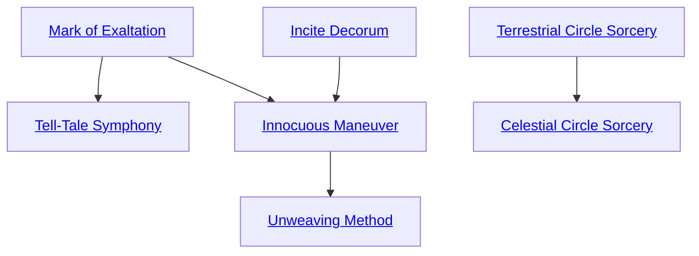

## Mark of Exaltation

Cost: 2 motes
Duration: One scene
Type: Simple
Minimum Occult: 1
Minimum Essence: 1
Prerequisite Charms: None

The character's Caste Mark shimmers, casting forth
an appropriately colored light only visible to spirits and
the Chosen of her caste. This light reveals unmanifested
spirits to those who can see it. In addition, the Sidereal
adds one automatic success to all Presence, Performance,
Occult, Bureaucracy and Socialize rolls made when
dealing with spirits or in Yu-Shan. This explicitly stacks
with effects that add dice to her pool, even if it exceeds
the dice limit. Sidereal Exalted may always use their
Compassion with this Charm. Learning this Charm
requires the appropriate Maiden's approval.

## Tell-Tale Symphony

Cost: 5 motes
Duration: One scene
Type: Simple
Minimum Occult: 3
Minimum Essence: 2
Prerequisite Charms: Mark of Exaltation

To help the character better untangle the threads of
fate, impelled by the earliest laws of Creation, the
patterns of Essence around the character sing. Charms,
sorcery and other effects give rise to strange but fitting
melodies. Spirits - manifested or otherwise — emit a
soft and inadvertent noise, like the ringing of bells. Only
Sidereal Exalted can hear this music.
Both the character and other Sidereals within earshot
can detect the presence of enchantments and
unmanifested spirits automatically. An Intelligence +
Occult roll against difficulty 3 allows Sidereal Exalted
with this Charm to identify the details of an enchant-
ment, the approximate rank and job description for a
given spirit or the minutiae of the local geomantic
environment.

## Incite Decorum

Cost: 2 motes
Duration: Indefinite
Type: Simple
Minimum Occult: 1
Minimum Essence: 1
Prerequisite Charms: None

Invoking the blessing of his Maiden, the character
facilitates polite dealings with the spirit world. Spirits
and elementals with the Sidereal's Essence or lower must
spend 2 temporary Willpower to initiate hostile action
against the character. In addition, each Charm they use
in a conflict they initiate costs 1 additional Willpower.
(This includes Charms that do not normally cost Will-
power.) Learning this Charm requires the appropriate
Maiden's approval.

## Innocuous Maneuver

Cost: 2 motes
Duration: Instant
Type: Simple
Minimum Occult: 3
Minimum Essence: 2
Prerequisite Charms: Mark of Exaltation, Incite Decorum

Wrapped in the terrible grandeur of the Maiden
that sponsors her, the Sidereal can present a compelling
case for her intentions. If her player succeeds at a
Charisma + Occult roll against a difficulty equal to the
target's Essence, the Sidereal acquires a god's support
in some political matter. The god must not be intractably
opposed to the Sidereal, and the Sidereal can
attempt this Charm at most once per year against a
given target. When used by the losing side in a celestial
audit, each use of this Charm counts as an independent
Severity 3 offense. When used by the winning side,
there is no penalty. (Helping others agree with the
truth, as the censor's final opinion defines it, is no
crime.) Sidereal Exalted may always use their Valor
with this Charm. Learning this Charm requires the
appropriate Maiden's approval.

## Unweaving Method

Cost: 5 motes, 1 Willpower, 1 health level
Duration: Instant
Type: Simple
Minimum Occult: 4
Minimum Essence: 3
Prerequisite Charms: Innocuous Maneuver

Sidereals with a deep understanding of the ways of
the Wyld and the dead can apply it to their manipulation
of fate. With a deft touch on the weave, the character
corrupts the pattern of a person's existence with the
essence of chaos and endings. She inflicts her Essence in
dice of unsoakable aggravated damage on any creature or
object she can see. This damage cannot be blocked or
dodged. The Unweaving Method cannot harm the dead
and has no effect on characters or items shielded from
the influence of the Wyld.

## Terrestrial Circle Sorcery

Cost: 1 Willpower
Duration: Instant
Type: Simple
Minimum Occult: 3
Minimum Essence: 3
Prerequisite Charms: None

For the Sidereal Exalted, steeped in the lore of the
First Age, Terrestrial Circle Sorcery comes easily. Note
that invoking this Charm only enables the character to
cast a single Terrestrial Circle spell. The actual spell
itself has an Essence cost, often very high, that the
character must pay to actualize the spell. This cost is
listed in the spell's description. Terrestrial Circle Sorcery
can never be part of a Combo.

## Celestial Circle Sorcery

Cost: 2 Willpower
Duration: Instant
Type: Simple
Minimum Occult: 4
Minimum Essence: 4
Prerequisite Charms: Terrestrial Circle Sorcery, one prayer strip Charm

Those Sidereal Exalted who attain the pinnacle of
one constellation's Charms, learning to understand and
use one of the scriptures found upon the Maidens' Loom,
unlock a path in their minds through which they may
learn Celestial Circle Sorcery. The first time they cast a
Celestial Circle spell, they must also sacrifice a prayer
strip inscribed with the scripture of the Maiden in
Chains, which burns away in a gout of emerald fire.
Celestial Circle Sorcery can never be part of a Combo.
