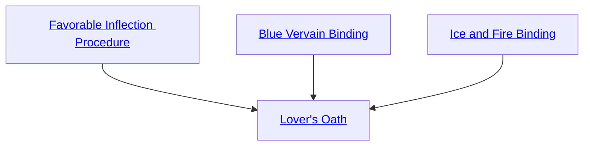

## Favorable Inflection Procedure

Cost: 5 motes
Duration: Instant
Type: Simple
Minimum Linguistics: 3
Minimum Essence: 2
Prerequisite Charms: None

Spoken properly, a person's name or nickname can
pleasingly reflect the underlying pattern of his existence,
forming a sense of completion in his heart. The character
knows how to inflect a name in such a fashion. Her player
rolls Charisma + Linguistics against the target's Essence.
If the roll succeeds, the target experiences a momentary
burst of warmth, happiness and connection to the Sidereal.
If upset or violent, he loses his train of thought,
forgetting what caused his unhappiness. He will not
remember it naturally, but events may remind him. For
example, seeing the Exalt standing over the murdered
body of his bride with a bloody knife in her hand would
immediately reinvoke his rage. This Charm fails before
the Great Curse, and the character must know the
target's name. Sidereal Exalted may always use their
Compassion with this Charm.

## Blue Vervain Binding

Cost: 5 motes, 1 experience point
Duration: One minute
Type: Simple
Minimum Linguistics: 3
Minimum Essence: 1
Prerequisite Charms: None

The Blue Vervain Binding is a minute-long formal
blessing in the language of the Old Realm. It ties together
two creatures' fates. (One creature can be the
Sidereal himself.) Successfully reciting the binding requires
perfect intonation, cadence and inflection
throughout — and thus an Intelligence + Linguistics roll
against difficulty 5. Forever after, to the limits of their
intellects, each creature can understand the other perfectly
and make herself understood.

## Ice and Fire Binding

Cost: 10 motes
Duration: One hour
Type: Simple
Minimum Linguistics: 3
Minimum Essence: 2
Prerequisite Charms: None

Reciting the Ice and Fire Binding is similarly complex
and takes a full hour to complete. The player rolls Intelligence
+ Linguistics against a difficulty of 9. Each additional
Sidereal who supports the Charm with her presence and
words reduces the difficulty by 1, to a minimum of 5.
Supporters need not know the Charm. This incantation
summons a spirit or elemental of fire, with Essence less
than the character's own and touches it with the essence
of Serenity. For one season, it binds that spirit to seek the
joy, health and pleasure of those around it. Afterward, it
smoothly removes any details of the characters who summoned
and bound it from the spirit's memory.

## Lover's Oath

Cost: 20 motes, 1 Willpower, 1 health level
Duration: Instant
Type: Simple
Minimum Linguistics: 4
Minimum Essence: 3
Prerequisite Charms: Favorable Inflection Procedure, Blue Vervain Binding, Ice and Fire Binding

This Charm uses a long prayer strip marked with the
scripture of the Bride. The Sidereal and a consenting
partner invoke it together. His partner need not know
this Charm but must fully understand its implications.
Together, they twist the strip and wind it around one
finger each, reciting an oath in the language of the Old
Realm. Both players roll Intelligence + Linguistics against
difficulty 5. On a success, every detail of cant and
expression is correct. The prayer strip shrivels and reshapes
into two starmetal rings, set with sapphires.
Neither character can ever directly or indirectly attempt
to remove the rings. Others can destroy them using the
standard rules for breaking a prayer strip.
While the rings endure, each character can reflexively
spend the others' health levels, Essence and
Willpower as his own. Treat motes of Essence drawn from
the character's partner as Peripheral for the purpose of
affecting the drawing characters' anima banner. A character
automatically and involuntarily draws on the other's
health levels when his partner has a smaller (pre-Charm)
wound penalty than he. When defending or helping one's
partner, treat all Compassion dice as automatic successes.
This Charm is tantamount to a wedding ceremony,
and the Maidens expect their Exalted to treat it with
reverence. The feelings between the characters need not
be romantic love. They do not even have to be love at all
— one can make a Lover's Oath of expedience. However,
the bond remains sacred, and ill fate follows should
one character treat his partner poorly.
