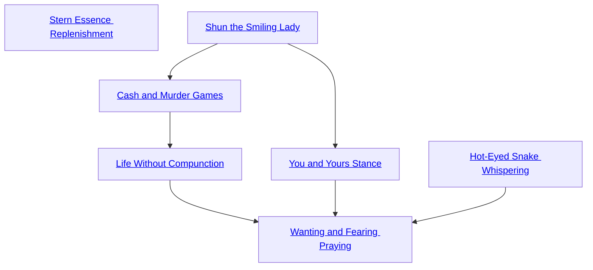

## Stern Essence Replenishment

Cost: None
Duration: Permanent
Type: Special
Minimum Socialize: 1
Minimum Essence: 2
Prerequisite Charms: None

In taking those actions she considers necessary,
whatever the personal cost, a Sidereal sets her order on
the world. As she does so, it helplessly yields its Essence
to her. This Charm draws on the Exalt's ability to play
spirits and the world, manipulating Creation in Creation's
service. Immediately after a successful roll using Conviction
or immediately after a Socialize roll that substantially
changed the local social environment in her favor, the
Exalt regains twice her Conviction in motes of Essence,
up to her normal maximum. There is no cost to use this
Charm's effects - learning this Charm simply enhances
the Exalt's capabilities.

## Shun the Smiling Lady

Cost: 7 motes
Duration: Indefinite
Type: Simple
Minimum Socialize: 2
Minimum Essence: 2
Prerequisite Charms: None

The character blots the target's name from the rolls
of those destined to attract love. The target has an
effective Appearance 1 for all non-magical effects. To
invoke any form of supernatural appeal or to maintain it
into a new scene, the target must spend a Willpower
point, and his player must succeed at a Manipulation +
Socialize roll against a difficulty of the Sidereal's Essence.
He makes this roll after paying for the Charm or
Ability used. If anyone with permanent Essence less than
the Sidereal's own has romantic feelings for the target,
those feelings are instantly severed. They do not return
when the Charm ends.

## Cash and Murder Games

Cost: 10 motes, 1 Willpower
Duration: Instant
Type: Simple
Minimum Socialize: 3
Minimum Essence: 2
Prerequisite Charms: [[#Shun the Smiling Lady]]

Quickly sketching a proposed relationship in the
plans for future fate, the character increases the power
one person has over another. The character names the
fashion in which the beneficiary acquires dominion over
the target — generally fear or desire, sexual or otherwise.
The player rolls Manipulation + Socialize. To resist
being intimidated, enthralled or impressed to the point
of near-servitude, the target must spend one temporary
Willpower per scene where he encounters the Charm's
beneficiary. When he has spent Willpower equal to the
number of successes rolled, the compulsion fades. Normally,
the emotional impact does not entirely dissipate
so much as mute itself to non-magical levels. The Sidereal
can choose herself as the beneficiary. Sidereal Exalted
may always use their Conviction with this Charm.

## Life Without Compunction

Cost: 5 motes
Duration: Instant
Type: Simple
Minimum Socialize: 4
Minimum Essence: 2
Prerequisite Charms: [[#Cash and Murder Games]]

As with legal crimes, the right tricks can make social
crimes... disappear. The Sidereal can instantly erase the
onus attached to herself or to someone else for some
social blunder or taboo violation. Her player rolls Manipulation
+ Socialize. A single success makes people
stop caring. With three successes, the character can
choose instead either to make the relevant action generally
acceptable or to make the person who committed it
an admirable rebel (e.g., an ideologue who makes a bold,
daring statement by digging up people's dead grandmothers,
however disgusting that behavior would be in
others). The Charm only affects communities where the
relevant action significantly contributes to the target's
notoriety. (To make theft socially acceptable through-
out Creation, the Sidereal would have to arrange an act
of theft infamous throughout Creation.) Socially acceptable
acts often retain legal penalties. Sidereal Exalted
may always use their Temperance with this Charm.

## You and Yours Stance

Cost: 10 motes, 1 Willpower
Duration: One scene
Type: Simple
Minimum Socialize: 3
Minimum Essence: 3
Prerequisite Charms: [[#Shun the Smiling Lady]]

The character wraps himself in the tenor of fate that
gives rise to lust. He becomes impossible to recognize.
Looking upon him, others perceive only a blazing sense
that he is their greatest possession and that to harm or
disappoint him is to risk losing their own hearts. For
those actively hostile to him, it requires a Conviction
roll to attack. For others, it requires a Temperance roll
not to act as best they can, short of suicide, to please him.
This Charm adds the character's Essence in automatic
successes to any seduction roll.

## Hot-Eyed Snake Whispering

Cost: 1 mote per target number reduction
Duration: Instant
Type: Supplemental
Minimum Socialize: 3
Minimum Essence: 2
Prerequisite Charms: None

Every time an audience's trust in the character is
about to falter, her hands on the web of fate twitch its
members' minds back onto the proper path. The Charm
can reduce the target number of Presence, Performance,
Bureaucracy and Socialize rolls. This Charm is explicitly
permitted to be in a Combo with Charms of other
Abilities. Sidereal Exalted may always use their Conviction
with this Charm.

## Wanting and Fearing Praying

Cost: 10 motes, 1 Willpower, 1 health level
Duration: Indefinite
Type: Simple
Minimum Socialize: 5
Minimum Essence: 4
Prerequisite Charms: [[#Life Without Compunction]], [[#You and Yours Stance]], [[#Hot-Eyed Snake Whispering]]

This Charm uses two prayer strips marked with the
scripture of the Whore. The character holds them up,
one at a time, and names a target for each. The targets
must be within 10 miles. Each prayer strip burns lambent
blue for a moment before disappearing, reappearing
wrapped around one of its target's bones. Its light cannot
shine through even the thinnest veil of flesh, but bursts
forth brilliantly if that flesh is ever cut away. Extracting
the strip requires 12 successes on an extended Dexterity
+ Medicine roll. Each attempt inflicts one level of
unsoakable lethal damage.
The Sidereal's player rolls Manipulation + Socialize
against the Essence of each target. If he succeeds both
times, the character can dictate a new social and emo-
tional relationship between the two targets. As fast and
hard as plausible, for the duration of the Charm, events
push the victims toward that social relationship. The
imposed emotional relationship is partly a magical com-
pulsion, which remains while the character commits
Essence to the Charm. Under its influence, a target must
spend a Willpower point to act significantly at odds with
the imposed emotional context. The Charm also in-
stantly creates genuine emotions, which do not depend
on magic to sustain them. They fade or blossom as
emotions normally do.
Sidereal Exalted may always use their Conviction
with this Charm.
