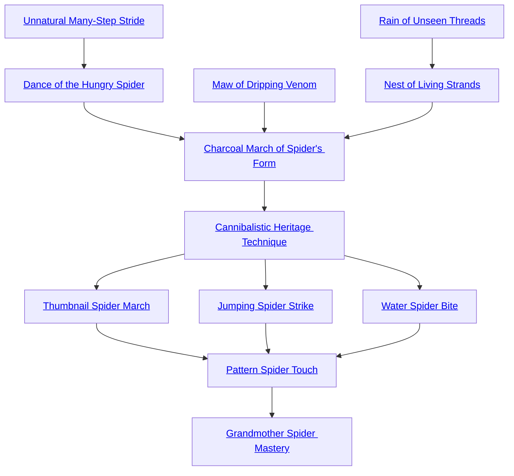

## Unnatural Many-Step Stride

Cost: 6 motes, 1 Willpower
Duration: One scene
Type: Simple
Minimum Martial Arts: 5
Minimum Essence: 4
Prerequisite Charms: None

...whose skill was great enough to climb a whirlwind
over water.
The character scuttles on the threads of fate like a
pattern spider. He can run through or stand upon the air
as easily as on the ground. He can reflexively spend a
mote of Essence to dematerialize from the beginning of
his initiative to the beginning of his next initiative,
allowing him to become as invisible and intangible as
those who weave fate. This does not count against his
actions for the turn. When he is under this Charm's
influence, the Sidereal's gait both disturbs and horrifies
those who see it. Except for the Sidereal's allies, the
player of a witness who does not have this Charm must
succeed at a difficulty 1 Valor roll each turn, or her
character loses her action.

## Dance of the Hungry Spider

Cost: 8 motes
Duration: Five turns
Type: Reflexive
Minimum Martial Arts: 5
Minimum Essence: 4
Prerequisite Charms: [[#Unnatural Many-Step Stride]]

Arrows fell upon her, forcing her to descend.
This Charm emulates a spider's motion, balanced
on six legs and striking with two, never lacking the
leverage — regardless of what might tangle its blows —
for a lightning retreat or advance. The character begins
a shuffling, sliding, shifting kata, her feet constantly in
motion and nearly impossible for mortal eyes to track.
Only the third of three separate, successful attempts can
sweep her, knock her down, clinch or hold her or make
a targeted attack against her lower body.
When the character uses this kata, she can shift
herself almost instantaneously out of the path of a blow.
Becoming aware of a physical attack allows her to glide
away, moving up to twice her Dexterity in yards. If the
attack can hit her at this range — as with archery or the
Lightning Strike Style (see Exalted: the Dragon-Blooded,
p. 246) — this Charm increases any associated range
penalties. Attacks that must hit her before she moves
away (such as hand-to-hand attacks if she puts more than
three yards between herself and her attacker) suffer a
dice pool penalty equal to half the character's initiative
for that turn, rounded up. After the first attack, the
attacker must move into range again to hit her at all.
Similarly, the character can glide forward up to twice her
Dexterity in yards to make any of her unarmed Martial
Arts attacks. Attempts to parry her attack suffer a dice
pool penalty equal to half her initiative for the turn,
rounded up. Dodging her requires less awareness of her
angle of approach; dodge attempts only suffer a penalty
equal to her permanent Essence.
When a character uses this Charm to dart quickly
through her enemies, splitting her Martial Arts action to
maximize the extra movement derived from this Charm,
it is sometimes called the Dance of the Pouncing Spider.
When she uses it to skate away from a barrage of arrows,
quickly exceeding their maximum range, it is the Dance
of the Spider in the Rain.

## Maw of Dripping Venom

Cost: 5 motes
Duration: Instant
Type: Supplemental
Minimum Martial Arts: 5
Minimum Essence: 4
Prerequisite Charms: None

But the Essence burning within her set the arrows afire.
The character's fingers rain across her opponent like
a thousand poisoned fangs, tainting the target's Essence
so that his soul begins to dissolve from the inside. The
character makes a normal unarmed Dexterity + Martial
Arts attack, which does normal damage. In addition, the
target begins to hemorrhage Essence. He loses 5 motes
every turn, exactly as if he had spent them. This effect
lasts one turn for each damage die rolled. Multiple
applications of this effect are cumulative. When the
target runs out of motes, he collapses, comatose, for a
number of days equal to the character's Martial Arts.
Storyteller characters may die outright. Given three
turns of physical contact with a comatose target, a
character with this Charm can suck out and devour the
target's soul. This restores the devourer's temporary
Essence to its normal maximum. The target does not
move on to the afterlife. If the character consumes a
Celestial Exalt, she will grow sick sometime within the
next three days and spit out the indigestible Celestial
Essence, suffering six dice of lethal damage in the process,
which ignores armor and soak.

## Rain of Unseen Threads

Cost: 8 motes
Duration: Instant
Type: Extra Action
Minimum Martial Arts: 5
Minimum Essence: 4
Prerequisite Charms: None

She answered the arrows' flight with a storm of her own.
The character casts forth a number of hair-fine
threads equal to his permanent Essence. Each can at-
tempt one of the following maneuvers, at a range of (the
Sidereal's Essence x 10) yards:
• Pick up a single unattended weapon or object.
Attacking or parrying with a weapon held by a thread is
a normal Martial Arts action.
• Pierce an opponent's skin, as a normal Martial
Arts attack that does lethal damage.
• Disarm, sweep or hold an opponent (see Exalted,
pp. 238-240). This attack uses the character's full Dexter-
ity + Martial Arts pool and does not count against the
character's actions. Further, the character can maintain
a hold with his full Strength + Martial Arts pool, without
losing or splitting his action, so long as he invokes this
Charm every turn. However, each thread can hold only
a single limb; a held character can take actions with her
other limbs. If the character devotes multiple threads to
holding an opponent, resolve the attack with a single roll.
Make reflexive Perception + Awareness or Perception
+ Martial Arts checks at difficulty 4 for other
characters to see the threads. Otherwise, except for
attacks with a visible weapon, targets are unaware of
the attack and can only use defenses that specifically
state they work on attacks the character is not aware
of. The threads are tangible and slightly reflective,
and opponents can use stunts to make them easier to
spot or predict.

## Nest of Living Strands

Cost: 15 motes, 1 Willpower
Duration: One scene
Type: Simple
Minimum Martial Arts: 5
Minimum Essence: 4
Prerequisite Charms: [[#Rain of Unseen Threads]]

And the small maiden began
Hundreds of near-invisible filaments spun from the
character's Essence launch from her hands, whipping
around physical and spiritual leverage points and weaving
amongst themselves to snarl and tangle all opponents
within (the Sidereal's Essence x 10) yards. Each turn, the
Sidereal's player reflexively rolls Dexterity + Martial
Arts. Enemies inside the Charm's area of effect, or who
enter that area before the character's next turn, suffer a
cumulative penalty to their dice pools for all physical
actions equal to half the number of successes. They
receive the same penalty to their natural movement rate
in yards. This penalty fades by one die and one yard per
turn that the victim spends outside the radius, as the
threads reluctantly disentangle themselves.
The weave of thread moves with the character,
easily catching new opponents brought into the radius
and twitching out of the way of those she wishes to give
unhampered passage. If the character does not keep
moving, the threads thicken toward the point of visibility,
first as glints of reflected light in the air, then a faint
visual impression like cobweb and ultimately (after five
minutes of stillness) an opaque forest of webbing around
the character, as impassible - for those she does not
offer passage to — as stone (use the statistics for Stone
Wall on page 239 of Exalted for each one-yard cube
attackers wish to clear).

## Charcoal March of Spider's Form

Cost: 12 motes
Duration: One scene
Type: Simple
Minimum Martial Arts: 5
Minimum Essence: 5
Prerequisite Charms: One complete martial art (all Charms), [[#Dance of the Hungry Spider]], [[#Maw of Dripping Venom]], [[#Nest of Living Strands]]

to climb the waterspout again.
The character moves in the fashion of an arachnid
sifu, her hands weaving lazily through three sets of
interwoven kata. Such is her grace and coordination, in
Essence as in body, that she may take three fully independent
physical actions in each turn. For example, she
might invoke a full dodge when attacked, then invoke
Flight of Mercury while making an ordinary Martial Arts
attack and, finally, split her dice pool to use Maw of
Dripping Venom against two nearby opponents.
Fully independent actions follow exactly the same
rules as taking single actions on multiple successive
turns, except that:
• Only one turn actually passes, which matters for
some Charm effects and durations and also means the
sutra discount applies only once.
• Characters who have split dice pools can interweave
their actions. For example, they can split one
action's dice pool between an attack and a parry, taking
another action in between.
• The character only moves once.
• Characters cannot also use extra action Charms or
Combos containing those Charms when taking more
than one independent action.
In addition, if the character chooses to use this
ability in a given turn, she cannot take any non-reflexive
dice actions depending on Social or Mental Attributes.
(This final limit is not intrinsic to fully independent
actions, but a feature of this Form.) The character does
not have to use this ability in a given turn if she would
prefer to use an extra action Charm, use a Combo or take
a Social or Mental action.
Characters using the Charcoal March of Spiders
Form automatically receive the benefits of the Unnatural
Many-Step Stride and Dance of the Hungry Spider in
every turn.
Characters cannot use more than one Martial Arts
Form-type Charm at a time.

## Cannibalistic Heritage Technique

Cost: 20 motes, 1 Willpower
Duration: Instant
Type: Reflexive
Minimum Martial Arts: 6
Minimum Essence: 6
Prerequisite Charms: [[#Charcoal March of Spider's Form]]

The Elder Sutra of Consumption: The maiden became
a mother...
Just as the widow spider devours her mate to feed a
thousand children, the character consumes the force of
one blow to give rise to a wind of vengeance. She may use
this Charm immediately after someone successfully attacks
her. The swirling pattern of her hands forms a raw
vortex to draw in and disrupt the Essence and physical
substance of the attack. She immediately inflicts her
Dexterity + Martial Arts in dice of unblockable,
undodgeable lethal damage against an unarmed attacker
or shatters any mortal weapon used against her. If this kills
an unarmed attacker or destroys an armed attacker's
weapon, she takes no damage from the attack. Her opponent
can use a perfect block or a perfect dodge to avoid the
vortex damage - however, this requires aborting the
original attack, and again, the Sidereal takes no damage.
Either way, from the heart of the vortex, the Exalt may
issue a number of unarmed counterattacks equal to her
Martial Arts score, doubling their raw damage. She can
use this Charm in response to a counterattack Charm
such as Crimson Palm Counterstrike but does not receive
counterattacks against any counterattack Charm.

## Thumbnail Spider March

Cost: 12 motes, 1 Willpower
Duration: Instant
Type: Extra Action
Minimum Martial Arts: 6
Minimum Essence: 6
Prerequisite Charms: [[#Cannibalistic Heritage Technique]]

And to one child she said, &quot;I have many things to
show you.&quot;
In the jungles of the East, one sometimes finds nests
of thumbnail spiders: thousands or millions of tiny spiders
sharing a funnel-shaped web. They normally wait
for prey to fall into their home but are more than happy
to swarm over anyone or anything that arouses their ire
When something destroys their web, such spiders migrate
for miles, devouring everything they pass, until
they decide upon a new home. A character using this
Charm is every bit as destructive. He moves up to (his
Essence x 10) yards and makes three Martial Arts attacks
at his full dice pool. Every opponent within five yards of
his path suffers the effects of each attack. Each dodges or
blocks individually. If the targets have defensive effects
that hurt attackers - such as counterattacks, spines or
an angry invocation of the Shield of Mars - the character
is immune to the effect. The blur of his passing fist or
foot fades away into nothingness as the counterattack
triggers, for the death of a single spider does not hurt the
swarm. The Exalt's attacks affect both material and
spiritual targets with equal facility, and the character can
launch these attacks while dematerialized.
Characters using Thumbnail Spider March do not
receive offensive benefits from reflexive movement
Charms such as the Dance of the Hungry Spider, although
they can still receive defensive benefits.

## Jumping Spider Strike

Cost: 20 motes, 1 Willpower
Duration: Instant
Type: Supplemental
Minimum Martial Arts: 6
Minimum Essence: 6
Prerequisite Charms: [[#Cannibalistic Heritage Technique]]

And to another, she said, &quot;You may rest within my
home, and eat; no need to fly.&quot;
In the South, surrounded by the sands, there
stands the great idol Ma-Un-Enle, and there are spi-
ders that come before it. Sometimes, a spider hears
Ma-Un-Enle speak a name, and it bows with all its legs,
and it walks out into the wind. It buries itself under the
sands, growing ever larger with age, for hundreds or
thousands of years. Then, when the person whose
name it has heard comes within 10 miles, it strikes in
one smooth bound. A character using this Charm can
spring at any visible target, issuing an unarmed attack
at the completion of that leap.
Against a person, this attack does normal damage,
adding the character's Essence in automatic successes to
the damage roll. In addition, the target's player must
make a reflexive opposed roll of Stamina + Resistance
against a difficulty equal to the Sidereal's Essence; on
failure, the force of the attack reduces the point of impact
(such as the target's head or chest) to a cloud of blood and
dust. The target has one turn left to live, or rather, one
turn before her Essence realizes that she should be dead.
No mortal medicine can help. The application of a
magical effect that heals one or more health levels makes
her Incapacitated but stable, but with one less dot of
permanent Stamina.
Treat attacks against inanimate objects as feats of
strength used to break them; the character's total on the
Feats of Strength table (see Exalted, p. 252) is (her
Essence x 5). This does mean a minimum total of 30 —
the character automatically shatters cliff faces, but a
powerful Manse might only lose its gate.

## Water Spider Bite

Cost: 20 motes, 1 Willpower
Duration: Instant
Type: Supplemental
Minimum Martial Arts: 6
Minimum Essence: 6
Prerequisite Charms: [[#Cannibalistic Heritage Technique]]

And to a third, she said, &quot;How beautiful you are.&quot;
In the oceans of the West live green hunting spiders,
bulbous and hand-sized, scurrying along the underside of
the surface as easily as if were a web. They kill fish -
sometimes, even great sharks or whales — for their meat,
paralyzing them with a pinprick bite and burrowing into
their flesh, floating to the surface years later, sated, when
they have eaten it all. A character with this Charm
possesses a touch every bit as deadly. With one swift
blow, she can render an enemy helpless and begin to
devour him for his Essence.
To use this Charm, she makes a normal unarmed
attack. If she succeeds and does even one health level of
damage, she also paralyzes the Essence of her opponent.
Paralysis means that the target cannot spend motes,
cannot regain Willpower or Essence and receives the
benefits of the Heartless Maiden Trance (see p. 133). He
can overcome this effect for one turn by spending a
Willpower point and having his player succeed at a
reflexive Stamina + Occult roll against a difficulty equal
to the character's Essence. He must do this successfully
a number of times equal to the character's Martial Arts
score to completely free himself from the effects. Mean-
while, until the victim is completely free, the martial
artist can spend his motes of Essence as if they were her
own. This can invoke the target's anima banner but does
not increase the Sidereal's.
When a character uses this Charm on a consenting
subject, allowing her to draw on that subject's Essence,
it is known instead as Seven-Leg Walking.

## Pattern Spider Touch

Cost: 20 motes, 1 Willpower
Duration: Instant
Type: Supplemental
Minimum Martial Arts: 6
Minimum Essence: 6
Prerequisite Charms: [[#Thumbnail Spider March]], [[#Jumping Spider Strike]], [[#Water Spider Bite]]

And as each heard her words and came to the center of
her web,
The master of this Charm learns the eight secret
atemi practiced by the firstmade of the pattern spiders,
Asna, who dwells surrounded by her teeming young in
a sanctum web larger than the Realm. With a success-
ful unarmed attack, the character can change her
target, reweaving the structure of the target's exist-
ence from the Essence outward. This causes one of the
following effects:
• Transforms the target into a beast, stripping him
of his mind and shape.
• Transforms the target's flesh into one of the five
elements: a gust of wind, a gout of fire that fades into ash,
a statue, a watery haze or a living oak. The target is still
alive, but unless he is an elemental of the relevant type,
he can take no actions.
• Grants the target a new life and identity. This uses
the same rules as the Ceasing to Exist Approach (see p.
173), save that the effects are permanent and the target
forgets his original identity.
• Unmakes the target utterly. In the unlikely
event a Primordial fails to use a perfect defense, that
Primordial becomes a Malfean. Any other target instantly
ceases to exist, in life and in afterlife, as the
strands of his Essence come violently apart and scatter
to the corners of Creation.
This replaces the normal damage of the attack.
The reapplication of this Charm, extremely po-
tent benedictions such as the Endowment spirit Charm
(see the Exalted Storyteller's Companion, p. 53) and
specific transformative agents such as the Wondrous
Lunar Transformation (see Exalted: The Lunars, p.
130) can return transformed targets to normalcy.
Gathering the pieces of elementally transformed tar-
gets before returning them to normalcy is advisable.
Normally, these methods provide an immediate resto-
ration. However, targets transformed into other people
and back may have difficulty relinquishing their new
memories and recovering the old ones. Nothing can
remake the unmade.
This Charm does not affect tattooed Lunar Exalted,
whose bodies reject external transformation. This ap-
plies even to the final version of the Charm.

## Grandmother Spider Mastery

Cost: 20 motes, 1 Willpower
Duration: One turn
Type: Simple
Minimum Martial Arts: 6
Minimum Essence: 7
Prerequisite Charms: [[#Pattern Spider Touch]]

she ate them.
To master this style is to approach the grandeur of
Asna Firstborn herself. When the character strikes, she
does not seem to move so much as to divide into many
warriors at once. She may cast forth endless invisible
filaments of web, as with Rain of Unseen Threads, or
simply strike so quickly as to occupy many locations
simultaneously. In either case, fighting her does not
resemble opposing the master herself so much as chal-
lenging an army of her young: The attacks rain down
from every side, skittering inward in the unsettling
many-stepped strides of the form to surround and
bewilder her foes.
The character applies each unarmed Martial Arts
attack she makes this turn against all visible opponents,
twice each, regardless of distance. Grandmother Spider
Mastery, as a simple Charm that cannot be in a Combo,
gives no benefit to characters without access to fully
independent actions. (That is, characters not using
Charcoal March of Spiders Form.)
