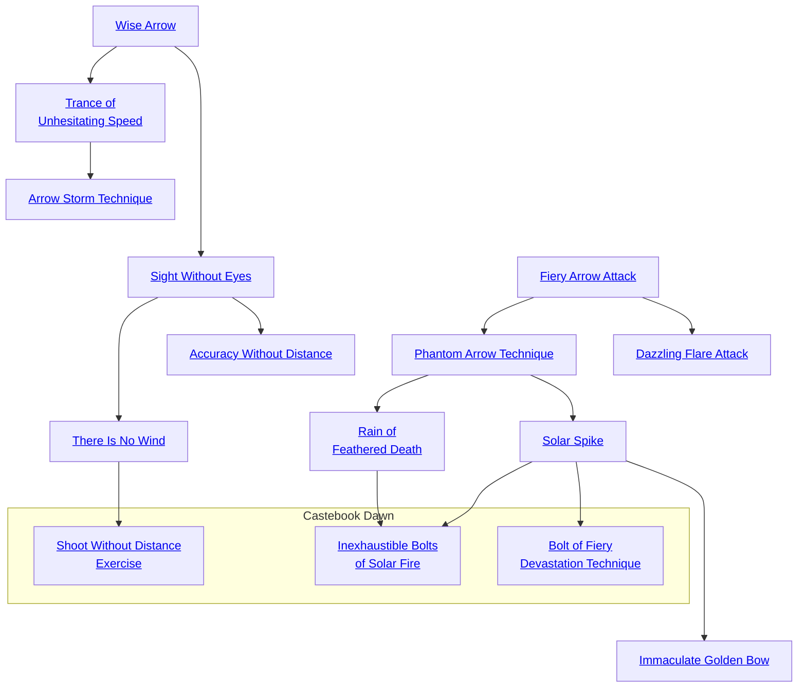

## Wise Arrow

Cost: 1 mote per die
Duration: Instant
Type: Supplemental
Minimum Archery: 1
Minimum Essence: 1
Prerequisite Charms: None

The character extends her anima into the world around
her, and joins archer, target and arrow into a single being. Truly,
the arrow knows the way to the target, for that is its natural
home. For each mote of Essence the player spends, he may add
1 die to an Archery attack roll, but the number of bonus dice
added to any single roll cannot exceed her normal Dexterity +
Archery dice pool. The player must declare how much Essence
she is going to use in this Charm prior to making the attack roll.

## Sight Without Eyes

Cost: 1 mote per die
Duration: Instant
Type: Supplemental
Minimum Archery: 3
Minimum Essence: 1
Prerequisite Charms: Wise Arrow

The character opens her eyes not to the visual world,
but to the world of Essence and senses her target in that
fashion. She may make an Archery attack without penalty
for visual conditions. Other negative modifiers (high winds,
range and so forth) still impose their regular penalties.

## Accuracy Without Distance

Cost: 1 mote, 1 Willpower
Duration: Instant
Type: Supplemental
Minimum Archery: 5
Minimum Essence: 1
Prerequisite Charms: Sight Without Eyes

The character extends her sense of the local Essence flows
to greater heights and can now shoot with perfect assurance. The
character may make an Archery attack out to the maximum
range of the bow with absolute certainty that the shot will hit.
The player rolls to attack as normal, but if he rolls insufficient
successes for his character to hit the target, he still hits it, doing
the arrow's base damage. This Charm can also be used to hit small
objects, to cut cords and ropes and for other trick shots. It does not,
however, allow the archer to negate their target's armor via a
called shot to the eye, throat or what have you.

## There Is No Wind

Cost: 3 motes
Duration: Instant
Type: Supplemental
Minimum Archery: 4
Minimum Essence: 1
Prerequisite Charms: Sight Without Eyes

The character's Essence flows into the bow and arrow, and he
fires with a perfect, supple grace. The character may make a
Archery attack without any environmental penalties of any sort,
be they for range, high winds, bad weather, bad ammunition or
what have you — the Charmed shot is absolutely flawless. Splitting
a dice pool for multiple actions is not an environmental penalty.

## Trance of Unhesitating Speed

Cost: Varies
Duration: Instant
Type: Extra Action
Minimum Archery: 3
Minimum Essence: 1
Prerequisite Charms: Wise Arrow

The character flows with soft and unhesitating grace
through the motions of firing her weapon. Before the
character takes her first action for the turn, the player must
declare how many attacks the character will make this
turn. Each extra attack costs a number of motes of Essence
equal to twice the total number of attacks the character has
made so far, including the attack the character is buying.
For Example: Harmonious Jade is surrounded by Dragon-Blooded
hunters and needs to act now, regardless of cost. She uses
the Trance of Unhesitating Speed to make three extra attacks (for
a total of four attacks that turn). The cost is 18 motes of Essence;
4 motes for the first extra attack, 6 motes for the second extra attack,
and 8 motes for the third extra attack. The cost of the Charm must
be paid before Harmonious Jade makes her first attack.
The player must decide how many attacks the character
will make and pay for them all before he makes any
attack rolls. Obviously, a character cannot attack more
times than she has ammunition.

## Arrow Storm Technique

Cost: 8 motes, 1 Willpower
Duration: Instant
Type: Extra Action
Minimum Archery: 5
Minimum Essence: 2
Prerequisite Charms: Trance of Unhesitating Speed

The character's motions become smooth and economical,
optimized for the release of arrows with a minimal
expenditure of effort. So long as the character hits (she need
not do damage) with an attack, she may make another attack
immediately thereafter. Each attack must be at a different
target, and the character cannot make more attacks than she
has ammunition. This Charm ends when the character misses
or when she has hit every possible target once.

## Fiery Arrow Attack

Cost: 2 motes
Duration: Instant
Type: Supplemental
Minimum Archery: 2
Minimum Essence: 2
Prerequisite Charms: None

The character concentrates Essence in an arrow and then
launches it, causing it to burst into flame in mid-flight. Not only
will the arrow ignite flammable materials it hits, it also adds dice
equal to the character's Essence score to the arrow's damage.
Arrows that have had the Fiery Arrow Attack Charm used on
them are burnt to cinders and cannot be recovered. Keep in mind
that indiscriminately firing burning arrows in a forest or grassland
during the dry season is generally a bad idea.

## Dazzling Flare Attack

Cost: 1 mote per 2 damage
Duration: Instant
Type: Supplemental
Minimum Archery: 3
Minimum Essence: 2
Prerequisite Charms: Fiery Arrow Attack

The character pours greater amounts of Essence into an
arrow, and it roars and flashes with Essence as it streaks toward its
target. The arrow flies faster and straighter than normal, adding
one die to the character's Archery pool. Also, for every mote of
Essence the character spends on the Charm, it adds two points
to the base damage of the arrow. The Exalted cannot spend more
motes of Essence activating this Charm than her permanent
Essence rating. Characters using this Charm must spend at least
one mote to do so — the Charm cannot be activated &quot;for free&quot;
to gain the bonus die to the character's Archery pool.
As the Charm's name suggests, if fired on a high arc through
the air, the arrow forms a beacon that can be seen for miles.
Arrows that have had the Dazzling Flare Attack Charm used on
them are burned to fine gray ash and cannot be recovered.

## Phantom Arrow Technique

Cost: 1 mote per arrow
Duration: Instant
Type: Supplemental
Minimum Archery: 3
Minimum Essence: 2
Prerequisite Charms: Fiery Arrow Attack

The bane of the archer is his dependence on ammunition.
Through the use of this Charm, the Exalted can
transcend the need for ammunition, at least while he
possesses the Essence needed to power this Charm. As the
character draws his bow, he shapes a mote of Essence into
a glittering arrow. This arrow has normal range and damage,
but winks out of existence a few seconds after impact.
The Essence Arrow can be Comboed with Charms such as
Dazzling Flare Attack or Rain of Feathered Death, allowing
a character to conjure powerful attacks from thin air.

## Solar Spike

Cost: 1 mote per 2 dice of damage
Duration: Instant
Type: Simple
Minimum Archery: 4
Minimum Essence: 2
Prerequisite Charms: Phantom Arrow Technique

The character pulls a blazing bolt of Essence across her
bow. This is fired as a normal arrow, but does a base damage
of twice the number of Essence motes that the character
spent conjuring the Solar Spike. A character cannot spend
more motes of Essence conjuring a Solar Spike than she
has dots in the Archery Ability. The Solar Spike moves as
quickly as a flash of lightning and is not subject to penalties
for range or wind, though poor visibility can hamper
shooting. A Solar Spike can be fired out to a distance of
(the firing character's Essence * 100) yards.
Regardless of the target's soak, Solar Spikes that
strike demons, undead and other creatures of the night
will always roll at least as many dice of damage as the
firing character's Essence. Solar Spike is not compatible
with arrow-enhancing Charms such as Fiery Arrow
Attack and Rain of Feathered Death. The damage of the
Solar Spike is determined only by the amount of Essence
the character spends on the bolt and the number
of extra successes she rolls on her attack — do not add
the damage of the bow.

## Immaculate Golden Bow

Cost: 5 motes, 1 Willpower
Duration: One Scene
Type: Simple
Minimum Archery: 4
Minimum Essence: 3
Prerequisite Charms: Phantom Arrow Technique

The Exalted can not only substitute his Essence for
ammunition, but for his weapon as well. Through this
Charm, the character shapes Essence into a deadly bow. As
an extension of the character's anima, each bow is unique
to the Exalted who conjured it. All, however, have the
same statistics - they do the character's Strength +
Essence damage and have the range of a compound bow.
The Immaculate Golden Bow does not come with ammunition,
so characters without arrows will need to use
Phantom Arrow Technique.

## Rain of Feathered Death

Cost: 3 motes per duplicate
Duration: Instant
Type: Supplemental
Minimum Archery: 4
Minimum Essence: 3
Prerequisite Charms: Phantom Arrow Technique

The character bundles Essence tightly around the arrow as
she fires, and as the shaft arcs toward the target, it is multiplied.
Use one attack roll for all the arrows, but apply the damage from
each of them separately. The character cannot create more
duplicate arrows than her Essence score. All the arrows in the
Rain of Feathered Death must attack the same target.

## Bolt of Fiery Devastation Technique

Cost: 10 motes, 1 Willpower
Duration: Instant
Type: Simple
Minimum Archery: 6
Minimum Essence: 6
Prerequisite Charms: Solar Spike

The character pulls a bolt of fiery Essence across his bow.
The character makes a normal Dexterity + Archery roll, but
the base damage is equal to the character's Permanent
Essence. This damage is aggravated. The bolt moves as
quickly as a stroke of lightning. Its deadly power is not subject
to penalties for range or wind, though poor visibility can
hamper shooting. These bolts can be fired to a distance of
(firing character's Essence x 100) yards.

## Inexhaustible Bolts of Solar Fire

Cost: 10 motes, 1 Willpower
Duration: One scene
Type: Simple
Minimum Archery: 5
Minimum Essence: 4
Prerequisite Charms: Solar Spike, Rain of Feathered Death

The character can fight an entire battle without needing
to worry about arrows. For the rest of thes cene, every time
the character shoots her bow, she fires a bolt of concentrated
solar Essence that does the same base damage as any type of
arrow she desires. These arrows are not subject to penalties
for range or wind, though poor visibility can hamper shooting.
These bolts have the normal range for arrows fired from
the type of bow the character is using.

## Shoot Without Distance Exercise

Cost: 4 motes
Duration: Instant
Type: Supplemental
Minimum Archery: 5
Minimum Essence: 4
Prerequisite Charms: There Is No Wind

The character's Essence propels the arrow at the speed of
thought. Environmental penalties do notapply to the character's
Archery attack, be they for range, high winds, bad weather, bad
ammunition, exceedingly difficult called shots or any other
external factors. In addition, this shot has no range limitations.
As long as the firing character can see the target, even if it is only
a tiny dot near the horizon, the shot can hit this distant goal. If
the character enhances her sight with a Charm such as Unsurpassed
Sight Discipline (see Exalted, page 196), she can
literally shoot the hat off of the head of a target five miles away.
As with the Charm There Is No Wind, splitting a dice pool for
multiple actions is not considered an environmental penalty.
