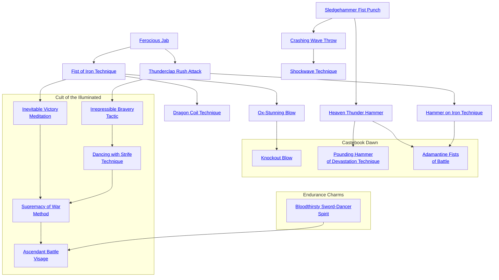

## Ferocious Jab

Cost: 1 mote
Duration: Instant
Type: Supplemental
Minimum Brawl: 1
Minimum Essence: 1
Prerequisite Charms: None

The character infuses his anima with Essence, making
his strikes much more damaging. On a successful attack,
the character may count his extra successes twice for the
purposes of determining damage. The Essence for this
Charm may be spent after the character rolls the attack.

## Fist of Iron Technique

Cost: 1 mote
Duration: Instant
Type: Supplemental
Minimum Brawl: 3
Minimum Essence: 1
Prerequisite Charms: Ferocious Jab

The character suffuses her fists with Essence, hardening
them into deadly weapons. Until her next action, her
hand-to-hand strikes do lethal damage, and she can safely parry
lethal damage blows with her hands. However, she is no
faster than normal and so, generally, cannot parry incoming
arrows or magical attacks without a well-described stunt.

## Ox-Stunning Blow

Cost: 1 mote per die
Duration: Instant
Type: Simple
Minimum Brawl: 4
Minimum Essence: 1
Prerequisite Charms: Fists of Iron Technique

The character concentrates her anima around her fist
and smashes it into her enemy, stunning and disorienting
him. The character makes a normal attack with her Dexterity
+ Brawl. If successful, the attack does no normal
damage but, instead, does a base of one point of stunning
damage for every mote spent on the Charm. This stunning
damage is soaked as bashing damage, but can only be
soaked with the target's Stamina. Extra successes on the
attack add to damage as usual. However, rather than doing
health levels of damage, each success on the damage roll
imposes a -1 penalty to the target's dice pools for a number
of turns equal to (7 - the target's Stamina).
The Exalted using this Charm cannot spend more
motes of Essence to power this Charm than twice his
Strength, and the Storyteller may rule that certain types of
opponents (mechanical constructs, shambling corpses or
giant man-eating trees, for example) are too sturdy or
insensible to be stunned by the character's mighty blows.

## Dragon Coil Technique

Cost: 3 motes per turn
Duration: Varies
Type: Simple
Minimum Brawl: 4
Minimum Essence: 1
Prerequisite Charms: Fists of Iron Technique

The character may wrap his opponents in his mighty
arms and crush the very life from them. The character makes
a clinch attack as normal, but the attack does the character's
Strength + Essence + 2 in lethal damage, while the subject of
the clinch does only the normal Strength + 2 bashing. If the
target attempts to escape the clinch, the character performing
the Dragon Coil Technique may add his Essence in automatic
successes to the reflexive roll to resist the escape attempt.
If the target also has Dragon Coil Technique, she may
choose to activate it as her action on subsequent turns and
do her Strength + Essence + 2 in lethal damage as well.
Maintaining this Charm over multiple turns prevents the
character from using simple and supplemental Charms but
does not prevent the use of reflexive defensive Charms.
This Charm is not compatible with Hammer on Iron
Technique or other Charms of the extra action type and
cannot be placed in Combos with them.

## Thunderclap Rush Attack

Cost: 3 motes
Duration: Instant
Type: Reflexive
Minimum Brawl: 3
Minimum Essence: 1
Prerequisite Charms: Ferocious Jab

The character pours Essence into quickening her
motions and rushes aggressively toward her enemy. She
automatically wins initiative over a single opponent.
Characters cannot split their dice pools on the turn they
use Thunderclap Rush Attack. Two characters using
Thunderclap Rush Attack in competition roll for initiative normally.

## Hammer on Iron Technique

Cost: 4 motes, 1 Willpower
Duration: Instant
Type: Extra Action
Minimum Brawl: 4
Minimum Essence: 2
Prerequisite Charms: Thunderclap Rush Attack

The character suffuses his body with Essence, turning
him into a virtual killing machine, with arms like pounding
triphammers. He gains a number of additional attacks
equal to his Essence but must make all his attacks against
the same target. Hammer on Iron Technique cannot be
Comboed with defensive Charms that allow the character
to dodge or otherwise avoid attacks, but may be combined
with those that allow her to soak or ignore damage.

## Sledgehammer Fist Punch

Cost: 3 motes
Duration: One turn
Type: Simple
Minimum Brawl: 1
Minimum Essence: 1
Prerequisite Charms: None

The character can suffuse his body with Essence,
concentrating his anima until it is a crackling nimbus
around him, and become capable of great destruction. This
Charm must be used to attack inanimate objects and
doubles the amount of damage the character does after
extra successes are added but before the object's soak is
applied. This increase in Strength does not add directly to
combat damage, though it may assist the character in
causing indirect damage (for example, by causing a tower
to collapse on top of his opponent).

## Crashing Wave Throw

Cost: 2 motes
Duration: Instant
Type: Simple
Minimum Brawl: 2
Minimum Essence: 1
Prerequisite Charms: Sledgehammer Fist Punch

The character tightly focuses his anima, making him
able to apply his Strength more effectively. In addition to
doing normal damage, the character also throws his opponent
on a successful attack. The target is hurled a number
of yards equal to the character's Strength + his extra
successes on the attack roll. This attack cannot be blocked,
only dodged. A target who strikes a solid object takes dice
of damage equal to the number of yards she would have
continued flying had the object not been in the way. This
damage is typically bashing but can be lethal if (for
example) the object is covered in sharp steel spikes.
Obviously, the target can also suffer serious injury if she is
tossed over a cliff or off a ship at sea.

## Heaven Thunder Hammer

Cost: 3 motes
Duration: Instant
Type: Supplemental
Minimum Brawl: 3
Minimum Essence: 1
Prerequisite Charms: Sledgehammer Fist Punch

The character fully concentrates his anima, gathering
dense Essence around his fists. Not only do the character's
unarmed attacks do normal damage, they also hurl his
opponents great distances. For each health level of damage
he inflicts before soak, the target is hurled backward a yard,
as per the effects of the Crashing Wave Throw Charm.

Errata:
Read &quot;For each health level of damage he inflicts before soak…&quot; as &quot;For each point of raw, pre-soak
damage he inflicts…&quot;

## Shockwave Technique

Cost: 4 motes
Duration: Instant
Type: Simple
Minimum Brawl: 4
Minimum Essence: 1
Prerequisite Charms: Crashing Wave Throw

The character burns with Essence, increasing her
strength and agility to superhuman levels. She seizes one
opponent and picks him up bodily, using him to strike
another foe. The character makes one attack roll against the
primary target. The attack cannot be blocked, only dodged.
If successful, this attack does no damage, but the attacker
may immediately make a reflexive Brawl attack at her full
dice pool against another target within hand-to-hand range.
If the second attack is successful, both the targets take
bashing damage equal to the character's Strength + the
extra successes on the Exalted's reflexive attack. The second
target may parry or dodge to reduce damage or avoid the
attack, but if the attack is parried, the character being used
as a club takes bashing damage equal to the Strength of the
Exalted swinging him around + the number of successes the
parrying character rolled to block the attacks.
If the Exalted hits with her second attack, both targets are
left in a heap on the ground and must spend an action to return
to their feet. If the second attack misses, the character being
used as a club is hurled a number of yards equal to the Exalted's
Strength, in a direction of the Exalted's choice, as if he had been
successfully attacked with the Crashing Wave Throw Charm.

## Knockout Blow

Cost: 3 motes + 2 motes per additional die
Duration: Instant
Type: Supplemental
Minimum Brawl: 4
Minimum Essence: 3
Prerequisite Charms: Ox-Stunning Blow

With greater skill and Essence comes greater power and
control. This Charm allows the character to precisely gauge the
amount of damage he is causing. Punches enhanced by this
Charm cannot accidentally do lethal damage to the target. If the
player rolls more health levels of damage than the target has
remaining health levels, all remaining damage is ignored. If the
damage rolled is insufficient to knock out the target, then the
attacker can roll additional dice in an attempt to do enough
damage to knock the target out. The character may buy
additional damage dice at 2 motes per die. These dice are bought
and rolled one at a time as a Reflexive Action, and a character
can continue buying and rolling them for as long as he can pay
for them. A character cannot buy dice to gain additional damage
levels beyond those required to knock out the target.
Characters can easily run out of Essence if they use this
Charm repeatedly. If a character runs out of Essence while
using this Charm, count all damage dice that have been paid
for. This Charm cannot be used if the character is wielding
Tiger Claws or any other weapon or magical effect that
causes his punches to do lethal damage.

## Pounding Hammer of Devastation Technique

Cost: 7 motes
Duration: Instant
Type: Supplemental
Minimum Brawl: 5
Minimum Essence: 5
Prerequisite Charms: Heaven Thunder Hammer

The character concentrates vast amounts of Essence
around her hands, allowing her to inflict terrible wounds. The
character's blow does lethal damage. In addition, when used
against a living target, this Charm adds a bonus to the base
damage of the attack equal to the attacking character's Permanent
Essence. However, this Charm is far more effective when
used against inanimate targets. If the character attacks an
inanimate object, add a number of damage levels equal to four
times the attacking character's Permanent Essence. A single
such punch or kick can knock down a sturdy oak door or break
a hole in a ship's hull large enough to walk through.

## Adamantine Fists of Battle

Cost: 7 motes, 1 Willpower
Duration: One scene
Type: Supplemental
Minimum Brawl: 5
Minimum Essence: 6
Prerequisite Charms: Heaven Thunder Hammer, Hammer on Iron Technique

Essence concentrates around the character's hands, infusing
them with great and lasting power. For the next full scene, the
character adds a number of levels of damage equal to twice her
Permanent Essence to all Brawling attacks. When this Charm is
performed, the caster can also specify whether these attacks will
do bashing or lethal damage. Using this Charm, the character can
even choose to do bashing damage when wielding a weapon that
would normally cause his blow to do lethal damage.

## Inevitable Victory Meditation

Cost: 3 motes, 1 Willpower
Duration: Until used
Type: Simple
Minimum Brawl: 5
Minimum Essence: 1
Prerequisite Charms: Fist of Iron Technique

A master warrior must have complete knowledge of
his own skills and prowess. With a moment of focus, the
Solar centers himself and secures his knowledge of victory.
When the perfect opportunity to strike comes, the Solar
will know and make full use of the opening. Unlike the
meditative nature of martial arts, this technique is trance-like,
similar to the perfect, blood-tinted awareness of
victory that cold-eyed berserkers receive.
The Solar takes a moment to focus himself into his
trance, letting his skill reach an instinctive level, and
then, his player rolls the character's Wits + Brawl, adding
a number of successes equal to the Solar's Essence. The
Solar may spend a Willpower point on the roll for an
automatic success, augment it with any appropriate
Charms or use any other appropriate, normal method for
improving the success of this roll. The Solar's player
notes the number of successes he received on the roll. At
any time for the remainder of the scene, the Solar may
reflexively replace the results of any single Brawl roll
with the successes rolled during the activation of Inevitable
Victory Meditation. Inevitable Victory Meditation
replaces the previous roll in its entirety, and any bonuses
that applied to the previous roll, including dice or successes
gained from Charms, Virtues or Willpower points,
are lost. After Inevitable Victory Meditation has replaced
a Brawl roll, the Charm expires, and the character
must activate it again if he wishes to reap its benefits once
more. A Solar may freely end the Charm prematurely if,
for example, his player rolls poorly upon activation and
wishes to try again for a better result. While activating
Inevitable Victory Meditation counts as the Solar's Charm
use for the turn, replacing the successes of a roll does not.
A Solar may wait for his opponent to roll for his defense
before replacing the successes of his attack roll. A Solar
may not have more than one instance of this Charm
active at any given time.

## Irrepressible Bravery Tactic

Cost: 3 motes per success
Duration: Instant
Type: Reflexive
Minimum Brawl: 3
Minimum Essence: 2
Prerequisite Charms: Thunderclap Rush Attack

A master warrior must have complete knowledge of
his surroundings and the progression of the fight. For a
Solar who has mastered this technique, the battle flows
around him, and he makes instinctive use of everything
that surrounds him and the constant, shifting nature of the
fight to his advantage. Brawlers with this Charm have a
reputation for foolhardy bravery and dumb luck, for they
make use of surprising and spectacular aspects of the fight,
turning seemingly hopeless situations to their advantage.
Any time a Solar gains bonus dice from a stunt, the
Solar may spend 3 motes per stunt die to convert each die
into an automatic success. The die isn't rolled and is simply
counted as a success. To use this Charm, the stunt must
make use of the Solar's surroundings or some ongoing aspect
of the fight (such as his opponent's last attack), or the Solar
must perform a surprisingly brave or foolhardy act. For the
purposes of this Charm, the bonus dice gained from the
Daredevil or Signature Style Merits count as stunt dice.

## Dancing with Strife Technique

Cost: 3 motes
Duration: Instant
Type: Reflexive
Minimum Brawl: 3
Minimum Essence: 3
Prerequisite Charms: Irrepressible Bravery Tactic

A master warrior must have complete knowledge of
his opponent, understanding the true extent of the danger
he faces. The greatness of Solars can only manifest
when faced with foes of equal greatness, and those who
have mastered Dancing with Strife Technique understand
this principle, throwing themselves at greater and
greater foes to feel the joy of battle. Anytime the Solar
successfully defends himself from an attack that received
no less than (the Solar's Essence or 5, whichever is
higher) successes, he may activate this Charm and gain
a temporary point of Willpower. This Charm does not
allow the Solar to gain more temporary Willpower than
his permanent rating.

## Supremacy of War Method

Cost: 1 mote per die
Duration: One scene or until used
Type: Reflexive
Minimum Brawl: 5
Minimum Essence: 3
Prerequisite Charms: Inevitable Victory Meditation, Dancing with Strife Technique

A true warrior has mastered himself, his battlefield
and his foes. Every movement, every attack, every action of
his foes only increases the mastery of the Solar's combat
technique as he is driven to prove his supremacy upon the
field of battle. Anytime an enemy takes an action against
the Solar, either an attack or a defense, the Solar may reflexively
activate Supremacy of War Method in response. The
Solar may commit 1 mote per success his opponent made on
his roll. At any time during the following scene, the Solar
may add a number of dice to any Brawl roll up to the number
of motes committed to Supremacy of War Method.
Each die added reduces the Essence committed by 1 mote.
A Solar must choose to add dice to his roll before, not after,
he makes his roll.
Activating Supremacy of War Method counts as a
Charm use for the turn, but gaining bonus dice does not.
For example: Michael is attacked by an Immaculate who
scores seven successes on his attack roll. Michael spends 7
motes on Supremacy of War Method. On the following
turn, he makes an attack, adds seven dice to his dice pool
and chooses to activate Ferocious Jab.
A Solar may activate Supremacy of War Method
multiple times in a scene to increase his total committed
motes, but he may never have more motes committed
to Supremacy of War Method than his Wits + Brawl.
Dice added through Supremacy of War Method are
derived from a Charm and, thus, are subject to all
associated limitations.

## Ascendant Battle Visage

Cost: 10 motes, 1 Willpower
Duration: One turn
Type: Simple
Minimum Brawl: 5
Minimum Endurance: 5
Minimum Essence: 4
Prerequisite Charms: Supremacy of War Method, Bloodthirsty Sword-Dancer Spirit

By combining his pure, instinctive awareness of
combat mastered through Supremacy of War Method
with the raging fury mastered through Bloodthirsty Sword-Dancer
Spirit, the Solar unlocks a deadly secret of his
anima. In a fantastic display of power, the Solar's anima
flares to full totemic glory, and within that pillar of divine
light, the Solar is reshaped, his body marked by his totem
and the colors of his anima. A Night Caste with the
totem of the wolf might gain a long, thick mane of grey
hair, sharpened teeth and violet or golden eyes, and a
Dawn Caste with the totem of the snake might gain a
long, sinuous tattoo of a serpent upon his body and eyes
of violent crimson. In this temporary state of power, the
Solar's player adds his character's Essence in automatic
successes to any combat rolls made, excluding damage
rolls, though the number of successes he adds may not
exceed the number of dice rolled, excluding bonus dice
gained from Charms. This Charm lasts only a short time
and threatens to enrage the character if sustained for too
long. Once Ascendant Battle Visage has expired, the
character may reflexively renew it. Doing so costs him no
Essence or Willpower. Instead, for each turn he extends
Ascendant Battle Visage, roll his highest Virtue. Each
success increases his Limit by 1. Should the Solar suffer
Limit Break during the use of this Charm, he frenzies as
per Bloodthirsty Sword-Dancer Spirit, and Ascendant
Battle Visage's bonuses remain for the rest of the scene.
The actual effects of the Limit Break itself, including the
bonus to Willpower, begin after the scene ends.
