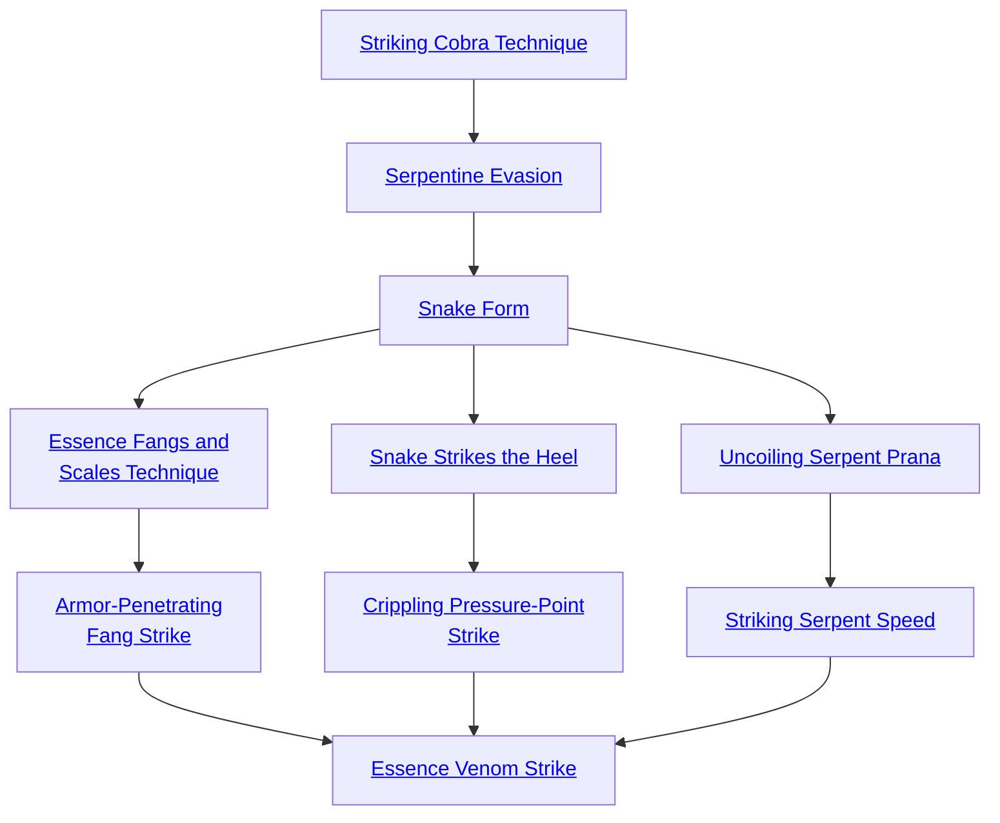
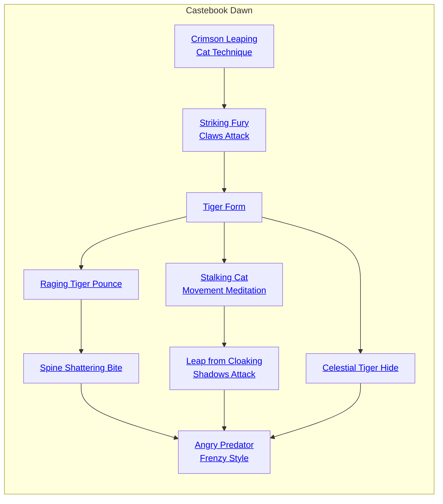
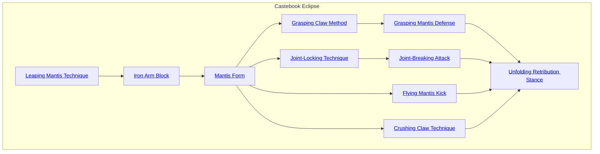
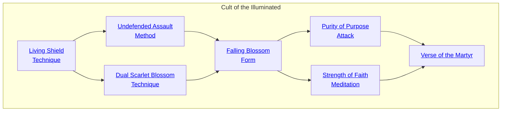

```mermaid

flowchart TD

    subgraph Castebook Night
        image_of_death_technique["<a class='internal-link' href='#Image of Death Technique'>Image of Death Technique</a>"]

        wall_climbing_technique["<a class='internal-link' href='#Wall-Climbing Technique'>Wall-Climbing Technique</a>"]

        distracting_finger_gesture_attack["<a class='internal-link' href='#Distracting Finger-Gesture Attack'>Distracting Finger-Gesture Attack</a>"]

        ebon_shadow_form["<a class='internal-link' href='#Ebon Shadow Form'>Ebon Shadow Form</a>"]

        seven_point_of_weakness_strike["<a class='internal-link' href='#Seven Points of Weakness Strike'>Seven Points of Weakness Strike</a>"]

        limb_immobilizing_method["<a class='internal-link' href='#Limb-Immobilizing Method'>Limb-Immobilizing Method</a>"]

        paralyzing_touch_attack["<a class='internal-link' href='#Paralyzing Touch Attack'>Paralyzing Touch Attack</a>"]

        elusive_flicker_evasion["<a class='internal-link' href='#Elusive Flicker Evasion'>Elusive Flicker Evasion</a>"]

        blow_concealing_gesture_technique["<a class='internal-link' href='#Blow-Concealing Gesture Technique'>Blow-Concealing Gesture Technique</a>"]

        shadow_body_style["<a class='internal-link' href='#Shadow Body Style'>Shadow Body Style</a>"]

        shadow_stepping_motion["<a class='internal-link' href='#Shadow-Stepping Motion'>Shadow-Stepping Motion</a>"]
    end

    image_of_death_technique --> wall_climbing_technique
    wall_climbing_technique --> distracting_finger_gesture_attack
    distracting_finger_gesture_attack --> ebon_shadow_form
    ebon_shadow_form --> seven_point_of_weakness_strike
    seven_point_of_weakness_strike --> limb_immobilizing_method
    limb_immobilizing_method --> paralyzing_touch_attack
    ebon_shadow_form --> elusive_flicker_evasion
    elusive_flicker_evasion --> blow_concealing_gesture_technique
    blow_concealing_gesture_technique --> shadow_body_style
    paralyzing_touch_attack --> shadow_stepping_motion
    shadow_body_style --> shadow_stepping_motion

```

## Striking Cobra Technique

Cost: 3 motes
Duration: Instant
Type: Reflexive
Minimum Martial Arts: 2
Minimum Essence: 1
Prerequisite Charms: None

The character charges her form with Essence to move
with the speed and deftness of the snake she seeks to
emulate. During the turn when this Charm is activated,
the character adds her Martial Arts score to her initiative
total. This Charm may be used only once per turn.

## Serpentine Evasion

Cost: 3 motes
Duration: Instant
Type: Reflexive
Minimum Martial Arts: 3
Minimum Essence: 1
Prerequisite Charms: [[#Striking Cobra Technique]]

The character's infuses her anima with Essence, and
it guides her body to flow with serpentine grace. By
invoking this Charm, she may add a number of dice equal
to her Martial Arts score to a single dodge attempt.

## Snake Form

Cost: 5 motes
Duration: One scene
Type: Simple
Minimum Martial Arts: 4
Minimum Essence: 2
Prerequisite Charms: [[#Serpentine Evasion]]

The Exalted adopts the attitude and stance of a wary
snake - head back, ready to strike or retreat. For the rest
of the scene, he adds his Martial Arts score to his initiative
totals and his bashing soak. Also, his sinuous, hypnotic
movements slow and distract enemies. Enemies attacking
him subtract a number of dice from their pool equal to the
Exalted's Essence. This latter effect only works if the target
can see the characters movements — a blind opponent
would be unfazed by this aspect of Snake Form. This
Charm is incompatible with the use of armor.
Characters cannot use more than one Martial Arts
Form-type Charm at a time. Snake Form is the only Form-type
Charm in the Exalted book, but more Martial Arts
styles will be introduced in later supplements.

## Essence Fangs and Scales Technique

Cost: 6 motes
Duration: One scene
Type: Simple
Minimum Martial Arts: 5
Minimum Essence: 2
Prerequisite Charms: [[#Snake Form]]

Thought training and the use of Essence, the character
learns to harden her fingers into talons, like the fangs of a
striking snake. Likewise, she can toughen her skin until it is
as strong and supple as snake's skin. For the rest of the scene,
the character's Martial Arts attacks do lethal damage, and
she soaks lethal damage with her bashing soak total. This
Charm is incompatible with the use of armor or weapons.

## Armor-Penetrating Fang Strike

Cost: 5 motes, 1 Willpower
Duration: Instant
Type: Supplemental
Minimum Martial Arts: 5
Minimum Essence: 2
Prerequisite Charms: [[#Essence Fangs and Scales Technique]]

The character can harden her fingers to the degree
that they can punch through nearly anything and cause
trauma merely by the intensity of their Essence. The
character's attack ignores the soak of the target's armor
and can be soaked only by the target's Stamina.

## Snake Strikes the Heel

Cost: 4 motes
Duration: Instant
Type: Reflexive
Minimum Martial Arts: 5
Minimum Essence: 2
Prerequisite Charms: [[#Snake Form]]

Like the snake, the Exalted defends herself by attacking.
Whenever she is successfully attacked, the character
may immediately (before damage is determined) make a
Martial Arts counterattack with a dice pool equal to her
Martial Arts Ability plus the attacker's extra successes on
his attack. The damage from her opponent's attack and her
own counterstrike is applied simultaneously. Snake Strikes
the Heel cannot be used to retaliate against Solar Counter-
attack or any other counterattack Charm.

## Crippling Pressure-Point Strike

Cost: 3 motes
Duration: Instant
Type: Simple
Minimum Martial Arts: 5
Minimum Essence: 2
Prerequisite Charms: [[#Snake Strikes the Heel]]

The character makes a Martial Arts attack as normal,
including the roll for damage. However, the attack
does no actual damage. Rather, for every health level
the character would have inflicted, her target is at a -1
penalty to all rolls for a number of turns equal to the
Martial Arts of the Exalted who used the Crippling
Pressure-Point Strike.

## Uncoiling Serpent Prana

Cost: 3 motes
Duration: Instant
Type: Supplemental
Minimum Martial Arts: 5
Minimum Essence: 3
Prerequisite Charms: [[#Snake Form]]

The character infuses his anima with Essence and
lashes out, his anima flashing forward like a striking snake.
The Exalted may invoke this Charm and make a Martial
Arts attack a number of yards away equal to his Essence.
The character's anima actually strikes the target, so there
must be a clear path to the target, and the character must
be able to perceive the target well enough to attack.

## Striking Serpent Speed

Cost: 6 motes, 1 Willpower
Duration: Instant
Type: Extra Action
Minimum Martial Arts: 5
Minimum Essence: 3
Prerequisite Charms: [[#Uncoiling Serpent Prana]]

The character internalizes the reflexes and raw speed
of a coiled snake. The player rolls the Exalted's Martial
Arts Ability, and for every success, she may take an extra
action during the turn. This extra action need not be an
attack. A character may not split her dice pool during the
round she uses Striking Serpent Speed.

## Essence Venom Strike

Cost:10 motes, 1 Willpower, 1 health level
Duration: Instant
Type:Simple
Minimum Martial Arts: 5
Minimum Essence: 3
Prerequisite Charms: [[#Armor-Penetrating Fang Strike]], [[#Crippling Pressure-Point Strike]], [[#Striking Serpent Speed]]

The character concentrates her Essence on the tips of
two fingers, making her attack as quick as lightning and as
deadly as the strike of a dozen serpents. The character
invokes the Charm and makes a Martial Arts attack as
normal, but adds her Essence score to the damage of the
attack. The attack does aggravated damage.

## Crimson Leaping Cat Technique

Cost: 3 motes
Duration: One turn
Type: Supplemental
Minimum Martial Arts: 2
Minimum Essence: 2
Prerequisite Charms: None

The character charges her form with Essence, moving
with the speed and agility of a leaping tiger. During the turn
when this Charm is activated, the character adds her Martial
Arts score to her Dexterity for purposes of determining how
fast she can sprint, run or jump in a single turn.

## Striking Fury Claws Attack

Cost: 2 motes
Duration: Instant
Type: Supplemental
Minimum Martial Arts: 3
Minimum Essence: 2
Prerequisite Charms: [[#Crimson Leaping Cat Technique]]

The character charges her anima with Essence, which in
turn infuses her hands with the power ofa tiger's deadly claws. Her
blows do lethal damage even if she is not wearing tiger claws. Ifshe
is using tiger claws, she may add a number of damage dice equal
to her Permanent Essence score to her raw damage for the attack.

## Tiger Form

Cost: 6 motes
Duration: One scene
Type: Simple
Minimum Martial Arts: 4
Minimum Essence: 2
Prerequisite Charms: [[#Striking Fury Claws Attack]]

The character adopts the attitude and stance of a raging
tiger — crouching, ready to spring on its prey. While using the
Tiger Form, he adds his Martial Arts score to his damage when
making Martial Arts attacks and adds his Permanent Essence
to his bashing and lethal soak totals. The damage bonus applies
only if the character is attacking barehanded or wearing tiger
claws. Also, the character's Martial Arts attacks automatically
do lethal damage even if he is not wearing tiger claws, and the
character suffers no penalties for fighting while prone. This
Charm is incompatible with armor. Characters cannot use
more than one martial arts form-type Charm at a time.

## Raging Tiger Pounce

Cost: 2 motes
Duration: One turn
Type: Supplementary
Minimum Martial Arts: 4
Minimum Essence: 2
Prerequisite Charms: [[#Tiger Form]]
The character can use her Essence to guide her attacks
in imitation of a tiger leaping on its prey. If her attack strikes
her opponent, she automatically knocks that opponent
down. Only Charms like Immaculate Balance or other
similar magical effects that maintain the target character's
balance can prevent the victim from falling.

## Spine Shattering Bite

Cost: 3 mote + 1 mote per die
Duration: Instant
Type: Simple
Minimum Martial Arts: 4
Minimum Essence: 3
Prerequisite Charms: [[#Raging Tiger Pounce]]

The character can infuse his hands with Essence, hardening
them to the degree that they cause massive and deadly
wounds. The character's hands do base damage of 4L. if he
attacks unarmed, or add 4 to his base damage if he is attacking
with tiger claws. For each additional mote of Essence spent
on this Charm, the character may add one die to a single
attack, up to a limit of double the character's regular Dexter-
ity + Melee dice pool. The attacker's hands leave deep
furrows in the target; they can even claw through wooden or
iron-bound doors and deeply score stone in a single blow.

## Stalking Cat Movement Meditation

Cost: 3 motes + 1 mote per die
Duration: One scene
Type: Simple
Minimum Martial Arts: 5
Minimum Essence: 2
Prerequisite Charms: [[#Tiger Form]]

Like the tiger, the Exalted can stealthily stalk her prey.
Whenever she sneaks up on an opponent, the character may
add one die to all Stealth and Awareness rolls involved in the
ambush for every two motes of Essence spent activating this
Charm. The effects persist until the character ambushes her
target or she is detected. The character cannot spend more
motes to increase her dice pool than she has points of
Permanent Essence. This Charm only works when a character
is actually sneaking up on an opponent; no bonuses are
gained if the character is attempting to sneak away from
danger or for any other purpose (for example, stealing
something or scouting enemy positions).

## Leap from Cloaking Shadows Attack

Cost: 5 motes
Duration: Instant
Type: Supplemental
Minimum Martial Arts: 5
Minimum Essence: 3
Prerequisite Charms: [[#Stalking Cat Movement Meditation]]

The Exalted can spring from cover with the deadly force
of a tiger leaping onto the back of an unsuspecting gazelle.
When attacking a target unaware of the Exalted character's
presence, the target's lethal or bashing soak score is halved
before the raw damage of the attack is applied. If the target
knows the attacker's location, or is aware of an impending
attack, this Charm does not function. A target's successful use
of the Surprise Anticipation Method (see Exalted, p. 197)
completely negates the effects of this Charm.

## Celestial Tiger Hide

Cost: 5 motes, 1 Willpower
Duration: One scene
Type: Simple
Minimum Martial Arts: 5
Minimum Essence: 2
Prerequisite Charms: [[#Tiger Form]]

Infusing her skin with the toughness of a tiger's hide,
the character strengthens it against all forms of damage.
The character may add her Martial Arts score to all bashing
and lethal soak rolls for the duration of the scene. This
Charm is incompatible with armor and has no effect on
aggravated damage.

## Angry Predator Frenzy Style

Cost: 7 motes, 1 Willpower
Duration: One scene
Type: Extra Action
Minimum Martial Arts: 5
Minimum Essence: 4
Prerequisite Charms: [[#Spine Shattering Bite]], [[#Leap from Cloaking Shadows Attack]]

Cloaking Shadows Attack, Celestial Tiger Hide
Burning with the passion of an enraged tiger, the character
can lash out in a rain of deadly blows. A character using this
Charm may make two attacks every turn, so longas she uses her
Martial Arts ability. In addition, whenever she is successfully
attacked, the character may immediately (before damage is
determined) make a Martial Arts counterattack with a dice
pool equal to her Martial Arts ability plus the attacker's extra
successes from his attack. The damage from the opponent's
attack and his own counterstrike are applied simultaneously.
This Charm cannot be used to retaliate against any other
counterattack Charm. Each blow does lethal damage even if
the attacking character is not wearing tiger claws. If desired, a
full parry or full dodge can be substituted for one or both of the
character's two normal actions. However, the character can-
not split any of these dice pools to obtain further multiple
actions. This Charm is incompatible with armor. A character
using Angry Predator Frenzy Style cannot use any other Extra
Actions-type Charms while this Charm is active.

## Image of Death Technique

Cost: 2 motes
Duration: Up to 24 hours
Type: Simple
Minimum Martial Arts: 2
Minimum Essence: 2
Prerequisite Charms: None

The character can use her Essence to temporarily
appear to be dead. The instant she performs this Charm,
she falls to the ground, seemingly deceased. A careful
examination and a successful Perception + Medicine roll
of difficulty 3 is necessary to determine that the character
is actually still alive. While this Charm is in effect, the
character can hold her breath 10 times as long as normal,
and she does not need to eat of drink. Although the
character can use her senses of hearing, touch and smell
normally, she cannot see or move while this Charm is in
effect. However, she can act normally the turn after she
chooses to end this Charm.

## Wall-Climbing Technique

Cost: 1 mote
Duration: One turn
Type: Reflexive
Minimum Martial Arts: 3
Minimum Essences 2
Prerequisite Charms: [[#Image of Death Technique]]

The character using this Charm can climb walls,
ropes, chains and other vertical surfaces as easily as he can
walk along a floor. Using Wall Climbing Technique, the
character can climb up to his normal movement rate per
turn. In his next turn, the character must either activate
the Charm again, remain where he is (if such is possible)
or attempt to leap or climb down normally.

## Distracting Finger-Gesture Attack

Cost: 2 motes
Duration: Instant
Type: Reflexive
Minimum Martial Arts: 3
Minimum Essence: 2
Prerequisite Charms: [[#Wall-Climbing Technique]]

The character can make a complex sign with her
fingers and charge it with Essence. This sign distracts and
slows a single opponent. It takes only an instant to make
and is performed at the beginning of the turn. The
character's Martial Arts score is subtracted from a single
opponent's initiative roll, and the Charm prevents this
opponent from splitting her dice pool that turn (although
the opponent may use Combos and reflexive and extra
action Charms normally and may abort to dodge or parry
as usual). If, for any reason, the opponent's initiative roll
is reduced below 1, the opponent may not act that turn.

## Ebon Shadow Form

Cost: 5 motes
Duration: One scene
Type: Simple
Minimum Martial Arts: 4
Minimum Essence: 2
Prerequisite Charms: [[#Distracting Finger-Gesture Attack]]

The Exalt moves with the speed and ease of a
flickering shadow While using the Ebon Shadow Form,
she adds her Martial Arts score to her initiative total. In
addition, she adds a number of dice equal to her permanent
Essence to her Stealth score, and the difficulty of
all attacks against the character is increased by a number
equal to the character's permanent Essence. The character
can also decide whether any of her attacks made with
hands, feet, sai or fighting chains will do bashing or
lethal damage. This decision must be made before a
given attack is rolled. This Charm is incompatible with
armor. Characters cannot use more than one Martial
Arts Form-type Charm at a time. If a character is killed
while under the effects of Ebon Shadow Form, her body
dissipates into acrid black smoke. She leaves no ghost,
and her physical remains provide no evidence of her
identity (though her gear may).

## Seven Points of Weakness Strike

Cost: 3 motes
Duration: Instant
Type: Supplemental
Minimum Martial Arts: 4
Minimum Essence: 3
Prerequisite Charms: [[#Ebon Shadow Form]]

The character uses her Essence to guide her hand,
foot or weapon so that it strikes the weakest point in her
target's armor. As a result, a number of points equal to the
character's Martial Arts score are subtracted from the
target's lethal or bashing soak before damage from this
attack is applied.

## Limb-Immobilizing Method

Cost: 3 motes
Duration: One scene
Type: Simple
Minimum Martial Arts: 4
Minimum Essence: 3
Prerequisite Charms: [[#Seven Points of Weakness Strike]]

A character trained in the Ebon Shadow Style learns
all of the weak points found in living bodies. With a slight
touch, the martial artist can immobilize one of her target's
limbs. The character need merely tap an unsuspecting
target, a normal unarmed attack at +1 difficulty. The
attack can be blocked or dodged as normal and does no
damage. The attacker can choose which limb is paralyzed,
and the target limb is immobilized for the remainder of
the scene. Immobilizing a human's leg halves his movement
speed, and the target's player must make a reflexive
Dexterity + Athletics roll every time his character is
struck to keep him from falling. Characters with both legs
immobilized can only crawl and must generally perform
stunts to attack, dodge or parry. Immobilizing the leg of a
horse or other animal with four or more legs merely halves
the distance it can move every turn. Immobilizing an arm
keeps the target from using that arm to attack. This attack
does no actual damage to the target, but it may cause off-
hand penalties, and paralyzing both the target's arms
makes it very difficult for him to fight effectively. This
attack has no effect against the undead, automata and
other beings that have no vital functions to obstruct.

## Paralyzing Touch Attack

Cost: 6 motes, 1 Willpower
Duration: One scene
Type: Simple
Minimum Martial Arts: 5
Minimum Essence: 3
Prerequisite Charms: [[#Limb-Immobilizing Method]]

This Charm allows the character to stun or incapacitate
a target with a mere touch to one of the five vital
centers. To perform this attack, the character must lightly
tap the target on one of several possible nerve points,
making a normal unarmed attack. This attack does no
damage. However, the Exalt's player may roll a number of
dice equal to her character's Martial Arts + the number of
extra successes she made on the attack, against a difficulty
equal to the target's Essence. Each extra success on this
roll reduces the target's Dexterity.by one dot. If the.
target's Dexterity is reduced to zero, he is paralyzed. Lost
Dexterity returns at the end of the scene. The effect is also
dispersed if the player of a character with Medicine and
Martial Arts at 3 or higher makes a successful Wits +
Martial Arts roll at difficulty 3 to remove the paralysis.
Removing paralysis is a normal dice action, and the target
may move normally in the next turn. With a successful
Wits + Stealth roll of difficulty 1, this touch can be made
to seem like a simple pat on a shoulder or an unintentional
push. This attack cannot be used against the undead or
other beings that lack vital centers.

## Elusive Flicker Evasion

Cost: 4 motes
Duration: One turn
Type: Reflexive
Minimum Martial Arts: 4
Minimum Essence: 2
Prerequisite Charms: [[#Ebon Shadow Form]]

The character becomes as difficult to hit as a dimly
lit shadow. Until her next action, add a number of dice
equal to her permanent Essence score to all dodge
attempts, including Dodge attempts involving reflexive
Charms such as Shadow Over Water. If, for some reason,
she has no Dodge pool, she may reflexively dodge attacks
with her Essence.

## Blow-Concealing Gesture Technique

Cost: 2 motes, 1 Willpower
Duration: Instant
Type: Supplemental
Minimum Martial Arts: 5
Minimum Essence: 3
Prerequisite Charms: [[#Elusive Flicker Evasion]]

The character can make an Essence-enhanced gesture
that renders his opponent unable to notice or react to
an attack the character makes. The opponent cannot
dodge or parry the character's blow without the use of
Charms. The target's player may make a reflexive Wits +
Awareness roll for the attack, with a difficulty equal to the
attacking character's Essence. If the roll succeeds, the
opponent may use any reflexive Charms or abilities she
possesses to counter the attack but may not avoid it
nonmagically. If the roll fails, the opponent may use only
Charms that specifically state they work on attacks the
- character is not aware of. This Charm may explicitly be
used in a Combo with Charms of other Abilities.

## Shadow Body Style

Cost: 3 motes, 1 Willpower
Duration: One scene
Type: Reflexive
Minimum Martial Arts: 5
Minimum Essence: 4
Prerequisite Charms: [[#Blow-Concealing Gesture Technique]]

This Charm allows the character to flatten her body in
order to pass through narrow spaces as easily as a shadow
slides under a door. The character can fit her entire body
through any space wide enough for her to fit her fingers
through. The character is shadowy and indistinct, composed
of tangible darkness and not flesh. It is impossible to identify
the character while this Charm is in effect, though her gear
may betray her. Even if her anima banner activates, only her
Caste Mark will shine forth, and her anima banner, while
bright as usual, will be muted and generic.
The Exalt cannot wear any armor when using this
Charm, but she adds a number of dice equal to her
permanent Essence to both her lethal and bashing soaks
while the Charm is in effect. This Charm is incompatible
with any other Charms that increase the character's
natural soak and have durations longer than Instant. A
character using this Charm sees as easily in total darkness
as in light, though she must actually use her eyes to see,
and so, this magic lends no aid if she must fight blind-
folded or in thick fog.

## Shadow-Stepping Motion

Cost: 7 motes, 1 Willpower
Duration: Instant
Type: Simple
Minimum Martial Arts: 5
Minimum Essence: 5
Prerequisite Charms: [[#Paralyzing Touch Attack]], [[#Shadow Body Style]]

In ancient times, Exalted assassins circumvented the
protections of their enemies by stepping directly through
them. By using this Charm, the Exalt steps into a shadow
and steps out of another shadow far away, near his desti-
nation. The Exalt must have a shadow to step into, and he
must have seen his destination before, though seeing it
through a familiar, sorcerous scrying or what have you
also counts. The Exalt then steps into the shadow as a
simple action. He reappears at the beginning of next tum
in the nearest unobserved shadow near his intended
destination. That destination cannot be more than a
number of miles away equal to the Exalt's permanent
Essence, and if there are no unobserved shadows within
100 yards of that location, the Charm fails (though the
Essence and Willpower are still spent).
There are certain sorcerous wards (the same as those
that will block teleportation, which is what this Charm
is) that prevent the use of this Charm. Generally, it
cannot penetrate the Manse of a sorcerer, a god's sanctum
or any other such forbidden place.

## Leaping Mantis Technique

Cost: 3 motes
Duration: Instant
Type: Reflexive
Minimum Martial Arts: 2
Minimum Essence: 1
Prerequisite Charms: None

The character springs into action with the speed
of a mantis leaping at its prey. Add the Exalted's
Martial Arts score in yards to the maximum distance
the character can leap and to the character's
Initiative score, provided that he leaps up or toward
his opponent (making this Charm of limited use in
an enclosed space). This Charm can only be used
once per turn and must be activated before initiative
is rolled.

## Iron Arm Block

Cost: 3 motes
Duration: Instant
Type: Reflexive
Minimum Martial Arts: 3
Minimum Essence: 1
Prerequisite Charms: [[#Leaping Mantis Technique]]

The character imitates the defensive stance of
the mantis. The Exalt can add his Martial Arts score
to a single parry attempt, either unarmed or with a
martial arts weapon, and the character can parry
attacks that do lethal damage while unarmed.

## Mantis Form

Cost: 6 motes
Duration: One scene
Type: Simple
Minimum Martial Arts: 4
Minimum Essence: 2
Prerequisite Charms: [[#Iron Arm Block]]

The character adopts the stance of a mantis,
ready to strike or block in an instant. The character
adds his Martial Arts score to his Initiative and to his
bashing and lethal soak. He may parry lethal attacks
without a stunt. So long as he wields a martial arts
weapon using his Martial Arts score or fights
barehanded, he may abort to a cascading parry, which
may be used to block multiple attacks. The dice pool
of a cascading parry is reduced by 1 per successive
parry attempt, as per a full dodge. The character's
unarmed Martial Arts attacks also do lethal damage.
Characters cannot use more than one Martial Arts
Form-type Charm at a time. Activating another Form
Charm immediately negates the effects of the first.
This Charm is incompatible with the use of armor.

## Grasping Claw Method

Cost: 3 motes
Duration: Instant
Type: Simple
Minimum Martial Arts: 4
Minimum Essence: 5
Prerequisite Charms: [[#Mantis Form]]

The character can snatch weapons away from
opponents in combat. The character using this Charm
adds his Martial Arts score to an attempt to disarm an
opponent in hand-to-hand combat.

## Grasping Mantis Defense

Cost: 5 motes
Duration: Instant
Type: Reflexive
Minimum Martial Arts: 5
Minimum Essence: 3
Prerequisite Charms: [[#Grasping Claw Method]]

When the character is successfully attacked, he
may activate this Charm and immediately attempt to
parry the attack with his Dexterity + Martial Arts
pool. If the parry is successful, the character's opponent
is placed in a hold using the character's net
successes as the extra successes on the hold attempt.

## Joint-Locking Technique

Cost: 3 motes
Duration: One turn or one hold
Type: Reflexive
Minimum Martial Arts: 4
Minimum Essence: 3
Prerequisite Charms: [[#Mantis Form]]

The character can place an opponent in a hold
that is difficult to break. If the character places
someone in a hold and activates this Charm, the
difficulty to break the hold is increased by the
character's permanent Essence (so the player has a
number of automatic successes on the Dexterity +
Martial Arts roll to maintain the hold equal to his
character's Essence).

## Joint-Breaking Attack

Cost: 4 motes
Duration: Instant
Type: Simple
Minimum Martial Arts: 5
Minimum Essence: 2
Prerequisite Charms: [[#Joint-Locking Technique]]

Make a martial arts attack roll as normal, including
rolling damage. However, the attack does no
actual damage. Rather, for every health level the
attack would have inflicted, the target's player is at a
-1 penalty to all rolls for the remainder of the scene.

## Flying Mantis Kick

Cost: 2 motes
Duration: Instant
Type: Supplemental
Minimum Martial Arts: 5
Minimum Essence: 3
Prerequisite Charms: [[#Mantis Form]]

The Exalt leaps into the air and strikes out with a
devastating kick. The character's extra attack successes
are doubled for the purposes of determining
damage of an unarmed kick attack.

## Crushing Claw Technique

Cost: 3 motes per turn
Duration: Varies
Type: Simple
Minimum Martial Arts: 5
Minimum Essence: 3
Prerequisite Charms: [[#Mantis Form]]

When the character executes a clinch attack, the
attack does Strength + Martial Arts + 2 lethal damage
rather than the usual Strength + 2 bashing damage.

## Unfolding Retribution Stance

Cost: 6 motes, 1 Willpower
Duration: Instant
Type: Reflexive
Minimum Martial Arts: 5
Minimum Essence: 3
Prerequisite Charms: [[#Grasping Mantis Defense]], [[#Joint-Breaking Attack]], [[#Flying Mantis Kick]], [[#Crushing Claw Technique]]

During the turn this Charm is active, the character
can launch an immediate Martial Arts
counterattack against anyone who attacks him using
his full Dexterity + Martial Arts dice pool. The counterattack
comes after the opponent's attack roll but
before the damage effects are applied. The Unfolding
Retribution Stance in no way mitigates the attack's
effects. A character cannot use the Unfolding Retribution
Stance in response to Solar Counterattack or
any other counterattack Charm.

## Living Shield Technique

Cost: 1 mote
Duration: Instant
Type: Reflexive
Minimum Martial Arts: 2
Minimum Essence: 1
Prerequisite Charms: None

The life of an Illuminated One is paramount. This truth
is the first principle of the Falling Blossom Style, and its
lessons are hammered into the practitioner with every
mantra and sutra. The first technique Falling Blossom
practitioners must master is that of defending the body of
their Shining One, taking arrows and sword blows that were
meant for him or knocking him away from such attacks.
The martial artist may spend 1 mote to reflexively
make himself the target of any attack aimed at his lord so
long as he is within leaping distance (usually five yards,
though this distance can be increased with Charms that
increase leaping or sprinting distances). Use of this Charm
does not require an action, and so, the martial artist may
dodge or parry the attack that now targets him using
normal rules. This Charm can only be used to protect a
single person. The martial artist must declare whom he
will defend at the beginning of combat, and he can defend
only that person for the remainder of the scene.

## Undefended Assault Method

Cost: 4 motes
Duration: One turn
Type: Reflexive
Minimum Martial Arts: 3
Minimum Essence: 1
Prerequisite Charms: [[#Living Shield Technique]]

A warrior uncaring for his safety can make attacks far
more effectively than those who restrain themselves with
an eye to their defense. By adopting an aggressive and
indefensible posture, the martial artist can make
devastatingly quick and accurate attacks, using offense as
his only defense. Upon the activation of this Charm, the
martial artist increases his initiative by his Martial Arts. In
addition, all attacks made during this turn gain an automatic
success. However, the martial artist may not make
an active defense with any part of his action, and all attacks
made against him gain an automatic success for the remainder
of the turn. He may still benefit from defenses
purchased from Charms or persistent effects such as Five-Dragon
Blocking Technique or Fivefold Bulwark Stance,
but without them, the martial artist is vulnerable. This
Charm must be activated before initiative is rolled.

## Dual Scarlet Blossom Technique

Cost: 1 mote and 1 health level per die, 1 Willpower
Duration: Instant
Type: Supplemental
Minimum Martial Arts: 3
Minimum Essence: 2
Prerequisite Charms: [[#Living Shield Technique]]

Except where it serves the Illuminated Ones, the life
of a Falling Blossom master means nothing. By learning to
tap into his own life force, the martial artist can enhance
the deadliness of his blows. When activating this Charm,
the martial artist pays 1 mote and one health level for every
die of damage he wishes to convert into an automatic
health level of damage inflicted upon his target. The
health levels sacrificed by the martial artist are taken as
levels of lethal damage. This damage is an effect of the
Charm and cannot by bypassed or neutralized by Charms
or other effects that reduce damage without negating the
effect. This Charm must be activated after the martial
artist's player has rolled for his attack but before he has
rolled for damage.

## Falling Blossom Form

Cost: 5 motes
Duration: One scene
Type: Simple
Minimum Martial Arts: 4
Minimum Essence: 2
Prerequisite Charms: [[#Undefended Assault Method]], [[#Dual Scarlet Blossom Technique]]

The character adopts an aggressive, dedicated stance
as he focuses his entire mind upon the defense and desires
of his divine lord, giving himself over completely to the
ideal of victory. For the remainder of the scene, the
character inflicts lethal damage with his unarmed attacks,
and any successful attacks made with a knife convert one
health level of damage to an automatic success. This bonus
does not apply to attacks made with swords or fists. The
form Charm is as much a state of mind as it is a state of
Essence and body, and as a result, the character's burning
faith shields him from terror and fear of death. For the
remainder of the scene, the character may substitute his
Conviction for his Valor for any rolls made to resist effects
based on fear or intimidation. Further, the brightness of
the martial artist's dedication powers his body when it fails
him, allowing him to continue to act after he has been
incapacitated. If bashing damage caused the incapacitation,
the martial artist simply ignores his incapacitated
state and may continue to act. If lethal damage caused the
incapacitation, the character will die in a number of turns
equal to his Stamina, as usual, but may continue to act
until then. However, the character suffers from the normal
wound penalties the damage has caused (-4 for Incapacitated).
Finally, because of the fervor of the martial artist's
faith, any character killed while in this form goes instantly
to his next incarnation. He leaves behind no ghost, and no
hungry ghost inhabits his corpse. This effect offers only
some protection against necromancy: If any necromantic
effect would create a ghost, the martial artist's player rolls
a resisted Essence roll against the necromancer's Essence,
and should the roll be successful, the martial artist's soul is
reborn immediately. Otherwise, he becomes a ghost as
dictated by the necromantic effect.
A character cannot use more than one Form-type
Charm at a time. Using a Form-type Charm ends the effects
of another Form-type Charm the character was utilizing.

## Purity of Purpose Attack

Cost: 3 motes, 1 Willpower, 1 experience point
Duration: Instant
Type: Supplemental
Minimum Martial Arts: 5
Minimum Essence: 2
Prerequisite Charms: [[#Falling Blossom Form]]

Once the martial artist has achieved mastery of the
basics of Falling Blossom Style, he learns to dedicate his
very soul to battle. With a willingness to sacrifice anything
to achieve victory for his master, the character can achieve
perfection in combat. After activating the Charm, the
character makes an unarmed attack (or an attack with a
sword or knife), his player rolling to attack as normal. So
long as the character achieves a single success, his attack
will strike its target, regardless of the difficulty of the
attack. Should the difficulty of the attack, or the targets
parry or dodge successes, reduce the successes to zero, the
attack still does its base damage. Only a perfect defense can
stop this attack.
The use of this Charm slowly aligns the soul of the
martial artist closer and closer to the destiny of his master.
The Storyteller should note every experience point spent
on the activation of this Charm. Every 3 experience points
spent purchases a point of the Destiny Merit (see the
Exalted Players Guide, pp. 25-26) for the martial artist,
though the nature of that destiny is up to the Storyteller.
As a general guide, the destiny is seldom pleasant, though
it usually provides an opportunity for the martial artist to
die in a manner that proves his dedication and faith.

## Strength of Faith Meditation

Cost: 1 mote per die, 1 Willpower
Duration: One scene
Type: Simple
Minimum Martial Arts: 4
Minimum Essence: 3
Prerequisite Charms: [[#Falling Blossom Form]]

The faith that drives the martial artist exceeds the
limitations of his mortal frame. By channeling that power
through focused meditations and quick exercises, the
character can overcome the weaknesses of his body. Each
mote spent in the activation of this Charm negates one
point of penalty caused by pain or disability of his body,
such as wound penalties or the effects of Charms such as
Crippling Pressure-Point Strike. This Charm will not
negate penalties that stem from outside factors, such as
environmental penalties.

## Verse of the Martyr

Cost: 15 motes
Duration: One day
Type: Simple
Minimum Martial Arts: 5
Minimum Essence: 3
Prerequisite Charms: [[#Purity of Purpose Attack]], [[#Strength of Faith Meditation]]

All warriors die, but a master of Falling Blossom Style
chooses how and where he shall die, rather than trusting
to the unpredictability of fate. Dedicating himself utterly
to his goal, the master meditates upon his purpose and
writes a 17-syllable poem that captures the essence of his
life, his dedication and his purpose. He leaves the poem
behind as he journeys to his fate, a final message to his
loved ones and friends. For the remainder of the day, his
focus is sharpened to divine proportions, and any time the
character channels a Virtue for any roll that aids his goal,
even remotely, his player gains a number of automatic
successes to his roll equal to the channeled Virtue, rather
than adding dice. Further, the Loom of Fate accepts the
dying martial artists proposition and realigns events so
that his death is honorable, giving him a chance at success.
This has no mechanical benefits except to encourage the
Storyteller to plan events around the character's death
that suit his sacrifice. However, this supreme clarity comes
at an ultimate price. Fate ensures the death of the character
before the rise of the sun on the next day. Often, this
death occurs just as he predicted within his poem. Should
the character manage to cheat death in some manner, he
is broken, a spent and useless weapon without purpose. For
the remainder of his sad life, the failed master may not
regain Essence or Willpower.
