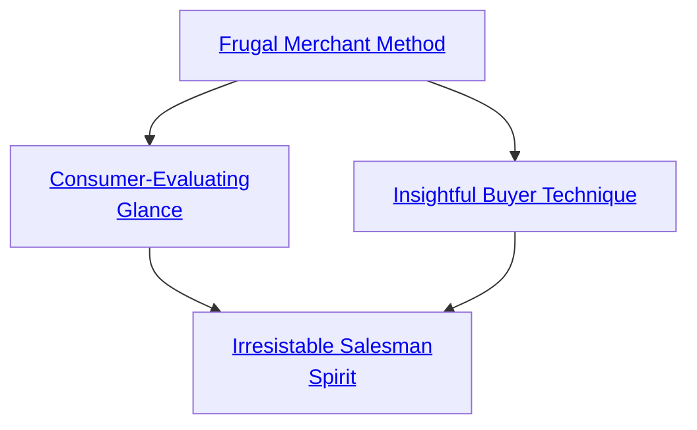
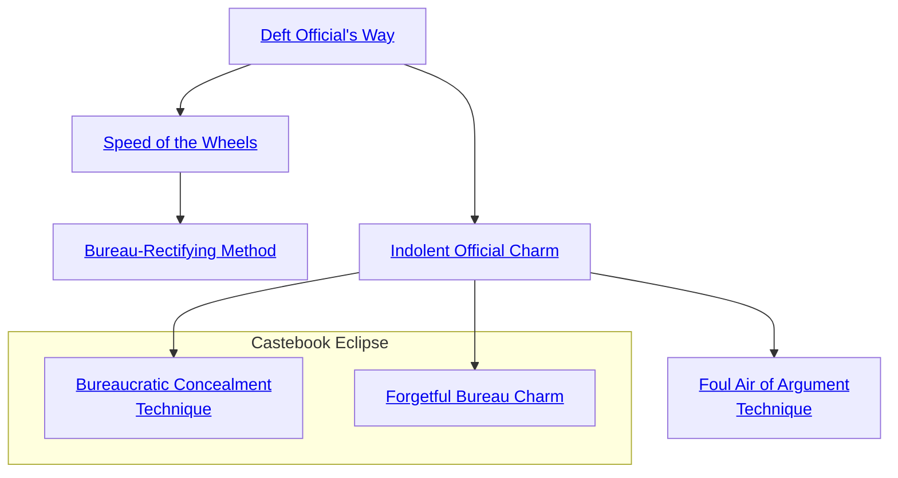

## Frugal Merchant Method

Cost: 1 mote
Duration: Instant
Type: Simple
Minimum Bureaucracy: 1
Minimum Essence: 1
Prerequisite Charms: None

This Charm allows an Exalted to evaluate the quality
of goods offered for sale. The character has an intuitive
sense of if the goods are shoddy, exceptional, average or
whatever. Note that this doesn't give the character market
knowledge he doesn't have. If a character has no idea how
much a good is supposed to cost, use of this power still
won't tell him if he's being overcharged. Likewise, this
power grants no actual knowledge of the good under
examination, only knowledge of its quality. Presented
with a totally unfamiliar object, the character will be able
to tell if it is shoddy or broken but will still not know
anything about its purpose or operation. This Charm
works on found objects as well as those offered for sale and
can, for example, tell if a piece of First Age magic is still
functional or not simply by handling it.

## Insightful Buyer Technique

Cost: 3 motes
Duration: Instant
Type: Simple
Minimum Bureaucracy: 3
Minimum Essence: 1
Prerequisite Charms: [[#Frugal Merchant Method]]

Through the use of this Charm, the character gains an
intuitive feel for a marketplace at a given instant, allowing
her to intuit roughly how much a given object will fetch in
any one market. Though the character need not be physically
present in the market, this Charm must be used with
a particular sales venue in mind. A character cannot discover
previously unknown markets through the use of this
Charm. She can, however, review markets she is familiar
with, even distant ones, to determine which would be the
best place to sell a given good. The more specific the venue
contemplated, the more accurate the forecast.
This Charm is perfectly accurate if used at the moment
of sale. However, the more time that elapses between
the use of the Charm and the actual sale of the goods, the
greater the chance of an error in the character's projection.

## Consumer-Evaluating Glance

Cost: 3 motes
Duration: Instant
Type: Simple
Minimum Bureaucracy: 3
Minimum Essence: 1
Prerequisite Charms: [[#Frugal Merchant Method]]

An Exalted using this Charm may evaluate a given
buyer's intentions and budget with but a glance. He can
tell if a given potential buyer has no real intention of
purchasing, if she's already decided to buy or if she requires
swaying. The Exalted also has a good idea of the target's
budget for the purchase, at least in relation to the price the
Exalted desires to obtain. Finally, the character will know
if the target plans to attempt to swindle or betray him in
some fashion, making it an essential tool for characters
dealing in illegal or extremely valuable goods.

## Irresistable Salesman Spirit

Cost: 5 motes, 1 Willpower
Duration: One scene
Type: Simple
Minimum Bureaucracy: 5
Minimum Essence: 3
Prerequisite Charms: [[#Consumer-Evaluating Glance]], [[#Insightful Buyer Technique]]

A character utilizing this Charm becomes the ultimate
high-pressure salesman, able to sell practically
anything to anyone for outrageous prices. If the target's
Willpower is equal to or lower than the Exalted's Essence,
he can be sold literally anything at any price — the Exalted
may cause him to sell himself into slavery for a handful of
potsherds or a kiss. If the target's Willpower is less than
twice the Exalted's Essence, the Exalted's player must
make a Wits + Bureaucracy roll. The number of successes
is how many times the object's normal price the character
manages to extract from the target. This Charm does not
work on characters whose Willpower is greater than twice
the Exalted's Essence.
Note that this Charm does not actually enforce the
deal in any way, and that it works only for a single scene.
Afterward, the target will be acutely aware of having just
been swindled — the greater the swindle, the more likely
he is to seek redress.

## Deft Official's Way

Cost: 6 motes
Duration: One task
Type: Simple
Minimum Bureaucracy: 1
Minimum Essence: 1
Prerequisite Charms: None

An Exalted who uses this Charm becomes preternaturally
adept at navigating through bureaucracies. The
character can naturally sense who to talk to in order to
produce results, who expects or is amenable to bribes, which
functionaries are actually useful or friendly and which are
simply petty individuals enjoying their tiny sliver of power.
A player whose character uses this Charm may add the
character's Essence score in automatic successes to any
Bureaucracy rolls when attempting to achieve a given result
in a bureaucracy (for example, obtain a license, passport,
grant or audience). Note that this Charm does not make the
impossible possible or allow an impoverished character to
pay bribes she cannot afford, but it may allow the character
to find away around such obstacles.

## Speed of the Wheels

Cost: 8 motes
Duration: One task
Type: Simple
Minimum Bureaucracy: 3
Minimum Essence: 2
Prerequisite Charms: [[#Deft Official's Way]]

Through the use of this Charm, a character can cause
a bureaucracy to accomplish a task in record time. An
Exalted using Speed of the Wheels causes the bureaucracy to
work (her Essence + 1) times faster for the duration of a
particular job. For example, a character with Essence 3 who
uses the Speed of the Wheels Charm to expedite an appeal to
the ruler of a city to use the naval dry-docks to repair her ship
would be able to make the appropriate appointments and
cause the proper papers to be read four times faster than
normal. Note that this Charm simply speeds the process, it
does not increase the character's chances of success. Characters
who wish to improve their chances of success should
use Social Charms or Deft Official's Way.

## Bureau-Rectifying Method

Cost: 8 motes, 1 Willpower
Duration: One investigation
Type: Simple
Minimum Bureaucracy: 5
Minimum Essence: 3
Prerequisite Charms: [[#Speed of the Wheels]]

An Exalted who knows this Charm may use it to aid in
an investigation of corruption in a bureaucracy. In order for
this Charm to work, the character must either request or
take part in the investigation. The result will be an actual
investigation — there will be genuine inquiries, real punishments
and, potentially, even meaningful reform. If this
Charm is used by an Exalted who is heading an investigation,
it causes questioned individuals to be much more
cooperative than they would be otherwise, and subordinates
who would otherwise go through the motions of their jobs
will instead actually attempt to ferret out the corruption.
Note that there is a finite upper limit on the how wide-ranging
an investigation this Charm can support. If the
character is reforming an entire bureaucracy, the Storyteller
should feel free to force him to commit Essence to this
Charm more than once. Typically, an Exalted can bolster
the efforts of (her Essence rating × 20) individuals per use of
this Charm. This Charm does not cause an investigation to
be launched, merely reinforces one that is already in progress.

## Indolent Official Charm

Cost: 4 motes
Duration: One task
Type: Simple
Minimum Bureaucracy: 3
Minimum Essence: 2
Prerequisite Charms: [[#Deft Official's Way]]

Solar Exalted can use their powers to slow as well as
hasten the actions of a bureaucracy. Through the use of the
Indolent Official Charm, a character may bring the wheels
of government to a screeching, grinding halt with regard to
a single task. Papers will be lost at every turn, every petty
official who could possibly interfere or request a bribe will do
so, and petitions and requests will inevitably end up neglected
at the bottom of the pile. For every point of Essence
the character possesses, the amount of time the bureaucracy
needs to accomplish a given task is multiplied by one.
The character need not be part of the matter to be
delayed, but must know about the situation well enough to
specify it. Characters may invest Essence speculatively (for
example, &quot;the ongoing secret police investigation into my
affair&quot; is a perfectly valid target, even if the character isn't
sure one exists) but will not know if the Charm had an
effect or not — as long as she keeps the Essence committed,
an investigation that meets her criteria will be hampered.
As with Bureau-Rectifying Method, there is an upper limit
to the size of the delay that the character can impose. Each
use of this Charm can hinder the efforts of a number of
investigators equal to (the character's Essence * 20).

## Foul Air of Argument Technique

Cost: 12 motes, 1 Willpower
Duration: One task
Type: Simple
Minimum Bureaucracy: 5
Minimum Essence: 3
Prerequisite Charms: [[#Indolent Official Charm]]

The character can cause a request, project or initiative
to become the kiss of death for a bureaucracy. Meetings
produce nothing, initiatives fall into pointless squabbling,
and departmental infighting hampers even the simplest
matters. Worse, the fighting spreads, rippling out from the
issue in question to other matters and, eventually, hamper-
ing or even crippling the bureaus involved. When
bureaucracies are subject to the Foul Air of Argument
Technique, they operate at a fraction of their efficiency
equal to 1/(1 + the Essence score of the character), so a
character with Essence 1 would make a bureau work at 1/2
efficiency, one with Essence 2 would make it work at 1/3,
Essence 3 at 1/4, and so on. A character cannot use multiple
invocations of this Charm on the same bureau at once.

Errata:
This Charm is lacking a Type. Its Type is Simple.

## Bureaucratic Concealment Technique

Cost: 4 motes
Duration: Special
Type: Simple
Minimum Bureaucracy: 4
Minimum Essence: 2
Prerequisite Charms: [[#Indolent Official Charm]]

Using this Charm, a character can effectively
cause a single item to disappear into the depths of a
bureaucracy and remain hidden from all efforts to find
it until the Exalted ceases committing Essence to the
Charm or chooses to retrieve the item herself. The
item may be virtually anything that can be moved
through human effort: a letter, an artifact, a piece of
jewelry — even a statue or the like. It is shuffled from
place to place, stored and forgotten, and it draws no
attention to itself. Investigation attempts to find the
concealed item have their difficulty increased by the
Exalted's Essence.

## Forgetful Bureau Charm

Cost: 10 motes, 1 Willpower
Duration: Instant
Type: Simple
Minimum Bureaucracy: 5
Minimum Essence: 3
Prerequisite Charms: [[#Indolent Official Charm]]

Forgetful Bureau Charm allows an Exalted character
to erase all evidence of one item or individual
from a particular bureaucracy. Records are lost or
destroyed, officials misremember facts, and so forth.
The effects take some time to make themselves felt.
A small local bureaucracy is affected within a day.
Larger organizations may take weeks, or even months,
before the process is complete. So far as the bureaucracy
is concerned, the item or individual in question
does not exist. Those with direct contact with the
subject still recall it normally, but official records
and other documentation do not support their recollections.
New records can come into being after this
Charm is used, but previous records on the subject
are permanently lost.
This Charm allows the Chosen to create difficulties
for others by eliminating all official record of
them or for the Exalted to protect their own secrets,
such as removing evidence of a Circle's activities or of
the location of a particular Demesne or Manse.
