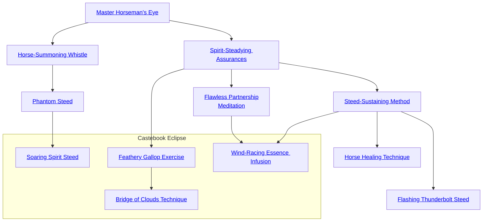

## Master Horseman's Eye

Cost: 1 mote
Duration: Instant
Type: Simple
Minimum Ride: 1
Minimum Essence: 1
Prerequisite Charms: None
With but a glance, the character can evaluate the age,
health and temperament of a mount or draft animal. The
Charm will effortlessly penetrate the sorts of ruses used to
pawn substandard animals off at full price.

## Horse-Summoning Whistle

Cost: 3 motes
Duration: Instant
Type: Simple
Minimum Ride: 3
Minimum Essence: 2
Prerequisite Charms: [[#Master Horseman's Eye]]

Through the use of this Charm, the character silently
summons her mount, which will move toward her at the best
possible speed. This Charm has a range of (10 x the character's
Essence) miles. The character must have built up a relationship
with the summoned animal — typically riding and
caring for it for several days — before it will respond to this
Charm. While the character's steed will always respond to
this call and will not become distracted or lost, it's still an
animal. It can't get through locked doors or penetrate
complex obstacles any better than it normally could.

## Phantom Steed

Cost: 10 motes, 1 Willpower
Duration: One day
Type: Simple
Minimum Ride: 5
Minimum Essence: 3
Prerequisite Charms: [[#Horse-Summoning Whistle]]

This Charm allows a character to summon up from raw
Essence a great white steed with a burning golden mane and
tail. It has the same statistics as a warhorse of excellent
quality, but it is tireless and fearless and need not eat or sleep.

## Spirit-Steadying Assurances

Cost: 3 motes
Duration: One scene
Type: Simple
Minimum Ride: 2
Minimum Essence: 1
Prerequisite Charms: [[#Master Horseman's Eye]]

Horses' instincts are to run away from what they perceive as
danger — the smells of fire and blood or the sounds of conflict and
wounded animals. This often puts them at odds with adventurous
riders, who are probably trying to reach and linger near the stimuli.
Through the use of this Charm, a character can render her mount
immune to terror for the rest of the scene, thus obviating the need
for rolls to control the animal around frightening sensations.

## Steed-Sustaining Method

Cost: 6 motes per mount
Duration: One day's march
Type: Simple
Minimum Ride: 5
Minimum Essence: 1
Prerequisite Charms: [[#Spirit-Steadying Assurances]]

While their speed in battle is tremendously greater than
that of a man on foot, traveling long distances with mounts is
often slower than walking. Mounts must be rested during the
march and must be cared for before and after the day's travel.
Through the use of this Charm, the character can reduce the
need to care for animals during travel. Mounts under the effect
of this Charm are very resistant to problems such as thrown
shoes and injured hooves and legs. They can also keep up a brisk
walk for an entire day without resting, even when burdened
with armored riders or cargo panniers. Keep in mind that, unless
this Charm is used on the characters' remounts or their pack
animals, the characters' overall marching speed will still be
limited by the speed of the slowest beast in the group.

## Horse Healing Technique

Cost: 4 motes, 1 health level
Duration: Instant
Type: Simple
Minimum Ride: 5
Minimum Essence: 3
Prerequisite Charms: [[#Steed-Sustaining Method]]

A sick or injured mount is a serious problem for its rider.
Even outside of a battle, the loss of an animal can be a tremendous
expense. By the use of this Charm, the character heals a number
of his mount's health levels equal to his Essence rating. If the
mount is unwounded, then this Charm cures any diseases or
parasites the beast possesses. This Charm does not take effect
instantly - the character must spend a scene tending to the
mount by dressing its wounds, feeding it, currying or otherwise
grooming it — for the healing effects to set in.

## Flawless Partnership Meditation

Cost: 5 motes
Duration: One scene
Type: Simple
Minimum Ride: 5
Minimum Essence: 3
Prerequisite Charms: [[#Spirit-Steadying Assurances]]

Through the use of this Charm, the Exalted and her mount
become as one. The player need never roll for her character to
accidentally be thrown or fall from her steed. Her mount will never
panic, and she receives a bonus equal to her Essence score to all Ride
rolls that cause the horse to jump, rear or otherwise perform tricks.

## Flashing Thunderbolt Steed

Cost: 5 motes, 1 Willpower, 1 health level
Duration: One scene
Type: Simple
Minimum Ride: 5
Minimum Essence: 3
Prerequisite Charms: [[#Steed-Sustaining Method]]

By using this Charm, the Exalted can imbue his steed
with endless energy. While under the effect of this Charm,
the steed can run at full speed for a full scene (a full march,
outside of dramatic time) without becoming fatigued. This
Charm has no long-term ill effects on the mount — the
Exalted pays the price in Essence and his own health.

## Soaring Spirit Steed

Cost: 15 motes, 1 Willpower
Duration: One day
Type: Simple
Minimum Ride: 5
Minimum Essence: 4
Prerequisite Charms: [[#Phantom Steed]]

This Charm summons a horse of pure Essence,
much like Phantom Steed, except the Chosen's mount
is also capable of flying through the air at its normal
rate of movement, allowing its rider to traverse obstacles
with ease.

## Feathery Gallop Exercise

Cost: 2 motes
Duration: Instant
Type: Reflexive
Minimum Ride: 4
Minimum Essence: 2
Prerequisite Charms: [[#Spirit-Steadying Assurances]]

The Exalted infuses Essence into her mount, lightening
its steps and distributing its weight. The mount
leaves no tracks, even in snow or soft sand, and can
run across any surface - even mud, quicksand or
water — at its normal speed without sinking. Note
that the mount's hooves do still touch the surface, so
a mount cannot run across dangerous liquids such as
molten lava or acid without harm. The Chosen must
spend Essence for each turn the mount passes over the
surface, or it will sink, meaning this Charm is only
useful for crossing short distances.

## Bridge of Clouds Technique

Cost: 4 motes
Duration: Instant
Type: Reflexive
Minimum Ride: 5
Minimum Essence: 3
Prerequisite Charms: [[#Feathery Gallop Exercise]]

When the Chosen uses this Charm, her mount
can run on the empty air between two solid surfaces as
if there were a solid, invisible bridge there. This lets
the Exalt bridge gaps such as canyons and chasms,
allowing horse and rider to cross. The mount moves at
its normal speed, and the Exalted must spend Essence
each turn of the crossing, or gravity takes hold once
again, usually with regrettable results.

## Wind-Racing Essence Infusion

Cost: 5 motes, 1 Willpower
Duration: One scene
Type: Simple
Minimum Ride: 5
Minimum Essence: 3
Prerequisite Charms: [[#Steed-Sustaining Method]], [[#Flawless Partnership Meditation]]

This Charm infuses the Exalted's mount with
Essence, granting it extraordinary speed. The mount
can run at a maximum speed of ([it's Stamina + the
Exalt's Essence] x 10) miles per hour. The mount still
tires at the normal rate (unless also under the effects
of a Charm such as Flashing Thunderbolt Steed), it
simply moves at a greater rate of speed during that
time.
