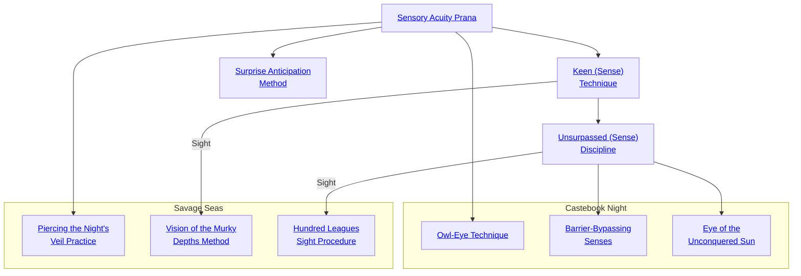

## Sensory Acuity Prana

Cost: 5 motes
Duration: One scene
Type: Simple
Minimum Awareness: 2
Minimum Essence: 1
Prerequisite Charms: None

Though the use of this Charm, the character extends
his perception, heightening all five senses. The
character can see farther and in less light, hear softer
sounds and distinguish between them more easily and
differentiate various tastes, textures and scents quite
easily — he could be a master chef or perfumer. The
basic mechanical effect is to increase the character's
Awareness by a number of dice equal to his Essence,
though there are obviously many other situations where
these senses might come into play — it's up to the
Storyteller to make a character's extended perceptions
a reality by increasing the amount of information available
to the player. Characters using this Charm are not
any more or less vulnerable to sensory overload than
normal mortals - the extended perceptions include
the ability to manage the sensations more effectively.

## Keen (Sense) Technique

Cost: 3 motes
Duration: One scene
Type: Simple
Minimum Awareness: 3
Minimum Essence: 2
Prerequisite Charms: [[#Sensory Acuity Prana]]

The character channels Essence into one of his senses,
heightening his perceptions to an immense degree. When
he purchases this Charm, the character must choose which
sense it affects. Characters may purchase this Charm more
than once in order to gain the ability to heighten different
senses. However, a character may not have more than one
sense heightened at any given time. Generally, this Charm
does not add dice to a character's pools, but instead,
changes what actions she can undertake at a given difficulty.
For example, recognizing someone by her scent is
normally difficulty 2 or 3, but a character with Keen Smell
and Taste Technique could do it without a roll.
The effects of various Keen (Sense) Techniques are
listed below
• Sight — The character's visual acuity is heightened
to several times that of a normal mortal. He can pick out
tiny details at 100 yards, quickly count masses of troops and
so on. In fog, dusk and other poor visual conditions, he can
see as well as a normal person in good visual conditions.
• Hearing and Touch - The character's hearing and
sense of touch are tremendously increased. The character
can easily judge the quality of fabric and metals with casual
inspection, hear animals burrowing beneath the ground,
listen in clearly on conversations through thick doors and
perform other, similar feats.
• Smell and Taste - The character can detect poisons
by taste and smell and recognize individuals by their scents
(even if they are no longer present). The character may track
by scent but is not good at it — add a + 2 bonus to all Survival
rolls involving tracking or hunting for food.
This Charm is incompatible with Sensory Acuity
Prana, above. The character can either extend all her
senses or one of them.

## Unsurpassed (Sense) Discipline

Cost: 5 motes
Duration: One scene
Type: Simple
Minimum Awareness: 5
Minimum Essence: 2

Prerequisite Charms: [[#Keen (Sense) Technique]]
The character channels Essence to hone one of her
senses As with Keen (Sense) Technique, above, the character
must choose a sense to be enhanced when she
purchases this Charm. The Charm may be purchased
multiple times to cover multiple senses, but the character
may not invoke Unsurpassed (Sense) Discipline and Keen
(Sense) Technique at the same time, and only one sense
at a time can be enhanced via the Unsurpassed (Sense)
Discipline Charm. A character can only purchase the
Unsurpassed (Sense) Discipline Charm for a sense for
which she has already purchased the Keen (Sense) Technique
Charm. Also, as with Keen (Sense) Technique, this
Charm is incompatible with Sensory Acuity Prana.
• Sight - The character gains eyes equal to those of
the greatest raptors. In good light, the character can see a
field mouse a mile away, pick a face out of a crowded street
with a casual glance and detect the tiniest details and
imperfections without effort. In the dark or in poor visual
conditions such as smoke, haze and mist, her senses are
diminished, and she sees only as well as an individual using
Keen Sight Technique does in normal conditions.
• Hearing and Touch - The character can listen in
on a whispered conversation a mile away in still air or 100
yards away indoors, in windy conditions or in noisy situations
such as a bazaar or coliseum. The character can read
by passing her fingers over a page and feeling the ink
beneath her fingertips.
• Smell and Taste - The character can track by scent
almost as well as a bloodhound, adding his Perception as
automatic successes to all Survival rolls involving tracking or
hunting for food. She can distinguish poisons at a distance by
scent alone and can tell how much and how recently some-
thing was poisoned with but a harmless touch of the tongue.
She can read an individual or animal's actual mood by scent.

## Surprise Anticipation Method

Cost: 1 mote
Duration: Instant
Type: Reflexive
Minimum Awareness: 3
Minimum Essence: 2
Prerequisite Charms: [[#Sensory Acuity Prana]]

The character develops a preternatural sense for haz-
ard. Whenever she is about to be placed in immediate
danger, her Surprise Anticipation Method activates. There
is no roll - the character simply becomes aware of
immanent danger. This effect costs a mote of Essence and
makes it almost impossible to ambush the character. Storytellers
should keep in mind that Surprise Anticipation
Method is an asset, not a liability. Don't use it as an excuse
to drain the character's Essence.
Storytellers should also keep in mind that Surprise
Anticipation Method operates by increasing the character's
awareness, not by precognition or mind reading. It alerts
characters to anything they would perceive as dangerous if
they saw it and gave it a quick glance. A character with
Surprise Anticipation Method can occasionally guess wrong
about an individual's intentions, particularly when on
edge. While the character will detect invisible individuals
from subtle environmental clues, she can fall into carefully
concealed pits, and she can be taken by surprise by the
unexpected treachery of a trusted friend. She is not pre-
scient so much as nearly impossible to catch flat-footed.
Characters may place other Charms in a Combo with
Surprise Anticipation Method. When Surprise Anticipation
Method activates, the character has the option of spending a
point of temporary Willpower and activating the rest of the
Charms. However, she must do this immediately upon the
activation of Surprise Anticipation Method. Most Exalted
Combo in defensive Charms since, while Surprise Anticipation
Method is generally reliable, it is hardly infallible. It only takes
one accidentally murdered loved one or terrible diplomatic
incident to make an Exalted into a broken or hunted creature.

## Piercing the Night's Veil Practice

Cost: 5 motes
Duration: One scene
Type: Simple
Minimum Awareness: 3
Minimum Essence: 2
Prerequisite Charms: [[#Sensory Acuity Prana]]

This Charm allows the user to see in darkness as if she
were in broad daylight. The Exalted needs no light source
of any kind, so long as this Charm is in effect; whether
down in the deepest cave or under a new moon on a cloudy
night, she will see with normal clarity and detail. Charms
used to increase her vision will work just like they normally
do; if she uses the Hundred Leagues Sight Procedure
(below) after activating this Charm, she will be able to
flawlessly focus on a target dozens of leagues away, as if in
daylight. As with the Sensory Acuity Prana (see Exalted,
p. 196), the Exalted is not more or less susceptible to bright
lights or sudden flashes. If she enters a torch-lit tent, she
will see normally, and if suddenly startled by the flare of an
anima banner, she will be blinded no longer than someone
using his ordinary senses would.

## Vision of the Murky Depths Method

Cost: 3 motes
Duration: One scene
Type: Simple
Minimum Awareness: 4
Minimum Essence: 2
Prerequisite Charms: [[#Keen (Sense) Technique|Keen Sight Technique]]

The Exalted shifts his vision so that he can see in
water as if in air. For the duration of the Charm, he can
adjust his vision to see in water, in air or to see through
them both. While shifted to see in either water or air, he
sees normally. When looking through both (as when
peering over the railing of a vessel to see if there is anything
in the waters below or when looking up onto the deck of
a ship from below the water's surface to locate a guard), he
sees without the distortions and shifting that normally
occurs, but his vision is halved (see &quot;Vision in the Depths,&quot;
this page). It takes one turn to change sight over from
water to air or from either to seeing in both.

## Hundred Leagues Sight Procedure

Cost: 5 motes
Duration: One scene
Type: Simple
Minimum Awareness: 5
Minimum Essence: 2
Prerequisite Charms: [[#Unsurpassed (Sense) Discipline|Unsurpassed Sight Discipline]]

Whereas, before, the Exalted could extend his vision
out to a mile or more using the Unsurpassed Sight Discipline,
with this Charm, he can see further than even the
sharpest-eyed mospid. The user of this Charm can clearly
focus and notice details out to a range equal to his (Essence
x 20) miles. Anything within that range can be seen just
as if it were close to hand — even the furthest objects will
appear as if they were no more than 100 yards or so away.
This ability is rarely of use on land, where terrain ensures
that the Exalted will never actually be able to see that far,
but at sea, the information gleaned may prove vital.

## Owl-Eye Technique

Cost: 5 motes
Duration: One day
Type: Simple
Minimum Awareness: 4
Minimum Essence: 2
Prerequisite Charms: [[#Sensory Acuity Prana]]

A character who uses this Charm can see in absolute
darkness without penalty. For the next full day, the
character can see equally well on a bright sunny day, on
a clear night under the full moon or in a totally lightless
cell 10 yards underground. The only sign that a character
is using this Charm is that her eyes become somewhat
luminescent in dim light, flashing Solar gold from certain
angles. This Charm does not allow the character to see
more easily through fog or smoke, nor does it help her
detect spirits or anyone who has been rendered invisible.

## Barrier-Bypassing Senses

Cost: 6 motes
Duration: One scene
Type: Simple
Minimum Awareness: 5
Minimum Essence: 3
Prerequisite Charms: [[#Unsurpassed (Sense) Discipline]]

The character can transcend physical limits and
extend her senses past a single barrier. The character can
see, hear, touch, smell or taste anything that is on the
other side of a barrier that is no thicker than the character's
Essence in yards. The character can observe events on the
other side of a closed door, hear a conversation inside a
locked stone cell or feel a powerful artifact locked inside
a safe. The character cannot actually interact with the
object, simply gain sensory impressions.

## Eye of the Unconquered Sun

Cost: 12 motes, 1 Willpower
Duration: One scene
Type: Simple
Minimum Awareness: 6
Minimum Essence: 6
Prerequisite Charms: [[#Unsurpassed (Sense) Discipline|Unsurpassed Sight Discipline]]

This potent Charm allows the character to pierce all
forms of deception and disguise. Everyone using magical
or mundane disguises is seen in their true form, even a
Lunar Exalted whose Tell has not yet been spotted or an
Immaculate using Shrouding the Body and Mind. Every-
one who is hiding is revealed to the character's gaze,
regardless of whether they are using ordinary Stealth or
potent invisibility magics, including mind altering effects
such as Mental Invisibility Technique, Everyone
and everything that was deliberately disguised or hidden
can be clearly seen. No known magic can deceive the
power of this Charm - Eye of the Unconquered Sun is a
perfect defense against invisibility and concealment.
When a character uses this Charm, his Caste Mark glows
as if the Exalt's anima banner were at the 12-15 mote level
if it does not already, shattering all illusion and invisibil-
ity Charms and making mundane stealth impossible.
