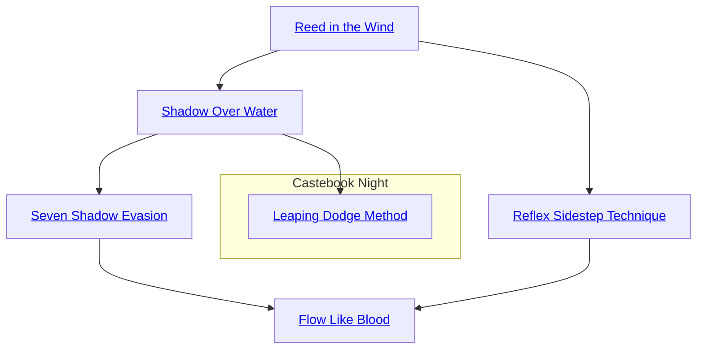

## Reed in the Wind

Cost: 1 mote per 2 dice
Duration: Instant
Type: Reflexive
Minimum Dodge: 2
Minimum Essence: 1
Prerequisite Charms: None
The Exalted lets Essence flow through her body, making
her motions as smooth as those of reeds and willows in the
wind. For each mote spent, add 2 dice to an attempt to dodge
an attack that the character can anticipate coming. A character
cannot gain more dice than her regular Dexterity +
Dodge pool. The player must declare she is using this Charm
and how much Essence she will spend on it before her
character's opponent makes his attack roll. If there are an odd
number of dice in the characters Dexterity + Dodge pool, the
fractional mote left over after buying the last die is lost.

Errata:
Each mote spent on Reed in the Wind adds 2 dice to the character's Dexterity + Dodge pool, not 1 die as
the Charm description at one point implies.

## Shadow Over Water

Cost: 2 motes
Duration: Instant
Type: Reflexive
Minimum Dodge: 3
Minimum Essence: 1
Prerequisite Charms: Reed in the Wind

Like shadows over water, the Exalted moves with perfect,
fluid grace and speed. The character may dodge a single
attack that he can anticipate with his full Dexterity + Dodge
pool. Characters must spend the Essence for Shadow Over
Water before his opponent makes her attack roll.

## Seven Shadow Evasion

Cost: 6 motes
Duration: Instant
Type: Reflexive
Minimum Dodge: 5
Minimum Essence: 1
Prerequisite Charms: Shadow Over Water

From Shadows Over Water to shadow itself, the
character is too quick to be hit at all. The character can use
this Charm to evade, without the need for a roll, any single
attack that she can anticipate, even one that has an area
of effect. A character must invoke Seven Shadow Evasion
before her opponent makes his attack roll.

## Reflex Sidestep Technique

Cost: 2 motes
Duration: Instant
Type: Reflexive
Minimum Dodge: 3
Minimum Essence: 1
Prerequisite Charms: Reed in the Wind

The character's attunement to the interaction of her
anima with the ambient Essence of Creation makes her
preternaturally aware of her surroundings. By using this
Charm, she may dodge attacks that she is not even aware of.
If the character is attacked, even by an attack she does not
anticipate, she may spend 2 motes of Essence to attempt to
evade the attack. The character's dice pool for dodging such
attacks is equal to (2 x her permanent Essence score).
Reflex Sidestep Technique cannot be used as part of
a Combo with other Dodge Charms. Although the character
does not perceive the situation until she has already
dodged, the player may choose whether or not the character
spends the Essence to dodge the blow. If she chooses to
dodge, she must spend the Essence to do so before the
attacker makes his roll.

## Flow Like Blood

Cost: 5 motes, 1 Willpower
Duration: One scene
Type: Simple
Minimum Dodge: 5
Minimum Essence: 3
Prerequisite Charms: Reflex Sidestep Technique, Seven Shadow Evasion

The character permeates his being with Essence,
becoming partly atomized. He moves with an impossible
fluid grace, and those attacks that he cannot dodge often
pass harmlessly through his dreamlike body. For the rest of
the scene, the character may use his full Dexterity + Dodge
dice pool to dodge all physical attacks, perceived or not.

## Leaping Dodge Method

Cost: 4 motes
Duration: Instant
Type: Reflexive
Minimum Dodge: 3
Minimum Essence: 2
Prerequisite Charms: Shadow Over Water

When attacked, the Exalted makes a prodigious leap
to take herself out of harms way. When making any dodge
using this Charm, the character avoids the attack by
leaping up to (Strength + Athletics) x 3 yards vertically
or twice this distance horizontally. The Exalt can choose
the exact direction and distance of this leap, so long as it
is away from her attacker. Leaping Dodge Method is
explicitly permitted to be part of a Combo with any Dodge
Charms, including Reflex Sidestep Technique. This
Charm will break multiple attack techniques if the attacker
cannot follow the dodging character.
