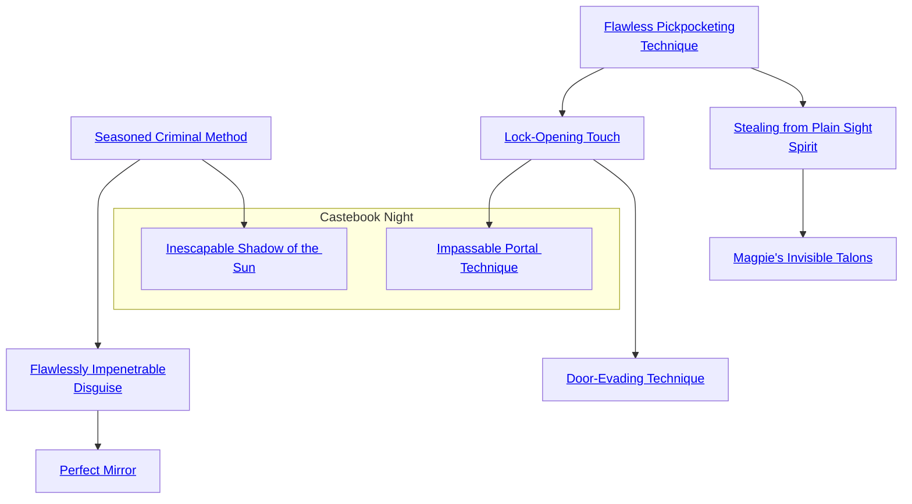

## Seasoned Criminal Method

Cost: 10 motes
Duration: One day
Type: Simple
Minimum Larceny: 3
Minimum Essence: 1
Prerequisite Charms: None

This Charm grants a character preternatural intuition
with regard to criminal subcultures. While under the influence
of this Charm, he can easily pick out criminal establishments
- pawnshops willing to operate as fences, taverns that are
thieves' havens and so on. Likewise, the character can easily
pick out those who are actively interested in buying or selling
illegal goods and services — he canspot police and officials who
will accept bribes and individuals interested in selling or buying
drugs, sex or information. Finally, the character using this
Charm can easily read lines of power, differentiating important
organized crime figures from small-time operators and quickly
tracking down the true thrones and powers of the local underworld.
In short, characters with this Charm are at home in any
criminal subculture. This Charm doesn't grant the ability to
spot agents provocateurs and informers.

## Flawlessly Impenetrable Disguise

Cost: 7 motes
Duration: One day
Type: Simple
Minimum Larceny: 4
Minimum Essence: 2
Prerequisite Charms: [[#Seasoned Criminal Method]]

By means of this Charm, the character can disguise her
appearance, her voice and even her scent. The player may not
imitate a specific individual, but may alter her apparent age by
as much as 20 years (minimum 16), her ethnicity, her height
by as much as six inches and her gender. It is impossible to see
through the character's disguise via mundane means. Characters
using this Charm can sometimes be detected via the
Unsurpassed (Sense) Discipline Charm or by the All-Encompassing
Sorcerer's Sight Charm - in these cases, the matter
is resolved as normal for disguise attempts — an opposed roll
of the disguised character's Wits + Larceny versus the
Perception + Awareness of the character attempting to detect him.

## Perfect Mirror

Cost: 10 motes, 1 Willpower
Duration: One hour
Type: Simple
Minimum Larceny: 5
Minimum Essence: 3
Prerequisite Charms: [[#Flawlessly Impenetrable Disguise]]

This Charm allows a character to perfectly imitate someone
she is very familiar with. While this Charm is active, not even the
target's pets, intimates and close friends will be able to tell her
from the real individual. The character must know the target well
to perfectly mirror him - at least well enough to imitate him
through mundane disguise (see the Drama chapter, page 255, for
rules on disguise). Also, while this Charm covers small mannerisms,
responses to in-jokes and so forth, it does not grant the
character access to the mirrored character's memories, so she will
not be able to use passwords she does not know, recall facts the
Exalted herself is not familiar with and so forth.

## Flawless Pickpocketing Technique

Cost: 3 motes
Duration: Instant
Type: Simple
Minimum Larceny: 2
Minimum Essence: 1
Prerequisite Charms: None

With this Charm, one of the Chosen can pick someone's
pocket flawlessly, with no chance of detection. He must be
able to touch the target (though no one will notice him do so),
and the Exalted must have a pouch, pocket or other hiding
place large enough to put the stolen items into if he does not
wish to end the theft with the filched item simply palmed.

## Stealing from Plain Sight Spirit

Cost: 6 motes
Duration: Instant
Type: Simple
Minimum Larceny: 4
Minimum Essence: 2
Prerequisite Charms: [[#Flawless Pickpocketing Technique]]

This Charm is much like Flawless Pickpocketing Technique,
allowing a character to steal an item without any
chance of being caught in the act. However, an Exalted
utilizing Stealing From Plain Sight Spirit can steal an item
from plain view, for example stealing a brooch from a table,
a key from a jailer's keyring or a sword from its scabbard.
Unless attention is somehow drawn to the act (for example,
a guard will notice his sword was stolen if he attempts to
draw it, and a jailer will notice a key is missing if he attempts
to unlock a door with it), the theft will go unnoticed for at
least number of turns equal to the character's Essence rating.
As with Flawless Pickpocketing Technique, the character
must be close enough to touch the object she wishes to
steal. Note that the item cannot be actively in use when it is
stolen - for instance, you cannot use Stealing From Plain
Sight Spirit to steal the pen or sword out of someone's hand.

## Magpie's Invisible Talons

Cost: 10 motes, 1 Willpower
Duration: Instant
Type: Simple
Minimum Larceny: 5
Minimum Essence: 3
Prerequisite Charms: [[#Stealing from Plain Sight Spirit]]

This Charm is similar to Stealing From Plain Sight
Spirit, in that it allows objects to be stolen from plain view
without their loss being noticed for a number of turns equal
to the Essence score of the character using the Charm
(unless some special notice is drawn to the fact that the
object is no longer present). However, Magpie's Invisible
Talon allows the character to steal an object from up to one
yard away per point of her Essence score. As with Stealing
From Plain Sight Spirit, the character cannot steal an
object that is actively in use.

## Lock-Opening Touch

Cost: 5 motes
Duration: Instant
Type: Simple
Minimum Larceny: 3
Minimum Essence: 1
Prerequisite Charms: [[#Flawless Pickpocketing Technique]]

Through the use of this Charm, the character can
instantly pick any lock. He needs no tools — all he need
do is strike or rap it sharply, and it pops open. The
character must use this Charm once per lock, and so, doors
with many locks can exhaust an Exalted thief who relies
only on this Charm. Lock-Opening Touch works on all
locks, not just those built into doors, and can be used to
open locked shackles or chests as well.

## Door-Evading Technique

Cost: 10 motes, 1 Willpower
Duration: Instant
Type: Simple
Minimum Larceny: 5
Minimum Essence: 3
Prerequisite Charms: [[#Lock-Opening Touch]]

Some doors do not have locks to pick, being bound
closed with bars or sorcery. Other doors are equipped
with too many locks to easily pick, even with the assistance
of Charms. With this Charm, an Exalted can
simply step through a locked portal, closed gate, dropped
portcullis or other closed portal. The character places her
hand against the portal, steps forward and appears on the
other side. This Charm also works on windows, sewer
grates and other aperture closures, but it does not allow
the character to pass through walls or stick his hand into
a locked chest and fish around.

## Inescapable Shadow of the Sun

Cost: 1 mote per die
Duration: Instant
Type: Supplemental
Minimum Larceny: 4
Minimum Essence: 2
Prerequisite Charms: [[#Seasoned Criminal Method]]

None can challenge the ability of the Night Caste to
walk among criminals, leam their methods and infiltrate
their ranks. Likewise, when members of the Night Caste
become corrupted, none can excel their ability as natural
rulers of the underworld. It is said by many that, during the
First Age, some among the Night Caste led organized
criminal groups, which helped govern lawless areas and
protect the vast cities of that era. It is unknown if this is
true or simply history garbled by the propaganda of the
Immaculates, however.
Through the use of this Charm, the Exalt can add 1
die per mote of Essence spent to any activities relating to
navigating. the criminal underworld, planning crimes,
recruiting criminal underlings or comprehending the
criminal mindset. The character cannot more than double
his Attribute + Larceny dice pool. This Charm does not
aid in technical larceny such as picking locks and pockets
or actually executing con games and espionage rings. It
simply allows the character preternatural skill as a crime
boss or a scourge of crime.

## Impassable Portal Technique

Cost: 7 motes
Duration: Special
Type: Reflexive
Minimum Larceny: 4
Minimum Essence: 3
Prerequisite Charms: [[#Lock-Opening Touch]]

Sometimes, locking a door is as valuable as opening
one. With a single touch, the character can lock any
door. Regardless of whether the door previously had a
lock or not, it is impossible to open for a number of hours
equal to the character's permanent Essence. A key that
would ordinarily open the door will not work until after
the scene is over. The only way to open the door in the
meantime is to break it down. Doors that do not possess
locks can be pushed open normally once this Charm
ends, but lockable doors remain normally locked after
the Charm ends.
