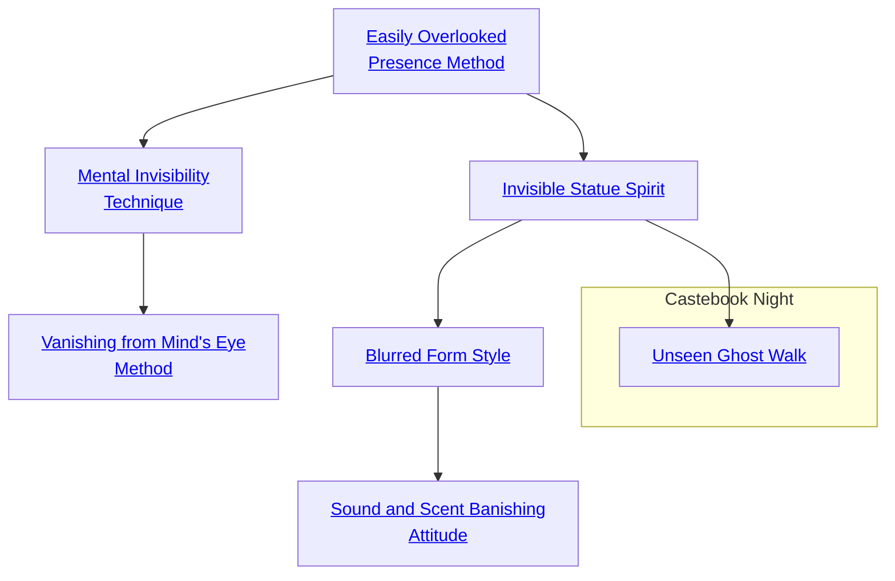

## Seasoned Criminal Method

Cost: 3 motes
Duration: One scene
Type: Simple
Minimum Stealth: 3
Minimum Essence: 1
Prerequisite Charms: None

This Charm does not involve hiding so much as
becoming difficult to notice. So long as the character does
nothing to stand out, make herself obvious or become the
center of attention, those who are not actively looking for
someone will simply discount her as part of the scenery. For
example, this Charm does not work on alerted guards or
those watching over restricted areas or on those who
intend to stop everyone who passes. Likewise, it cannot
conceal a character who is very different from her sur-
roundings; a tall, short-haired, light-skinned woman in a
crowd of short, long-haired, dark-skinned men is going to
stand out too much to benefit from this Charm.

## Mental Invisibility Technique

Cost: 5 motes, 1 Willpower
Duration: One scene
Type: Simple
Minimum Stealth: 4
Minimum Essence: 2
Prerequisite Charms: Easily Overlooked Presence Method

An extension of Easily Overlooked Presence Method, this
Charm bends the minds of those seeing the character. Players
whose characters see the Exalted must make a Willpower roll and
gain a number of successes equal to the Essence of the Chosen
using the Charm to actually perceive her and not just ignore her.
This effect ends if the character takes violent action or if she is
pointed out by someone who notices her, either directly (&quot;Look!
Over there!&quot;) or indirectly (Onlookers asking themselves the
question, &quot;Who is the guard swinging an axe at?&quot;).

## Vanishing from Mind's Eye Method

Cost: 10 motes, 1 Willpower
Duration: One day
Type: Simple
Minimum Stealth: 5
Minimum Essence: 3
Prerequisite Charms: Mental Invisibility Technique

The ultimate mental misdirection - the character can
vanish from all memory. She is no more or less easy to detect
than before, but those who see her will not recognize her
because they have no idea who she is. Essentially, the character
sets up a separate history for herself, starting when the Charm
is first invoked and ending when she allows it to expire. Beings
with Essence ratings higher than the character's are immune to
this effect. Obviously, a character trying to get somewhere she
shouldn't should have some other Stealth abilities at work
since, while she will not be recognized, guards are still going to
stop someone they don't know. Extended use of this Charm can
cause serious problems for an Exalted who is a ruler, merchant
or other important person, as others will quickly start dividing
up the character's now-ownerless property.

## Invisible Statue Spirit

Cost: 5 motes
Duration: Until disturbed
Type: Simple
Minimum Stealth: 3
Minimum Essence: 2
Prerequisite Charms: Easily Overlooked Presence Method

This Charm allows the Exalted to truly disappear — no
amount of visual searching, however thorough, will detect him,
so long as he remains still. Moving, even in a slow, shuffling walk,
is enough to disturb the effect of this Charm, as is any sort of
offensive action. Characters using Invisible Statue Spirit are not
immaterial, they can be detected by touch or by scent or hearing.

## Blurred Form Style

Cost: 8 motes, 1 Willpower
Duration: One scene
Type: Simple
Minimum Stealth: 4
Minimum Essence: 3
Prerequisite Charms: Invisible Statue Spirit

This Charm conceals the Exalted, blurring her form
and allowing her to blend into whatever background she
stands against, vastly improving her Stealth. Players whose
characters attempt to spot her when she is hiding or
moving slowly must gain a number of additional successes
on their Perception + Alertness rolls equal to the character's
Essence. If she attacks from a distance, players of those who
see the attack get one free Perception + Alertness roll at
difficulty 1 to spot her for each attack she makes. If she
attacks in hand-to-hand combat, all watching are assumed
to immediately spot her.
Once spotted, her enemies can pick her out again at will
until she escapes from their line of sight for at least several
seconds. While the Exalted has Blurred Form Style active,
enemies attacking her at range do so at a difficulty penalty equal
to her Essence score, and those attacking her in hand-to-hand
combat suffer a flat + 1 penalty to the difficulty of their attacks.

## Sound and Scent-Banishing Attitude

Cost: 6 motes
Duration: One scene
Type: Simple
Minimum Stealth: 4
Minimum Essence: 3
Prerequisite Charms: Blurred Form Style

Visual detection is not the only thing an Exalted must
fear. Through the use of this Charm, an Exalted can
protect himself from other forms of detection, as well.
While this Charm is active, the character makes no noise
of any sort, nor does anything carried on his person or in
his hands. This effect does not extend beyond his touch —
a dropped knife will still clatter, a knocked-over pot will
still shatter. Also, while this Charm is in effect, the
character has (and leaves) no scent of any sort. Tracking
beasts will not detect him or be able to follow him.

## Cost: 7 motes, 1 Willpower

Duration: Essence in minutes
Type: Simple
Minimum Stealth: 5
Minimum Essence: 3
Prerequisite Charms: Invisible Statue Spirit

This Charm allows the character to literally vanish
from sight. She can become completely invisible. The
only limit to this Charm is the fact that the character must
move slowly and carefully (move no more than six yards
per turn) and cannot engage in any form of combat or
perform any other activity that involves rapid movement.
Any such movements instantly disrupt the Charm and
render the character visible. However, the character can
walk slowly down a corridor, pour a dram of poison in
someone's cup or steal a treaty from a table. Characters
using Unseen Ghost Walk are not immaterial. They can
be detected normally by touch, scent or hearing.
Enemies players may attempt a reflexive Perception
+ Awareness roll each turn for the enemies to spot the
character. If the observer saw the character disappear,
noticed the character last turn or witnessed an action
performed by the character, the difficulty for the check is
only 1. However, the difficulty increases by one every turn
that the character remains undetected; to a maximum of
5. If the observer has some reason to believe that someone
is around (a knocked over vase, footprints in the sand),
the difficulty for spotting the character starts at 3 and
scales up. Just looking casually for the invisible Exalted
has a difficulty of 5. Even when spotted, any actions taken
against the character are at a +2 difficulty.
