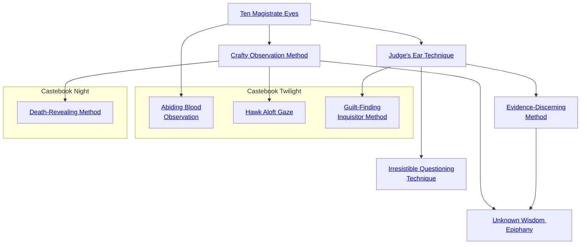

## Ten Magistrate Eyes

Cost: 3 motes
Duration: One scene
Type: Supplemental
Minimum Investigation: 1
Minimum Essence: 1
Prerequisite Charms: None

The character attunes himself to the world's ambient
Essence and becomes preternaturally aware of the order of and
links between objects. For the remainder of the scene, add his
Essence score in automatic successes to any Investigation rolls.

## Crafty Observation Method

Cost: 5 motes
Duration: Instant
Type: Simple
Minimum Investigation: 3
Minimum Essence: 1
Prerequisite Charms: [[#Ten Magistrate Eyes]]

By examining the undisturbed physical evidence of
an event, the character can reconstruct the physical
process behind that event. For example, finding a body
with a knife wound, the character can tell what sort of
knife was used, from what direction the blow was struck
and so on. This effect need not be limited to bodies and
the scenes of crimes — characters can likewise recon-
struct the evidence left behind by liaisons, examine the
details of a camp site, etc.
Obviously, the event must have left significant physical
evidence for a character to analyze. If the evidence is
disturbed significantly, the Charm doesn't function automatically.
The player must instead make a Perception
+ Investigation roll with a difficulty determined by the
amount of disturbance the evidence has been subjected
to, with success indicating that the character can reconstruct
the events.

## Judge's Ear Technique

Cost: 6 motes
Duration: One scene
Type: Reflexive
Minimum Investigation: 2
Minimum Essence: 1
Prerequisite Charms: [[#Ten Magistrate Eyes]]

This Charm allows the character to tell if a specific
individual is lying to her. This Charm is infallible, within its
limits. If the target refuses to answer or answers in an unclear
fashion, the Charm will not indicate him as having lied.
Likewise, it can only detect lies the target knows to be lies. If the
target sincerely believes something to be the case, then the
Charm will not detect him as having lied. This Charm in no
way compels or reveals the truth — it only detects falsehoods.

Errata:
This reads &quot;Minimum Ability: 2, Minimum Investigation: 1&quot;, it should read, &quot;Minimum Investigation: 2, Minimum Essence: 1&quot;

## Evidence-Discerning Method

Cost: 6 motes, 1 Willpower
Duration: Instant
Type: Simple
Minimum Investigation: 4
Minimum Essence: 2
Prerequisite Charms: [[#Judge's Ear Technique]]

By sorting through possessions, physical evidence and so
on left by a particular individual, an Exalted using this Charm
may construct a psychological profile of the character who left
the evidence. The clarity of this profile is determined by the
amount of material the Exalted employing this Charm has to
sort through. The more material, the more likely the character
is to derive an accurate picture; the use of the Investigation
Charm Crafty Observation Method is extremely beneficial as
an aid to the use of this Charm. If there is material mixed in
that does not actually belong to the target of analysis, then the
Exalted's picture of the target will be distorted.

## Irresistible Questioning Technique

Cost: 5 motes
Duration: One scene
Type: Simple
Minimum Investigation: 3
Minimum Essence: 2
Prerequisite Charms: [[#Judge's Ear Technique]]

An Exalted using this Charm can make her questions
impossible to resist. During the extended interrogation of a
target whose Willpower is equal to or less than her Essence, she
may wring him utterly dry — he is unable to lie, dissimulate or
otherwise prevaricate. If the target has Willpower equal to or
less than twice the Exalted's Essence, the Exalted's player may
make a Manipulation + Investigation roll. For every success,
the target must truthfully and to the best of his ability answer
a single question. The Charm Ten Magistrate Eyes cannot be
used to gain extra successes on this roll.
This Charm does not work on targets whose Willpower is
higher than twice the Exalted's Essence. In any event, this
Charm loses its effectiveness with repeated use — if used by an
Exalted on the same target more than once during a period equal
to the target's Willpower in weeks, the Charm has no effect.

Errata:
On the sixth line of the first paragraph of the charm's description, it says that a weak effect occurs if the
target's Willpower is less than or equal to &quot;twice the Exalted's Willpower&quot;. This should read &quot;twice the
Exalted's Essence&quot; instead.

## Unknown Wisdom Epiphany

Cost: 10 motes, 1 Willpower
Duration: Instant
Type: Simple
Minimum Investigation: 5
Minimum Essence: 3
Prerequisite Charms: [[#Crafty Observation Method]], [[#Evidence-Discerning Method]]

By visiting the scene of an event and attuning himself to
local Essence flows and residues, the Exalted can psychically
reenact history, reconstructing the event to the point of
gaining insight he could not normally receive from evidence
alone. The character must have time alone to go over the
scene, touch and examine the largely undisturbed evidence
and &quot;get into the shoes&quot; of one of the people involved.
The Exalted experiences flashbacks of the event from the
perspective of the person he is emulating and gains insight into
the target's persona, including her Nature and her superficial
feelings and attitudes over the course of the reenacted event.
Characters involved in reenacting an event are rarely danger-
ous, but if disturbed, they may very briefly cling to the adopted
persona before snapping back to the current moment.

## Abiding Blood Observation

Cost: 4 motes
Duration: Instant
Type: Simple
Minimum Investigation: 2
Minimum Essence: 1
Prerequisite Charms: [[#Ten Magistrate Eyes]]

When a character uses this Charm, he will perceive
blood dripping from the hands of anyone within 10 yards of
him who has killed someone within the last five days. The
vision is momentary, but quite clear. The Charm lasts long
enough for him to turn around and look all around him,
though if someone takes pains to hide her hands, he will not
be able to see any blood that might be there and judge
whether or not she has killed. A target who has merely killed
a single person will have simple bloodstains on her hands; an
Exalted who has massacred a troop of guards will have hands
dripping with gore. The Charm makes no distinctions on
the basis of motives for killing or types of killing, but merely
shows whether or not those close by have killed.

## Hawk Aloft Gaze

Cost: 5 motes
Duration: Instant
Type: Simple
Minimum Investigation: 4
Minimum Essence: 2
Prerequisite Charms: [[#Crafty Observation Method]]

This Charm allows the Exalted to scan a crowd of
people or a landscape, as far as the eye can see, searching
for a particular person or thing, focusing all his attention
on his prey. If any part of his target is theoretically within
his view — however great the distance — then he will see
it as clearly as if he were only 10 yards away, together with
the immediate surroundings for five yards around the
target. This applies even if his target is camouflaged or
partly concealed, in which case the visible part of the
target will be identified as obviously part of the complete
target. The only way to avoid this Charm is to be wholly
concealed by some object between the target and the
Exalt. However, the Exalted must know what he is looking
for; attempts merely to look for &quot;something odd&quot; will be
fruitless. Characters who are invisible cannot be detected
with this spell, but even the cleverest of magical camouflage
is penetrated by it.

## Guilt-Finding Inquisitor Method

Cost: 7 motes
Duration: One scene
Type: Simple
Minimum Investigation: 3
Minimum Essence: 2
Prerequisite Charms: [[#Judge's Ear Technique]]

With this Charm, an Exalt can hear the private
whispers of guilt that underlie most speech, betraying the
dark secrets of an interrogated person. When invoked, it
will allow the Solar to know the single thing about which
the target feels guiltiest concerning the subject under
discussion. The Solar will seem to hear the target's voice
whispering his guilt and shame about the matter, while the
target continues to speak of whatever he chooses and is not
necessarily aware that he is revealing his hidden secrets. If
the target refuses to say anything, then the Charm fails to
provide any answers. Also, the Charm operates on the
target's personal perceptions of guilt: If the target feels no
guilt or shame about his private actions, then the Charm
will not reveal them. Thus, a sincere and self-justified
revolutionary might betray his shame in not speaking up
publicly for his cause but not his private involvement in a
recent assassination of a Terrestrial Exalted. Unfortunately,
the Charm will not function on someone with an
Essence equal to or greater than that of the user.

## Death-Revealing Method

Cost: 3 motes
Duration: Instant
Type: Simple
Minimum Investigation: 4
Minimum Essence: 2
Prerequisite Charms: [[#Crafty Observation Method]]

By touching a weapon, the character can instantly
determine the appearance of the person who was killed by
it last and the appearance of the person who wielded it
then. Similarly, if used on a corpse or even a fragment of
bone or hair, the character can get an image of the person
while she was alive and will know both her name and
exactly how she died.
