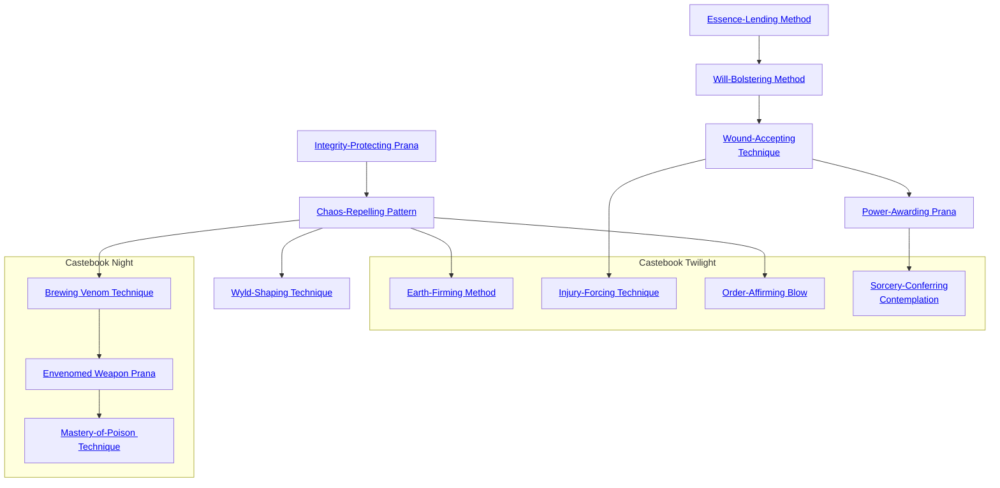

## Integrity-Protecting Prana

Cost: 5 motes, 1 Willpower
Duration: One day
Type: Simple
Minimum Lore: 1
Minimum Essence: 1
Prerequisite Charms: None

Exposure to Wyld energies can cause hallucinations,
psychological dependency, insanity and even terrible mutations.
Through the use of this Charm, the character makes her
person proof against the influence of Wyld energies. While
the Charm is in effect, her mind and body cannot be warped
or twisted by the power of the Wyld. Note that, while the
character's shape and sanity are protected, her body can still
be torn asunder by Wyld-spawned phenomenon; the whirling
walls of fire and thunder and the 100-headed snake
monsters with burning chalcedony eyes are quite real.
Similarly, her possessions are vulnerable, though the
protective effect of the Charm does seem to spill over to them
slightly. A character's sword will turn into a snake that hisses
and slithers off rather than an asp that bites her hand, and her
armor will suddenly become gossamer spiderwebs rather than
sheets of rotting gristle full of carnivorous maggots.

## Chaos-Repelling Pattern

Cost: 10 motes, 1 Willpower
Duration: One hour
Type: Simple
Minimum Lore: 3
Minimum Essence: 2
Prerequisite Charms: Integrity-Protecting Prana

Through the use of this Charm, the character protects
his possessions from the warping influence of the Wyld.
While the Charm lasts, the character and his goods (an
amount which can equal a fully laden horse if the character
is mounted) can sojourn in even the most fluid areas of the
Wyld without worry that they will suddenly become something
other than what they currently are.
Note again that Wyld-spawned phenomenon are not
warded against, though the Charm makes certain sorts of
mishaps (falling into the sky, having the ground suddenly
open up to become a pit of mechanical alligators) quite
unlikely. The character may be blasted asunder or eaten
and digested, but up and down will continue to mean the
same thing, and his feet will tend to always land on a stable,
solid object of some sort. Any character trying to lead a
horse into a deep Wyld area had better have the Spirit-Steadying
Assurances Charm or something similar.

## Wyld-Shaping Technique

Cost: 20 motes, 1 Willpower
Duration: Instant
Type: Simple
Minimum Lore: 5
Minimum Essence: 3
Prerequisite Charms: Chaos-Repelling Pattern

There are few of their abilities that the Exalted fear
using. They are, after all, the anointed of the gods. They do
not command Essence, it flows to match their desire. Even
the most serious sorts of negligence or mistakes are only
likely to lead to wild mood swings and misbehavior, not a
grisly death. But even in the days of the Old Realm, the
most powerful Solar Exalted used this Charm sparingly.
A character using this Charm can shape the primordial
chaos, the inchoate precursor of reality, to his whim.
Obviously, this Charm does not work in areas where the
fabric of reality is already set — it must be used in the
deepest, most fluid Wyld zones or else at the edge of the
world, forcing shape into the teeth of the howling storm.
To activate this Charm, the character sets foot in the
unformed substance of reality and wills it to take shape as he
commands. The player rolls his character's Essence. Wyld-
Shaping Technique is an extended action, with the cost of the
Charm paid for each roll. The number of successes required is
up to the Storyteller. The character can create nearly any-
thing — a Demesne, a giant factory that produces golem
warriors, a bag of diamonds as big as potatoes — but the larger
and more powerful the thing he wishes to create, the more
successes the player must roll. A single success would create
a bag of diamonds or a talent of gold, while three successes
would create a Demesne, a keep or a talent of one of the Five
Magical Materials. Five successes would create a fortress, an
enchanted forest complete with magical inhabitants or the
aforementioned manufactory for golem warriors.
If the player botches at any time, horrible side effects result
as reality shapes to the character's subconscious whims. It may
take the shape of his fears or simply coalesce in some horrifically
wrong fashion - the specifics are up to the Storyteller. They
are rarely pleasant and often worse than fatal.
Objects created in this fashion are freshly minted. Lacking
roots in reality, they are more subject to the gnawing of chaos
than other items. This instability is really only a problem for
large structures such as fortresses and cities - if such places are
left unpeopled and not made part of the complex interplay of
contact that makes up existence, they will slowly dissolve back
into the chaos from which they sprang.

## Essence-Lending Method

Cost: 3 motes
Duration: Instant
Type: Simple
Minimum Lore: 1
Minimum Essence: 1
Prerequisite Charms: None

No Exalted is an island. Through the use of this Charm, a
character can transfer Essence motes to another character. Touse
this Charm, the character must spend a turn in skin-to-skin
contact with the target and burn 3 motes of Essence to power the
Charm. She may then transfer to the target motes of Essence
equal to 3 x her permanent Essence score. This Essence may not
cause the target's Essence pool to rise above its normal maximum.
If the target cannot accept all the transferred Essence, then the
excess dissipates harmlessly. Characters may activate this Charm
over successive turns to transfer large quantities of Essence but
must pay the 3 motes for each turn the Charm is in use.

## Will-Bolstering Method

Cost: 5 motes, 1 Willpower
Duration: Instant
Type: Simple
Minimum Lore: 2
Minimum Essence: 2
Prerequisite Charms: Essence-Lending Method

Exalted can share more than simple power. The touch
of a Solar can bring new strength to the downcast heart and
new courage to the terrified. To use this Charm, the
character must be in skin-to-skin contact with the target
for a turn and must spend the Essence and Willpower to
power the Charm. The character may then transfer a
number of points of temporary Willpower to the target
equal to the highest Virtue that the two of them share.
For Example: Dace is transferring Willpower to Swan.
Dace has Valor 4, Conviction 2, Compassion 3, Temperance
2. Swan has Valor 3, Conviction 2, Compassion 2, Temperance
3. Dace can transfer up to three points of Temporary
Willpower to Swan, one for each dot they share in Valor.
As with Essence-Lending Method, above, the Will-Bolstering
Method cannot cause a character's temporary Willpower
to rise above its normal maximum. Excess points are wasted.

## Wound-Accepting Technique

Cost: 3 motes per health level, 1 Willpower
Duration: Instant
Type: Simple
Minimum Lore: 3
Minimum Essence: 2
Prerequisite Charms: Will-Bolstering Method

Through the use of this Charm, the Exalted can give the
gift of his very life energy. The character must be in skin-to-skin
contact with the target for a turn and must spend a point of
temporary Willpower and the appropriate amount of Essence.
The Exalted using the Charm immediately takes a number of
health levels of bashing damage, and the target of the Charm
immediately heals a like number of levels of bashing or lethal
damage. Exalted cannot share more health levels than the
lower of the two character's Staminas. This Charm cannot heal
aggravated damage, nor can it cause a character to gain more
health levels than she would normally have. Exalted can, in
fact, kill themselves through the use of this Charm.

## Power-Awarding Prana

Cost: 5 mote, 1 Willpower, 1 experience point
Duration: One day
Type: Simple
Minimum Lore: 5
Minimum Essence: 3
Prerequisite Charms: Wound-Accepting Technique

Through the use of this Charm, the Exalted can lend some
of her power to a normal mortal recipient. For each point of the
loaning character's Essence, he can loan one Charm to the
target. The target must have the appropriate minimum Ability
to use the Charm, and if the Charms lent have prerequisite
Charms, then the target must be lent those as well. The Charms
draw directly on the Essence of the Exalted who lent them, but
the recipient must pay any non-Essence costs. While the
Charms are lent, the Exalted cannot use them. The Exalted can
end the effect of this Charm and recall her power at any time.
During the First Age, Exalted often used this ability to bolster
their lictors and pages for important tasks.

## Earth-Firming Method

Cost: 15 motes, 1 Willpower
Duration: One day
Type: Simple
Minimum Lore: 4
Minimum Essence: 2
Prerequisite Charms: Chaos-Repelling Pattern

With this Charm, an Exalted can protect a large area
from the ravages of the Wyld for a single day. While it lasts,
the earth and vegetation within the warded area, together
with any living beings present inside it, will not be affected
by the Wyld's changes, and the air will remain breathable
and safe. The Solar paces around the area that he wishes to
ward (which may not have more than a five yard radius per
dot of permanent Essence that he has) and invokes the
Charm. Unfortunately, although the contents of the area
will be safe from change, faeries or Wyld-mutated beings
are not prevented from entering the protected area.

## Injury-Forcing Technique

Cost: 5 motes per health level, 1 Willpower
Duration: Instant
Type: Simple
Minimum Lore: 4
Minimum Essence: 2
Prerequisite Charms: Wound-Accepting Technique

With this Charm, an Exalt may transfer his current
injuries to another person. The character must be in skin-to-skin
contact with the target of the Charm for a turn, and
his player must spend a point of temporary Willpower and
the appropriate amount of Essence. The Exalt's wounds
close up and heal on his own body, while appearing at the
same time on that of the subject. The Solar using the
Charm immediately heals a number of health levels of
bashing or lethal damage, and the target of the Charm
immediately takes a like number of levels of bashing
damage. The maximum number of health levels transfer-
able is the lower of the two characters' Staminas. This
Charm cannot be used to transfer aggravated damage:
However, it is quite possible to kill somebody with it. It can
be used in combat, but it requires that the character have
concluded a successful grab or clinch maneuver and have
the target trapped at the time the Charm is used.

## Order-Affirming Blow

Cost: 15 motes, 1 Willpower
Duration: Instant
Type: Simple
Minimum Lore: 5
Minimum Essence: 4
Prerequisite Charms: Chaos-Repelling Pattern

By means of this Charm, an Exalt can use his singular
knowledge of both chaos and order to restore a Wyld-corrupted
living creature or object. By placing his hands
upon the target and focusing his will, the Solar can restore
it to its original physical and mental state. However, any
time that has passed will be taken into account: The target
of the Charm will be restored to his appropriate age and
may age significantly if the Wyld has preserved him from
the passing years. For a full day after this Charm has been
used, the target is immune to the effects of the Wyld:
However, if he remains in Wyld areas after that time, he
will once again be subject to its changes and may eventually
be returned to his previous altered form. Note that this
Charm does nothing to cure Wyld addiction - exposure
to the energies of the madlands is still pleasurable.

## Sorcery-Conferring Contemplation

Cost: 10 motes, 1 Willpower, 1 experience point
Duration: Instant
Type: Simple
Minimum Lore: 6
Minimum Essence: 6
Prerequisite Charms: Power-Awarding Prana

By means of this Charm, a character can lend one of
her spells to another Exalted sorcerer. For each dot of the
loaning character's Essence, she can lend a spell for one
use. The recipient must have the appropriate Sorcery
Charm to be able to use the spell. These spells draw directly
on the Essence of the Exalted who lent them, but the
recipient must pay any non-Essence costs - for example
the Willpower to activate the appropriate Sorcery Charm.
The Solar is still able to use these spells while the
Charm is in effect, but as soon as the recipient has cast any
of them as many times as the lending character has
permanent Essence, the recipient loses the ability to cast
that particular spell again. Use of this Charm does not aid
in the study of the spell — it merely imprints the spell on
the target, giving him the ability to use it once per dot of
the lending character's Essence. Powerful Solars often
used this ability to empower lesser minions — particularly
the Dragon-Blooded - for particular missions.

## Brewing Venom Technique

Cost: 4 motes, 1 willpower, 1 health level per pot created
Duration: One week
Type: Simple
Minimum Lore: 4
Minimum Essence: 3
Prerequisite Charms: Chaos-Repelling Pattern

The Exalt must spend an entire scene (30 minutes)
boiling a small pot of water. During this time, she meditates
and focuses her Essence into the water, transforming
it into a deadly poison. The difficulty of the Stamina +
Resistance roll to avoid the poison and the penalty it
causes are both equal to the character's Lore Ability score.
This penalty persists for a number of minutes equal to the
character's permanent Essence.
The damage done if the victim's player succeeds in
making a successful Stamina + Resistance roll is equal to
half of the brewing character's Lore (round up), and the
damage done by the poison if the victim's player fails the
roll is equal to twice the brewing character's Lore.
At the character's choice, the poison brewed can
either bẻ a deadly toxin that does lethal damage or a
powerful narcotic that only does bashing damage. Either
poison must be ingested or delivered via a weapon to be
effective Each pot made contains poison enough to
envenom a dozen weapons or to poison a large meal. The
poison is odorless, tasteless and colorless, requiring a
Perception + Awareness roll of a difficulty equal to the
brewing character's Essence to detect.
Like all other weapon venoms, each dose of poison
can only be used against a single target. Once it has been
used, the poison must be applied to the weapon again to
be effective. The poison transforms back into harmless
water after a week. Each batch must be brewed as either
a thick weapon venom or an ingested venom that is as
thin as water. Charms such as Poison-Resisting Medita-
tion and Immunity to Everything Technique affect this
poison normally.

## Envenomed Weapon Prana

Cost: 6 motes, 1 Willpower, 1 health level
Duration: One day
Type: Simple
Minimum Lore: 4
Minimum Essence: 3
Prerequisite Charms: Brewing Venom Technique

With a seemingly harmless touch, the character can
envenom a single weapon, a single plate of food or a
goblet of wine. The difficulty to resist the poison and the
penalty and damage for the poison are all the same as for
Brewing Venom Technique. At the character's option,
the poison brewed can either be a deadly toxin that does
lethal damage or a powerful narcotic that only does
bashing damage. Either poison must be ingested or enter
a wound to be effective. The poison is odorless, tasteless
and colorless. The poison lingers in the drink or the
weapon for the next full day — after this time, it
dissipates harmlessly. This Charm cannot be used to
poison food or drink in the same turn that it is consumed
or to envenom a weapon in the same turn that it is being
used to strike a target.

## Mastery-of-Poison Technique

Cost: 10 motes, 1 Willpower, 1 health level
Duration: Instant
Type: Reflexive
Minimum Lore: 5
Minimum Essence: 3
Prerequisite Charms: Envenomed Weapon Prana

The character can use this Charm to either envenom
a single weapon on the same turn that it is used to strike
a target or to poison a single plate of food or goblet of
drink. Also, the character may poison a weapon, food or
drink that is up to one yard per point of permanent
Essence away. The difficulty to resist the poison and the
penalty and damage for the poison are all the same as for
Brewing Venom Technique. At the character's choice,
the poison brewed can either be a deadly toxin the does
lethal damage or a powerful narcotic that only does
bashing damage. Either poison must be ingested or enter
a wound to be effective. The poison is odorless, tasteless
and colorless. The poison lingers on the drink or the
weapon for the next full scene — after this time; it
harmlessly dissipates.
