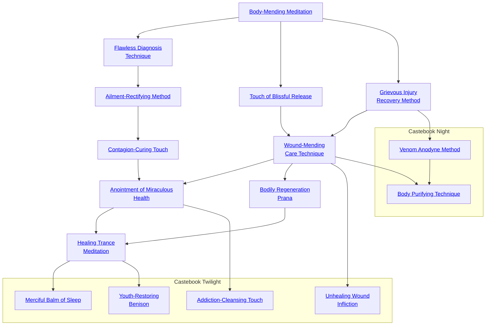

## Body-Mending Meditation

Cost: 10 motes
Duration: One day
Type: Reflexive
Minimum Medicine: 1
Minimum Essence: 1
Prerequisite Charms: None

This Charm allows the character to channel Essence
through her own body, knitting broken bones and mending
cut and burnt flesh with supernatural speed. When this
Charm is active, the character heals at 10 times the normal
rate. For healing times, see the Drama chapter, page 234. This
Charm works only on the Exalted herself and cannot be used
on others. This Charm does not speed the healing of aggravated
damage, nor does it allow the regeneration of amputated
or destroyed tissue — a character who loses an eye or hand will
have to seek more powerful magical remedies. Characters can
activate this Charm even if unconscious.

## Flawless Diagnosis Technique

Cost: 1 mote
Duration: Five minutes
Type: Simple
Minimum Medicine: 1
Minimum Essence: 1
Prerequisite Charms: None

Through the use of this Charm, the character hones
his medical abilities to an unearthly degree. By examining
a patient closely and hearing about her symptoms, the
character can flawlessly diagnose her illness. Note that this
is an improvement of the character's perception, not
access to a vast store of medical wisdom - knowledge of
formal medicine is a function of the character's Medicine
and Lore skills. If the character has never heard of a disease,
she will only be able to diagnose its general type and
determine if it is magical in nature or not. The character's
ability to actually treat the disease will be strictly contingent
on her skill as a physician. However, regardless of her
degree of skill, she will never misdiagnose a disease, mis-
taking one she doesn't know for one she does.

## Ailment-Rectifying Method

Cost: 10 motes
Duration: Six hours
Type: Simple
Minimum Medicine: 2
Minimum Essence: 1
Prerequisite Charms: Flawless Diagnosis Technique

The Charm Ailment-Rectifying Method allows an
Exalted to recover rapidly from even the most serious
illness. Non-life-threatening illnesses dissipate immediately.
The player of a character suffering from a more
serious ailment may make a Stamina + Resistance roll
(without any wound or disease-related penalties). Success
indicates that the character's illness fades over the
course of the Charm's duration. Very serious diseases may
require two or more successes, so it may take a character
several days of use to accumulate enough successes to
recover fully. However, even the most serious illnesses
are halted in their progress by this Charm, and even the
Great Contagion requires but five accumulated successes
to overcome. Note that this Charm can only be used on
the Exalted herself - to heal others of sickness, the
Exalted must use Contagion-Curing Touch.

## Contagion-Curing Touch

Cost: 10 motes
Duration: One day
Type: Simple
Minimum Medicine: 3
Minimum Essence: 2
Prerequisite Charms: Ailment-Rectifying Method

Through the use of this Charm, the character can
successfully treat serious or even normally incurable diseases.
The Exalted's player makes an Intelligence +
Medicine roll. Normal diseases are cured with a single
success, while more serious ailments may require as many
as five successes. Regardless of success, once treatment has
begun, the course of the disease is halted, and unless use of
this Charm is discontinued, the illness will grow no worse.
No medicine is required, though the person being treated
must be bathed, kept warm, fed well and given all the other
prerequisites of bed rest. The Exalted himself must perform
this care and, as a result, cannot treat more individuals
during a given day than his score in the Medicine Ability.

## Touch of Blissful Release

Cost: 5 motes
Duration: Six hours
Type: Simple
Minimum Medicine: 2
Minimum Essence: 1
Prerequisite Charms: Body-Mending Meditation

The Touch of Blissful Release allows the character to
lessen the suffering of wounded or ill individuals, dulling
their pains and easing the discomforts of illness. Wounded
characters reduce their wound penalties by two, and sick
characters likewise ignore up to two dice of negative
symptoms. However, Touch of Blissful Release has a
narcotic effect as well as an analgesic one, and characters
under its influence are at a -3 die penalty to performing any
action that requires thought, memory or coordination.

## Grievous Injury Recovery Method

Cost: 10 motes
Duration: One day
Type: Simple
Minimum Medicine: 2
Minimum Essence: 2
Prerequisite Charms: Body-Mending Meditation

By channeling Essence through her body, the character
can increase her rate of healing immensely. Over the
duration of the Charm, which must be spent in bed rest,
the character heals health levels equal to her Essence score
plus a number of additional health levels equal to the
number of successes the character's player achieves on a
Stamina + Endurance roll. This Charm does not speed the
healing of aggravated damage, nor does it allow the regeneration
of amputated or destroyed tissue.

## Wound-Mending Care Technique

Cost: 10 motes
Duration: One day
Type: Simple
Minimum Medicine: 3
Minimum Essence: 2
Prerequisite Charms: Grievous Injury Recovery Method, Touch of Blissful Release

Similar in effect to Grievous Injury Recovery Method,
this Charm allows the character to heal others at an
incredible pace. For each day the character spends treating
the subject (who must rest in bed during the treatment),
she heals health levels equal to her permanent Essence
plus a number of additional levels equal to the number of
successes her player achieves on an Intelligence + Medicine
roll. A character cannot tend to more than one
individual undergoing Wound-Mending Care Technique
at a time. This Charm does not speed the healing of
aggravated damage, nor does it allow the regeneration of
amputated or destroyed tissue.

## Anointment of Miraculous Health

Cost: 10 motes
Duration: Instant
Type: Simple
Minimum Medicine: 4
Minimum Essence: 3
Prerequisite Charms: Contagion-Curing Touch, Wound-Mending Care Technique

This Charm allows the character to actually cure
injuries with nothing but a touch. Where the character's
Essence-charged hands go, shattered bones are made whole
and torn flesh is instantly mended. With each use of this
Charm, the character instantly heals a number of health
levels equal to his Essence score. The Exalted cannot heal
herself with this Charm. This Charm does not speed the
healing of aggravated damage, nor does it allow the regeneration
of amputated or destroyed tissue.

## Bodily Regeneration Prana

Cost: 10 motes, 1 Willpower
Duration: One hour
Type: Simple
Minimum Medicine: 5
Minimum Essence: 2
Prerequisite Charms: Wound-Mending Care Technique

The character enters a healing trance, during which he
loses all awareness of the world around him. For every hour
he is in this trance, he heals a number of health levels equal
to his Essence score. This healing trance will cure aggravated
damage, as well as allow the regrowth of destroyed
tissues, amputated limbs, lost eyes and so forth. Eyes, tongues,
hands, feet, mouths full of smashed teeth and other lesser
maimings are the equivalent of a health level. Lost limbs are
the equivalent of two health levels and, so, take two hours
each to regrow. During the period the Exalted is so entranced,
she regains no Essence - prolonged periods of
healing can leave a Solar helpless before her enemies.

## Healing Trance Meditation

Cost: 10 motes, 1 Willpower
Duration: One hour
Type: Simple
Minimum Medicine: 5
Minimum Essence: 3
Prerequisite Charms: Anointment of Miraculous Health

Health, Bodily Regeneration Prana
Similar to the Charm Bodily Regeneration Prana, the
Healing Trance Meditation Charm allows the character to
heal similarly serious injuries in others. The Exalted must
touch her target, and the target must be cooperative. Both
she and the target fall into a healing trance, during which
they have no awareness of the outside world. For each hour
they remain in this trance, the target heals a number of
health levels equal to the Exalted's Essence score. As with
Healing Trance Meditation, this Charm can heal aggravated
damage and replace lost limbs and other, similar
maimings. The times required to heal these injuries are as
for Bodily Regeneration Prana, above. Neither of the
characters involved regains Essence during the healing
period (assuming that the target has any Essence to regain
— he may, after all, be an unExalted mortal).

Errata:
Healing Trance Meditation refers twice to itself as if it were a different Charm. The text is actually
referring to Bodily Regeneration Prana.

## Addiction-Cleansing Touch

Cost: 8 motes, 1 Willpower
Duration: Instant
Type: Simple
Minimum Medicine: 4
Minimum Essence: 3
Prerequisite Charms: Anointment of Miraculous Health

With this Charm, an Exalted can cleanse another
character of any addiction that she may have to alcohol or
to more noxious substances, such as opium, bright morn-
ing, lotus distillate or fire butterfly wing-powder. The
character places her hand on the subject's brow and
invokes the Charm, instantly freeing the subject from all
psychological and physiological effects and cravings of the
addiction. However, the stresses and temptations that
drove the subject to addiction in the first place will not be
banished and may, quite possibly, cause the subject to
relapse. An Exalt cannot use this Charm upon herself.

## Unhealing Wound Infliction

Cost: 10 motes, 1 Willpower
Duration: One scene
Type: Simple
Minimum Medicine: 4
Minimum Essence: 2
Prerequisite Charms: Wound-Mending Care Technique

In a sense the diametric opposite to the Wound-Mending
Care Technique, this Charm allows the
character to inflict particularly grievous wounds, which
will heal far more slowly than normal. By spending 10
motes of Peripheral Essence and 1 point of temporary
Willpower, the character focuses his blows through his
understanding of anatomy and Essence flows, so that all
aggravated and lethal damage he inflicts will take five
times as long to heal, and all bashing damage will take 10
times as long to heal. If healing Charms are later used on
the target, they function at half their usual efficacy.
Twilight Exalted frequently used this Charm in duels
during the First Age.

## Merciful Balm of Sleep

Cost: 10 motes, 1 Willpower
Duration: One day
Type: Simple
Minimum Medicine: 6
Minimum Essence: 6
Prerequisite Charms: Healing Trance Meditation

With this Charm, an Exalted can heal not only
wounded bodies, but also salve damaged minds and souls.
While the character must touch the subject of the Charm,
the subject need not be cooperative or willing — in fact,
if he suffers from a particularly violent form of insanity,
he may need to be restrained in some way. Both the
Exalted and the target pass into a deep healing trance, in
which they remain for an entire day. The only way of
forcibly breaking the trance before the day is over is
either to separate the two physically or to slay one of
them, in which case the other awakens. During the
period that the Exalted is entranced, he regains no
Essence. If the Charm is completed, then the subject
awakens with a clear and rational mind, free from all
forms of insanity. While this Charm will also heal the
effects on a soul of the Fair Folk's hunger and cure
sorcerous forms of madness, it will not necessarily alter a
target's morality or cause a person to change strongly held
views. An Exalted cannot use this Charm upon himself:
If he is suffering from some form of insanity, then someone
else must use the Charm on him. Also, the Charm
cannot cure the Great Curse.

## Youth-Restoring Benison

Cost: 15 motes, 1 Willpower, 1 experience point
Duration: Instant
Type: Simple
Minimum Medicine: 7
Minimum Essence: 7
Prerequisite Charms: Healing Trance Meditation

One of the most legendary of Charms, it allows an
Exalt to restore youth and health to a normal human or
animal. However, it cannot restore another Exalted or a
magical being, as it only works on purely natural creatures.
The character invokes the Charm, touching the target
(who must be willing) and spending 15 motes of Peripheral
Essence, 1 Willpower and 1 experience point. The target
instantly and visibly grows young again, becoming as
healthy and attractive as he was when a young adult (18
years old for humans, proportionally younger for animals),
though retaining all his skills and knowledge. The effect
lasts for a single year; if it is not renewed at the end of the
year, then the subject's lost years will be visited upon him
once again. The legends of this Charm are generally not
believed: Were it known that Exalts could actually per-
form such a deed, it is likely that many unscrupulous and
powerful persons would be extremely interested.

## Venom Anodyne Method

Cost: 3 motes
Duration: Instant
Type: Reflexive
Minimum Medicine: 4
Minimum Essence: 2
Prerequisite Charms: Grievous Injury Recovery Method

To be effective, characters must use this Charm the
instant they are subjected to poison damage. This Charm
instantly negates all damage from poison and renders the
poison harmless.

## Body Purifying Technique

Cost: 5 motes
Duration: Instant
Type: Simple
Minimum Medicine: 4
Minimum Essence: 3
Prerequisite Charms: Wound-Mending Care Technique, Venom Anodyne Method

This Charm allows the character to cure others of
all damage caused by poison or acid provided that he can
get to them within 10 turns of their being poisoned or
burned. The character can also touch poisoned weapons,
food or drink and render it harmless with a touch
If she has time to handle and caress a venomous animal,
she can render it nonpoisonous for the next day, but this
cannot be done in combat, and it does not effect magical
animals such as dragons.
