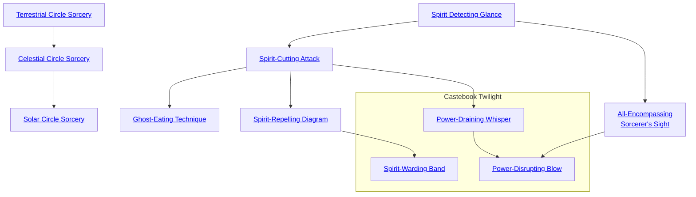

## Terrestrial Circle Sorcery

Cost: 1 Willpower
Duration: Instant
Type: Simple
Minimum Occult: 3
Minimum Essence: 3
Prerequisite Charms: None

While some mortals can manage, by supreme effort, to
perform magical rituals, magic is simply another, more
draining way of channeling Essence to the Exalted. Characters
who have learned the Terrestrial Circle Sorcery Charm
are able to hone their will into the needle-sharp focus
needed to perform magic of the so-called First Circle. Note
that the cost of the Charm is only to enable the character to
cast a single spell. The actual spell itself has an Essence cost,
often very high, that the character must pay to actualize the
spell. This cost is listed in the spell's description. For
descriptions of spells, see the &quot;Sorcery&quot; section on page 215.
Terrestrial Circle Sorcery can never be part of a Combo.

## Celestial Circle Sorcery

Cost: 2 Willpower
Duration: Instant
Type: Simple
Minimum Occult: 4
Minimum Essence: 4
Prerequisite Charms: [[#Terrestrial Circle Sorcery]]

Similar to, but more powerful than, magic of the
Terrestrial Circle, Celestial Circle magic is mighty indeed.
Dragon-Blooded and mortals are unable to practice this
form of magic, but Celestial Exalted can. It is worth noting
that there are only a handful of individuals in the world
who know the secrets of Celestial Circle magic. Characters
who wish to learn magic of this circle will have to find
these entities and convince them to share their wisdom.
Celestial Circle Sorcery can never be part of a Combo.

## Solar Circle Sorcery

Cost: 3 Willpower
Duration: Instant
Type: Simple
Minimum Occult: 5
Minimum Essence: 5
Prerequisite Charms: [[#Celestial Circle Sorcery]]

The most powerful form of magic available to the
Exalted. Sorcery of the Solar Circle rivals the anger of the Five
Elemental Dragons in its power. Only the Solar Exalted can
practice magic of this magnitude, and most of it was lost after
the murder of the Solars, many centuries ago. As a result, there
are practically no spells of the Solar Circle left outside the
Imperial Library. Characters who wish to reclaim the sorcerous
power that is their legacy without centuries of magical
research will have to either search far and wide for magic or
else bargain with the Yozis and Deathlords for such scraps of
power as they can be persuaded to part with. Solar Circle
Sorcery can never be part of a Combo.

## Spirit Detecting Glance

Cost: 3 motes
Duration: One scene
Type: Simple
Minimum Occult: 1
Minimum Essence: 1
Prerequisite Charms: None

This Charm allows the character to perceive
unmanifested spirits. Normally, spirits must manifest (appear
but remain intangible) or materialize (appear in physical
form) to be perceived. However, characters with this Charm
can see spirits when they have done neither. Spirits in their
natural form appear much as they do when manifested or
materialized, though the character can clearly distinguish
them from those that are actually visible. Note that this
Charm does not make the character any more able to strike
or harm spirits, though it does make it much easier for her to
direct her attacks. For more information on spirits and their
powers, see the Antagonists chapter, page 289.

## Spirit-Cutting Attack

Cost: 2 motes
Duration: Instant
Type: Supplemental
Minimum Occult: 2
Minimum Essence: 2

Prerequisite Charms: [[#Spirit Detecting Glance]]
This Charm allows the character to launch a single
attack at an unmanifested spirit. For the purposes of the
individual attack, the character attacks the spirit as if it
was manifested normally. Characters who do not have
Spirit-Detecting Glance active (or who are not using some
other means of perceiving spirits) will be attacking blind
— a +2 difficulty modifier. Spirits killed via Spirit-Cutting
Attack will eventually regenerate, but this process takes
some time (potentially decades) and is quite unpleasant
for the spirit. Spirit-Cutting Attack is explicitly permitted
to be part of a Combo with Charms of other Abilities.

## Ghost-Eating Technique

Cost: 5 motes
Duration: Instant
Type: Supplemental
Minimum Occult: 4
Minimum Essence: 3
Prerequisite Charms: [[#Spirit-Cutting Attack]]

This Charm is similar to Spirit-Cutting Attack, but the
character's blows are much more dangerous. Name aside, the
character does not actually place the spirit into her mouth,
though she does consume its Essence, and its death at her
hands is permanent. A blow struck using this Charm does
aggravated damage to unmaterialized spirits and drains away
motes of the spirit's Essence equal to twice the character's
permanent Essence, which are added to the character's own
store of motes. Drained motes that would take the character
above her normal maximum are still drained but dissipate
without benefit to the Exalted. Spirits that have materialized
are no longer vulnerable to the Ghost-Eating Technique.
This Charm is the weapon by which the Exalted slew the
enemies of the gods, and spirits hate and fear it. The Ghost-Eating
Technique is explicitly permitted to be part of a
Combo with Charms of other Abilities.

## Spirit-Repelling Diagram

Cost: 10 motes
Duration: One scene
Type: Simple
Minimum Occult: 5
Minimum Essence: 2
Prerequisite Charms: [[#Spirit-Cutting Attack]]

Through the use of this Charm, characters can drive away
unmaterialized spirits from an area and bar them from entry. The
character spreads her arms, and a blazing circle of gold-white light
erupts a number of yards in radius equal to the character's Essence.
All unmaterialized spirits within the diagram who have a lower
maximum Essence pool than the character must either flee the
warded area or materialize. Unmaterialized spirits outside the
diagram with maximum Essence pools lower than the character's
may not use their Charms to effect those within the diagram, nor
may they enter it. Spirits that have materialized are no longer
subject to the diagram.

## All-Encompassing Sorcerer's Sight

Cost: 6 motes
Duration: One scene
Type: Simple
Minimum Occult: 5
Minimum Essence: 2
Prerequisite Charms: [[#Spirit Detecting Glance]]

This powerful Charm allows a character to perceive the
flows of Essence at work in the world around him. Far more
detailed than Spirit-Detecting Glance or the intuition for
magic at work that every sorcerer possesses, this Charm allows
characters to actually see the Essence of the world. Characters
can not only perceive spirits, they can also see the great gauzy
rivers of the dragon tracks and the shatteringly brilliant fountains
and spires of Manses and Demesnes. Exalted using this
Charm can distinguish the diamond-bright lattices of Charms
and sorcery at work, allowing them to spot most enchantments
without the need for any roll. With a successful Intelligence +
Occult roll, a character can even identify the kind of enchantment
and (if he is sufficiently familiar with her handiwork) the
Exalted who caused the magic to come into existence.

## Power-Draining Whisper

Cost: 5 motes per turn
Duration: Varies
Type: Simple
Minimum Occult: 4
Minimum Essence: 5
Prerequisite Charms: [[#Spirit-Cutting Attack]]

By giving voice to the arcane patterns of this Charm,
an Exalted can hamper an enemy's ability to use Essence.
The character must be within a number of yards of the
target equal to his Essence. The Solar's player and target's
player must both make Will + Occult rolls: If the Solar's
player scores more successes, then for the turn when this
Charm is used and in every subsequent turn in which the
character spends 5 motes of Essence, the chosen subject of
the Charm must pay twice as much Essence to use any of
his Charms or other Essence-fueled abilities. If the target
scores more successes, then the Charm fails to function.
While this Charm does not require continuous concentration
by the Exalt, only the continued expenditure of
Essence, and counts as the use of a simple Charm every
turn, it will be nullified if the Solar using it is rendered
unconscious or killed. This Charm may never be used as
part of a Combo, nor does it affect beings with an Essence
equal to or greater than the character.

## Power-Disrupting Blow

Cost: 7 motes of Essence, 1 temporary Willpower
Duration: Multiple Turns
Type: Supplemental
Minimum Occult: 6
Minimum Essence: 5
Prerequisite Charms: [[#All-Encompassing Sorcerer's Sight]], [[#Power-Draining Whisper]]

With a barehanded blow, the character using this
Charm makes it impossible for his target to make any
directed use of Essence for that turn and, potentially, for
later turns. It must be used with a successful barehanded
attack (which need do no damage but must penetrate
the target's block or dodge) and is specifically permitted
to be used as part of a Combo with Charms of other
Abilities. The character may maintain the Charm as
long as she continues to spend 10 motes of Peripheral
Essence and 1 permanent Willpower for each turn that
it is in use. This count's as the character's Charm use for
the turn, as long as se continues to spend 7 motes and 1
temporary Willpower per turn.
The target — whether he is an Exalt, a spirit, one of
the Fair Folk or anything else — will be unable to use any
Essence-driven powers and must react on a purely physical
level. Note that creatures that are magically aflame or that
have magical venom are not restricted by this Charm, as
such prodigies are expressions of their fundamental beings,
and this attack bars only the working of magic. Likewise,
this Charm cannot stop Lunar shapeshifting or the display
and use of anima banners. Should the Solar invoking the
Charm be rendered unconscious or killed, the magic is
broken. It is whispered that there are more powerful
versions of this Charm, which can suppress the powers of
an Exalted for days, years or permanently, but if so, they are
still not yet rediscovered.

## Spirit-Warding Band

Cost: 15 motes, 1 Willpower
Duration: Instant
Type: Simple
Minimum Occult: 6
Minimum Essence: 6
Prerequisite Charms: [[#Spirit-Repelling Diagram]]

An Exalted can use this Charm to ward a building or
room from unwanted entry by spirits. For the Charm to
function, the area being warded must have a clearly defined
main entrance and may not be larger than 20 yards
square. The Exalt invokes the Charm by tracing his Caste
Mark upon the main door of the area — or on the ground,
if there is no actual door — to seal the entrance. Dematerialized
spirits outside the warded area with permanent
Essence lower than the character's may not use their
Charms to affect those within the warded area, nor may
they enter it unless invited by those within. Should they
attempt to enter, whether or not they succeed, the mark
upon the entrance blazes bright gold, visible to anybody
nearby. This ward is a continuing effect that lasts until the
room is broken or the ward is deliberately defiled by a being
that is not a spirit.
