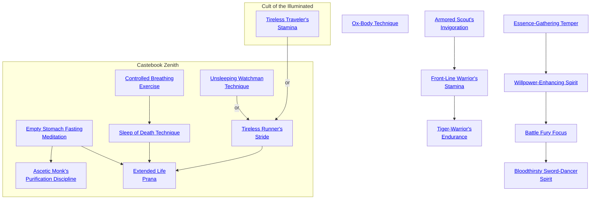

## Ox-Body Technique

Cost: None
Duration: Permanent
Type: Special
Minimum Endurance: Varies
Minimum Essence: 1
Prerequisite Charms: None

The bodies of the Exalted are far more durable than
those of mere mortals. To help simulate this, an Exalted may
buy extra health levels as if they were a Charm. A player may
purchase this Charm up to once per dot of the Endurance
Ability his character possesses. Each Ox-Body Technique
Charm purchased can provide one of the following, at the
player's option, determined at the time of purchase:
• One -0 health level
• Two -1 health levels
• One -1 health level and two -2 health levels

## Armored Scout's Invigoration

Cost: 5 motes
Duration: One day
Type: Simple
Minimum Endurance: 2
Minimum Essence: 2
Prerequisite Charms: None

The Exalted causes her anima to encompass her gear as
well as her person, and she adapts perfectly to wearing her
armor, even in conditions of brutal heat or freezing cold. This
Charm reduces the fatigue value and mobility penalty of the
character's armor by one each. A fatigue value of zero means
that the character need never roll to see if he becomes fatigued
from wearing the armor. This Charm cannot reduce a
character's mobility penalty or fatigue value below zero.

## Front-Line Warrior's Stamina

Cost: 10 motes
Duration: One day
Type: Simple
Minimum Endurance: 3
Minimum Essence: 1
Prerequisite Charms: [[#Armored Scout's Invigoration]]

This Charm is a more powerful version of the Armored
Scout's Invigoration. This Charm reduces the fatigue value and
mobility penalty of the character's armor by two each. A fatigue
value of zero means that the character need never roll to see if he
becomes fatigued from wearing the armor. This Charm cannot
reduce a character's mobility penalty or fatigue value below zero.

## Tiger Warrior's Endurance

Cost: 15 motes
Duration: One day
Type: Simple
Minimum Endurance: 4
Minimum Essence: 2
Prerequisite Charms: [[#Front-Line Warrior's Stamina]]

The most powerful of the armor Charms, Tiger-Warrior's
Endurance reduces the fatigue value and mobility penalty of
the character's armor by three each. A fatigue value of zero
means that the character need never roll to see if he becomes
fatigued from wearing the armor. This Charm cannot reduce
a character's mobility penalty or fatigue value below zero.

## Essence-Gathering Temper

Cost: 1 mote
Duration: Instant
Type: Reflexive
Minimum Endurance: 1
Minimum Essence: 2
Prerequisite Charms: None
Many Exalted learn to tap the wellsprings of Essence
that are pain and rage. A character who knows this Charm
may activate it whenever he is hit in combat. For every point
of damage he takes before soak is applied, his player may roll
one die. Each success on this roll causes the character to gain
a mote of Essence. A character cannot gain more Essence
from any given attack than his Stamina score.

## Willpower-Enhancing Spirit

Cost: 3 motes
Duration: Instant
Type: Reflexive
Minimum Endurance: 3
Minimum Essence: 2
Prerequisite Charms: [[#Essence-Gathering Temper]]

With this Charm, the character does not simply tap her
inner rage and pain to refill her Essence pool, but internalizes it
to gain true inner strength. The Exalted's player may roll one die
for each health level of damage the character takes when hit in
combat (that is, damage successes rolled after the character's soak
is applied). Each success on this roll causes the Exalted to regain
a point of temporary Willpower. A character using this Charm
may not raise her temporary Willpower over its permanent value.

## Battle Fury Focus

Cost: 5 motes
Duration: One scene
Type: Simple
Minimum Endurance: 3
Minimum Essence: 2
Prerequisite Charms: [[#Willpower-Enhancing Spirit]]

Through the use of this Charm, the character taps his
inner rage, not to replenish his stores of Essence, but in
conjunction with them. He channels his anger and infuses it
with primal magic, making him capable of superhuman feats.
For the duration of the scene, the character has + 1 die to
all pools related to combat and subtracts -1 from all wound
penalties. However, the character must either be engaged in
combat or attempting to become so engaged. He can attack
at range and differentiate friend from foe, but his player must
make a Willpower roll for him to utter sentences of more than
a few words, move away from the enemy or perform a complex
action, such as retrieving a small object from a pack. Failure
means the character simply chooses to ignore whatever the
action is in favor of attacking or readying himself to attack.
Success means the character can do whatever it was he
wished, but the Battle Fury Focus immediately ends, with the
dice pool bonus dissipating and wound penalties returning.
The bonus vanishes, and the penalties return starting with
the action that broke the Battle Fury Focus.

## Bloodthirsty Sword-Dancer Spirit

Cost: 10 motes, 1 Willpower
Duration: One scene
Type: Simple
Minimum Endurance: 4
Minimum Essence: 2
Prerequisite Charms: [[#Battle Fury Focus]]

The battle-trance engendered by Bloodthirsty Sword-Dancer
Spirit is similar to that of Battle Fury Focus, but greater
in all ways. While in effect, the character is at +3 to all dice
pools and suffers no wound penalties. However, her awareness
of the world around her narrows to little more than a
narrow red tunnel with things that must die at the far end. The
character cannot use ranged weapons, cannot speak coherently,
cannot retreat and cannot choose to fight another foe
until the one she is attacking is definitively dead. She may
only attack or move toward the nearest foe via the most direct
route. A character under the effect of Bloodthirsty Sword-Dancer
Spirit may opt to die where she stands (for example,
when holding a gate or bridge against tremendous odds) and,
in this case, need not move toward the next enemy.
The character may have difficulty telling friend from
foe if they are dressed similarly but will generally not attack
close friends, relatives or lovers unless they attempt to get
between her and her target or otherwise restrain her.
Bloodthirsty Sword-Dancer Spirit lasts until the character
can no longer locate an enemy to kill.
If the character wishes to leave the state earlier, her
player may make a Willpower roll to snap the character out
of it. The Willpower roll is normally difficulty 3, but it is made
at normal difficulty if there is a loved one or friend attempting
to restrain the character. Unfortunately, in the event that the
roll fails when a loved one is attempting to calm the character
down, she is almost certain to lash out at the unrecognizable
blur obstructing her from slaying her target.

## Empty Stomach Fasting Meditation

Cost: 1 mote
Duration: One day
Type: Simple
Minimum Endurance: 1
Minimum Essence: 1
Prerequisite Charms: None

The constitutions of Exalted are far more resilient
than those of mere mortals, yet even the Chosen must
eat. Through the use of this Charm, an Exalted may
eliminate her need to eat for a single day. Activation of
this Charm takes the normal investment of Essence and
meditation for one-quarter hour. Use of this Charm
does not alleviate the need to drink water. The Charm
may be used for up to 40 days in a row without penalty.
Afterward, the Chosen must eat and drink normally for
three days in a row. This Charm will not work again
until the Chosen has so eaten.

## Ascetic Monk's Purification Discipline

Cost: 10 motes
Duration: Three days
Type: Simple
Minimum Endurance: 3
Minimum Essence: 3
Prerequisite Charms: [[#Empty Stomach Fasting Meditation]]

In the harsh conditions of the wilderness, even fresh
water can be hard to come by. The Exalted who has
mastered this Charm can go without food and water for
three days. Activation of this Charm takes the normal
investment of Essence and meditation for a full hour. The
Exalt must eat and drink normally for at least one day
before this Charm can be used again.

## Controlled Breathing Exercise

Cost: 5 motes
Duration: One scene
Type: Simple
Minimum Endurance: 2
Minimum Essence: 2
Prerequisite Charms: None

The Exalted uses Essence to reduce his need for
breathing. Once the Charm is activated, the Chosen need
not breath until the scene is over, as long as he does nor
speak and only attempts simple actions. Each turn the
Exalted attempts a complicated action, including combat,
he must make a reflexive Stamina + Endurance roll to
avoid breathing. Obviously, this Charm is of great use in
poisoned environments.

## Sleep of Death Technique

Cost: 15 motes
Duration: Special
Type: Simple
Minimum Endurance: 4
Minimum Essence: 4
Prerequisite Charms: [[#Controlled Breathing Exercise]]

Through the use of this Charm, an Exalted can give
the illusion of death. Her heartbeat slows to
imperceptibility, and she does not breath. To every mortal
inspection, the Chosen is dead. The Exalted can remain in
this state for as long as she chooses, but the Charm does not
remove the need to eat or drink, putting a practical limit
on its use without the invocation of additional Charms.

## Unsleeping Watchman Technique

Cost: 5 motes
Duration: One night
Type: Simple
Minimum Endurance: 2
Minimum Essence: 2
Prerequisite Charms: None

Even the most careful of Exalted must sleep sometime,
and it is when they sleep that they are most vulnerable.
The use of this Charm replaces the need for a night's sleep
with spent Essence, allowing the Exalt to act without
penalty both day and night. There is no limitation on the
number of concurrent days on which the Charm may be
used. However, each night that Unsleeping Watchman
Technique is invoked is a night without dreaming. After
a number of consecutive days equal to the Chosen's
Stamina + Endurance, the Exalted will begin to experience
waking dreams, seeing and hearing weird, seemingly
disconnected objects and sounds. Mechanically, the distraction
of these hallucinations will cause the character to
suffer a one die penalty on all checks. This penalty increases
by one day for each additional period of (Stamina
+ Endurance) consecutive days.

## Tireless Runner's Stride

Cost: 10 motes
Duration: Special
Type: Simple
Minimum Endurance: 3
Minimum Essence: 3
Prerequisite Charms: [[#Unsleeping Watchman Technique]]

An Exalted with Tireless Runner's Stride can run for
an extended period to complete her tasks. The Chosen
must have a specific target in mind when invoking the
Charm and must invest the Essence as normal. Afterward,
the Exalted can run without ceasing until her goal is
reached. She needs no sleep, nor does she need to perform
bodily functions. If a sufficient supply of food and water is
carried, the Exalted may eat and drink without stopping or
slowing her running speed. Her pace is tripled by the
investiture of Essence and by the lack of need to stop. If the
Exalted stops running, the Charm ends. This running
prevents the Exalt from regaining Essence naturally, just
like any other strenuous exercise. The Exalted must clearly
know the location she seeks to properly invoke this Charm.

## Extended Life Prana

Cost: None
Duration: Permanent
Type: Special
Minimum Endurance: 7
Minimum Essence: 7
Prerequisite Charms: [[#Empty Stomach Fasting Meditation]], [[#Sleep of Death Technique]], [[#Tireless Runner's Stride]]

The Exalted who masters this Charm has his natural life
extended many times, staving off the reaper with his righteousness.
While the typical Solar Exalted lives for 2,000 to
3,000 years, this Charm extends his life to 5,000 to 7,000
years. The possessor of this Charm shows no sign of aging or
degradation of health until his very last days walking Creation.
This Charm offers no protection from damage or
disease, it merely extends the lifespan of the Chosen. In
addition to the prerequisites listed above, the Exalted must
have a rating of at least three in all of his Virtues.

## Tireless Traveler's Stamina

Cost: 5 motes
Duration: One day
Type: Simple
Minimum Endurance: 2
Minimum Essence: 1
Prerequisite Charms: None

The character using this Charm infuses his body with
Essence, allowing him to travel for an entire day without
needing rest, provided he maintains a reasonably steady
pace (the character cannot run, as that requires the Tireless
Runner's Stride Charm from Caste Book: Zenith, p.
72). A character using this Charm could walk or ride at a
steady pace for an entire day without becoming fatigued,
footsore or saddlesore. The character must still eat and
drink and is subject to the effects of the environment (such
as extreme heat or cold), and the Charm does not prevent
an Exalt's mount from tiring. Still, characters using this
Charm can cover considerable distance in fairly short time
and arrive at their destination as fresh as when they left.
(This Charm can be used as an alternate prerequisite to the Tireless Runner's Stride Charm from Caste
Book: Zenith.)
