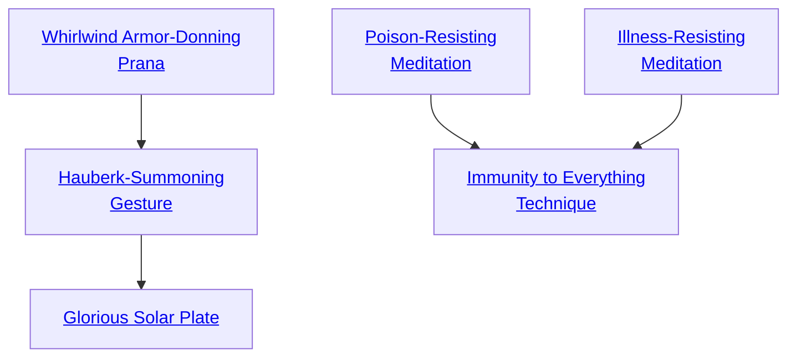

```mermaid

flowchart TD

    durability_of_oak_meditation["<a class='internal-link' href='#Durability of Oak Meditation'>Durability of Oak<br>Meditation</a>"]

    iron_skin_concentration["<a class='internal-link' href='#Iron Skin Concentration'>Iron Skin Concentration</a>"]
    durability_of_oak_meditation --> iron_skin_concentration

    spirit_strengthens_the_skin["<a class='internal-link' href='#Spirit Strengthens the Skin'>Spirit Strengthens the Skin</a>"]
    durability_of_oak_meditation --> spirit_strengthens_the_skin

    adamant_skin_technique["<a class='internal-link' href='#Adamant Skin Technique'>Adamant Skin Technique</a>"]
    spirit_strengthens_the_skin --> adamant_skin_technique
    iron_skin_concentration --> adamant_skin_technique

    unfailing_tortoise_technique["<a class='internal-link' href='#Unfailing Tortoise Technique'>Unfailing Tortoise<br>Technique</a>"]
    durability_of_oak_meditation --> unfailing_tortoise_technique

    iron_kettle_body["<a class='internal-link' href='#Iron Kettle Body'>Iron Kettle Body</a>"]
    unfailing_tortoise_technique --> iron_kettle_body



    subgraph Castebook Zenith
        direction TB
        environmental_hazard_resisting_meditation["<a class='internal-link' href='#Environmental Hazard-Resisting Meditation'>Environmental Hazard-Resisting<br>Meditation</a>"]

        alcohol_resisting_prana["<a class='internal-link' href='#Alcohol-Resisting Prana'>Alcohol-Resisting<br>Prana</a>"]

        drunken_warrior_technique["<a class='internal-link' href='#Drunken Warrior Technique'>Drunken Warrior<br>Technique</a>"]
        alcohol_resisting_prana --> drunken_warrior_technique

        inebriated_fool_defense["<a class='internal-link' href='#Inebriated Fool Defense'>Inebriated Fool<br>Defense</a>"]
        drunken_warrior_technique --> inebriated_fool_defense

        interrogation_resisting_attitude["<a class='internal-link' href='#Interrogation-Resisting Attitude'>Interrogation-Resisting<br>Attitude</a>"]

        pain_reducing_meditation["<a class='internal-link' href='#Pain-Reducing Meditation'>Pain-Reducing<br>Meditation</a>"]
        interrogation_resisting_attitude --> pain_reducing_meditation

        armor_of_virtue_technique["<a class='internal-link' href='#Armor of Virtue Technique'>Armor of Virtue<br>Technique</a>"]

        fivefold_armon_of_virtue_technique["<a class='internal-link' href='#Fivefold Armor of Virtue Technique'>Fivefold Armor of Virtue<br>Technique</a>"]
        armor_of_virtue_technique --> fivefold_armon_of_virtue_technique
    end

    spirit_strengthens_the_skin --> inebriated_fool_defense
    durability_of_oak_meditation --> pain_reducing_meditation
    durability_of_oak_meditation --> armor_of_virtue_technique

```

## Durability of Oak Meditation

Cost: 1 mote per die
Duration: One scene
Type: Simple
Minimum Resistance: 1
Minimum Essence: 1
Prerequisite Charms: None
The Exalted uses Essence to enhance his ability to withstand
attack. The player may roll up to his character's Stamina
+ Resistance in dice, but must spend one mote of Essence per
die rolled. For every success on this roll, the character adds 1 to
his bashing soak for the remainder of the scene. This Charm
may be used again on subsequent rounds, but a character
cannot gain more dice of bashing soak via Durability of Oak
Meditation than his Stamina + Resistance.

Rule change:
The Essence cost of this Charm is reduced to one mote per 2 dice rolled, from 1 mote per die.

## Iron Skin Concentration

Cost: 3 motes, 1 Willpower
Duration: Varies
Type: Reflexive
Minimum Resistance: 2
Minimum Essence: 1
Prerequisite Charms: Durability of Oak Meditation

The character's anima hardens, and his skin is made incredibly
difficult to cut or pierce. The player makes a Stamina +
Resistance roll. For a number of turns equal to the character's
Essence + the number of successes the player rolls on the Resistance
roll, the character soaks lethal damage with his bashing soak. This
Charm cannot be used by characters wearing armor.

Rule change:
The cost for the Charm remains unchanged, but the Duration: is now “One scene” – the character no longer
need roll to see how long the effect lasts.

## Spirit Strengthens the Skin

Cost: 3 motes per point
Duration: One scene
Type: Simple
Minimum Resistance: 3
Minimum Essence: 2
Prerequisite Charms: Durability of Oak Meditation

The Solar pours Essence into her skin and muscles,
hardening and toughening them far beyond those of any
mere mortal. The Exalted may add up to her score in the
Resistance Ability to her bashing soak, at a cost of 3
Essence motes per additional point of bashing soak. These
additional points of bashing soak are above and beyond
those provided by Durability of Oak Meditation and do
not count against that Charm's maximum soak bonus.
The character can use Spirit Strengthens the Skin
more than once during a scene, increasing her soak repeatedly
as her assessment of the situation changes. However,
a character cannot at any given time gain more points of
bashing soak through Spirit Strengthens the Skin than her
score in the Resistance Ability.

Rule change:
The cost of this Charm is reduced to 2 motes per point of additional bashing soak.

## Adamant Skin Technique

Cost: 5 motes, 1 health level, 1 Willpower
Duration: Instant
Type: Reflexive
Minimum Resistance: 5
Minimum Essence: 3
Prerequisite Charms: Iron Skin Concentration, Spirit Strengthens the Skin

Through the use of this Charm, the Exalted hardens
his skin into impenetrability, sacrificing some of his life
force to gain the strength of unbreakable diamond. The
character using this Charm takes no damage whatsoever
from a single attack. This Charm does not protect the
character from the secondary effects of the attack - for
example, a character smashed down through a sheet of ice
and into a frozen lake by the blow of a giant beastman's
club would take no damage from the impact or from
passing through the ice, but she would have to contend
with the dangers of drowning and hypothermia.
The Adamant Skin Technique can also be used to
withstand physical damage not associated with combat. It is as
effective at withstanding the impact of a fall as the blow of a
sword. However, Storytellers should keep in mind that the
defense offered by the Adamant Skin Technique is of a very
short duration — the character might use it to withstand the
impact of a falling idol or a plunge from the top of a tower, but
a character who hurled himself into a blazing firepit would only
be protected for a second or two. A character must invoke the
Adamant Skin Technique before his opponent's attack roll.

## Unfailing Tortoise Technique

Cost: 1 mote
Duration: Instant
Type: Reflexive
Minimum Resistance: 3
Minimum Essence: 1
Prerequisite Charms: Durability of Oak Meditation

This Charm strengthens the character's awareness of the
world around him and allows him to resist even unanticipated
attacks. If hit by an attack, even one he is not anticipating, the
character may spend 1 mote of Essence to add his Resistance
score to his bashing soak total for the purposes of soaking that
attack. Characters must invoke Unfailing Tortoise Technique
before soak is subtracted from the damage.

## Iron Kettle Body

Cost: 3 motes
Duration: Instant
Type: Reflexive
Minimum Resistance: 5
Minimum Essence: 2
Prerequisite Charms: Unfailing Tortoise Technique

As Unfailing Tortoise Technique, but the character's
Resistance is also added to her lethal soak as well.

Rule change:
The cost of this Charm is reduced to 2 motes.

## Environmental Hazard-Resisting Meditation

Cost: None
Duration: Permanent
Type: Special
Minimum Resistance: 5
Minimum Essence: 2
Prerequisite Charms: None

Some Exalted, in their years of wandering the wilder-
ness, develop an immunity to nature's rigors. To simulate
this, a character can take this Charm to grant permanent
resistance to one of the following conditions. Each time she
purchases this Charm, she can choose one of the following:
• Resistance to Extreme Heat
• Resistance to Extreme Cold
• Resistance to Acid
• Resistance to Windblown Particles
A character with one of these resistances suffers no
damage from natural occurrences of the condition and is
comfortable acting in it wearing normal gear. For instance,
a Chosen with Resistance to Extreme Heat may walk
across the most brutal of deserts without penalty, but still
suffers damage if caught in a forest fire or magical flame.
This Charm is similar to Ox-Body Technique, in that an
Exalt can take it repeatedly, until she has purchased all
four versions. A character cannot purchase this Charm
more times than she has dots in the Resistance Ability.

## Alcohol-Resisting Prana

Cost: 1 mote
Duration: One scene
Type: Simple
Minimum Resistance: 1
Minimum Essence: 1
Prerequisite Charms: None

By invoking this Charm, the Exalted becomes
immune to the negative effects of alcohol for the rest
of the scene. He suffers no penalties during or after the
scene in which Alcohol-Resisting Prana is used, and in
fact, the effect is quite pleasant, as the character
experiences the euphoric feelings of drunkenness without
any of the impairment normally associated with
heavy drinking. If the character is already drunk, then
all negative effects of the alcohol are negated until the
Charm ends. In addition, invoking this Charm prevents
any chance of hangover from alcohol drunk
during the scene, whether or not the Charm was in
effect when the alcohol was consumed.

## Drunken Warrior Technique

Cost: 2 motes
Duration: Instant
Type: Reflexive
Minimum Resistance: 2
Minimum Performance: 2
Minimum Essence: 1
Prerequisite Charms: Alcohol-Resisting Prana
The Drunken Warrior Technique allows the invoking
Exalted to harness the unpredictability of
drunkenness in combat. When this Charm is invoked,
the character may add dice to an attempt to attack or an
attempt to dodge or to parry an attack. The Charm may
be invoked multiple times per turn, but the total num-
ber of dice added in a given turn cannot exceed the
number of drinks the character has had during the scene
or the sum of the character's Resistance and Perfor-
mance Abilities, whichever is lower.
For the purposes of this Charm, a &quot;drink&quot; is a glass of
wine, a tankard of beer, a dram of hard liquor or the
equivalent. This Charm does not provide any immunity
to the negative effects of drinking, but may be used even
if the alcohol's effects have been negated though the use
of the Alcohol-Resisting Prana.

## Inebriated Fool Defense

Cost: 2 motes
Duration: Instant
Type: Reflexive
Minimum Resistance: 4
Minimum Performance: 3
Minimum Essence: 1
Prerequisite Charms: Drunken Warrior Technique, Spirit Strengthens the Skin

The Inebriated Fool Defense allows the Exalted to
utilize the effects alcohol has on the human body,
loosening its muscles and joints, to withstand damage.
When this Charm is invoked, the character may add a
number of points to his bashing soak equal the number
of drinks he has consumed during the scene. This
number can be no greater than the sum of the Exalted's
Resistance and Performance Abilities. The Charm may
be invoked multiple times per turn, and the bonus is the
same each time it is invoked. The effects of this Charm
are compatible with other Resistance Charms that in-
crease the character's bashing soak.
For the purposes of this Charm, a &quot;drink&quot; is a glass of
wine, a tankard of beer, a dram of hard liquor or the
equivalent. This Charm does not provide any immunity to
the negative effects of drinking, but may be used even if the
alcohol's effects have been negated though the use of th
Alcohol-Resisting Prana.

## Interrogation-Resisting Attitude

Cost: 5 motes
Duration: One scene
Type: Simple
Minimum Resistance: 2
Minimum Essence: 1
Prerequisite Charms: None

The character's will and body are strengthened by
Essence, allowing her to easily endure all forms of
torture and interrogation. The player may add a num-
ber of automatic successes equal to the character's
permanent Essence to any Resistance rolls to avoid
breaking under interrogation. The character need not
call upon this power before the interrogation and may
even invoke it after giving some information during
the interrogation.
Use of this Charm does not negate the effects of any
toxins used in the interrogation, nor does it prevent
damage. It merely allows the character complete control
over what she chooses to say.

## Pain-Reducing Meditation

Cost: 1 mote per -1
Duration: One scene
Type: Reflexive
Minimum Resistance: 3
Minimum Essence: 2
Prerequisite Charms: Interrogation-Resisting Attitude, Durability of Oak Meditation
The cumulative effects of pain can bring down even
the hardiest of Exalted. This Charm allows a Chosen to
ignore pain through the application of Essence. To activate
the Charm, the Exalted chooses to what degree he
wishes to ignore wound penalties for the remainder of the
scene. For each -1 wound penalty the character ignores,
the Charm costs 1 mote to activate. This Charm may be
used multiple times during a single scene, with cumulative
effects. A character can also negate more points of
wound penalties than he is currently suffering, to anesthetize
himself against later injury.

## Armor of Virtue Technique

Cost: 3 motes
Duration: One scene
Type: Simple
Minimum Resistance: 2
Minimum Essence: 2
Prerequisite Charms: Durability of Oak Meditation

Through the expenditure of Essence, this Charm
allows the Exalted to reinforce his ability to withstand
attack with one of his Virtues. The character must
choose the Virtue at the beginning of the scene and act
in accordance with that Virtue for the duration of the
scene. If at any point he acts contrary to the chosen
Virtue, the Armor of Virtue fades immediately, Specifically,
attempting any action that would require failing a
Virtue check causes the Charm's effects to expire. For
example, abandoning or attempting to abandon a loved
one to perish miserably while under the protection of
Compassion causes the Armor of Virtue to fail.
When invoked, the Armor of Virtue Technique
increases the character's bashing soak by the value of the
character's chosen Virtue for the rest of the scene. This
Charm may be used again on subsequent turns, but a
character cannot gain a greater bonus to his bashing soak
via Armor of Virtue Technique than his Stamina +
Resistance. The effects of this Charm are compatible
with the effects of other Resistance Charms that increase
the character's soak.
While under the effect of the Armor of Virtue Technique,
the Exalted's Caste Mark glows brightly, as if the
character had spent 4 to 7 motes of Peripheral Essence.
Invoking this Charm automatically adds one point to the
character's Limit.

## Fivefold Armor of Virtue Technique

Cost: 5 motes
Duration: One scene
Type: Simple
Minimum Resistance: 3
Minimum Essence: 3
Prerequisite Charms: Armor of Virtue Technique

Through the expenditure of Essence, the Fivefold
Armor of Virtue Technique allows the Exalted to reinforce
his ability to withstand attack with one of his Virtues.
The character must choose the Virtue at the beginning of
the scene and act in accordance with it for the duration of
the scene. If at any point he acts contrary to the chosen
virtue, the Fivefold Armor of Virtue fades immediately, as
per the Armor of Virtue Technique.
When invoked, the Fivefold Armor of Virtue
Technique increases the character's lethal soak roll by
the value of the character's chosen Virtue for the rest
of the scene. This Charm may be used again on subsequent
turns, but a character cannot gain a greater
bonus to his lethal soak via Fivefold Armor of Virtue
than his Stamina + Resistance.
While under the effect of the Fivefold Armor of
Virtue Technique, the Exalted's anima glows brightly
enough to read by, as if the character had spent 8 to 10
motes of Peripheral Essence. Characters wearing armor
cannot use this Charm. Invoking this Charm automatically
adds one point to the character's Limit.

## Whirlwind Armor-Donning Prana

Cost: 2 motes per turn
Duration: Special
Type: Simple
Minimum Resistance: 1
Minimum Essence: 1
Prerequisite Charms: None

Through the use of this Charm, the character can
speed the process of donning his armor. The character can
don his armor in a number of turns equal to the armor's
mobility penalty. Each turn of effort costs 2 motes of
Essence. The character must have the armor readily available
and at hand to don it so quickly — this Charm does
not speed the process of getting the armor out of a trunk.

## Hauberk-Summoning Gesture

Cost: 5 motes
Duration: Instant
Type: Simple
Minimum Resistance: 3
Minimum Essence: 3
Prerequisite Charms: Whirlwind Armor-Donning Prana

This Charm allows a character to call her armor to her. In
an eyeblink, it appears on her. She is instantly fully armored,
with all the straps and buckles adjusted properly. If the character
uses a shield, that appears on her person as well. The
character cannot call her armor from further away than 100
yards x her Essence rating. This Charm can't be used to steal
armor off an opponent or off a display dummy— the armor must
be the character's own. She must have worn it for at least several
hours and established her possession of it.

## Glorious Solar Plate

Cost: 10 motes, 1 Willpower
Duration: One scene
Type: Simple
Minimum Resistance: 4
Minimum Essence: 3
Prerequisite Charms: Hauberk-Summoning Gesture

The characters materializes his Essence into a suit of
golden lamellar armor. This armor is an expression of the
character's anima and, so, reflects his personality and predispositions.
It can be sleek, imposing, ornate, simple — it is the
character's ideal armor. Regardless of its appearance, the
armor glows with an golden inner light bright enough to read
by in a several-yard radius. Glorious Solar Plate provides 10
lethal and 10 bashing soak, with only a -1 penalty to maneuvers
requiring dexterity and grace.

## Poison-Resisting Meditation

Cost: 4 motes
Duration: One scene
Type: Reflexive
Minimum Resistance: 3
Minimum Essence: 1
Prerequisite Charms: None

The character's metabolism is strengthened by Essence,
allowing him to easily endure the effects of toxins.
The player may add a number of automatic successes
equal to the character's Stamina to her Stamina + Resistance
roll to resist the effects of poison. Though even the
hardiest Exalted can still be slain by massive doses of
poison while using this Charm, they are largely invulnerable
to poisoned food and envenomed blades. Characters
need not invoke this Charm before exposure to poison —
they may call upon its effects after they are exposed but
before the Stamina + Resistance roll is made to survive
the toxin.
Use of this Charm allows a character to withstand
incidental toxins such as spoiled food. A character under
the effect of this Charm may also consume without penalty
a number of drinks equal to his Stamina.

## Illness-Resisting Meditation

Cost: 6 motes
Duration: One day
Type: Reflexive
Minimum Resistance: 3
Minimum Essence: 1
Prerequisite Charms: None

While the Exalted are little-affected by disease, they
can still become sick. Fevers can slow them at critical
moments. Further, while the Chosen can withstand even
the most serious illnesses with little more than a feeling of
weariness and discomfort, those illnesses are as lethal as
ever to mortals who contract them from exposure to the
infected Exalted.
This Charm allows the player to add a number of
automatic successes equal to her character's Stamina to the
Stamina + Resistance roll to avoid contracting an illness.
Further, the player may add a like number of automatic
successes to her character's daily Stamina + Endurance roll
to overcome an illness she has already contracted.

## Immunity to Everything Technique

Cost: 10 motes, 1 Willpower
Duration: One scene
Type: Simple
Minimum Resistance: 5
Minimum Essence: 3
Prerequisite Charms: Poison-Resisting Meditation

The Exalted's body becomes a perfect vessel of Essence,
immune to all toxins and poisons. The character is immune
to all poisons and toxins, including those that would normally
be fatal to Exalted. This Charm does not protect the
character from the effects of diseases, however.
