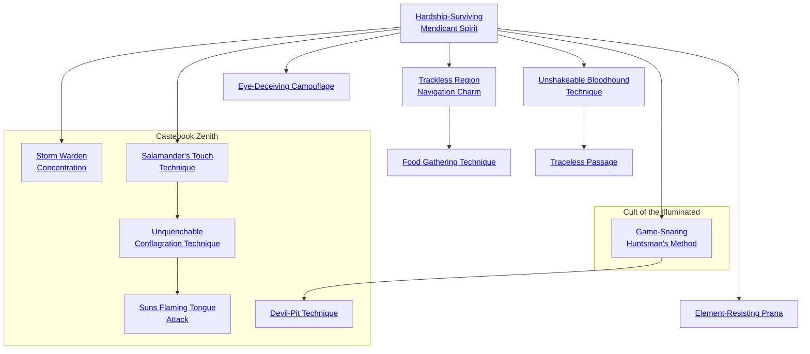
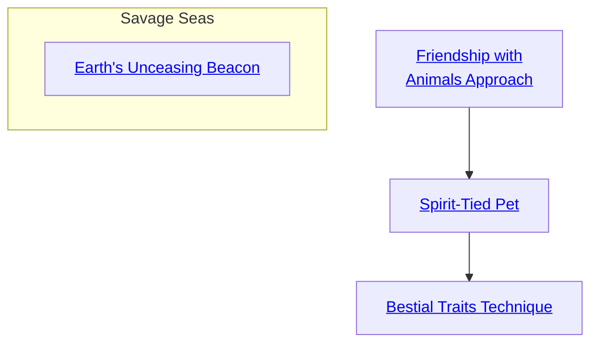

## Hardship-Surviving Mendicant Spirit

Cost: 5 motes
Duration: One day
Type: Simple
Minimum Survival: 3
Minimum Essence: 1
Prerequisite Charms: None

Through the use of this Charm, the character becomes
able to survive in even the most hostile conditions without
special preparations. Blazing heat or terrible cold are no danger
to the character, nor are hypothermia from rain or water
exposure, trench foot, snow and sand blindness, leeches, mosquitoes
and other potentially deadly biting insects — the
character is perfectly at home in a harsh wilderness environment.
This magic protects the character even if he personally
is not prepared for the environment. A character using Hardship-Surviving
Mendicant Spirit is at home on a glacier if he is
bundled in the warmest clothing available or if he is clad in
nothing but silk slippers and a pair of pantaloons (though he
may have difficulty walking over ice in silk slippers).
Note that this Charm does not protect against the most
hostile of environments - ocean survival, underwater
survival or the extreme elemental effects near the elemental
poles. To exist in those environments, characters must use
the Element-Resisting Prana Charm (p. 182).

## Trackless Region Navigation Charm

Cost: 7 motes
Duration: One day
Type: Simple
Minimum Survival: 4
Minimum Essence: 2
Prerequisite Charms: Hardship-Surviving Mendicant Spirit

With this Charm, the character can find his way safely and
surely through even the worst terrain. The character (and a
number of persons following him equal to twice his Essence
score) can travel through even the worst terrain with ease.
Travel through most terrain (forest, light marsh, rock and sand
desert) is about as fast as if the character was walking over flat,
level ground - characters will travel about 20 miles a day.
Travel over very harsh terrain (muskeg at high summer, glacier,
bayou, dense scrub or fresh-growth jungle) is at half this speed.

## Food Gathering Technique

Cost: 3 motes per person
Duration: One hour
Type: Simple
Minimum Survival: 5
Minimum Essence: 2
Prerequisite Charms: Trackless Region Navigation Charm

A character with this Charm will never go hungry. In
a hour of foraging for food, she can gather enough nuts,
berries, edible tubers, slugs, bugs and small animals to make
a large meal for a number of people equal to her Essence
score. Note that this skill typically does not involve
hunting game, and so, the character does not need a
hunting tool such as a spear, sling or bow — the character
will probably not bring back anything larger than a rabbit.
Storytellers may wish to make it more difficult to gather
food in certain environments (deep sandy desert and pack
ice, for example) but should not impose a penalty greater
than halving the Exalted's take. This is, after all, magic.

## Unshakeable Bloodhound Technique

Cost: 8 motes, 1 Willpower
Duration: One day
Type: Simple
Minimum Survival: 5
Minimum Essence: 2
Prerequisite Charms: Hardship-Surviving Mendicant Spirit

The character can track anyone in the wilderness,
following the most minute signs and, sometimes, nothing
more than a magical intuition of where the target has gone.
The character can track anyone through any terrain, so long
as the trail is fresh enough. Over difficult terrain for tracking
(open ocean, rocky desert, grasslands), the trail remains
fresh for typically one day per point of the tracking character's
permanent Essence. Over terrain more amenable to tracking,
it can be two or even three times that long.
This ability can be foiled by the Traceless Passage Charm.
If the target is using Traceless Passage, then the tracker and
target resolve the matter as if neither was using magic. See
&quot;Tracking&quot; on page 245 of the Drama chapter for details.

## Eye-Deceiving Camouflage

Cost: 6 motes
Duration: One day
Type: Simple
Minimum Survival: 5
Minimum Essence: 3
Prerequisite Charms: Hardship-Surviving Mendicant Spirit

Trough the use of this Charm, the character can conceal
himself or an object no bigger around than his Essence rating
in yards so well as to be undetectable. In order to gain the
benefit of this Charm, the character must spend one hour
camouflaging his position or the object to be concealed. So
long as the character stays still and takes no violent action, he
will not be seen. Note that a character or object camouflaged
in this fashion is essentially fixed in position. If the character
moves suddenly or at great length, the effect is disturbed and
the Charm ceases to have its effect.
Camouflaged objects or characters can be found
after a number of hours of intensive searching in their
immediate area equal to the camouflaging character's
Essence score or by a character with Unsurpassed (Sense)
Discipline or some similarly powerful perception power
whose player succeeds in a Perception + Awareness roll
against the character's Intelligence + Survival. Note that
camouflage covers scent and other detection methods as
well as visual stealth.

## Traceless Passage

Cost: 5 motes per person, 1 Willpower
Duration: One day
Type: Simple
Minimum Survival: 5
Minimum Essence: 3
Prerequisite Charms: Unshakeable Bloodhound Technique

Through the use of this Charm, the character can
make his passage and the passage of additional persons
equal to his Essence score totally traceless. They cannot be
tracked by conventional means, not even with the aid of
tracking animals or other tracking aids. Only characters
with the Unshakeable Bloodhound Technique Charm
can follow them, and even then, it's played out as if they
were tracking him without magical assistance.

## Element-Resisting Prana

Cost: 10 motes, 1 Willpower
Duration: One day
Type: Simple
Minimum Survival: 5
Minimum Essence: 3
Prerequisite Charms: Hardship-Surviving Mendicant Spirit

Through the use of this Charm, the character becomes
able to survive in any environment. The character
can survive in extreme environments, such as the extreme
heat and toxic fumes within the caldera of active volcanoes,
can exist underwater with no ill effects and can even
exist without danger in conditions as harsh as those of the
elemental poles. While this Charm is active, the character
adds her Endurance to her soak when she takes damage
from elemental sources such as cold, fire and lightning.

## Game-Snaring Huntsman's Method

Cost: 1 mote per die
Duration: One day
Type: Supplemental
Minimum Survival: 4
Minimum Essence: 1
Prerequisite Charms: Hardship-Surviving Mendicant Spirit

When invoking this Charm, the Exalted names a
single breed of animal, which may include &quot;human.&quot; He
then crafts a snare appropriate for trapping the species of
interest. For each mote invested in the Charm, the
Survival roll to create the snare is increased by one die.
In addition, for each mote invested, the targeted breed
suffers a one-die penalty to detect or escape the trap. The
trap will not be triggered by any species other than the
one named. This trap cannot be used to snare a specific
specimen, but instead, affects the first member of the
species that encounters it.
Game-Snaring Huntsman's Method cannot be used
to create a trap that will innately do damage, such as spike-pits
or deadfalls. It can only be used to enhance snares, pit
traps and other such traps that hinder or ensnare, rather
than wound or kill. However, traps empowered by Game-Snaring
Huntsman's Method may inflict incidental damage
upon a target while it attempts to escape (a cage, for
example, could be spiked to discourage meddling with the
bars), so long as the primary purpose of the trap isn't the
wounding of its intended prey.

## Storm Warden Concentration

Cost: 6 motes
Duration: One day
Type: Simple
Minimum Survival: 3
Minimum Essence: 1

Prerequisite Charms: Hardship-Surviving Mendicant Spirit
This Charm protects the invoker from the adverse
affects of natural weather. The Exalted may move through
heavy winds without being impeded by them, travel
through a sand- or snowstorm without being blinded or
spend a stormy night with no shelter without fear of
becoming waterlogged. The Chosen's anima deflects
these conditions, providing a nearly skintight zone of
protection for the Exalted and any possessions worn
against her body. This Charm does not protect against
damage from temperature extremes.

## Salamander's Touch Technique

Cost: 1 mote
Duration: Instant
Type: Simple
Minimum Survival: 3
Minimum Essence: 2

Prerequisite Charms: Hardship-Surviving Mendicant Spirit
Through the use of this Charm, the Exalted can
light small, controlled fires. These are normal fires in
every way. They can cause no damage by themselves,
but if allowed to blaze out of control, they can be as
dangerous as any other fire. The fires this Charm can
light are limited to normally flammable materials. The
Charm is useless against water-soaked wood or other
noncombustible substances.

## Unquenchable Conflagration Technique

Cost: 10 motes
Duration: Instant
Type: Simple
Minimum Survival: 3
Minimum Essence: 2
Prerequisite Charms: Salamander's Touch Technique

When all the available wood is soaked or, worse,
when there is no wood to be found, even the most skilled
survivalist can find herself forced to live without heat
and flame. This Charm allows the Exalted to cause a fire
of up to bonfire size to spring into existence with but a
gesture. The fire will burn for a complete scene, even in
high winds or driving rain, but it will not spread unless
normally flammable materials are introduced. This power
cannot be used as a direct attack.

## Sun's Flaming Tongue Attack

Cost: 15 motes, 1 Willpower
Duration: Instant
Type: Simple
Minimum Survival: 5
Minimum Essence: 3

Prerequisite Charms: Unquenchable Conflagration Technique

Through the use of this Charm, the Exalted rains
down solar fire upon a single opponent. After investing
the required Essence, make a Willpower roll. The
fire does a number of points of lethal damage equal to
the Exalted's Survival score, plus one point of damage
per success on the character's Willpower roll. This
power can strike at a range of line of sight. Against
demons, ghosts or other creatures of the night, the
damage is aggravated. This attack cannot normally be
blocked or dodged, but targets may have Charms that
allow them to do either in their defense.

## Devil-Pit Technique

Cost: 2 motes per die
Duration: One week
Type: Supplemental
Minimum Survival: 4
Minimum Essence: 2
Prerequisite Charms: Game-Snaring Huntsman's Method

The Devil-Pit Technique functions in many ways
like the Game-Snaring Huntsman's Method. The Exalted
names a breed of animal to be targeted by the trap.
The roll for creating the trap is increased by one die for
every 2 motes invested in the Charm, and the targeted
breed suffers a like number of dice in penalty for rolls to
detect or escape the trap. The trap will not be triggered
by any species other than the named one, nor can it be set
to trap a specific individual.
Unlike Game-Snaring Huntsman's Method, Devil-Pit
Technique can be used to enhance traps that are
designed to cause damage or death to their targets, rather
than restrain them. A trap enhanced by the Devil-Pit
Technique does one die of soakable lethal damage per 2
motes invested in the Charm. This damage is in addition
to any damage a normal trap of the design might do.

## Friendship with Animals Approach

Cost: 3 motes
Duration: One Scene
Type: Simple
Minimum Survival: 1
Minimum Essence: 1
Prerequisite Charms: None

Through the use of this Charm, the character can deal
well with nearly any wild animal. The character must be
within one yard of the target per point of her Essence.
Herbivores and smaller omnivores will become somewhat
docile, even letting the character pet or handle them.
Predators are less susceptible to this power, and most will
simply let the character pass unmolested through their
territory. This power does not work on sentient animals,
animals that are trained to attack or animals that are
insane from pain, hunger or disease.

## Spirit-Tied Pet

Cost: 10 motes, 1 Willpower, 1 experience point
Duration: Instant
Type: Simple
Minimum Survival: 3
Minimum Essence: 2
Prerequisite Charms: Friendship With Animals Approach

By handling an animal, feeding it, petting and scratching
it and otherwise interacting with it, a character who
knows this Charm can forge a permanent magical bond
with the beast. Each time the character uses this Charm
on the target, it is as if he gained a point of the Familiar
Background with the target animal as the Familiar. So a
character who wished to tame a tiger would have to use
it at least three times to cause the beast to become well-disposed
to him and an additional two times to gain the
ability to see through the beast's eyes and communicate
with it. Obviously, using this Charm on animals such as
bears, tigers and tyrant lizards can be problematic, as they
will not allow themselves to be handled, even under the
effects of Friendship with Animals Approach. A strong
wrestling ability or a willingness to raise the animal from
a cub is useful in such instances. Characters cannot have
more than one Spirit-Tied Pet at a time.

## Bestial Traits Technique

Cost: 8 motes
Duration: One scene
Type: Simple
Minimum Survival: 4
Minimum Essence: 2
Prerequisite Charms: Spirit-Tied Pet

Through the use of this Charm, a character can gain
the traits of her Spirit-Tied Pet. Each use of this Charm
allows the character to gain a single characteristic. Obviously,
animals have too many characteristics to easily
model them all. Typically, the character will gain the
ability to climb rough surfaces, fall great distances without

## Earth's Unceasing Beacon

Cost: 2 motes
Duration: One scene
Type: Reflexive
Minimum Survival: 2
Minimum Essence: 1
Prerequisite Charms: None

By means of this Charm, the Exalt can instantly know
in what direction the Elemental Pole of Earth lies, at least
in a general sense. The player must make a Perception +
Survival roll for the character. With even a single success,
the character will have a general idea (able to point in the
direction of) of where the Pole of Earth is located. Each
additional success makes this sense of direction more
precise; with three or more successes, the Exalt will know
exactly where the pole is in relation to his current location,
with sufficient clarity to be able to navigate with the aid of
a compass and map. Any additional successes beyond three
may be applied as bonus dice to any rolls involving navigation
or plotting a course, until the end of the scene.
