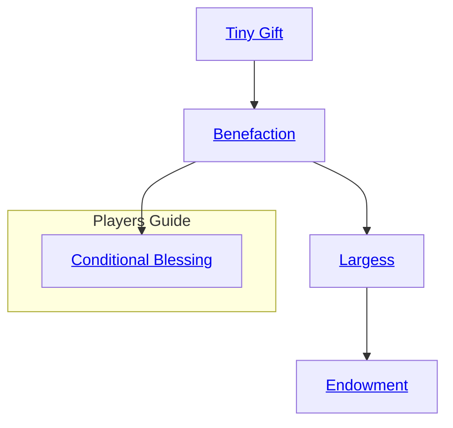

## Tiny Gift

Cost: 5 motes
Duration: One day
Type: Simple
Minimum Compassion: 1
Minimum Essence: 1
Prerequisite Charms: None

The effects of this Charm always fade by the next
sunset, and the Charm may not be used more than once per
day. Some possible gifts:
• One extra dot added to an Ability of the spirit's
choice.
• The return of two motes of Essence.
• Good luck: The target gains one extra die to add to
all normal Ability checks (not Charms).

## Benefaction

Cost: 10 motes
Duration: One week
Type: Simple
Minimum Compassion: 1
Minimum Essence: 2
Prerequisite Charms: Tiny Gift
The effects of this Charm last for one week, and the
Charm may not be used more than once per week. Some
possible benefactions:
• Two dots of Abilities, distributed as the spirit sees fit.
• One dot added to an Attribute.
• The return of five motes of Essence.
• Create a good luck charm, walkaway or other
talisman that lasts for a week.
• Good luck: the target gains one extra die to add to
normal Ability checks (not Charms).
• A mark appears on the target in an obvious place
(forehead, hand, etc.) that can be seen only by spirits and
Exalted using a sensory Charm that allows them to perceive
Essence at work. This power is most often used to
grant safe passage through an area or as a mark of favor.

## Largess

Cost: 15 motes, 1 Willpower
Duration: One week
Type: Simple
Minimum Compassion: 2
Minimum Essence: 4
Prerequisite Charms: Benefaction

The effects of this Charm last for one week, and the
Charm may not be used more than once every other week
Some possible effects:
• Four dots to Abilities, distributed as the spirit sees
fit. This may include Abilities the target does not normally
possess, unless he is not physically capable of possessing
them. 1 his may not raise a target s Ability score above six.
• Two dots to Attributes, distributed as the spirit sees fit.
• The return of one temporary Willpower point. (The
target's Willpower may not be raised above his maximum.
The returned Willpower may be used up normally, but will
not disappear when the week is over.)
• The return of ten motes of Essence.
• The effects of one Charm (maximum Virtue 1,
Essence 1) that the spirit possesses may be conferred upon
the target. These effects last no longer than one week.
• Good luck: the target gains one extra die to add to
normal Ability checks and to Charm checks.
• Create a good luck charm, walkaway of other
talisman of permanent duration.
• A permanent mark appears on the target in an
obvious place. This mark can be seen only by spirits and
Exalted using a sensory Charm that allows them to per-
ceive Essence at work. While mortals cannot see the mark,
it obviously alters the character's horoscope and can be
detected in that fashion. Effects vary, depending on the
meaning of the mark.

## Endowment

Cost: 20 motes, 1 permanent Willpower
Duration: Instant
Type: Simple
Minimum Compassion: 3
Minimum Essence: 5
Prerequisite Charms: Largess

This blessing is never given lightly. Great tales are told
of the massive quests that lead to such rewards, and the
heroes who achieve them. This Charm may only be used
once per year.
• One dot added to an Attribute, duration permanent.
• Two dots to Abilities, distributed as the spirit sees
fit, duration permanent. This may include Abilities the
target does not normally possess, unless he is not physically
capable of possessing them.
• One permanent Essence point.
• The return of all temporary Willpower that the
target has lost.
• The effects of one Charm (maximum Virtue 2,
Essence 2) that the spirit possesses may be conferred upon
the target. These effects last for as long as the effects of the
Charm that was conferred would normally last. In rare cases,
the effect may be permanent (Storyteller's discretion).
• Good luck: the target's temporary Willpower is
always one higher than her permanent Willpower. The
effect is permanent.
• Create a double- or triple-effect talisman of permanent
duration.

## Conditional Blessing

Cost: 3 motes, 1 Willpower
Duration: Until Calibration
Type: Simple
Minimum Compassion/Valor: 2
Minimum Essence: 4
Prerequisite Charms: Benefaction or Imprecation

With these Charms, a spirit may place a mark of Essence
upon a target in its line of sight as a delayed trigger for another
Charm. If the delayed effect has a positive intent, the spirit
must know and use the Compassion Charm Conditional
Blessing. A negative or harmful intent requires the Valor
Charm Conditional Curse. A Manipulation + Compassion/
Valor roll against a difficulty of the target's Essence is neces-
sary to inscribe the mark. If this roll succeeds, the spirit
chooses one Charm it knows that can directly affect that
target. If the selected Charm has multiple uses or permuta-
tions, the spirit must also select the exact effects the Charm
will take. The spirit then establishes the precise actions the
target must perform to trigger the delayed Charm.
The spirit may include as many conditions as desired, any
of which may be as elaborate or straightforward as desired. For
example, the spirit may decide to heal a loyal shaman with
Touch of Grace if she speaks a specific prayer petitioning aid.
Conversely, a demon might arrange to summon its Demon-
Blooded daughter to a dungeon in Malfeas (via Capture) if
she ever disobeys a direct order or reveals her infernal heritage
to anyone she is not actively trying to kill.
Whenever the target of a Conditional Blessing or
Curse performs the requisite actions, the spirit knows. At
any time, it may then immediately activate the triggered
Charm as a reflexive action to end the Conditional Bless-
ing/Curse regardless of distance or withhold its benediction/
wrath until it can learn more about the target's actions.
This Charm and its mark also fade without effect if the
target does not meet the established conditions by the next
Calibration. Only spirits and other beings capable of
perceiving Essence at work can see the mark of an extant
Conditional Blessing/Curse.
