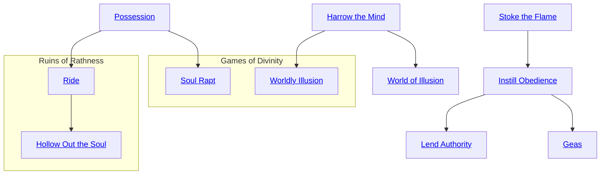
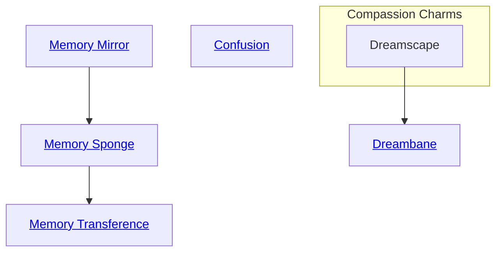

## Harrow the Mind

Cost: 10 motes, 1 Willpower
Duration: One scene
Type: Simple
Minimum Conviction: 3
Minimum Essence: 2
Prerequisite Charms: None

Through the use of this Charm, the spirit can create mental
illusions that only the target can see. To do it, roll the spirit's
Manipulation + Conviction. The first success creates the illusion,
while additional successes make the illusion more difficult to
penetrate. The target's player must make an Intelligence + Temperance
roll and must gain a number of successes at least equal to
the number of successes the spirit rolled. If not, the target is unable
to tell the illusion from reality. He may make additional Intelligence
+ Temperance rolls whenever the illusion departs wildly
from what the target expects from reality, making believable
illusions much more difficult to see through. Once the illusion has
been penetrated, it is dispelled, and all further uses of the Charm
on that being are at + 1 difficulty for the next several days.

## Possession

Cost: 3 motes, 1 Willpower
Duration: One scene
Type: Simple
Minimum Conviction: 4
Minimum Essence: 1
Prerequisite Charms: None
Roll the spirit's Manipulation + Conviction in an extended
resisted action against the target's Willpower. When the spirit
gains more successes than the victim has temporary Willpower,
the spirit takes possession of the target for the rest of the scene.
Successes accumulate for the duration of the scene. More
powerful versions of this Charm exist, which allow spirits to
&quot;hollow out&quot; a being's soul and possess him indefinitely.

## Stoke the Flame

Cost: 1 mote per die
Duration: One scene
Type: Simple
Minimum Conviction: 2
Minimum Essence: 1
Prerequisite Charms: None

The spirit channels Essence into the victim to inflame her
emotional state. One success merely aggravates whatever
condition is already present, while three or more successes
cause the target to completely lose herself in the emotion of the
moment. You may roll no more dice that the spirit's Convic-
tion. Used against one of the Exalted, this Charm causes the
character's Limit to increase by one point per success.

## Instill Obedience

Cost: 10 motes, 1 Willpower
Duration: One day
Type: Simple
Minimum Conviction: 3
Minimum Essence: 3
Prerequisite Charms: [[#Stoke the Flame]]

The spirit channels Essence into the target to alter his
emotional state, instilling within him a desire to obey the
spirit. Roll the spirit's Charisma + Conviction with a
difficulty equal to the target's Essence. Simple success
merely makes the target slightly more likely to obey, while
three successes forces him to obey completely unless such
obedience would cause him physical harm. At five successes,
the target does anything the spirit commands.

## Geas

Cost: 1 mote per day (Min 15, Max 28), 2 Willpower
Duration: One to 28 days
Type: Simple
Minimum Conviction: 5
Minimum Essence: 4
Prerequisite Charms: [[#Instill Obedience]]
This Charm allows a spirit to lay a Geas, or bond, upon
a target. It requires eye contact and a successful Manipulation
+ Conviction check, with at least three successes,
The spirit may order the target to perform one task, which
may include such broad orders as &quot;serve me for one month.&quot;
The spirit may not order the target to do something that
would directly harm the target, but it may order him to
attempt a difficult or dangerous goal as long as there is a
reasonable chance of success (Storyteller's discretion).
This Charm has a minimum cost of 15 motes, even if it is
to last only one day. This Geas does not completely govern
the target's actions; rather, it gives the target a compulsion
to work toward the task he has been given. For each day
that the target fails to work in good faith toward the task,
he loses one temporary Willpower and takes one health
level of aggravated damage. For each two days spent
working in good faith toward the task, he regains one
health level lost from for disobeying the Geas.

## Lend Authority

Cost: 15 motes
Duration: 1 day x the spirit's Willpower
Type: Simple
Minimum Conviction: 3
Minimum Essence: 3
Prerequisite Charms: [[#Instill Obedience]]

For each success on a Conviction + Presence check,
the spirit may raise an individual's Presence by one dot.
The spirit may not increase the target's Presence by more
dots than the spirit's Essence, although it may increase it
above 5. Only one use of this Charm may be active on an
individual at any given time. The Presence lasts for one
day for each dot of the spirit's Willpower.

## World of Illusion

Cost: 20 motes, 1 Willpower per person
Duration: Instant
Type: Reflexive
Minimum Conviction: 4
Minimum Essence: 3
Prerequisite Charms: [[#Harrow the Mind]]

The target of this Charm finds herself in an illusory
world of the spirit's design. The illusion is total and covers
all senses — according to all of her senses, the target has
been transported elsewhere. The illusion has a nearly
instant duration but may appear to last tor up to one day to
the mind of the target.
This Charm requires the spirit to touch its target (a
nonreflexive Dexterity + Brawl or Martial Arts roll if she's
actively evading) or look in her eyes. The spirit may use
this effect on multiple people at once, but all of them must
find themselves in the same illusion, and the spirit must
touch all of them at once.
Any damage the target takes within the hallucination
is purely illusory. However, if the target dies within the
illusion, then her player must succeed on a Stamina +
Resistance roll or fall into a coma for one day per point of
the spirit's Essence (or longer, at the Storyteller's discretion,
if it suits the dramatic needs of the story).

## Soul Rapt

Cost: 10 motes, 2 Willpower
Duration: Indefinite
Type: Simple
Minimum Conviction: 5
Minimum Essence: 4
Prerequisite Charm: Possession

As the Possession spirit Charm, roll the spirit's Manipulation
+ Conviction against the target's Willpower in a resisted
action. If the spirit gains more successes than the target has
temporary Willpower, then the initial possession succeeds. As
long as the spirit occupies the victim, temporary Willpower
cannot he regained. The possessing spirit must relinquish con-
trol of the victims body at least once per week, though it isn't
necessary to abandon the victim. The spirit must make the
attempt to regain control of the victim by repeating the initial
possession roll. After each month of possession, the victim loses
one point of Willpower permanently. If a spirit fails in its attempt
to regain control of its victim, the spirit is expelled, and the
victim cannot be possessed by that spirit again.

## Worldly Illusion

Cost: 20 motes, 1 Willpower per person
Duration: Instant
Type: Reflexive
Minimum Conviction: 4
Minimum Essence: 3
Prerequisite Charms: [[#Harrow the Mind]]

The target of this Charm finds herself in an illusory- world
of die spirit's design. The illusion is total and covers all senses
according to all of her senses, the target has been transported
elsewhere. The illusion has a nearly instant duration but may
appear to last for up to one day to the mind of the target.
This Charm requires the spirit to touch its target (a
nonreflexive Dexterity + Brawl or Martial Arts roll if she's actively
evading) or to look in her eyes. The spirit may use this effect on
multiple people at once, but all of them must find themselves in
die same illusion, and the spirit must touch all of them at once.
Any damage the target takes within the hallucination is
purely illusory. However, if the target dies within the illusion,
then her player must succeed on a Stamina + Resistance roll
or have the character fall into a coma for one day per point of
the spirit's Essence (or longer, at the Storyteller's discretion, if
it suits the dramatic needs of the story).

## Ride

Cost: 20 motes, 1 Willpower
Duration: Indefinite
Type: Simple
Minimum Conviction: 5
Minimum Essence: 2
Prerequisite Charms: [[#Possession]]

This Charm allows a spirit to possess someone indefinitely,
riding them as if the host's body were its own
and laying the groundwork for a true fusion of spirit and
mortal form. In order for this Charm to work, the potential
vessel must consent to the spirit's possessing him.
Otherwise, it does not function and the spirit must rely
on cruder Charms, such as Soul Rapt. The results of the
Charm depend on the difference in the Essence of the
host and the possessing spirit. If the spirit's Essence
exceeds the host's by three or more, the host acquires the
spirit's Traits (both Attributes and Abilities). If the
host's Essence exceeds the spirit's by three or more, the
spirit acquires the host's Traits. If the Essence of host and
spirit are within two points of one another, a true fusion
is achieved in which the combined entity has the average
of the Traits of both halves, rounded up. The fusion also
acquires the average of the spirit and the subject's temporary
Essence after subtracting the 20 motes needed to
trigger the Charm. If the being is an Exalt, add all
temporary Essence together before determining the average
— the result of a god synthesis with an Exalt has only
Peripheral Essence. In addition, it has access to one of the
god's Charms per point of total permanent Essence.
These Charms cannot include Dematerialize.
This Charm is exceedingly rare outside of Rathess, the
surrounding regions and other backwaters. Gods and spirits
hailing from regions close to the Realm generally avoid
using it, out of fear that the Immaculates would notice and
take offense. The Immaculate Philosophy's adherents consider
use of this Charm a grave blasphemy and take harsh
measures to suppress its continued use. If the host is slain,
the spirit reforms in one-third the normal time, and the
spirit will never lose its individual identity as a result. If the
host is killed using Charms that have the effect of slaying
a spirit forever (as with Ghost-Eating Technique) the
spirit and the host's higher soul are both destroyed. Spirits
using this Charm are not constantly drained the way those
who simply create bodies for themselves out of Essence
through the use of the Materialize Charm are.

## Hollow Out the Soul

Cost: 15 motes, 1 Willpower
Duration: Indefinite
Type: Simple
Minimum Conviction: 4
Minimum Essence: 4
Prerequisite Charms: [[#Ride]]

This Charm allows a spirit to utterly destroy the soul
of a being it is riding, thereby creating a host lacking the
ability to regain control. The spirit rider may then use the
body as a host at will or vacate it, during which time it
assumes a comatose state until either the spirit returns or
the vessel is destroyed. To attempt to use this Charm, the
spirit must be in contact with the target. Make an extended
roll of Conviction + Essence against the target's
Willpower + Essence, one roll per activation of the Charm.
If the spirit accumulates successes equal to the target's
Essence, he succeeds, destroying the victim's soul permanently.
Failing at any point in this process casts out the
spirit, who may never again attempt to use this Charm
against the same would-be host.
A soulless body retains all its Physical Attributes
(Strength, Dexterity and Stamina), which the spirit may
either use as they were before hollowing out the soul or
augment with its own Attributes (if higher). However, its
Mental and Social Attributes cease to exist. The body now
uses its spirit rider's Attributes in these areas, as well all of
its other characteristics (such as Willpower, Essence, Abilities,
Charms, etc.). Such a body is indeed little more than
an empty vessel, and the spirit primarily gains the ability
to manifest in a particular physical form on a permanent
basis — a valuable ability in some cases.
A body without a soul lasts only two weeks before it
begins to show signs of physical corruption, becoming
useless to the spirit after an additional week. This decay
may be staved off by the commitment of 2 additional motes
of Essence per day, each infusion pushing back the start of
the two-week period. All Essence spent activating the
Charm remains committed until the host body decays.

## Confusion

Cost: 6 motes, 1 Willpower
Duration: One scene
Type: Simple
Minimum Conviction: 2
Minimum Essence: 1
Prerequisite Charms: None

Roll the spirit's Manipulation + Conviction with a
difficulty equal to the target's Essence. Simple success or
one extra success indicates that the target is mildly confused.
He might confuse one direction along a path with
another. Two or three extra successes indicate that the
target is quite confused. He might believe that traveling
after dark in the woods without a lantern is a perfectly
reasonable thing to do. Four or more extra successes
indicate that the target is completely addled and may well
do something very dangerous. He could try to scale a cliff
face in the dark or go to sleep in a bear's den. Fair Folk are
immune to this power.

## Memory Mirror

Cost: 6 motes, 1 Willpower
Duration: Instant
Type: Reflexive
Minimum Conviction: 2
Minimum Essence: 2
Prerequisite Charms: None

The spirit must touch its target in order to employ this
Charm (normal Dexterity + Brawl or Martial Arts check).
If successful, roll the spirit's Manipulation + Conviction
with a difficulty equal to the target's Essence. The more
successes, the more of the target's memories the spirit
absorbs. This may temporarily befuddle the target, but
Memory Mirror does not actually remove the target's
memories, just duplicates them. With a simple success, the
spirit obtains only the most basic details: profession, name
and any major life events. Four or more extra successes
indicate near-total memor; absorption.

## Memory Sponge

Cost: 12 motes, 1 Willpower
Duration: Instant
Type: Reflexive
Minimum Conviction: 4
Minimum Essence: 3
Prerequisite Charms: [[#Memory Mirror]]

This Charm works like Memory Mirror, except that
the memories are drained out of the target as they enter the
spirit's mind. Roll the spirit's Manipulation + Conviction
with a difficulty equal to the target's Essence. The more
successes the spirit achieves, the fewer details the target
remembers, until only the smallest details remain. Four or
more extra successes indicate that the target suffers from
near-total amnesia. The memories have actually been
removed and cannot be recovered through association or
prompting.

## Memory Transference

Cost: 15 motes, 2 Willpower
Duration: Instant
Type: Reflexive
Minimum Conviction: 4
Minimum Essence: 4
Prerequisite Charms: [[#Memory Sponge]]

This Charm allows a spirit to transfer memories between
two subjects. The spirit must be able to touch both
subjects at once, and if they are evading, the spirit must
succeed on a Dexterity + Brawl or Martial Arts roll. This
is not a reflexive attack, and if the spirit is attempting to
touch both targets in the same turn it activates the Charm,
split its dice pool at least three ways.
After the spirit touches the targets, roll its Manipulation
+ Conviction with a difficult equal to the higher of the
two target's Essences. The memories are moved from one
subject to another, not copied. The spirit gets a vague idea
of the shape of the memories - enough to identify blocks
of them and figure out what should be moved. The spirit
remembers only vague details afterward, not specifics.
The more successes on the roll, the more precisely the
spirit can identify and choose what to move, and the more
it can move. Simple success allows the movement of a few
random memories, three successes allows large, important
memories, and five or more extra successes allow the spirit
to transfer an entire lifetime's worth of memories, or just a
single dark and hidden secret. Note that the transfer is one
way — a spirit that wishes to swap two personalities
between bodies has to roll five or more extra success on two
uses of the Charm.

## Dreambane

Cost: 15 motes, 1 Willpower
Duration: Reflexive
Minimum Conviction: 3
Minimum Essence: 6
Prerequisite Charms: [[Spirits Compassion#Dreamscape|Dreamscape]]

This Charm acts exactly as the Compassion Charm
Dreamscape, except that the roll made is Manipulation +
Conviction, and any harm done to the target within the
dream has a chance of leaking through to the target's physical
body (as either bashing or lethal damage, as appropriate).
If the target takes damage in the dream, her player must
make a reflexive Wits roll to see how much slips through to
harm the character's real body. For every success on the wits
roll, one health level is subtracted from the damage that the
character took in the hallucination before it is applied to her
real body. The character can never take more damage to her
real body from a single event in the hallucination than the
Essence of the spirit that used Dreambane on her.
Each time damage gets through the soak roll, the
target's player may make a Willpower roll. With three or
more successes, the character wakes up. The player must
also succeed a Willpower roll if the character takes enough
damage to kill her in the dream before she wakes up. If the
roll botches, the character dies (if mortal) or enters a coma
for one week per point of the spirit's Essence (if Exalted).
If the roll fails, the character wakes up at Incapacitated and
must heal normally. If the roll succeeds, she wakes up with
only one additional health level of bashing damage. This
Charm may only be used on one target at a time.
